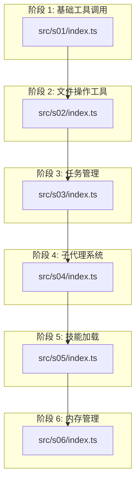
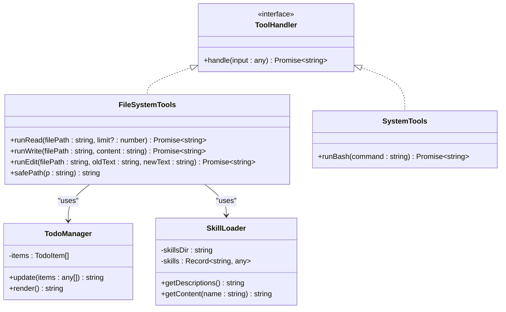
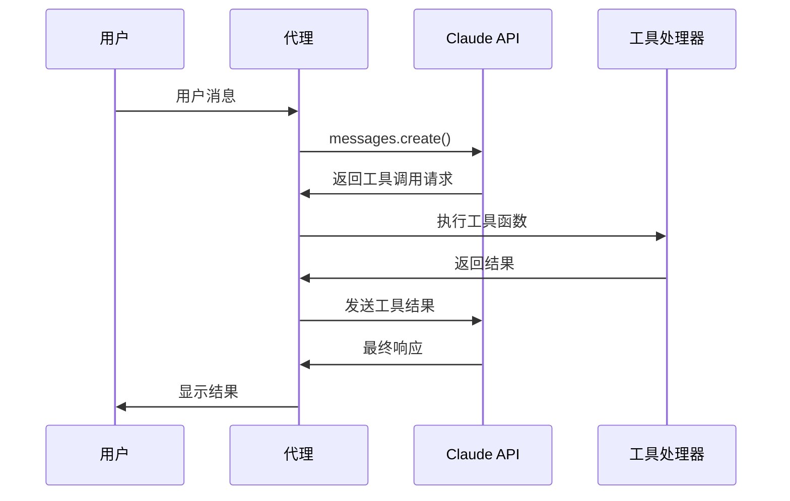
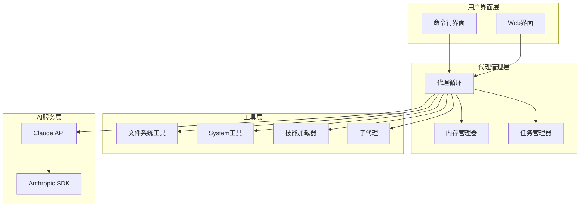
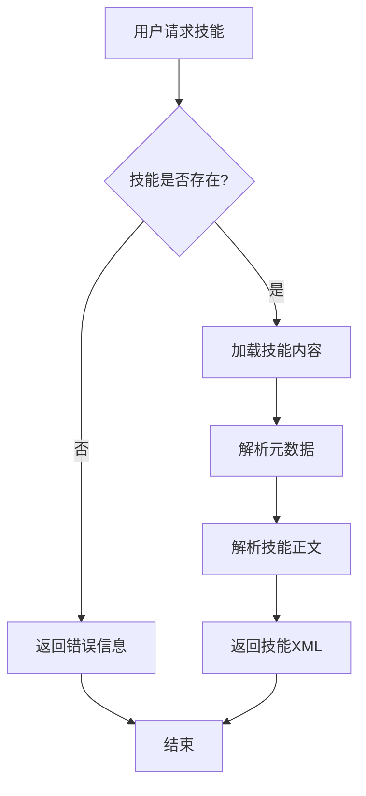

# API 参考手册

<cite>
**本文档引用的文件**
- [README.md](file://README.md)
- [package.json](file://package.json)
- [src/s01/index.ts](file://src/s01/index.ts)
- [src/s02/index.ts](file://src/s02/index.ts)
- [src/s03/index.ts](file://src/s03/index.ts)
- [src/s04/index.ts](file://src/s04/index.ts)
- [src/s05/index.ts](file://src/s05/index.ts)
- [src/s06/index.ts](file://src/s06/index.ts)
- [src/s05/skills/code-reviews/SKILL.md](file://src/s05/skills/code-reviews/SKILL.md)
- [src/s02/test.txt](file://src/s02/test.txt)
- [src/s06/.transcripts/transcript_1777018931.jsonl](file://src/s06/.transcripts/transcript_1777018931.jsonl)
</cite>

## 目录
1. [简介](#简介)
2. [项目结构](#项目结构)
3. [核心组件](#核心组件)
4. [架构概览](#架构概览)
5. [详细组件分析](#详细组件分析)
6. [依赖关系分析](#依赖关系分析)
7. [性能考虑](#性能考虑)
8. [故障排除指南](#故障排除指南)
9. [结论](#结论)
10. [附录](#附录)

## 简介

Mini-Claude-Code 是一个基于 Anthropic Claude AI 的最小化代码助手系统，通过逐步实现的方式展示了如何构建智能代理。该项目包含了六个渐进式阶段，从基础的工具调用扩展到复杂的记忆管理和子代理协作。

该系统的核心特性包括：
- 工具处理器接口：支持多种文件操作和系统命令执行
- 任务管理接口：通过 Todo 列表跟踪多步骤任务进度
- 子代理 API：实现上下文隔离的子任务处理
- 内存管理 API：提供对话压缩和长期记忆存储
- 技能加载系统：按需加载领域专业知识

## 项目结构

项目采用模块化的阶段式设计，每个阶段都建立在前一阶段的基础上：



**图表来源**
- [src/s01/index.ts:1-158](file://src/s01/index.ts#L1-L158)
- [src/s02/index.ts:1-213](file://src/s02/index.ts#L1-L213)
- [src/s03/index.ts:1-335](file://src/s03/index.ts#L1-L335)
- [src/s04/index.ts:1-314](file://src/s04/index.ts#L1-L314)
- [src/s05/index.ts:1-332](file://src/s05/index.ts#L1-L332)
- [src/s06/index.ts:1-413](file://src/s06/index.ts#L1-L413)

**章节来源**
- [README.md:1-3](file://README.md#L1-L3)
- [package.json:1-25](file://package.json#L1-L25)

## 核心组件

### 工具处理器接口

系统定义了统一的工具处理器接口，用于扩展 Claude 的能力：



**图表来源**
- [src/s02/index.ts:129-135](file://src/s02/index.ts#L129-L135)
- [src/s03/index.ts:77-131](file://src/s03/index.ts#L77-L131)
- [src/s05/index.ts:46-142](file://src/s05/index.ts#L46-L142)

### 消息处理系统

系统使用统一的消息格式与 Claude API 交互：



**图表来源**
- [src/s01/index.ts:76-124](file://src/s01/index.ts#L76-L124)
- [src/s02/index.ts:138-179](file://src/s02/index.ts#L138-L179)

**章节来源**
- [src/s02/index.ts:129-135](file://src/s02/index.ts#L129-L135)
- [src/s03/index.ts:77-131](file://src/s03/index.ts#L77-L131)
- [src/s05/index.ts:46-142](file://src/s05/index.ts#L46-L142)

## 架构概览

系统采用分层架构设计，每个阶段都添加新的功能层次：



**图表来源**
- [src/s03/index.ts:242-299](file://src/s03/index.ts#L242-L299)
- [src/s04/index.ts:220-279](file://src/s04/index.ts#L220-L279)
- [src/s06/index.ts:303-367](file://src/s06/index.ts#L303-L367)

## 详细组件分析

### 阶段 1：基础工具调用

**API 规范**

#### bash 工具
- **名称**: bash
- **描述**: 执行 shell 命令
- **输入模式**: `{ command: string }`
- **必需字段**: `command`
- **返回值**: 命令输出或错误信息
- **超时设置**: 120 秒

**使用示例**
```
{
  "name": "bash",
  "input": {
    "command": "ls -la"
  }
}
```

**错误处理**
- 命令执行失败返回错误信息
- 超时自动终止
- 空输出返回特殊标记

**章节来源**
- [src/s01/index.ts:31-43](file://src/s01/index.ts#L31-L43)
- [src/s01/index.ts:50-62](file://src/s01/index.ts#L50-L62)

### 阶段 2：文件操作 API

**API 规范**

#### read_file 工具
- **名称**: read_file
- **描述**: 读取文件内容
- **输入模式**: `{ path: string, limit?: integer }`
- **必需字段**: `path`
- **可选字段**: `limit` (限制行数)
- **返回值**: 文件内容或错误信息
- **大小限制**: 50,000 字符

#### write_file 工具
- **名称**: write_file
- **描述**: 向文件写入内容
- **输入模式**: `{ path: string, content: string }`
- **必需字段**: `path, content`
- **返回值**: 写入统计信息或错误信息

#### edit_file 工具
- **名称**: edit_file
- **描述**: 替换文件中的文本
- **输入模式**: `{ path: string, old_text: string, new_text: string }`
- **必需字段**: `path, old_text, new_text`
- **返回值**: 编辑确认或错误信息

**安全特性**
- 路径验证防止目录遍历攻击
- 自动创建缺失的目录结构
- 文本替换精确匹配检查

**章节来源**
- [src/s02/index.ts:118-127](file://src/s02/index.ts#L118-L127)
- [src/s02/index.ts:50-89](file://src/s02/index.ts#L50-L89)

### 阶段 3：任务管理接口

**API 规范**

#### todo 工具
- **名称**: todo
- **描述**: 更新任务列表，跟踪多步骤任务进度
- **输入模式**: `{ items: Array<TodoItem> }`
- **必需字段**: `items`
- **任务状态**: `pending | in_progress | completed`
- **约束条件**:
  - 最多 20 个任务
  - 仅允许一个任务处于进行中状态
  - 每个任务必须有文本描述

#### TodoManager 类
- **方法**: `update(items: any[]): string`
- **方法**: `render(): string`
- **属性**: `items: TodoItem[]`

**使用示例**
```
{
  "name": "todo",
  "input": {
    "items": [
      {
        "id": "1",
        "text": "分析代码结构",
        "status": "in_progress"
      },
      {
        "id": "2", 
        "text": "编写测试用例",
        "status": "pending"
      }
    ]
  }
}
```

**章节来源**
- [src/s03/index.ts:219-230](file://src/s03/index.ts#L219-L230)
- [src/s03/index.ts:77-131](file://src/s03/index.ts#L77-L131)

### 阶段 4：子代理 API

**API 规范**

#### task 工具
- **名称**: task
- **描述**: 派生具有全新上下文的子代理
- **输入模式**: `{ prompt: string, description?: string }`
- **必需字段**: `prompt`
- **上下文隔离**: 子代理不继承父代理的历史对话

#### 子代理生命周期
1. 创建子代理（全新消息历史）
2. 执行工具调用循环
3. 生成最终摘要
4. 将摘要返回给父代理

**上下文隔离机制**
- 子代理拥有独立的消息数组
- 不共享对话历史
- 文件系统访问权限相同

**章节来源**
- [src/s04/index.ts:198-216](file://src/s04/index.ts#L198-L216)
- [src/s04/index.ts:148-195](file://src/s04/index.ts#L148-L195)

### 阶段 5：技能加载 API

**API 规范**

#### load_skill 工具
- **名称**: load_skill
- **描述**: 按需加载专业技能知识
- **输入模式**: `{ name: string }`
- **必需字段**: `name`
- **技能发现**: 自动扫描 `skills/` 目录

#### 技能系统架构
- **技能目录**: `skills/<技能名>/SKILL.md`
- **技能元数据**: YAML 前言块
- **技能内容**: Markdown 格式的详细指导

**技能加载流程**


**图表来源**
- [src/s05/index.ts:257-298](file://src/s05/index.ts#L257-L298)
- [src/s05/index.ts:46-142](file://src/s05/index.ts#L46-L142)

**章节来源**
- [src/s05/index.ts:234-245](file://src/s05/index.ts#L234-L245)
- [src/s05/index.ts:46-142](file://src/s05/index.ts#L46-L142)

### 阶段 6：内存管理 API

**API 规范**

#### compact 工具
- **名称**: compact
- **描述**: 触发手动对话压缩
- **输入模式**: `{ focus?: string }`
- **可选字段**: `focus` (要保留的摘要重点)

#### 内存管理策略

**微压缩 (micro_compact)**
- **触发条件**: 每次对话轮次
- **处理规则**: 保留最近的工具结果，其他结果用占位符替换
- **保留工具**: `read_file` 结果始终保留

**自动压缩 (auto_compact)**
- **触发条件**: token 数量超过阈值 (1000)
- **处理流程**: 
  1. 保存完整对话记录到 `.transcripts/`
  2. 请求 LLM 生成摘要
  3. 用摘要替换所有历史消息

**章节来源**
- [src/s06/index.ts:280-291](file://src/s06/index.ts#L280-L291)
- [src/s06/index.ts:82-138](file://src/s06/index.ts#L82-L138)
- [src/s06/index.ts:150-196](file://src/s06/index.ts#L150-L196)

## 依赖关系分析

系统依赖关系图展示了各模块间的耦合程度：

```mermaid
graph TB
subgraph "外部依赖"
Anthropic[@anthropic-ai/sdk]
Dotenv[dotenv]
JSYAML[js-yaml]
end
subgraph "核心模块"
S01[s01: 基础工具]
S02[s02: 文件操作]
S03[s03: 任务管理]
S04[s04: 子代理]
S05[s05: 技能加载]
S06[s06: 内存管理]
end
subgraph "工具函数"
SafePath[路径安全检查]
ExtractText[文本提取]
EstimateTokens[token估算]
end
Anthropic --> S01
Anthropic --> S02
Anthropic --> S03
Anthropic --> S04
Anthropic --> S05
Anthropic --> S06
Dotenv --> S01
Dotenv --> S02
Dotenv --> S03
Dotenv --> S04
Dotenv --> S05
Dotenv --> S06
JSYAML --> S05
SafePath --> S02
SafePath --> S03
SafePath --> S04
SafePath --> S05
SafePath --> S06
ExtractText --> S01
ExtractText --> S02
ExtractText --> S03
ExtractText --> S04
ExtractText --> S05
ExtractText --> S06
EstimateTokens --> S06
```

**图表来源**
- [package.json:13-22](file://package.json#L13-L22)
- [src/s02/index.ts:37-48](file://src/s02/index.ts#L37-L48)
- [src/s06/index.ts:59-61](file://src/s06/index.ts#L59-L61)

**章节来源**
- [package.json:13-22](file://package.json#L13-L22)

## 性能考虑

### Token 优化策略

系统实现了多层次的 token 管理：

1. **微压缩**: 每轮对话自动清理旧的工具结果
2. **阈值监控**: 当 token 数超过 1000 时触发自动压缩
3. **选择性保留**: `read_file` 结果始终保留以避免重复读取

### 并发处理

- **异步工具调用**: 所有工具操作都是异步的
- **超时控制**: 系统命令执行超时 120 秒
- **资源清理**: 自动清理临时文件和目录

### 内存管理

- **对话截断**: 使用摘要替换历史消息
- **文件缓存**: 重要文件内容保持在内存中
- **垃圾回收**: 定期清理无用的工具结果

## 故障排除指南

### 常见问题及解决方案

#### API 密钥配置问题
**症状**: 启动时出现认证错误
**解决方案**: 
1. 检查 `.env` 文件是否正确配置
2. 验证 `ANTHROPIC_API_KEY` 和 `ANTHROPIC_BASE_URL`
3. 确认网络连接正常

#### 路径安全错误
**症状**: 访问文件时抛出 "Path escapes workspace" 错误
**原因**: 尝试访问工作区外的文件路径
**解决方案**: 
- 使用相对路径而非绝对路径
- 确保文件位于工作区内

#### 工具调用超时
**症状**: 系统命令执行超时
**解决方案**:
- 检查命令复杂度
- 调整超时时间设置
- 分解复杂的命令为多个简单命令

#### 技能加载失败
**症状**: `load_skill` 返回未知技能错误
**解决方案**:
- 确认技能目录结构正确
- 检查 `SKILL.md` 文件格式
- 验证 YAML 前言块语法

**章节来源**
- [src/s02/index.ts:37-48](file://src/s02/index.ts#L37-L48)
- [src/s05/index.ts:133-141](file://src/s05/index.ts#L133-L141)

## 结论

Mini-Claude-Code 提供了一个完整的、渐进式的 AI 代理系统实现，展示了从基础工具调用到复杂记忆管理的技术演进过程。该系统的主要优势包括：

1. **模块化设计**: 每个阶段都有明确的功能边界
2. **安全性**: 内置路径验证和上下文隔离
3. **可扩展性**: 统一的工具接口便于添加新功能
4. **性能优化**: 多层次的内存管理和 token 控制

该系统为构建生产级 AI 代理提供了良好的参考架构和实现模式。

## 附录

### 版本兼容性

当前版本: 1.0.0

**兼容性说明**:
- Node.js 16+
- TypeScript 4.0+
- Anthropic API 兼容

### 集成最佳实践

#### 环境配置
```bash
# 设置环境变量
export ANTHROPIC_API_KEY="your_api_key"
export ANTHROPIC_BASE_URL="https://api.anthropic.com"
export MODEL_ID="claude-3-haiku-20240307"
```

#### 错误处理模式
```typescript
try {
  const result = await toolHandler(input);
} catch (error) {
  console.error(`工具调用失败: ${error.message}`);
  return `Error: ${error.message}`;
}
```

#### 性能监控
- 监控 token 使用量
- 跟踪工具调用延迟
- 定期检查内存使用情况