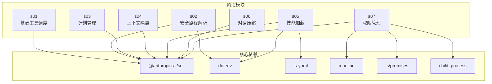
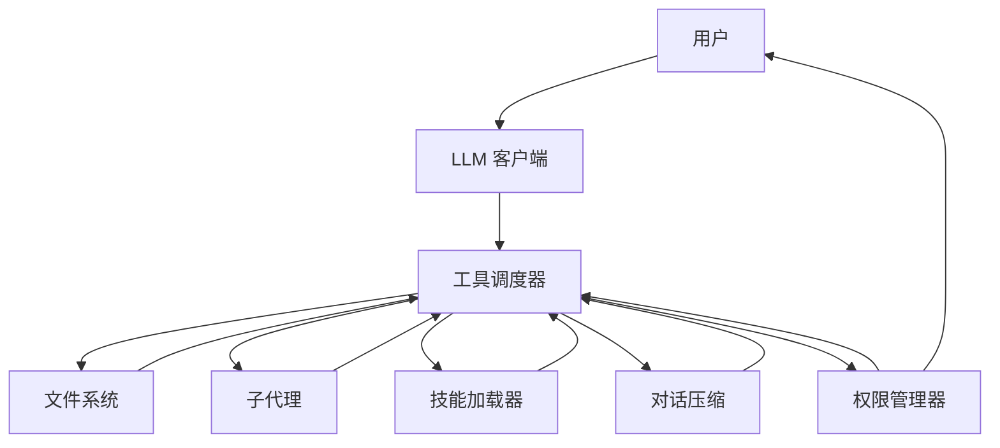
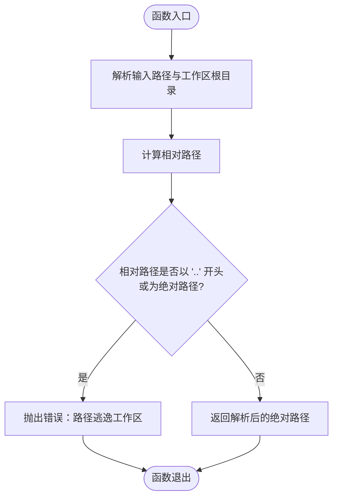
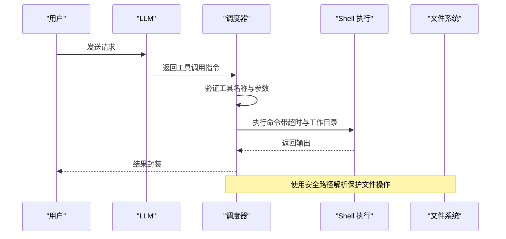
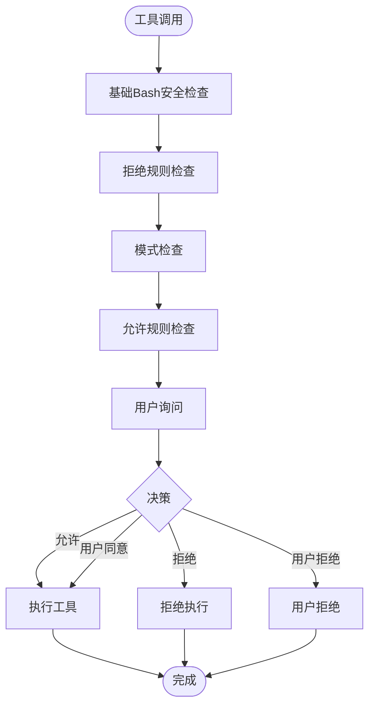
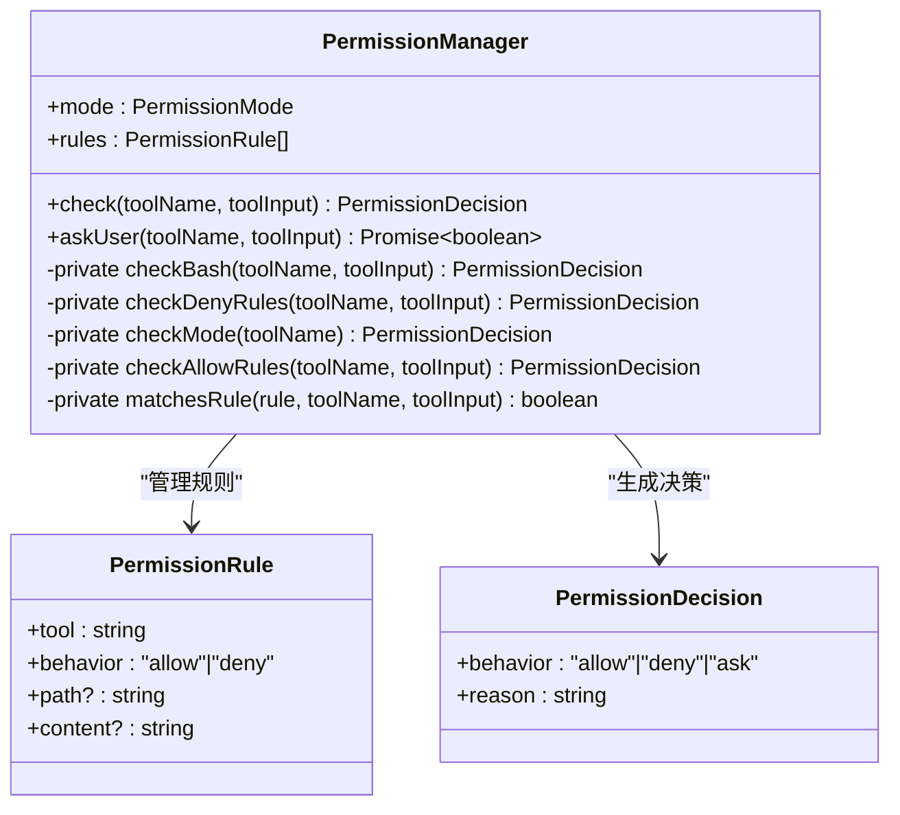
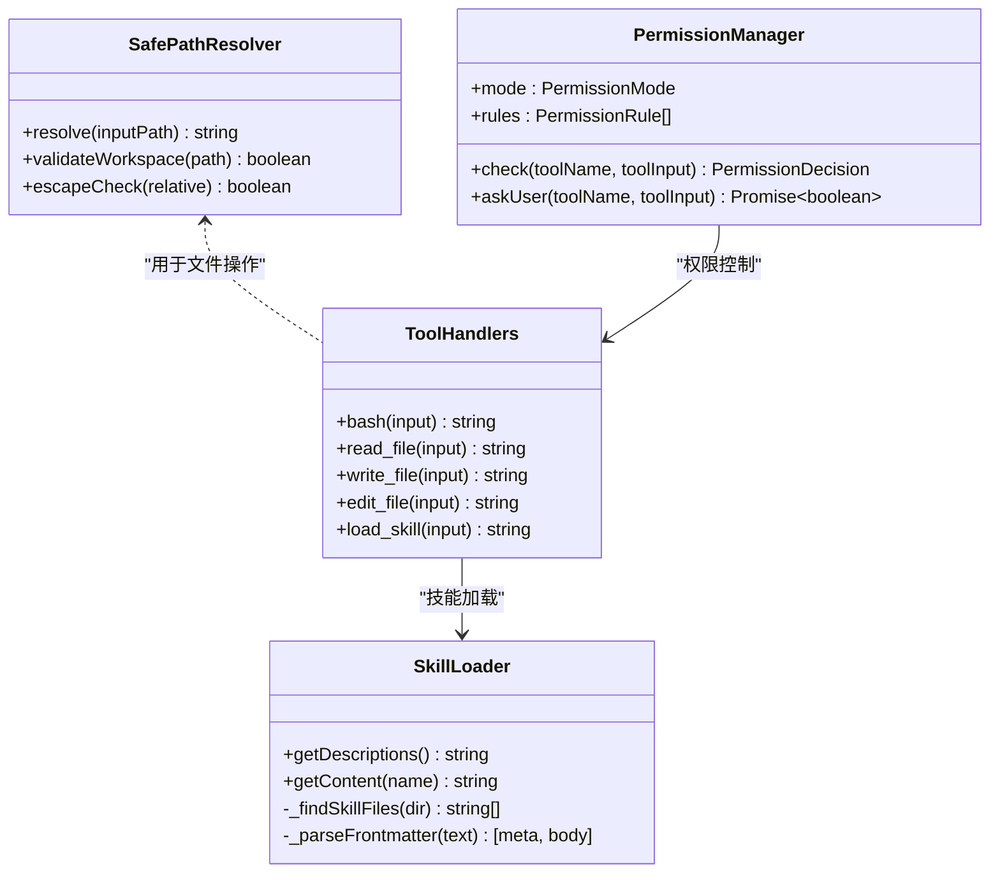
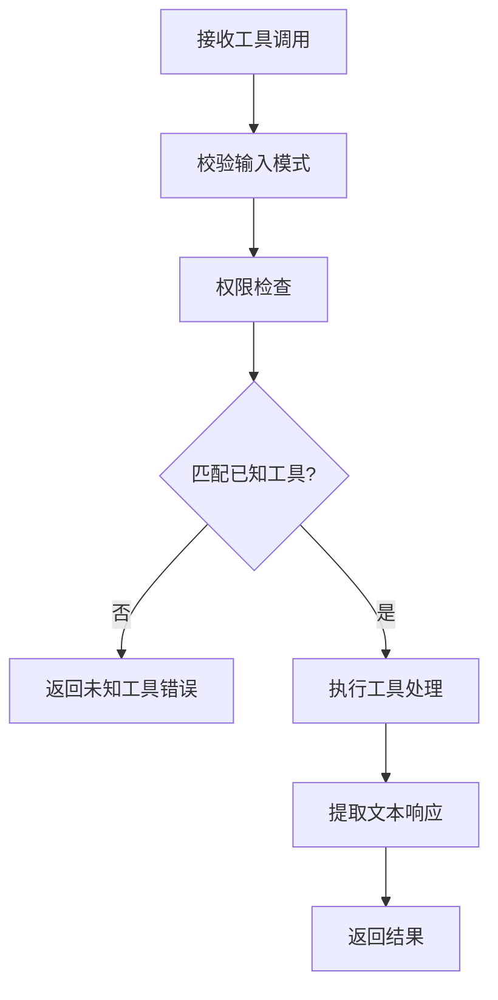
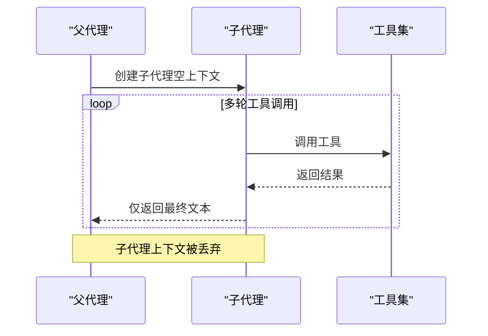
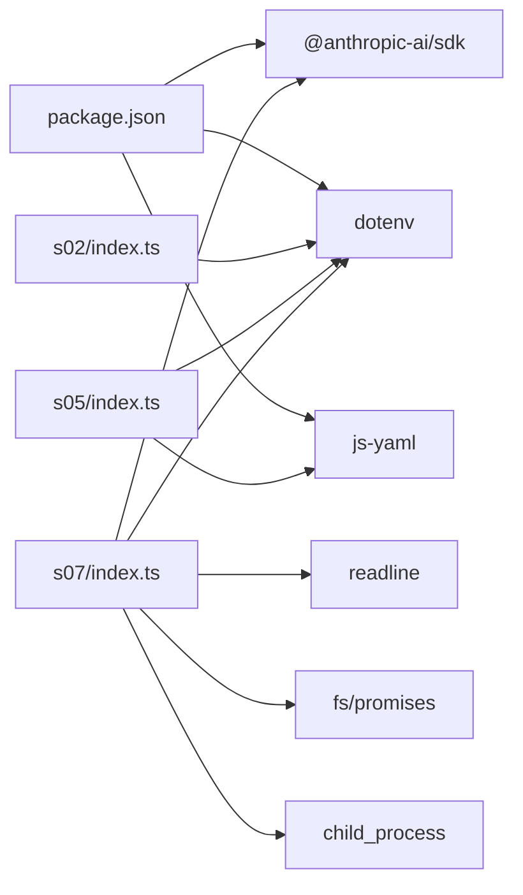

# 安全最佳实践

<cite>
**本文档引用的文件**
- [README.md](file://README.md)
- [package.json](file://package.json)
- [src/s07/index.ts](file://src/s07/index.ts)
- [src/s07/package.json](file://src/s07/package.json)
- [src/s07/tsconfig.json](file://src/s07/tsconfig.json)
- [src/s07/test.txt](file://src/s07/test.txt)
- [src/s01/index.ts](file://src/s01/index.ts)
- [src/s02/index.ts](file://src/s02/index.ts)
- [src/s03/index.ts](file://src/s03/index.ts)
- [src/s04/index.ts](file://src/s04/index.ts)
- [src/s05/index.ts](file://src/s05/index.ts)
- [src/s06/index.ts](file://src/s06/index.ts)
- [src/s05/skills/code-reviews/SKILL.md](file://src/s05/skills/code-reviews/SKILL.md)
- [src/s02/greet.py](file://src/s02/greet.py)
- [src/s02/test.txt](file://src/s02/test.txt)
</cite>

## 更新摘要
**变更内容**
- 新增完整的TypeScript权限管理系统章节，包含四层审批机制详解
- 更新权限管理最佳实践部分，整合新的权限系统架构
- 新增智能规则匹配与安全防护措施的详细分析
- 更新架构总览图，反映权限系统的集成
- 新增权限系统代码审查清单和安全编码规范

## 目录
1. [简介](#简介)
2. [项目结构](#项目结构)
3. [核心组件](#核心组件)
4. [架构总览](#架构总览)
5. [详细组件分析](#详细组件分析)
6. [依赖关系分析](#依赖关系分析)
7. [性能考量](#性能考量)
8. [故障排除指南](#故障排除指南)
9. [结论](#结论)
10. [附录](#附录)

## 简介
本指南围绕 Mini-Claude-Code 项目的安全实践展开，重点覆盖以下方面：
- 路径遍历攻击的防范（安全路径解析算法）
- 命令注入防护机制（shell 命令执行与参数化）
- 权限管理最佳实践（文件系统访问控制）
- 输入验证策略（工具输入校验与类型约束）
- 沙箱执行环境的实现思路（上下文隔离与子代理）
- **新增**：TypeScript权限管理系统（四层审批机制、智能规则匹配、安全防护措施）
- 常见安全漏洞案例分析与修复方案
- 安全编码规范与代码审查清单
- 上下文隔离在安全方面的作用与重要性

该项目通过多阶段迭代展示了从基础工具调用到上下文隔离、技能加载与对话压缩的演进过程，**以及最新的权限管理系统**，为安全实践提供了丰富的实现参考。

## 项目结构
项目采用按阶段划分的模块化结构，每个阶段（s01 到 s07）聚焦不同的能力与安全特性：
- s01：基础工具调度与 shell 命令执行
- s02：文件读写与安全路径解析
- s03：计划管理与工具调用增强
- s04：上下文隔离（子代理）
- s05：技能加载（按需知识注入）
- s06：对话压缩与内存清理
- **新增**：s07：TypeScript权限管理系统（四层审批机制）

**图表来源**
- [package.json:13-23](file://package.json#L13-L23)
- [src/s01/index.ts:16-26](file://src/s01/index.ts#L16-L26)
- [src/s02/index.ts:15-28](file://src/s02/index.ts#L15-L28)
- [src/s05/index.ts:23-40](file://src/s05/index.ts#L23-L40)
- [src/s07/index.ts:10-17](file://src/s07/index.ts#L10-L17)

**章节来源**
- [README.md:1-3](file://README.md#L1-L3)
- [package.json:1-25](file://package.json#L1-L25)

## 核心组件
本节概述与安全相关的核心组件及其职责：
- 安全路径解析器：防止路径遍历攻击，确保文件操作仅限于工作区
- 工具处理器：统一管理工具调用，包括 shell 执行、文件读写、编辑与技能加载
- 上下文隔离：通过子代理与独立上下文避免敏感信息泄露
- 技能加载器：按需加载领域知识，减少系统提示长度带来的风险
- 对话压缩：控制上下文大小，降低令牌超限风险
- **新增**：权限管理器：实现四层审批机制，提供智能规则匹配与用户交互

**章节来源**
- [src/s02/index.ts:37-48](file://src/s02/index.ts#L37-L48)
- [src/s04/index.ts:47-58](file://src/s04/index.ts#L47-L58)
- [src/s05/index.ts:46-144](file://src/s05/index.ts#L46-L144)
- [src/s06/index.ts:59-196](file://src/s06/index.ts#L59-L196)
- [src/s07/index.ts:129-246](file://src/s07/index.ts#L129-L246)

## 架构总览
整体架构以"LLM + 工具调度 + 文件系统/子代理/技能/压缩/权限管理"为核心，强调通过严格的输入验证、路径控制、上下文隔离和**权限控制**实现安全可控的自动化执行。

**图表来源**
- [src/s01/index.ts:77-83](file://src/s01/index.ts#L77-L83)
- [src/s04/index.ts:148-195](file://src/s04/index.ts#L148-L195)
- [src/s05/index.ts:257-298](file://src/s05/index.ts#L257-L298)
- [src/s06/index.ts:303-367](file://src/s06/index.ts#L303-L367)
- [src/s07/index.ts:401-433](file://src/s07/index.ts#L401-L433)

## 详细组件分析

### 安全路径解析算法
安全路径解析是防范路径遍历攻击的关键。其核心思想是：
- 将输入路径与工作区根目录进行解析与相对化比较
- 若解析后的相对路径以".."开头或为绝对路径，则判定为逃逸工作区并抛出异常
- 否则返回解析后的绝对路径，确保后续文件操作限定在工作区内

**图表来源**
- [src/s02/index.ts:93-103](file://src/s02/index.ts#L93-L103)
- [src/s07/index.ts:93-103](file://src/s07/index.ts#L93-L103)

**章节来源**
- [src/s02/index.ts:93-103](file://src/s02/index.ts#L93-L103)
- [src/s03/index.ts:138-149](file://src/s03/index.ts#L138-L149)
- [src/s04/index.ts:47-58](file://src/s04/index.ts#L47-L58)
- [src/s05/index.ts:153-164](file://src/s05/index.ts#L153-L164)
- [src/s06/index.ts:199-210](file://src/s06/index.ts#L199-L210)
- [src/s07/index.ts:93-103](file://src/s07/index.ts#L93-L103)

### 命令注入防护机制
项目中存在直接调用 shell 命令的场景，需要通过以下策略降低命令注入风险：
- 参数化与白名单：仅允许预定义的工具名称与参数结构
- 输入校验：对命令字符串进行长度、字符集与特殊字符检查
- 限制执行范围：设置超时时间与工作目录，避免长时间运行与跨目录影响
- 最小权限原则：在受限环境中执行命令，避免高权限账户

**图表来源**
- [src/s01/index.ts:50-62](file://src/s01/index.ts#L50-L62)
- [src/s02/index.ts:92-104](file://src/s02/index.ts#L92-L104)
- [src/s03/index.ts:193-205](file://src/s03/index.ts#L193-L205)
- [src/s04/index.ts:102-114](file://src/s04/index.ts#L102-L114)
- [src/s05/index.ts:208-220](file://src/s05/index.ts#L208-L220)
- [src/s06/index.ts:254-266](file://src/s06/index.ts#L254-L266)

**章节来源**
- [src/s01/index.ts:50-62](file://src/s01/index.ts#L50-L62)
- [src/s02/index.ts:92-104](file://src/s02/index.ts#L92-L104)
- [src/s03/index.ts:193-205](file://src/s03/index.ts#L193-L205)
- [src/s04/index.ts:102-114](file://src/s04/index.ts#L102-L114)
- [src/s05/index.ts:208-220](file://src/s05/index.ts#L208-L220)
- [src/s06/index.ts:254-266](file://src/s06/index.ts#L254-L266)

### TypeScript权限管理系统
**新增**：s07阶段引入了完整的TypeScript权限管理系统，采用四层审批机制：

#### 四层审批机制
1. **基础Bash安全检查**：检测危险命令（如rm -rf /、sudo）
2. **拒绝规则检查**：根据预定义规则拒绝特定工具调用
3. **模式检查**：根据权限模式（default、plan、auto）进行快速决策
4. **允许规则检查**：匹配允许规则，支持通配符匹配
5. **用户询问**：当无规则匹配时，向用户询问授权

**图表来源**
- [src/s07/index.ts:140-157](file://src/s07/index.ts#L140-L157)
- [src/s07/index.ts:107-125](file://src/s07/index.ts#L107-L125)
- [src/s07/index.ts:165-176](file://src/s07/index.ts#L165-L176)
- [src/s07/index.ts:178-202](file://src/s07/index.ts#L178-L202)
- [src/s07/index.ts:204-215](file://src/s07/index.ts#L204-L215)

#### 智能规则匹配
权限系统支持灵活的规则匹配：
- **工具匹配**：精确匹配或使用通配符"*"
- **路径匹配**：支持glob模式匹配文件路径
- **内容匹配**：支持glob模式匹配命令内容
- **行为控制**：允许（allow）或拒绝（deny）行为

**图表来源**
- [src/s07/index.ts:129-246](file://src/s07/index.ts#L129-L246)
- [src/s07/index.ts:48-53](file://src/s07/index.ts#L48-L53)
- [src/s07/index.ts:43-46](file://src/s07/index.ts#L43-L46)

#### 权限模式与安全防护
- **默认模式（default）**：标准权限控制，遵循所有规则
- **计划模式（plan）**：仅允许只读工具，阻止所有写入操作
- **自动模式（auto）**：自动批准只读工具，其他工具需要人工确认
- **安全防护**：内置危险命令检测、路径安全检查、超时限制

**章节来源**
- [src/s07/index.ts:129-246](file://src/s07/index.ts#L129-L246)
- [src/s07/index.ts:40-68](file://src/s07/index.ts#L40-L68)
- [src/s07/index.ts:107-125](file://src/s07/index.ts#L107-L125)

### 权限管理最佳实践
- 文件系统权限：所有文件操作均通过安全路径解析器，禁止越权访问
- 工具权限：仅暴露必要工具，避免递归子代理 spawn，限制子代理工具集
- 环境变量：通过 dotenv 加载，避免硬编码敏感信息
- 技能加载：仅扫描指定目录下的技能文件，防止任意路径读取
- **新增**：权限控制：实现四层审批机制，支持用户交互与规则配置
- **新增**：智能规则：支持通配符匹配、路径过滤、内容匹配的灵活规则系统

**图表来源**
- [src/s02/index.ts:37-48](file://src/s02/index.ts#L37-L48)
- [src/s05/index.ts:46-144](file://src/s05/index.ts#L46-L144)
- [src/s07/index.ts:129-246](file://src/s07/index.ts#L129-L246)

**章节来源**
- [src/s02/index.ts:37-48](file://src/s02/index.ts#L37-L48)
- [src/s05/index.ts:46-144](file://src/s05/index.ts#L46-L144)
- [src/s07/index.ts:129-246](file://src/s07/index.ts#L129-L246)

### 输入验证策略
- 工具输入模式：每个工具定义明确的输入模式（JSON Schema），要求必填字段并限制枚举值
- 工具调用校验：在调度器中对工具名称进行匹配，未知工具返回错误
- 文本提取：统一从响应内容中提取文本，避免解析错误导致的异常传播
- 计划管理：对任务列表进行严格校验，限制数量与状态一致性
- **新增**：权限输入验证：对权限规则进行类型检查，确保规则格式正确

**图表来源**
- [src/s02/index.ts:118-135](file://src/s02/index.ts#L118-L135)
- [src/s03/index.ts:219-239](file://src/s03/index.ts#L219-L239)
- [src/s05/index.ts:234-254](file://src/s05/index.ts#L234-L254)
- [src/s06/index.ts:280-300](file://src/s06/index.ts#L280-L300)
- [src/s07/index.ts:366-397](file://src/s07/index.ts#L366-L397)

**章节来源**
- [src/s02/index.ts:118-135](file://src/s02/index.ts#L118-L135)
- [src/s03/index.ts:219-239](file://src/s03/index.ts#L219-L239)
- [src/s05/index.ts:234-254](file://src/s05/index.ts#L234-L254)
- [src/s06/index.ts:280-300](file://src/s06/index.ts#L280-L300)
- [src/s07/index.ts:366-397](file://src/s07/index.ts#L366-L397)

### 沙箱执行环境的实现
- 子代理机制：父代理创建独立上下文的子代理，子代理仅使用有限工具并在完成后返回最终文本
- 上下文隔离：子代理不继承父代理的历史消息，避免敏感信息泄露
- 轮次与错误处理：子代理具有轮次上限与错误处理，确保可预期退出

**图表来源**
- [src/s04/index.ts:148-195](file://src/s04/index.ts#L148-L195)

**章节来源**
- [src/s04/index.ts:148-195](file://src/s04/index.ts#L148-L195)

### 常见安全漏洞案例分析与修复方案
- 路径遍历（目录穿越）
  - 风险：攻击者通过"../"等序列访问工作区外文件
  - 修复：使用安全路径解析器，严格检查相对路径逃逸
  - 参考：各阶段的 safePath 实现
- 命令注入
  - 风险：用户输入拼接到 shell 命令中导致任意命令执行
  - 修复：参数化命令、白名单工具、限制工作目录与超时
  - 参考：工具调用与执行流程
- 权限滥用
  - 风险：未受控的文件读写与编辑
  - 修复：统一通过安全路径解析器，限制工具集
  - 参考：文件读写与编辑工具
- **新增**：权限绕过
  - 风险：攻击者绕过权限控制系统执行危险操作
  - 修复：实现四层审批机制，内置危险命令检测，支持用户交互确认
  - 参考：权限管理器实现
- 上下文泄露
  - 风险：历史消息泄露敏感信息
  - 修复：子代理独立上下文，仅返回最终文本
  - 参考：上下文隔离机制
- 提示过长导致令牌超限
  - 风险：对话历史过长导致成本与性能问题
  - 修复：微压缩与自动压缩，仅保留最近工具结果与摘要
  - 参考：对话压缩实现

**章节来源**
- [src/s02/index.ts:93-103](file://src/s02/index.ts#L93-L103)
- [src/s04/index.ts:47-58](file://src/s04/index.ts#L47-L58)
- [src/s06/index.ts:82-138](file://src/s06/index.ts#L82-L138)
- [src/s06/index.ts:150-196](file://src/s06/index.ts#L150-L196)
- [src/s07/index.ts:129-246](file://src/s07/index.ts#L129-L246)

### 安全编码规范与代码审查清单
- 编码规范
  - 所有文件操作必须经过安全路径解析
  - 工具调用必须符合输入模式定义
  - shell 命令执行必须参数化且限制超时
  - 子代理上下文必须独立且仅返回最终文本
  - 技能加载必须限定目录与格式
  - **新增**：权限规则必须经过类型检查与验证
  - **新增**：危险命令必须通过安全检查
  - **新增**：权限模式切换必须进行有效性验证
- 代码审查清单
  - 是否存在路径逃逸风险？
  - 是否对用户输入进行了必要的校验？
  - 是否限制了工具的执行范围与权限？
  - 是否实现了上下文隔离与内存清理？
  - 是否存在敏感信息泄露的风险？
  - **新增**：权限规则是否完整且无冲突？
  - **新增**：危险命令检测是否覆盖常见攻击模式？
  - **新增**：权限模式切换是否安全可靠？

**章节来源**
- [src/s05/skills/code-reviews/SKILL.md:10-88](file://src/s05/skills/code-reviews/SKILL.md#L10-L88)
- [src/s07/index.ts:129-246](file://src/s07/index.ts#L129-L246)

### 上下文隔离在安全方面的作用与重要性
- 作用
  - 防止历史消息中的敏感信息被后续工具调用利用
  - 降低令牌超限风险，提升系统稳定性
  - 通过独立上下文限制子任务的影响范围
- 重要性
  - 在多轮交互中保持清晰的边界
  - 减少因上下文污染导致的推理偏差
  - 为后续扩展（如多子代理并发）奠定基础

**章节来源**
- [src/s04/index.ts:148-195](file://src/s04/index.ts#L148-L195)

## 依赖关系分析
项目依赖关系主要体现在工具链与第三方库上，安全相关的关注点在于：
- Anthropic SDK：负责与 LLM 通信，需正确配置 API 密钥与基础 URL
- dotenv：加载环境变量，需确保敏感信息不被提交到版本控制
- js-yaml：解析技能文件的 YAML 前言，需注意输入合法性
- **新增**：readline：提供用户交互界面，支持权限确认
- **新增**：fs/promises：文件系统操作，需配合安全路径解析
- **新增**：child_process：shell命令执行，需配合安全检查

**图表来源**
- [package.json:13-23](file://package.json#L13-L23)
- [src/s02/index.ts:19-20](file://src/s02/index.ts#L19-L20)
- [src/s05/index.ts:29-29](file://src/s05/index.ts#L29-L29)
- [src/s07/index.ts:10-17](file://src/s07/index.ts#L10-L17)

**章节来源**
- [package.json:13-23](file://package.json#L13-L23)
- [src/s02/index.ts:19-20](file://src/s02/index.ts#L19-L20)
- [src/s05/index.ts:29-29](file://src/s05/index.ts#L29-L29)
- [src/s07/index.ts:10-17](file://src/s07/index.ts#L10-L17)

## 性能考量
- 令牌估算：通过字符数粗略估算令牌数量，避免超限
- 微压缩：每轮清理旧工具结果，仅保留最近若干条
- 自动压缩：达到阈值时保存转录并请求 LLM 汇总，替换历史消息
- 子代理轮次限制：防止无限循环与资源耗尽
- **新增**：权限检查开销：四层审批机制增加少量延迟，但显著提升安全性
- **新增**：规则匹配优化：使用高效的数据结构（Set、Map）提高匹配速度

**章节来源**
- [src/s06/index.ts:59-61](file://src/s06/index.ts#L59-L61)
- [src/s06/index.ts:82-138](file://src/s06/index.ts#L82-L138)
- [src/s06/index.ts:150-196](file://src/s06/index.ts#L150-L196)
- [src/s07/index.ts:61-62](file://src/s07/index.ts#L61-L62)

## 故障排除指南
- 路径解析错误
  - 现象：提示"路径逃逸工作区"
  - 排查：确认输入路径是否包含"../"或绝对路径
  - 修复：使用相对路径或通过安全路径解析器处理
- 工具调用失败
  - 现象：返回"未知工具"或"错误"
  - 排查：核对工具名称与输入模式
  - 修复：修正工具名称或补充缺失字段
- Shell 执行超时
  - 现象：命令执行超时
  - 排查：检查命令复杂度与工作目录
  - 修复：优化命令或调整超时设置
- 技能加载失败
  - 现象：技能不存在或格式错误
  - 排查：确认技能文件命名与前言格式
  - 修复：修正文件名或补全 YAML 前言
- **新增**：权限拒绝
  - 现象：工具调用被拒绝
  - 排查：检查权限规则、模式设置、危险命令检测
  - 修复：调整规则配置或切换权限模式
- **新增**：权限系统异常
  - 现象：权限管理器崩溃或无响应
  - 排查：检查规则格式、用户输入、系统资源
  - 修复：重置规则、清理缓存、重启系统

**章节来源**
- [src/s02/index.ts:50-63](file://src/s02/index.ts#L50-L63)
- [src/s05/index.ts:133-141](file://src/s05/index.ts#L133-L141)
- [src/s06/index.ts:338-346](file://src/s06/index.ts#L338-L346)
- [src/s07/index.ts:140-157](file://src/s07/index.ts#L140-L157)

## 结论
Mini-Claude-Code 通过多阶段迭代逐步引入安全实践，形成了以"安全路径解析 + 工具输入校验 + 上下文隔离 + 技能加载 + 对话压缩 + **权限管理**"为核心的体系。**新增的TypeScript权限管理系统**进一步强化了安全控制，通过四层审批机制、智能规则匹配和用户交互，为自动化工具调用提供了全面的安全保障。遵循本文档的安全规范与最佳实践，可在保证功能完整性的同时显著降低安全风险。

## 附录
- 安全路径解析器实现参考：[src/s02/index.ts:93-103](file://src/s02/index.ts#L93-L103)
- 工具调用与执行流程参考：[src/s01/index.ts:50-62](file://src/s01/index.ts#L50-L62)
- 上下文隔离与子代理参考：[src/s04/index.ts:148-195](file://src/s04/index.ts#L148-L195)
- 技能加载与前端言解析参考：[src/s05/index.ts:46-144](file://src/s05/index.ts#L46-L144)
- 对话压缩与令牌估算参考：[src/s06/index.ts:59-196](file://src/s06/index.ts#L59-L196)
- **新增**：权限管理系统实现参考：[src/s07/index.ts:129-246](file://src/s07/index.ts#L129-L246)
- **新增**：四层审批机制流程参考：[src/s07/index.ts:3-8](file://src/s07/index.ts#L3-L8)
- **新增**：智能规则匹配算法参考：[src/s07/index.ts:217-233](file://src/s07/index.ts#L217-L233)