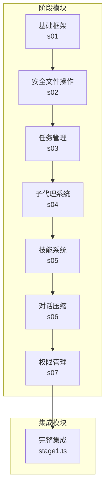
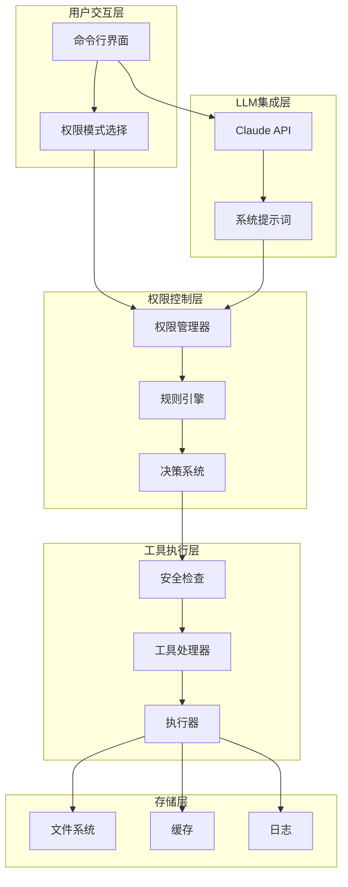
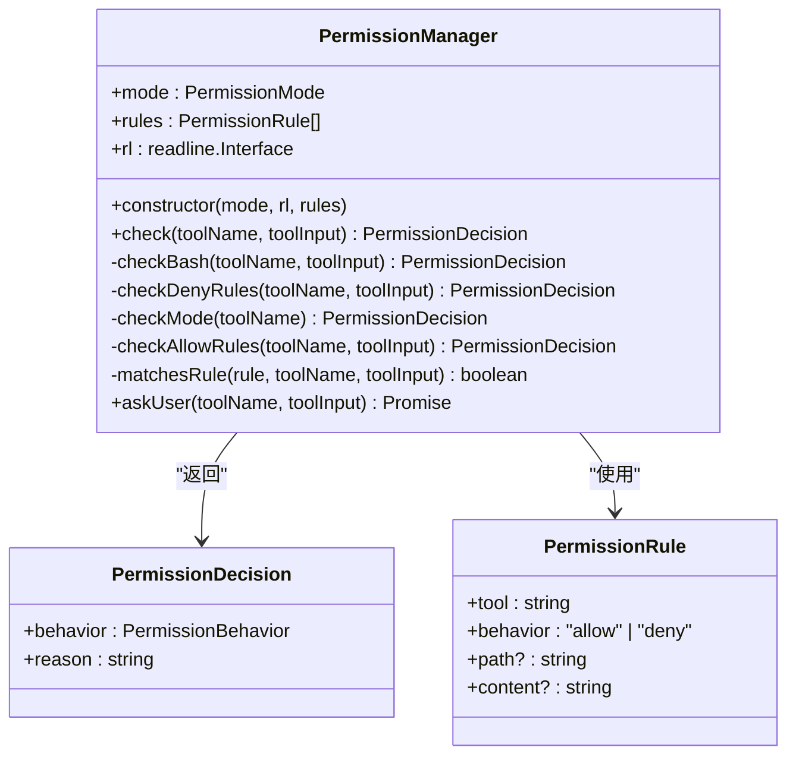
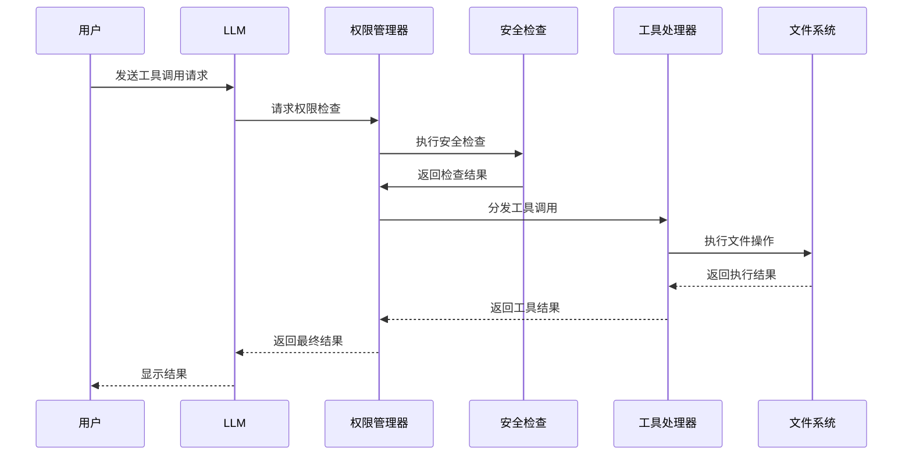

# 权限管理系统

<cite>
**本文档引用的文件**
- [README.md](file://README.md)
- [package.json](file://package.json)
- [src/s01/index.ts](file://src/s01/index.ts)
- [src/s02/index.ts](file://src/s02/index.ts)
- [src/s03/index.ts](file://src/s03/index.ts)
- [src/s04/index.ts](file://src/s04/index.ts)
- [src/s05/index.ts](file://src/s05/index.ts)
- [src/s06/index.ts](file://src/s06/index.ts)
- [src/s07/index.ts](file://src/s07/index.ts)
- [src/s02/greet.py](file://src/s02/greet.py)
- [src/s05/skills/code-reviews/SKILL.md](file://src/s05/skills/code-reviews/SKILL.md)
- [SummaryStage/stage1.ts](file://SummaryStage/stage1.ts)
</cite>

## 目录
1. [简介](#简介)
2. [项目结构](#项目结构)
3. [核心组件](#核心组件)
4. [架构总览](#架构总览)
5. [详细组件分析](#详细组件分析)
6. [依赖关系分析](#依赖关系分析)
7. [性能考虑](#性能考虑)
8. [故障排除指南](#故障排除指南)
9. [结论](#结论)

## 简介
本项目是一个逐步实现的最小 Claude Code 权限管理系统，通过多个阶段展示了从基础工具调用到复杂权限控制的演进过程。该系统基于 Anthropic Claude API，实现了安全的文件操作、任务管理、子代理委派、技能加载和对话压缩等核心功能，并在最后一个阶段引入了完整的权限控制机制。

## 项目结构
项目采用模块化设计，每个阶段代表一个特定的功能特性：



**图表来源**
- [src/s01/index.ts:1-158](file://src/s01/index.ts#L1-L158)
- [src/s07/index.ts:1-508](file://src/s07/index.ts#L1-L508)
- [SummaryStage/stage1.ts:1-33](file://SummaryStage/stage1.ts#L1-L33)

**章节来源**
- [README.md:1-3](file://README.md#L1-L3)
- [package.json:1-25](file://package.json#L1-L25)

## 核心组件
系统包含以下核心组件：

### 1. 工具调用系统
- **基础工具**: bash、read_file、write_file、edit_file
- **高级工具**: todo、task、load_skill、compact
- **权限工具**: 用于权限控制和决策

### 2. 安全机制
- **路径安全检查**: 防止路径遍历攻击
- **命令安全过滤**: 拦截危险命令
- **模式控制**: 默认、计划、自动三种权限模式

### 3. 管理组件
- **TodoManager**: 任务进度跟踪
- **SkillLoader**: 技能知识库管理
- **子代理系统**: 独立上下文的任务执行

**章节来源**
- [src/s07/index.ts:33-56](file://src/s07/index.ts#L33-L56)
- [src/s07/index.ts:129-157](file://src/s07/index.ts#L129-L157)

## 架构总览



**图表来源**
- [src/s07/index.ts:129-246](file://src/s07/index.ts#L129-L246)
- [src/s07/index.ts:366-397](file://src/s07/index.ts#L366-L397)

## 详细组件分析

### 权限管理器 (PermissionManager)



**图表来源**
- [src/s07/index.ts:129-246](file://src/s07/index.ts#L129-L246)
- [src/s07/index.ts:43-53](file://src/s07/index.ts#L43-L53)

权限管理器实现了五层权限控制策略：

1. **基础安全检查**: 拦截危险命令 (`rm -rf /`, `sudo *`)
2. **拒绝规则**: 用户自定义的拒绝策略
3. **模式检查**: 基于权限模式的访问控制
4. **允许规则**: 用户自定义的允许策略
5. **用户询问**: 未知情况下的用户确认

**章节来源**
- [src/s07/index.ts:129-246](file://src/s07/index.ts#L129-L246)

### 权限决策流程


**图表来源**
- [src/s07/index.ts:140-157](file://src/s07/index.ts#L140-L157)
- [src/s07/index.ts:235-245](file://src/s07/index.ts#L235-L245)

### 工具执行管道



**图表来源**
- [src/s07/index.ts:366-397](file://src/s07/index.ts#L366-L397)
- [src/s07/index.ts:401-433](file://src/s07/index.ts#L401-L433)

**章节来源**
- [src/s07/index.ts:366-397](file://src/s07/index.ts#L366-L397)

### 权限模式系统

| 模式 | 允许工具 | 描述 | 使用场景 |
|------|----------|------|----------|
| default | 所有工具 | 标准权限模式 | 日常开发工作 |
| plan | read_file | 计划模式 | 只读分析任务 |
| auto | read_file | 自动模式 | 仅允许只读操作 |

**章节来源**
- [src/s07/index.ts:59-68](file://src/s07/index.ts#L59-L68)
- [src/s07/index.ts:178-202](file://src/s07/index.ts#L178-L202)

## 依赖关系分析

```mermaid
graph LR
subgraph "外部依赖"
ANTHROPIC[@anthropic-ai/sdk]
DOTENV[dotenv]
YAML[js-yaml]
end
subgraph "内部模块"
S01[s01: 基础框架]
S02[s02: 安全文件操作]
S03[s03: 任务管理]
S04[s04: 子代理系统]
S05[s05: 技能系统]
S06[s06: 对话压缩]
S07[s07: 权限管理]
STAGE1[stage1: 完整集成]
end
S01 --> ANTHROPIC
S02 --> ANTHROPIC
S03 --> ANTHROPIC
S04 --> ANTHROPIC
S05 --> ANTHROPIC
S06 --> ANTHROPIC
S07 --> ANTHROPIC
S05 --> YAML
S07 --> DOTENV
S01 --> S02
S02 --> S03
S03 --> S04
S04 --> S05
S05 --> S06
S06 --> S07
S07 --> STAGE1
```

**图表来源**
- [package.json:13-23](file://package.json#L13-L23)
- [src/s07/index.ts:16-17](file://src/s07/index.ts#L16-L17)

**章节来源**
- [package.json:13-23](file://package.json#L13-L23)

## 性能考虑
系统在多个层面进行了性能优化：

### 1. 内存管理
- **微压缩**: 每轮自动清理旧工具结果
- **自动压缩**: 超过阈值时触发全文压缩
- **手动压缩**: 用户主动触发压缩

### 2. 工具执行优化
- **异步处理**: 所有文件操作采用异步模式
- **超时控制**: 命令执行设置超时限制
- **缓冲区管理**: 控制输出大小防止内存溢出

### 3. 缓存策略
- **技能缓存**: 加载的技能内容缓存
- **路径缓存**: 安全路径验证结果缓存
- **会话压缩**: 历史记录定期压缩

**章节来源**
- [src/s06/index.ts:54-61](file://src/s06/index.ts#L54-L61)
- [src/s06/index.ts:82-138](file://src/s06/index.ts#L82-L138)

## 故障排除指南

### 常见问题及解决方案

#### 1. 权限相关问题
- **问题**: 工具调用被拒绝
- **原因**: 权限规则配置不当
- **解决**: 检查 `/rules` 命令查看当前规则

#### 2. 路径安全问题
- **问题**: 文件操作失败
- **原因**: 路径超出工作目录范围
- **解决**: 使用相对路径，避免 `../` 组合

#### 3. 命令执行问题
- **问题**: bash 命令超时
- **原因**: 命令执行时间过长
- **解决**: 检查命令复杂度或调整超时设置

#### 4. 内存使用过高
- **问题**: 系统内存占用增加
- **原因**: 会话历史过长
- **解决**: 触发 `/compact` 命令进行压缩

**章节来源**
- [src/s07/index.ts:478-482](file://src/s07/index.ts#L478-L482)
- [src/s07/index.ts:107-125](file://src/s07/index.ts#L107-L125)

### 调试技巧
1. **启用详细日志**: 查看控制台输出的执行详情
2. **检查权限模式**: 使用 `/mode` 命令切换不同模式
3. **验证规则**: 使用 `/rules` 命令查看当前规则配置
4. **监控资源**: 关注内存和 CPU 使用情况

## 结论
本权限管理系统通过五个阶段的逐步演进，展示了一个完整的 AI Agent 权限控制解决方案。系统具备以下特点：

### 核心优势
- **多层次安全防护**: 从基础安全检查到精细权限控制
- **灵活的权限模式**: 支持默认、计划、自动三种模式
- **完善的工具集**: 覆盖文件操作、任务管理、技能加载等功能
- **高效的内存管理**: 通过多层压缩机制控制上下文窗口

### 应用价值
- **企业级应用**: 可作为企业内部 AI 工具的安全控制中心
- **开发辅助**: 帮助开发者安全地执行各种代码操作
- **学习平台**: 展示了权限控制的最佳实践和实现方法

### 未来扩展
- **动态规则**: 支持基于时间、用户角色的动态权限控制
- **审计日志**: 完善的操作审计和合规性报告
- **多租户支持**: 支持多用户环境下的隔离权限控制

该系统为构建安全可靠的 AI Agent 提供了完整的参考实现，适合在生产环境中部署和使用。