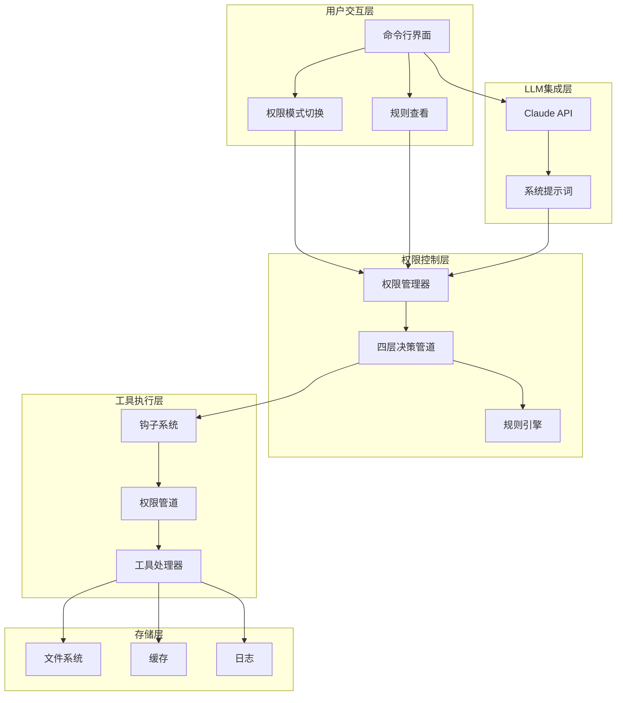
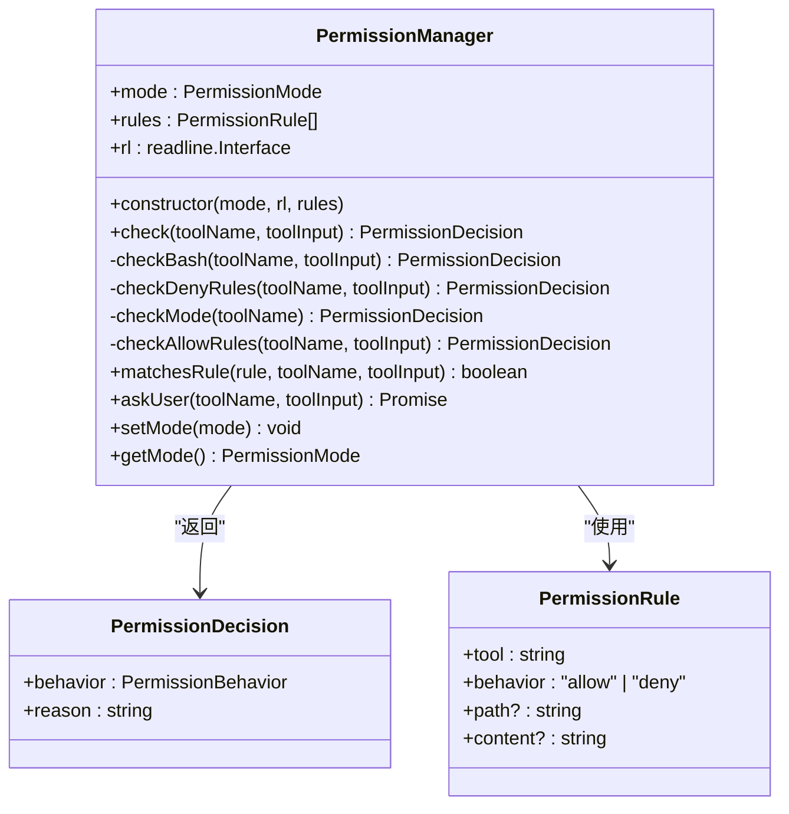
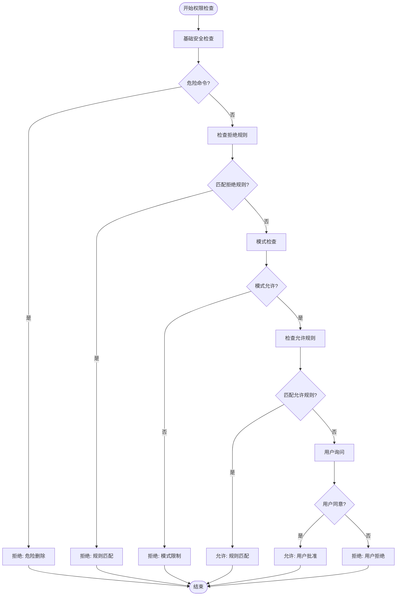
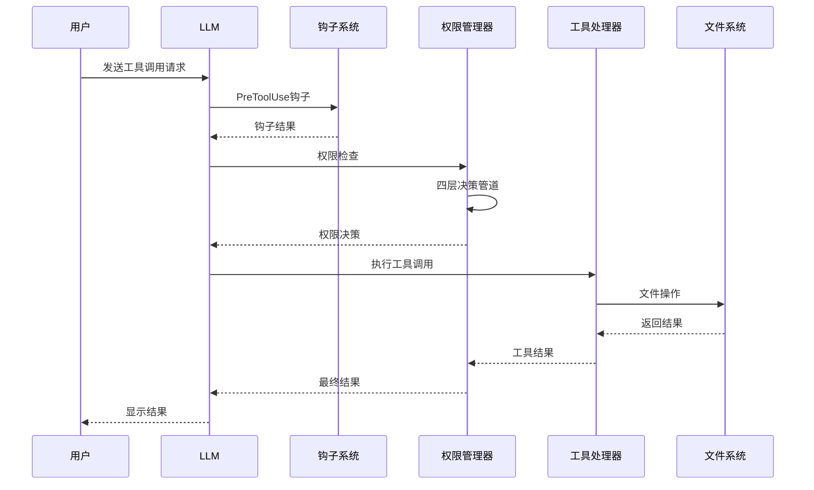

# 权限管理系统

<cite>
**本文档引用的文件**
- [SummaryStage/src/features/permissions/index.ts](file://SummaryStage/src/features/permissions/index.ts)
- [SummaryStage/src/features/permissions/permission-manager.ts](file://SummaryStage/src/features/permissions/permission-manager.ts)
- [SummaryStage/src/core/types.ts](file://SummaryStage/src/core/types.ts)
- [SummaryStage/src/core/agent-loop.ts](file://SummaryStage/src/core/agent-loop.ts)
- [SummaryStage/src/core/agent.ts](file://SummaryStage/src/core/agent.ts)
- [SummaryStage/src/core/context.ts](file://SummaryStage/src/core/context.ts)
- [SummaryStage/src/tools/registry.ts](file://SummaryStage/src/tools/registry.ts)
- [SummaryStage/src/tools/index.ts](file://SummaryStage/src/tools/index.ts)
- [SummaryStage/src/tools/bash.ts](file://SummaryStage/src/tools/bash.ts)
- [SummaryStage/src/tools/file-read.ts](file://SummaryStage/src/tools/file-read.ts)
- [SummaryStage/package.json](file://SummaryStage/package.json)
- [SummaryStage/src/main.ts](file://SummaryStage/src/main.ts)
</cite>

## 更新摘要
**所做更改**
- 更新为基于SummaryStage的新权限管理架构
- 新增四层决策管道和三种权限模式
- 替代原有的简单权限系统
- 重新设计权限管理器的集成方式
- 更新工具执行管道中的权限检查流程

## 目录
1. [简介](#简介)
2. [项目结构](#项目结构)
3. [核心组件](#核心组件)
4. [架构总览](#架构总览)
5. [详细组件分析](#详细组件分析)
6. [依赖关系分析](#依赖关系分析)
7. [性能考虑](#性能考虑)
8. [故障排除指南](#故障排除指南)
9. [结论](#结论)

## 简介
本项目是一个基于SummaryStage重构的权限管理系统，通过四个阶段的分层决策管道实现了更安全、更灵活的权限控制机制。系统基于Anthropic Claude API，采用模块化设计，支持默认(default)、计划(plan)、自动(auto)三种权限模式，为AI Agent提供了完整的安全控制解决方案。

## 项目结构
项目采用全新的SummaryStage架构，权限管理功能作为独立模块集成到Agent系统中：

```mermaid
graph TB
subgraph "核心模块"
CORE[core/<br/>核心架构]
FEATURES[features/<br/>功能模块]
TOOLS[tools/<br/>工具系统]
END
subgraph "权限管理模块"
PERM[features/permissions/<br/>权限管理]
PM_CLASS[permission-manager.ts<br/>权限管理器]
PM_INDEX[index.ts<br/>模块导出]
END
subgraph "核心架构"
CONTEXT[context.ts<br/>Agent上下文]
AGENTLOOP[agent-loop.ts<br/>主消息循环]
AGENT[agent.ts<br/>Agent组装器]
TYPES[types.ts<br/>类型定义]
END
subgraph "工具系统"
REGISTRY[registry.ts<br/>工具注册表]
BASETOOLS[index.ts<br/>基础工具注册]
BASHTOOL[bash.ts<br/>Bash工具]
READTOOL[file-read.ts<br/>文件读取工具]
END
PERM --> PM_CLASS
PERM --> PM_INDEX
CORE --> CONTEXT
CORE --> AGENTLOOP
CORE --> AGENT
CORE --> TYPES
FEATURES --> PERM
TOOLS --> REGISTRY
TOOLS --> BASETOOLS
TOOLS --> BASHTOOL
TOOLS --> READTOOL
```

**图表来源**
- [SummaryStage/src/features/permissions/index.ts:1-47](file://SummaryStage/src/features/permissions/index.ts#L1-L47)
- [SummaryStage/src/features/permissions/permission-manager.ts:1-265](file://SummaryStage/src/features/permissions/permission-manager.ts#L1-L265)
- [SummaryStage/src/core/agent-loop.ts:1-277](file://SummaryStage/src/core/agent-loop.ts#L1-L277)

## 核心组件
系统包含以下核心组件：

### 1. 权限管理器 (PermissionManager)
- **四层决策管道**: 基础安全检查 → 拒绝规则 → 模式检查 → 允许规则 → 用户询问
- **三种权限模式**: default(默认)、plan(计划)、auto(自动)
- **规则引擎**: 支持通配符匹配的权限规则系统
- **交互式确认**: 基于readline的用户确认机制

### 2. Agent上下文集成
- **可选模块**: 通过Agent.enablePermissions()按需启用
- **上下文注入**: 自动挂载到AgentContext.permissionManager
- **生命周期管理**: 在Agent初始化时创建和管理

### 3. 工具执行管道
- **钩子前置检查**: 支持PreToolUse钩子覆盖权限决策
- **权限决策**: 四层管道确保安全执行
- **异常处理**: 完善的错误处理和回退机制

**章节来源**
- [SummaryStage/src/features/permissions/permission-manager.ts:104-150](file://SummaryStage/src/features/permissions/permission-manager.ts#L104-L150)
- [SummaryStage/src/core/agent-loop.ts:149-211](file://SummaryStage/src/core/agent-loop.ts#L149-L211)

## 架构总览



**图表来源**
- [SummaryStage/src/core/agent-loop.ts:149-211](file://SummaryStage/src/core/agent-loop.ts#L149-L211)
- [SummaryStage/src/features/permissions/permission-manager.ts:133-150](file://SummaryStage/src/features/permissions/permission-manager.ts#L133-L150)

## 详细组件分析

### 权限管理器 (PermissionManager)



**图表来源**
- [SummaryStage/src/features/permissions/permission-manager.ts:114-265](file://SummaryStage/src/features/permissions/permission-manager.ts#L114-L265)
- [SummaryStage/src/core/types.ts:124-142](file://SummaryStage/src/core/types.ts#L124-L142)

权限管理器实现了四层决策管道：

1. **第一层：基础安全检查** - 拦截危险命令 (`rm -rf /`, `sudo *`)
2. **第二层：拒绝规则匹配** - 用户自定义的拒绝策略
3. **第三层：模式检查** - 基于权限模式的访问控制
4. **第四层：允许规则匹配** - 用户自定义的允许策略
5. **第五层：用户询问** - 未知情况下的用户确认

**章节来源**
- [SummaryStage/src/features/permissions/permission-manager.ts:133-150](file://SummaryStage/src/features/permissions/permission-manager.ts#L133-L150)

### 权限决策流程



**图表来源**
- [SummaryStage/src/features/permissions/permission-manager.ts:153-157](file://SummaryStage/src/features/permissions/permission-manager.ts#L153-L157)
- [SummaryStage/src/features/permissions/permission-manager.ts:243-253](file://SummaryStage/src/features/permissions/permission-manager.ts#L243-L253)

### 工具执行管道



**图表来源**
- [SummaryStage/src/core/agent-loop.ts:129-211](file://SummaryStage/src/core/agent-loop.ts#L129-L211)

**章节来源**
- [SummaryStage/src/core/agent-loop.ts:129-211](file://SummaryStage/src/core/agent-loop.ts#L129-L211)

### 权限模式系统

| 模式 | 工具集合 | 行为描述 | 使用场景 |
|------|----------|----------|----------|
| default | SAFE_TOOLS | 安全工具自动批准 | 标准开发工作 |
| plan | READ_ONLY_TOOLS | 仅允许只读操作 | 只读分析任务 |
| auto | SAFE_TOOLS + READ_ONLY_TOOLS | 安全和只读工具自动批准 | 严格安全环境 |

**章节来源**
- [SummaryStage/src/features/permissions/permission-manager.ts:28-35](file://SummaryStage/src/features/permissions/permission-manager.ts#L28-L35)
- [SummaryStage/src/features/permissions/permission-manager.ts:174-207](file://SummaryStage/src/features/permissions/permission-manager.ts#L174-L207)

## 依赖关系分析

```mermaid
graph LR
subgraph "外部依赖"
ANTHROPIC[@anthropic-ai/sdk]
DOTENV[dotenv]
YAML[js-yaml]
READLINE[node:readline]
END
subgraph "内部模块"
CORE[core/<br/>核心架构]
FEATURES[features/<br/>功能模块]
TOOLS[tools/<br/>工具系统]
END
subgraph "权限管理模块"
PM[features/permissions/<br/>权限管理器]
END
CORE --> ANTHROPIC
FEATURES --> PM
FEATURES --> READLINE
TOOLS --> ANTHROPIC
PM --> READLINE
PM --> CORE
PM --> TOOLS
```

**图表来源**
- [SummaryStage/package.json:14-18](file://SummaryStage/package.json#L14-L18)
- [SummaryStage/src/features/permissions/index.ts:10-14](file://SummaryStage/src/features/permissions/index.ts#L10-L14)

**章节来源**
- [SummaryStage/package.json:14-18](file://SummaryStage/package.json#L14-L18)

## 性能考虑
系统在多个层面进行了性能优化：

### 1. 内存管理
- **微压缩**: 每轮自动清理旧工具结果
- **自动压缩**: 超过阈值时触发全文压缩
- **手动压缩**: 用户主动触发压缩

### 2. 权限检查优化
- **快速路径**: 危险命令立即拒绝，避免后续检查
- **规则缓存**: 已匹配规则的快速返回
- **异步用户交互**: 非阻塞的用户确认机制

### 3. 工具执行优化
- **超时控制**: Bash命令执行设置超时限制
- **输出限制**: 防止内存溢出的大文件处理
- **并发处理**: 支持多个工具并行执行

**章节来源**
- [SummaryStage/src/tools/bash.ts:40-57](file://SummaryStage/src/tools/bash.ts#L40-L57)
- [SummaryStage/src/tools/file-read.ts:41-62](file://SummaryStage/src/tools/file-read.ts#L41-L62)

## 故障排除指南

### 常见问题及解决方案

#### 1. 权限相关问题
- **问题**: 工具调用被拒绝
- **原因**: 权限规则配置不当或模式限制
- **解决**: 使用 `/rules` 命令查看当前规则，使用 `/mode` 切换权限模式

#### 2. 路径安全问题
- **问题**: 文件操作失败
- **原因**: 路径超出工作目录范围
- **解决**: 使用相对路径，避免 `../` 组合

#### 3. 命令执行问题
- **问题**: Bash命令超时
- **原因**: 命令执行时间过长
- **解决**: 检查命令复杂度或调整超时设置

#### 4. 权限模式问题
- **问题**: 模式切换无效
- **原因**: 模式参数错误
- **解决**: 使用 `/mode default|plan|auto` 正确切换

**章节来源**
- [SummaryStage/src/core/agent.ts:191-221](file://SummaryStage/src/core/agent.ts#L191-L221)

### 调试技巧
1. **启用详细日志**: 查看控制台输出的执行详情
2. **检查权限模式**: 使用 `/mode` 命令查看当前模式
3. **验证规则**: 使用 `/rules` 命令查看当前规则配置
4. **监控资源**: 关注内存和CPU使用情况

## 结论
本权限管理系统通过四个阶段的分层决策管道，提供了一个更加安全、灵活的权限控制解决方案。系统具备以下特点：

### 核心优势
- **四层安全防护**: 从基础安全检查到精细权限控制
- **灵活的权限模式**: 支持默认、计划、自动三种模式
- **模块化设计**: 独立的权限管理模块，可按需启用
- **完善的工具集**: 覆盖文件操作、任务管理、技能加载等功能
- **高效的内存管理**: 通过多层压缩机制控制上下文窗口

### 应用价值
- **企业级应用**: 可作为企业内部AI工具的安全控制中心
- **开发辅助**: 帮助开发者安全地执行各种代码操作
- **学习平台**: 展示了权限控制的最佳实践和实现方法

### 未来扩展
- **动态规则**: 支持基于时间、用户角色的动态权限控制
- **审计日志**: 完善的操作审计和合规性报告
- **多租户支持**: 支持多用户环境下的隔离权限控制

该系统为构建安全可靠的AI Agent提供了完整的参考实现，适合在生产环境中部署和使用。