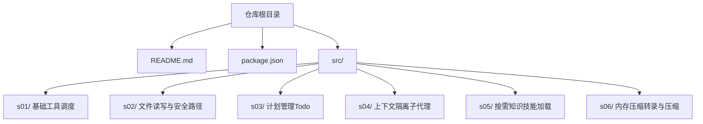
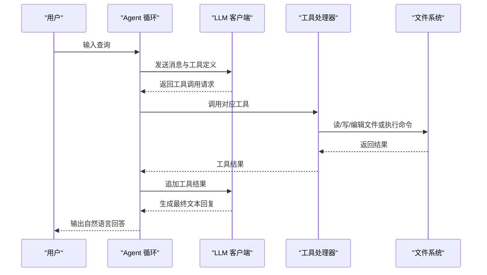
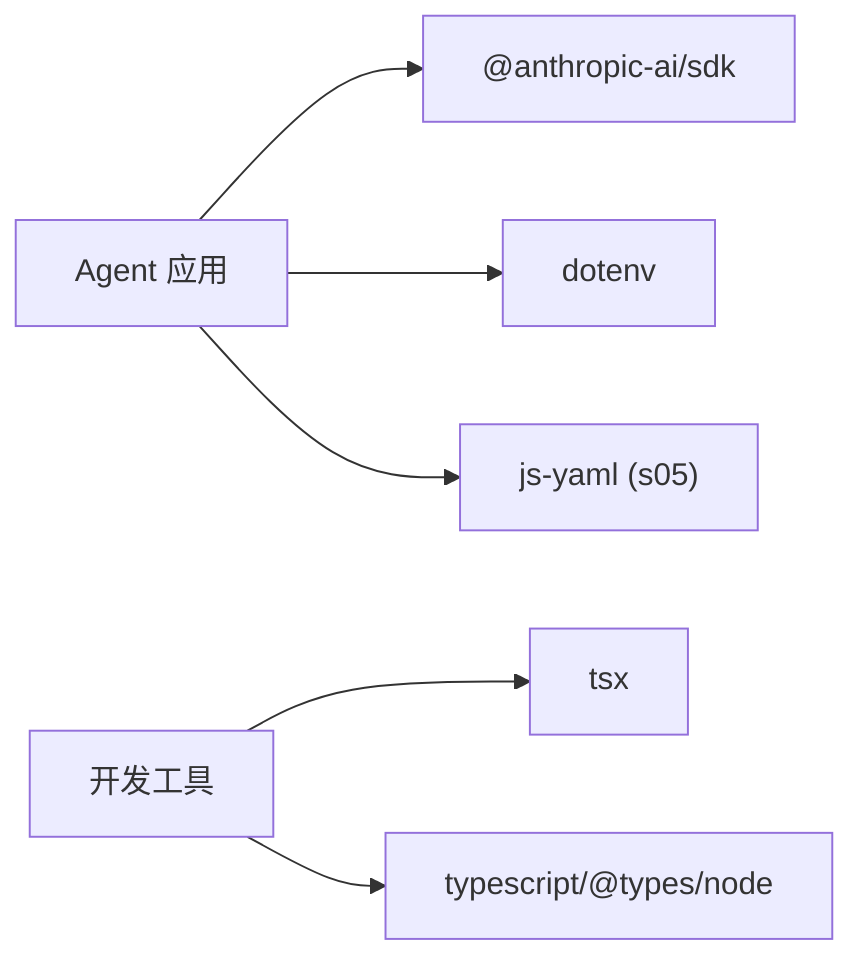

# 快速开始

<cite>
**本文引用的文件**
- [README.md](file://README.md)
- [package.json](file://package.json)
- [src/s01/index.ts](file://src/s01/index.ts)
- [src/s01/package.json](file://src/s01/package.json)
- [src/s01/tsconfig.json](file://src/s01/tsconfig.json)
- [src/s02/index.ts](file://src/s02/index.ts)
- [src/s02/package.json](file://src/s02/package.json)
- [src/s02/test.txt](file://src/s02/test.txt)
- [src/s02/greet.py](file://src/s02/greet.py)
- [src/s03/index.ts](file://src/s03/index.ts)
- [src/s04/index.ts](file://src/s04/index.ts)
- [src/s05/index.ts](file://src/s05/index.ts)
- [src/s05/skills/code-reviews/SKILL.md](file://src/s05/skills/code-reviews/SKILL.md)
- [src/s06/index.ts](file://src/s06/index.ts)
</cite>

## 目录
1. [简介](#简介)
2. [项目结构](#项目结构)
3. [核心组件](#核心组件)
4. [架构总览](#架构总览)
5. [详细组件分析](#详细组件分析)
6. [依赖分析](#依赖分析)
7. [性能考虑](#性能考虑)
8. [故障排除指南](#故障排除指南)
9. [结论](#结论)
10. [附录](#附录)

## 简介
本指南面向新手用户，帮助你在约 15 分钟内完成 Mini-Claude-Code 的环境准备、依赖安装与首次运行，体验一个可交互的 AI 代理（Agent）在本地工作区执行命令、读写文件、规划任务、子代理协作以及知识加载等能力。你将学到：
- 环境要求与工具链准备
- 依赖安装与脚本使用
- 环境变量配置
- 运行第一个 AI 代理实例
- 常见问题排查

## 项目结构
该项目采用分阶段（Step）组织的多模块结构，每个阶段对应一个功能增强点，便于循序渐进学习与验证。

图表来源
- [README.md:1-3](file://README.md#L1-L3)
- [package.json:1-25](file://package.json#L1-L25)
- [src/s01/index.ts:1-158](file://src/s01/index.ts#L1-L158)
- [src/s02/index.ts:1-213](file://src/s02/index.ts#L1-L213)
- [src/s03/index.ts:1-335](file://src/s03/index.ts#L1-L335)
- [src/s04/index.ts:1-314](file://src/s04/index.ts#L1-L314)
- [src/s05/index.ts:1-332](file://src/s05/index.ts#L1-L332)
- [src/s06/index.ts:1-413](file://src/s06/index.ts#L1-L413)

章节来源
- [README.md:1-3](file://README.md#L1-L3)
- [package.json:1-25](file://package.json#L1-L25)

## 核心组件
- 代理入口与交互循环：各阶段均通过命令行交互（readline）接收用户输入，驱动一次或多轮工具调用，最终输出自然语言回复。
- 工具集：基础工具（bash、read_file、write_file、edit_file），计划工具（todo），子代理工具（task），技能加载工具（load_skill），压缩工具（compact）。
- 安全与隔离：路径解析与工作区限制、上下文隔离、内存压缩与转录持久化。
- 配置与运行：通过环境变量注入 API 密钥、基础 URL、模型标识；使用 TypeScript + tsx 启动器进行开发运行。

章节来源
- [src/s01/index.ts:126-158](file://src/s01/index.ts#L126-L158)
- [src/s02/index.ts:181-213](file://src/s02/index.ts#L181-L213)
- [src/s03/index.ts:301-335](file://src/s03/index.ts#L301-L335)
- [src/s04/index.ts:281-314](file://src/s04/index.ts#L281-L314)
- [src/s05/index.ts:300-332](file://src/s05/index.ts#L300-L332)
- [src/s06/index.ts:370-413](file://src/s06/index.ts#L370-L413)

## 架构总览
下面以“工具调度”阶段为例，展示从用户输入到工具执行与结果回传的端到端流程。

图表来源
- [src/s01/index.ts:76-124](file://src/s01/index.ts#L76-L124)
- [src/s02/index.ts:138-179](file://src/s02/index.ts#L138-L179)
- [src/s03/index.ts:242-299](file://src/s03/index.ts#L242-L299)
- [src/s04/index.ts:221-279](file://src/s04/index.ts#L221-L279)
- [src/s05/index.ts:257-298](file://src/s05/index.ts#L257-L298)
- [src/s06/index.ts:303-367](file://src/s06/index.ts#L303-L367)

## 详细组件分析

### 环境与依赖准备
- Node.js 版本：项目使用 ES2022 目标与 NodeNext 模块解析，建议使用较新的 LTS 版本（如 18.x 或 20.x）以获得最佳兼容性。
- 包管理器：项目声明使用 pnpm（版本在根 package.json 中指定），请先安装 pnpm 并确保其可用。
- 依赖安装：在仓库根目录执行依赖安装，随后进入任一阶段目录（例如 s01）执行安装与运行。

章节来源
- [src/s01/tsconfig.json:1-11](file://src/s01/tsconfig.json#L1-L11)
- [package.json:12-25](file://package.json#L12-L25)
- [src/s01/package.json:12-23](file://src/s01/package.json#L12-L23)

### 环境变量配置
运行前必须设置以下环境变量：
- ANTHROPIC_API_KEY：Anthropic API 密钥
- ANTHROPIC_BASE_URL：可选，自定义 API 基础地址
- MODEL_ID：使用的模型标识符（例如 claude-3-haiku-20240307）

提示：可在工作区根目录创建 .env 文件并写入上述键值对，程序会自动加载。

章节来源
- [src/s01/index.ts:19-28](file://src/s01/index.ts#L19-L28)
- [src/s02/index.ts:20-29](file://src/s02/index.ts#L20-L29)
- [src/s03/index.ts:32-42](file://src/s03/index.ts#L32-L42)
- [src/s04/index.ts:27-38](file://src/s04/index.ts#L27-L38)
- [src/s05/index.ts:29-41](file://src/s05/index.ts#L29-L41)
- [src/s06/index.ts:36-47](file://src/s06/index.ts#L36-L47)

### 运行第一个 AI 代理实例（s01）
- 步骤
  1) 在根目录安装依赖后，进入 s01 目录
  2) 设置环境变量（见上节）
  3) 使用开发脚本启动：tsx index.ts
  4) 在交互提示符下输入你的第一条指令，例如“列出当前目录”
  5) 退出：输入 q 或 exit

- 交互要点
  - 提示符为 s01 >>，输入空行或退出命令即可结束
  - 代理会根据工具调用结果输出最终自然语言回复

章节来源
- [src/s01/index.ts:126-158](file://src/s01/index.ts#L126-L158)
- [src/s01/package.json:6-8](file://src/s01/package.json#L6-L8)

### 功能扩展：s02（文件读写与安全路径）
- 新增能力
  - 读取文件内容（支持行数限制）
  - 写入/编辑文件（带安全路径校验）
  - 执行 shell 命令
- 示例
  - 读取 test.txt
  - 写入一段文本到新文件
  - 编辑现有文件中的特定片段
- 安全
  - 所有文件操作均受工作区限制，防止路径逃逸

章节来源
- [src/s02/index.ts:50-89](file://src/s02/index.ts#L50-L89)
- [src/s02/index.ts:118-135](file://src/s02/index.ts#L118-L135)
- [src/s02/test.txt:1-1](file://src/s02/test.txt#L1-L1)

### 功能扩展：s03（计划管理）
- 新增能力
  - 使用 todo 工具维护任务清单（待办/进行中/已完成）
  - 自动提醒机制：当连续多轮未更新任务时，注入提醒
- 示例
  - 创建任务列表
  - 将某项标记为进行中
  - 逐步完成并更新状态

章节来源
- [src/s03/index.ts:77-131](file://src/s03/index.ts#L77-L131)
- [src/s03/index.ts:219-239](file://src/s03/index.ts#L219-L239)
- [src/s03/index.ts:242-299](file://src/s03/index.ts#L242-L299)

### 功能扩展：s04（上下文隔离与子代理）
- 新增能力
  - 通过 task 工具派生子代理，子代理拥有全新对话上下文
  - 子代理执行工具后仅返回最终总结文本给父代理
- 示例
  - 请求子代理探索某个目录并汇总结果
  - 父代理保持干净的上下文，避免历史累积

章节来源
- [src/s04/index.ts:148-195](file://src/s04/index.ts#L148-L195)
- [src/s04/index.ts:197-216](file://src/s04/index.ts#L197-L216)
- [src/s04/index.ts:221-279](file://src/s04/index.ts#L221-L279)

### 功能扩展：s05（按需知识与技能加载）
- 新增能力
  - 通过 load_skill 工具动态加载“技能”知识
  - 技能以 Markdown + YAML Frontmatter 组织，系统提示中注入技能概览
- 示例
  - 加载 code-review 技能，获取结构化的代码审查方法论与检查清单
  - 结合文件读写工具对目标代码进行审查

章节来源
- [src/s05/index.ts:46-144](file://src/s05/index.ts#L46-L144)
- [src/s05/skills/code-reviews/SKILL.md:1-157](file://src/s05/skills/code-reviews/SKILL.md#L1-L157)
- [src/s05/index.ts:234-254](file://src/s05/index.ts#L234-L254)

### 功能扩展：s06（内存压缩与转录）
- 新增能力
  - 微型压缩：将旧的工具结果替换为占位摘要，保留最近若干条
  - 自动压缩：当消息长度超过阈值时，保存完整转录并请求模型生成摘要，替换历史消息
  - 手动压缩：通过 compact 工具触发即时压缩
- 示例
  - 长时间对话后，查看 .transcripts/ 下的转录文件
  - 手动触发压缩，清理历史上下文

章节来源
- [src/s06/index.ts:59-61](file://src/s06/index.ts#L59-L61)
- [src/s06/index.ts:82-138](file://src/s06/index.ts#L82-L138)
- [src/s06/index.ts:150-196](file://src/s06/index.ts#L150-L196)
- [src/s06/index.ts:280-300](file://src/s06/index.ts#L280-L300)

## 依赖分析
- 运行时依赖
  - @anthropic-ai/sdk：调用 Claude API
  - dotenv：加载 .env 环境变量
  - js-yaml（仅 s05）：解析技能文档的 YAML Frontmatter
- 开发依赖
  - tsx：TypeScript 启动器
  - typescript、@types/node：类型支持
- 包管理器
  - pnpm：锁定版本并加速安装

图表来源
- [package.json:13-23](file://package.json#L13-L23)
- [src/s01/package.json:13-22](file://src/s01/package.json#L13-L22)
- [src/s05/index.ts:27](file://src/s05/index.ts#L27)

章节来源
- [package.json:13-23](file://package.json#L13-L23)
- [src/s01/package.json:13-22](file://src/s01/package.json#L13-L22)
- [src/s05/index.ts:27](file://src/s05/index.ts#L27)

## 性能考虑
- 工具调用频率与上下文长度：频繁的工具调用会增加上下文长度，建议在长对话场景中启用压缩策略（s06）。
- 文件读取限制：读取大文件时建议使用行数限制参数，避免一次性传输过多内容。
- 超时控制：命令执行默认超时为 120 秒，避免长时间阻塞。
- 模型选择：不同模型在推理速度与成本上有差异，请根据需求调整 MODEL_ID。

## 故障排除指南
- 无法连接 API
  - 确认 ANTHROPIC_API_KEY 已正确设置且有效
  - 如使用自定义服务端点，确认 ANTHROPIC_BASE_URL 可访问
- 无响应或超时
  - 检查网络连通性与代理设置
  - 减少一次性读取的大文件大小
- 权限错误或路径异常
  - 确保工作区内文件操作不会越界（安全路径校验已在工具中实现）
- 退出与中断
  - 使用 q 或 exit 退出交互
  - 若需要中断进程，使用 Ctrl+C

章节来源
- [src/s01/index.ts:23-26](file://src/s01/index.ts#L23-L26)
- [src/s02/index.ts:92-104](file://src/s02/index.ts#L92-L104)
- [src/s06/index.ts:254-266](file://src/s06/index.ts#L254-L266)

## 结论
通过本快速开始指南，你已掌握：
- 环境准备与依赖安装
- 环境变量配置
- 运行首个 AI 代理实例
- 体验从基础工具调度到上下文隔离与知识加载的关键能力

建议继续探索更高阶段（s04~s06）以深入理解子代理、技能加载与内存压缩等高级特性。

## 附录

### 安装与运行清单（s01）
- 在仓库根目录安装依赖
- 进入 src/s01
- 设置环境变量（见“环境变量配置”）
- 使用开发脚本启动：tsx index.ts
- 在提示符 s01 >> 下输入你的第一条指令

章节来源
- [src/s01/package.json:6-8](file://src/s01/package.json#L6-L8)
- [src/s01/index.ts:126-158](file://src/s01/index.ts#L126-L158)