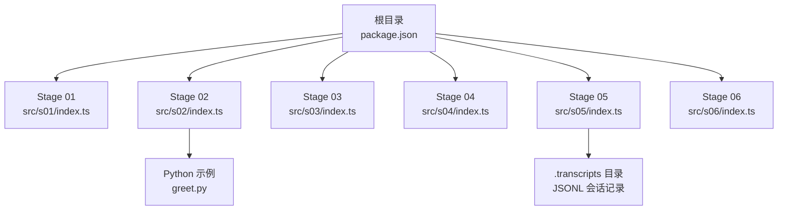
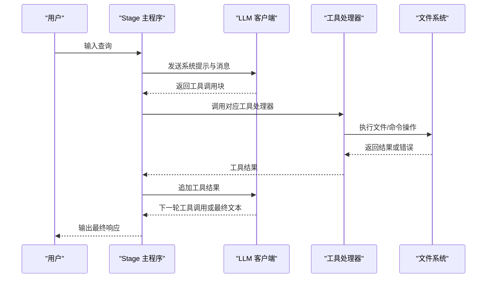
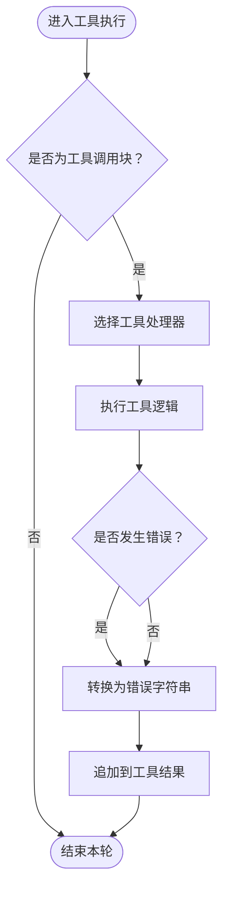
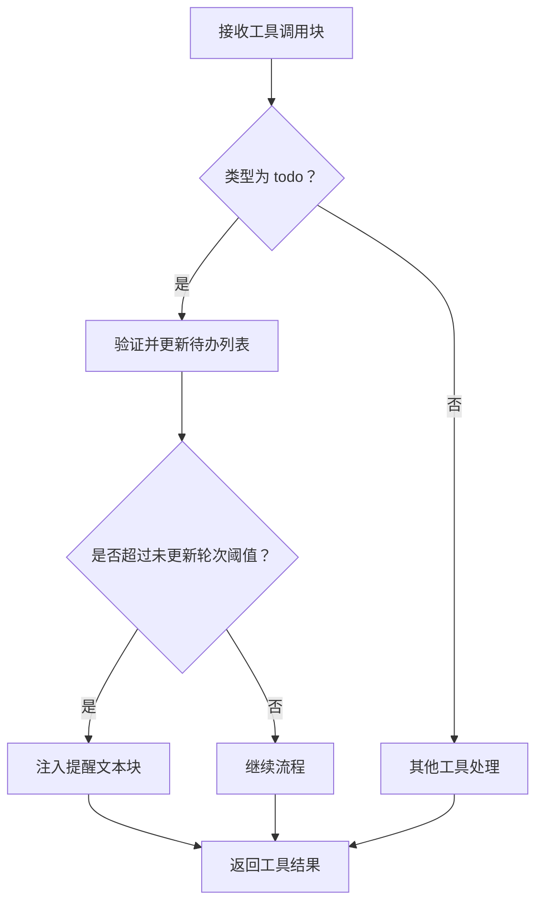
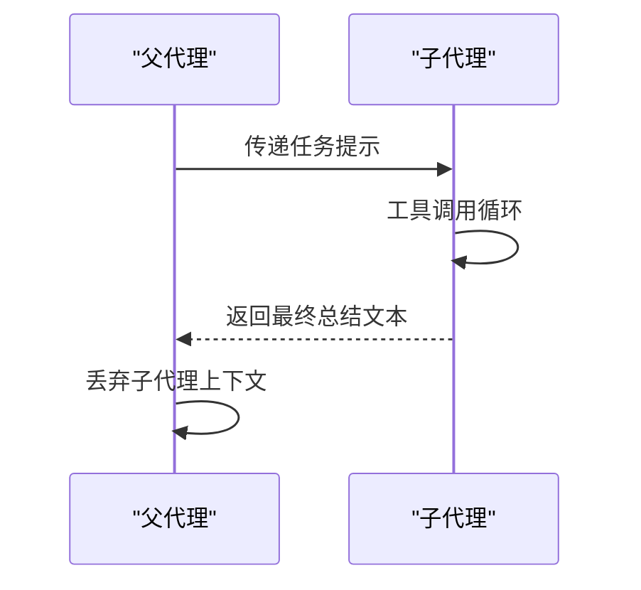
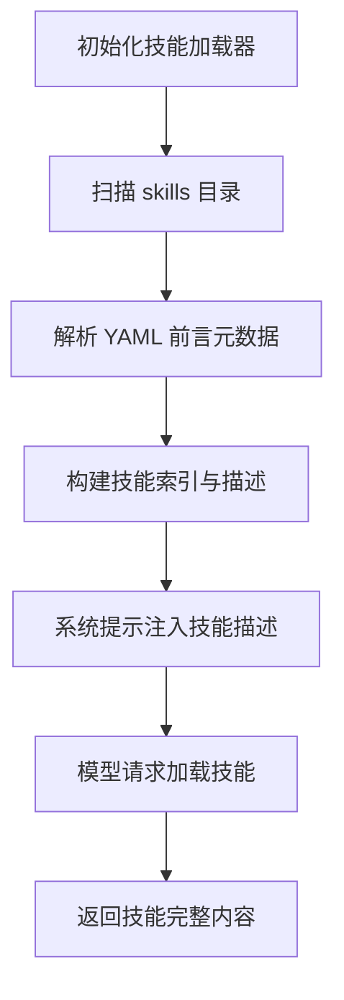
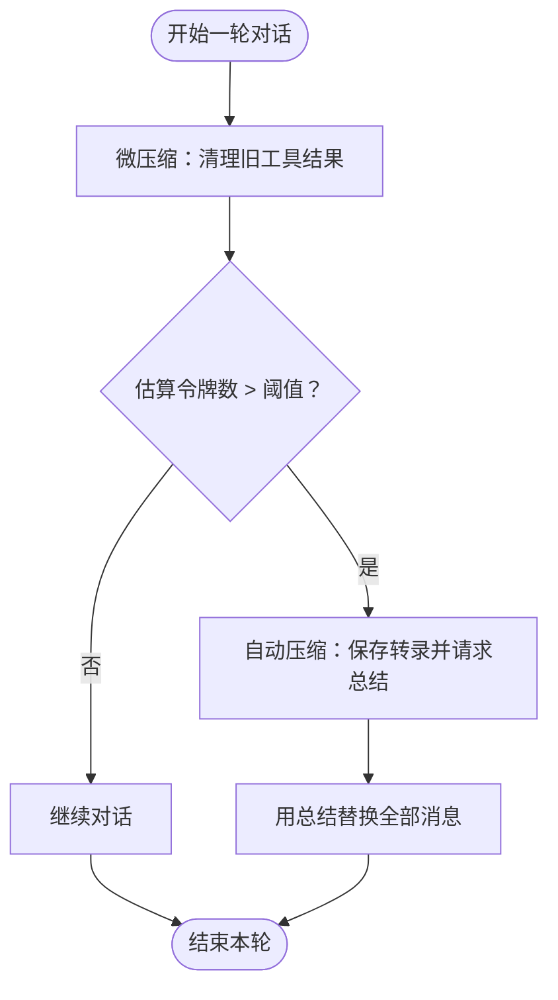
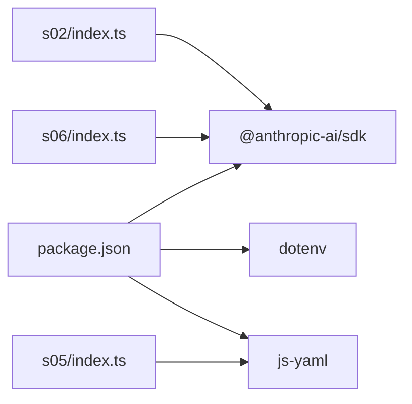

# 故障排除指南

<cite>
**本文档引用的文件**
- [README.md](file://README.md)
- [package.json](file://package.json)
- [src/s01/index.ts](file://src/s01/index.ts)
- [src/s01/package.json](file://src/s01/package.json)
- [src/s02/index.ts](file://src/s02/index.ts)
- [src/s02/greet.py](file://src/s02/greet.py)
- [src/s02/package.json](file://src/s02/package.json)
- [src/s02/test.txt](file://src/s02/test.txt)
- [src/s03/index.ts](file://src/s03/index.ts)
- [src/s04/index.ts](file://src/s04/index.ts)
- [src/s05/index.ts](file://src/s05/index.ts)
- [src/s06/index.ts](file://src/s06/index.ts)
- [src/s06/.transcripts/transcript_1777018931.jsonl](file://src/s06/.transcripts/transcript_1777018931.jsonl)
</cite>

## 目录
1. [简介](#简介)
2. [项目结构](#项目结构)
3. [核心组件](#核心组件)
4. [架构总览](#架构总览)
5. [详细组件分析](#详细组件分析)
6. [依赖关系分析](#依赖关系分析)
7. [性能考虑](#性能考虑)
8. [故障排除指南](#故障排除指南)
9. [结论](#结论)
10. [附录](#附录)

## 简介
本指南面向使用 Mini-Claude-Code 的开发者与使用者，提供系统化的问题诊断与解决流程，覆盖安装与环境准备、配置错误、运行时异常、性能问题、网络连接与权限问题，并给出日志分析技巧、问题报告模板与社区支持资源，帮助快速定位与解决问题。

## 项目结构
该项目采用多阶段（stage）模块化组织，每个 stage 实现不同的智能体能力（工具调度、计划管理、上下文隔离、技能加载、会话压缩等）。顶层通过脚本启动各 stage 的入口文件；各 stage 内部通过环境变量与 dotenv 配置访问 API 密钥与模型参数。

图表来源
- [package.json:1-25](file://package.json#L1-L25)
- [src/s01/index.ts:1-158](file://src/s01/index.ts#L1-L158)
- [src/s02/index.ts:1-213](file://src/s02/index.ts#L1-L213)
- [src/s03/index.ts:1-335](file://src/s03/index.ts#L1-L335)
- [src/s04/index.ts:1-314](file://src/s04/index.ts#L1-L314)
- [src/s05/index.ts:1-332](file://src/s05/index.ts#L1-L332)
- [src/s06/index.ts:1-413](file://src/s06/index.ts#L1-L413)
- [src/s06/.transcripts/transcript_1777018931.jsonl:1-8](file://src/s06/.transcripts/transcript_1777018931.jsonl#L1-L8)

章节来源
- [README.md:1-3](file://README.md#L1-L3)
- [package.json:1-25](file://package.json#L1-L25)

## 核心组件
- 工具执行器：封装 bash、文件读写、编辑与子任务派发等工具调用，统一错误处理与输出截断。
- 智能体循环：按轮次与工具调用结果迭代，支持多阶段的系统提示注入与上下文管理。
- 技能加载器：扫描 skills 目录，解析 YAML 前言元数据，按需注入领域知识。
- 会话压缩器：对历史消息进行微压缩与自动压缩，控制上下文长度，避免超出令牌阈值。
- 环境配置：通过 dotenv 读取 API 密钥、基础 URL、模型 ID 等关键参数。

章节来源
- [src/s01/index.ts:23-26](file://src/s01/index.ts#L23-L26)
- [src/s02/index.ts:25-28](file://src/s02/index.ts#L25-L28)
- [src/s03/index.ts:37-54](file://src/s03/index.ts#L37-L54)
- [src/s04/index.ts:32-38](file://src/s04/index.ts#L32-L38)
- [src/s05/index.ts:36-44](file://src/s05/index.ts#L36-L44)
- [src/s06/index.ts:42-47](file://src/s06/index.ts#L42-L47)

## 架构总览
下图展示从用户输入到工具执行与结果回传的整体流程，以及在不同阶段中系统提示、工具集与上下文管理的变化。

图表来源
- [src/s01/index.ts:77-124](file://src/s01/index.ts#L77-L124)
- [src/s02/index.ts:138-179](file://src/s02/index.ts#L138-L179)
- [src/s03/index.ts:243-299](file://src/s03/index.ts#L243-L299)
- [src/s04/index.ts:221-279](file://src/s04/index.ts#L221-L279)
- [src/s05/index.ts:257-298](file://src/s05/index.ts#L257-L298)
- [src/s06/index.ts:313-367](file://src/s06/index.ts#L313-L367)

## 详细组件分析

### 组件 A：工具执行与安全路径校验
- 功能要点
  - bash 执行：限制超时，捕获标准输出与错误输出，统一返回格式。
  - 文件工具：读取、写入、编辑均通过安全路径校验，防止越界访问。
  - 错误处理：所有工具调用统一包装为字符串错误信息，便于对话上下文传递。
- 关键路径
  - bash 执行与输出拼接：[src/s01/index.ts:50-62](file://src/s01/index.ts#L50-L62)
  - 安全路径校验与文件操作：[src/s02/index.ts:37-89](file://src/s02/index.ts#L37-L89)
  - 文件工具实现与错误包装：[src/s03/index.ts:151-205](file://src/s03/index.ts#L151-L205)

图表来源
- [src/s02/index.ts:138-179](file://src/s02/index.ts#L138-L179)
- [src/s03/index.ts:243-299](file://src/s03/index.ts#L243-L299)

章节来源
- [src/s01/index.ts:50-62](file://src/s01/index.ts#L50-L62)
- [src/s02/index.ts:37-89](file://src/s02/index.ts#L37-L89)
- [src/s03/index.ts:151-205](file://src/s03/index.ts#L151-L205)

### 组件 B：计划管理与待办状态
- 功能要点
  - 待办管理器维护任务列表，约束状态与数量，渲染当前进度。
  - 模型在多步任务中优先更新待办，再逐步推进，减少偏离。
  - 超过阈值未更新待办时注入提醒，保持任务聚焦。
- 关键路径
  - 待办更新与校验：[src/s03/index.ts:80-117](file://src/s03/index.ts#L80-L117)
  - 循环中的提醒触发与结果注入：[src/s03/index.ts:281-283](file://src/s03/index.ts#L281-L283)

图表来源
- [src/s03/index.ts:243-299](file://src/s03/index.ts#L243-L299)

章节来源
- [src/s03/index.ts:77-131](file://src/s03/index.ts#L77-L131)
- [src/s03/index.ts:281-283](file://src/s03/index.ts#L281-L283)

### 组件 C：上下文隔离与子代理
- 功能要点
  - 父代理仅保留最终总结，丢弃子代理上下文，实现“进程隔离即上下文隔离”。
  - 子代理拥有基础工具集，但不递归派生子代理，避免上下文膨胀。
- 关键路径
  - 子代理循环与工具调用：[src/s04/index.ts:148-195](file://src/s04/index.ts#L148-L195)
  - 父代理的任务分派与结果汇总：[src/s04/index.ts:221-279](file://src/s04/index.ts#L221-L279)

图表来源
- [src/s04/index.ts:148-195](file://src/s04/index.ts#L148-L195)
- [src/s04/index.ts:221-279](file://src/s04/index.ts#L221-L279)

章节来源
- [src/s04/index.ts:148-195](file://src/s04/index.ts#L148-L195)
- [src/s04/index.ts:221-279](file://src/s04/index.ts#L221-L279)

### 组件 D：技能加载与动态知识注入
- 功能要点
  - 扫描 skills 目录，解析 YAML 前言元数据，生成技能描述列表。
  - 模型请求加载技能时，返回完整技能内容，作为“按需知识层”。
- 关键路径
  - 技能目录扫描与解析：[src/s05/index.ts:55-108](file://src/s05/index.ts#L55-L108)
  - 技能描述注入系统提示：[src/s05/index.ts:146-151](file://src/s05/index.ts#L146-L151)
  - 技能内容返回：[src/s05/index.ts:133-141](file://src/s05/index.ts#L133-L141)

图表来源
- [src/s05/index.ts:46-144](file://src/s05/index.ts#L46-L144)

章节来源
- [src/s05/index.ts:46-144](file://src/s05/index.ts#L46-L144)

### 组件 E：会话压缩与无限会话支持
- 功能要点
  - 微压缩：将非最近的工具结果替换为占位摘要，保留 read_file 结果以维持参考。
  - 自动压缩：当估算令牌数超过阈值时，保存完整会话至 .transcripts 并请求 LLM 总结，替换全部消息。
  - 手动压缩：模型可直接触发压缩工具，立即执行自动压缩流程。
- 关键路径
  - 令牌估算与阈值判断：[src/s06/index.ts:59-61](file://src/s06/index.ts#L59-L61)
  - 微压缩与占位替换：[src/s06/index.ts:82-138](file://src/s06/index.ts#L82-L138)
  - 自动压缩与转录保存：[src/s06/index.ts:150-196](file://src/s06/index.ts#L150-L196)
  - 手动压缩触发：[src/s06/index.ts:334-366](file://src/s06/index.ts#L334-L366)

图表来源
- [src/s06/index.ts:303-367](file://src/s06/index.ts#L303-L367)

章节来源
- [src/s06/index.ts:59-61](file://src/s06/index.ts#L59-L61)
- [src/s06/index.ts:82-138](file://src/s06/index.ts#L82-L138)
- [src/s06/index.ts:150-196](file://src/s06/index.ts#L150-L196)
- [src/s06/index.ts:334-366](file://src/s06/index.ts#L334-L366)

## 依赖关系分析
- 外部依赖
  - @anthropic-ai/sdk：调用 Claude API 的客户端。
  - dotenv：读取 .env 中的环境变量。
  - js-yaml：解析技能前言元数据。
- 内部模块
  - 各 stage 的入口文件相互独立，共享通用工具函数与安全路径校验。
  - Stage 06 的压缩器可被其他 stage 引用以实现长会话支持。

图表来源
- [package.json:13-22](file://package.json#L13-L22)
- [src/s02/index.ts:15-16](file://src/s02/index.ts#L15-L16)
- [src/s05/index.ts:27-27](file://src/s05/index.ts#L27-L27)
- [src/s06/index.ts:31-31](file://src/s06/index.ts#L31-L31)

章节来源
- [package.json:13-22](file://package.json#L13-L22)

## 性能考虑
- 上下文控制
  - 使用微压缩与自动压缩控制消息长度，避免超出模型上下文限制。
  - 保留 read_file 结果以减少重复读取带来的往返成本。
- 工具调用优化
  - 对 bash 命令设置合理超时，避免长时间阻塞。
  - 尽量使用精确的文件路径与小范围读取，减少 IO 开销。
- 令牌估算
  - 基于字符串长度的粗略估算，结合阈值触发压缩，平衡准确性与性能。

章节来源
- [src/s06/index.ts:59-61](file://src/s06/index.ts#L59-L61)
- [src/s06/index.ts:82-138](file://src/s06/index.ts#L82-L138)
- [src/s06/index.ts:150-196](file://src/s06/index.ts#L150-L196)

## 故障排除指南

### 一、安装与环境准备
- 症状
  - 启动时报错找不到模块或命令。
- 排查步骤
  - 确认包管理器版本与依赖安装：[package.json:12-12](file://package.json#L12-L12)、[src/s01/package.json:12-12](file://src/s01/package.json#L12-L12)、[src/s02/package.json:12-12](file://src/s02/package.json#L12-L12)、[src/s03/package.json:12-12](file://src/s03/package.json#L12-L12)
  - 检查 Node.js 版本与 TypeScript 支持：[package.json:21-22](file://package.json#L21-L22)、[src/s01/package.json:19-20](file://src/s01/package.json#L19-L20)、[src/s02/package.json:18-19](file://src/s02/package.json#L18-L19)、[src/s03/package.json:18-19](file://src/s03/package.json#L18-L19)
  - 确认全局可执行工具（如 tsx）可用：[package.json:7-7](file://package.json#L7-L7)、[src/s01/package.json:7-7](file://src/s01/package.json#L7-L7)、[src/s02/package.json:7-7](file://src/s02/package.json#L7-L7)、[src/s03/package.json:7-7](file://src/s03/package.json#L7-L7)
- 解决方案
  - 使用指定版本的包管理器安装依赖后重试。
  - 如需 Python 示例，请确认系统已安装 Python 并可执行：[src/s02/greet.py:1-12](file://src/s02/greet.py#L1-L12)

章节来源
- [package.json:7-22](file://package.json#L7-L22)
- [src/s01/package.json:7-22](file://src/s01/package.json#L7-L22)
- [src/s02/package.json:7-22](file://src/s02/package.json#L7-L22)
- [src/s03/package.json:7-22](file://src/s03/package.json#L7-L22)
- [src/s02/greet.py:1-12](file://src/s02/greet.py#L1-L12)

### 二、配置错误
- 症状
  - 启动后立即报错或无响应。
- 排查步骤
  - 检查环境变量是否正确加载：[src/s01/index.ts:19-19](file://src/s01/index.ts#L19-L19)、[src/s02/index.ts:20-20](file://src/s02/index.ts#L20-L20)、[src/s03/index.ts:32-32](file://src/s03/index.ts#L32-L32)、[src/s04/index.ts:27-27](file://src/s04/index.ts#L27-L27)、[src/s05/index.ts:29-29](file://src/s05/index.ts#L29-L29)、[src/s06/index.ts:36-36](file://src/s06/index.ts#L36-L36)
  - 确认 ANTHROPIC_API_KEY、ANTHROPIC_BASE_URL、MODEL_ID 是否存在且有效：[src/s01/index.ts:23-28](file://src/s01/index.ts#L23-L28)、[src/s02/index.ts:25-28](file://src/s02/index.ts#L25-L28)、[src/s03/index.ts:37-41](file://src/s03/index.ts#L37-L41)、[src/s04/index.ts:32-36](file://src/s04/index.ts#L32-L36)、[src/s05/index.ts:36-40](file://src/s05/index.ts#L36-L40)、[src/s06/index.ts:42-46](file://src/s06/index.ts#L42-L46)
- 解决方案
  - 在项目根目录创建 .env 文件并填入必要变量，确保 dotenv 正常加载。
  - 若使用自定义服务端点，确认 baseURL 与 API Key 匹配目标平台。

章节来源
- [src/s01/index.ts:19-28](file://src/s01/index.ts#L19-L28)
- [src/s02/index.ts:20-28](file://src/s02/index.ts#L20-L28)
- [src/s03/index.ts:32-41](file://src/s03/index.ts#L32-L41)
- [src/s04/index.ts:27-36](file://src/s04/index.ts#L27-L36)
- [src/s05/index.ts:29-40](file://src/s05/index.ts#L29-L40)
- [src/s06/index.ts:36-46](file://src/s06/index.ts#L36-L46)

### 三、运行时异常
- 症状
  - 工具调用失败、文件读写异常、路径越界错误。
- 排查步骤
  - 查看工具调用返回的错误字符串，定位具体失败原因：[src/s01/index.ts:59-61](file://src/s01/index.ts#L59-L61)、[src/s02/index.ts:50-62](file://src/s02/index.ts#L50-L62)、[src/s03/index.ts:177-189](file://src/s03/index.ts#L177-L189)
  - 检查路径是否越界：[src/s02/index.ts:37-47](file://src/s02/index.ts#L37-L47)、[src/s03/index.ts:138-149](file://src/s03/index.ts#L138-L149)
  - 确认文件是否存在与权限是否足够：[src/s02/test.txt:1-1](file://src/s02/test.txt#L1-L1)
- 解决方案
  - 使用安全路径校验函数限定工作区范围，避免相对路径逃逸。
  - 对文件写入前先创建目录，确保父路径存在。
  - 对 bash 命令添加超时与最小必要权限，避免长时间阻塞或权限不足。

章节来源
- [src/s01/index.ts:59-61](file://src/s01/index.ts#L59-L61)
- [src/s02/index.ts:37-62](file://src/s02/index.ts#L37-L62)
- [src/s03/index.ts:138-189](file://src/s03/index.ts#L138-L189)
- [src/s02/test.txt:1-1](file://src/s02/test.txt#L1-L1)

### 四、网络连接问题
- 症状
  - 请求超时、无法连接到 API、返回未知错误。
- 排查步骤
  - 检查 baseURL 与网络连通性：[src/s01/index.ts:25-25](file://src/s01/index.ts#L25-L25)、[src/s02/index.ts:27-27](file://src/s02/index.ts#L27-L27)、[src/s03/index.ts:40-40](file://src/s03/index.ts#L40-L40)、[src/s04/index.ts:35-35](file://src/s04/index.ts#L35-L35)、[src/s05/index.ts:39-39](file://src/s05/index.ts#L39-L39)、[src/s06/index.ts:45-45](file://src/s06/index.ts#L45-L45)
  - 确认 API Key 有效且未过期：[src/s01/index.ts:24-24](file://src/s01/index.ts#L24-L24)、[src/s02/index.ts:26-26](file://src/s02/index.ts#L26-L26)、[src/s03/index.ts:41-41](file://src/s03/index.ts#L41-L41)、[src/s04/index.ts:36-36](file://src/s04/index.ts#L36-L36)、[src/s05/index.ts:38-38](file://src/s05/index.ts#L38-L38)、[src/s06/index.ts:44-44](file://src/s06/index.ts#L44-L44)
- 解决方案
  - 切换到稳定网络或使用代理，确保可访问目标 API。
  - 如使用自定义网关，核对 baseURL 与鉴权方式。

章节来源
- [src/s01/index.ts:24-25](file://src/s01/index.ts#L24-L25)
- [src/s02/index.ts:26-27](file://src/s02/index.ts#L26-L27)
- [src/s03/index.ts:39-40](file://src/s03/index.ts#L39-L40)
- [src/s04/index.ts:34-35](file://src/s04/index.ts#L34-L35)
- [src/s05/index.ts:37-38](file://src/s05/index.ts#L37-L38)
- [src/s06/index.ts:43-44](file://src/s06/index.ts#L43-L44)

### 五、权限相关问题
- 症状
  - 文件写入失败、目录创建失败、命令执行无权限。
- 排查步骤
  - 检查工作目录权限与路径合法性：[src/s02/index.ts:67-67](file://src/s02/index.ts#L67-L67)、[src/s03/index.ts:169-169](file://src/s03/index.ts#L169-L169)
  - 确认 bash 命令在当前用户下可执行：[src/s01/index.ts:52-54](file://src/s01/index.ts#L52-L54)、[src/s02/index.ts:94-96](file://src/s02/index.ts#L94-L96)
- 解决方案
  - 提升工作目录写权限或切换到有权限的目录。
  - 使用最小权限原则运行，必要时临时提升权限执行一次性任务。

章节来源
- [src/s02/index.ts:67-67](file://src/s02/index.ts#L67-L67)
- [src/s03/index.ts:169-169](file://src/s03/index.ts#L169-L169)
- [src/s01/index.ts:52-54](file://src/s01/index.ts#L52-L54)
- [src/s02/index.ts:94-96](file://src/s02/index.ts#L94-L96)

### 六、性能问题
- 症状
  - 会话过长导致超时或响应缓慢。
- 排查步骤
  - 观察令牌估算与阈值触发：[src/s06/index.ts:59-61](file://src/s06/index.ts#L59-L61)
  - 检查转录保存与总结生成：[src/s06/index.ts:150-196](file://src/s06/index.ts#L150-L196)
- 解决方案
  - 启用自动压缩，定期清理历史消息。
  - 控制每次工具结果大小，避免传输冗余内容。

章节来源
- [src/s06/index.ts:59-61](file://src/s06/index.ts#L59-L61)
- [src/s06/index.ts:150-196](file://src/s06/index.ts#L150-L196)

### 七、日志分析技巧
- 分析要点
  - 工具调用链路：查看每轮返回的工具调用块与对应结果，定位失败环节。
  - 会话压缩痕迹：关注微压缩后的占位摘要与自动压缩后的总结消息。
  - 转录文件：检查 .transcripts 目录下的 JSONL 文件，复盘完整对话历史。
- 参考文件
  - 会话压缩示例：[src/s06/.transcripts/transcript_1777018931.jsonl:1-8](file://src/s06/.transcripts/transcript_1777018931.jsonl#L1-L8)

章节来源
- [src/s06/.transcripts/transcript_1777018931.jsonl:1-8](file://src/s06/.transcripts/transcript_1777018931.jsonl#L1-L8)

### 八、问题报告模板
- 基本信息
  - 系统版本、Node.js 版本、包管理器版本
  - Stage 名称与版本
- 复现步骤
  - 详细列出操作步骤与输入
- 预期行为与实际行为
- 日志与截图
  - 包含关键错误信息与 .transcripts 记录
- 附加信息
  - 环境变量配置、网络状况说明

### 九、社区支持资源
- 仓库与文档
  - 项目根 README：[README.md:1-3](file://README.md#L1-L3)
- 相关依赖
  - @anthropic-ai/sdk、dotenv、js-yaml：[package.json:13-22](file://package.json#L13-L22)

章节来源
- [README.md:1-3](file://README.md#L1-L3)
- [package.json:13-22](file://package.json#L13-L22)

## 结论
通过本指南，您可以系统地定位 Mini-Claude-Code 在安装、配置、运行与性能方面的常见问题。建议优先检查环境变量与网络连通性，其次关注工具调用与路径安全，最后利用会话压缩与转录文件进行深入分析。若问题仍未解决，可按问题报告模板提交反馈，配合社区资源寻求进一步支持。

## 附录
- 快速检查清单
  - .env 是否存在且包含必需变量
  - 网络是否可访问目标 API
  - 工作目录权限是否充足
  - 依赖是否按指定版本安装
  - 是否启用了自动压缩以控制上下文长度