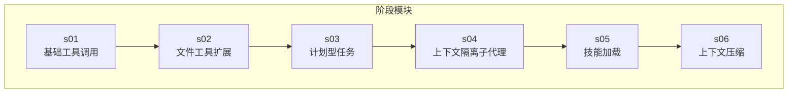
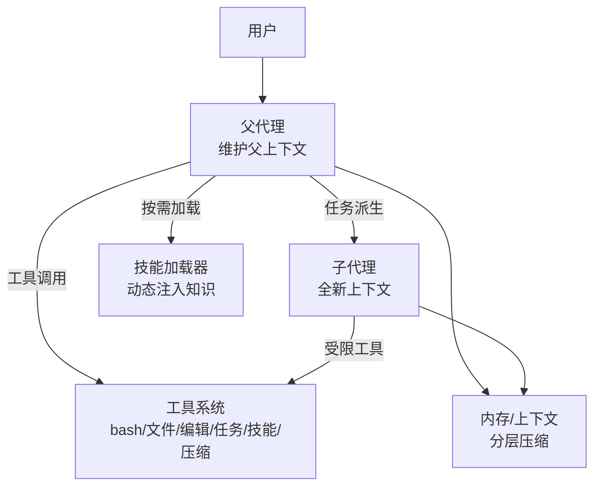
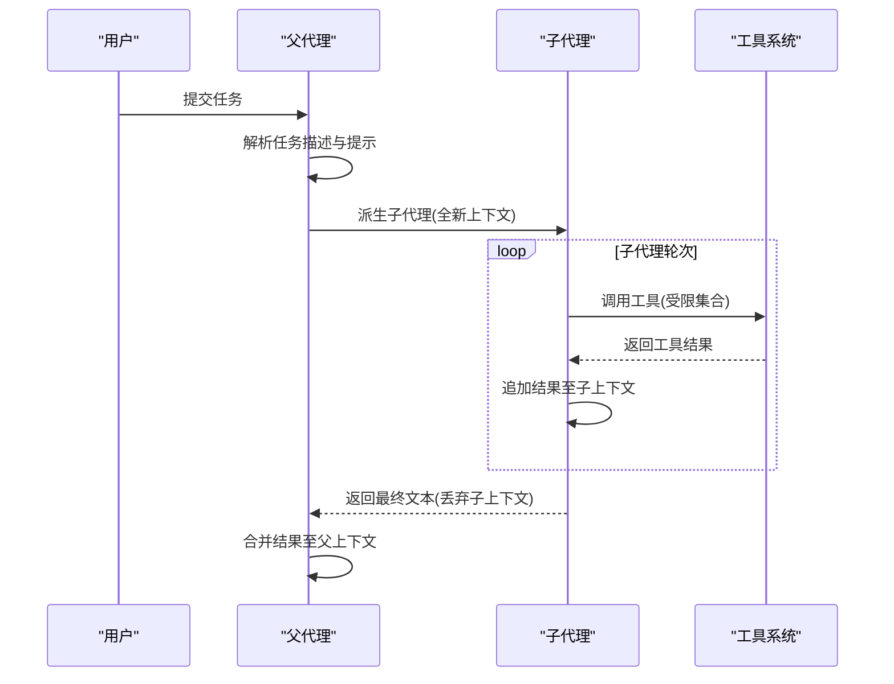
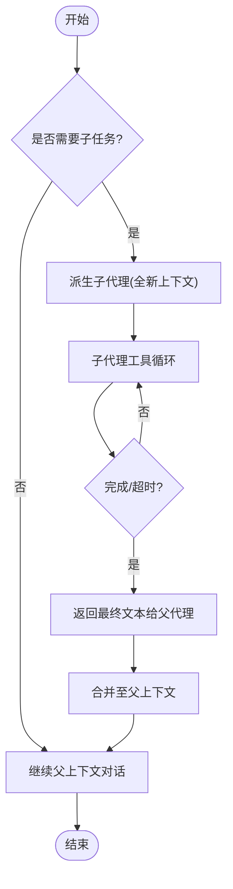
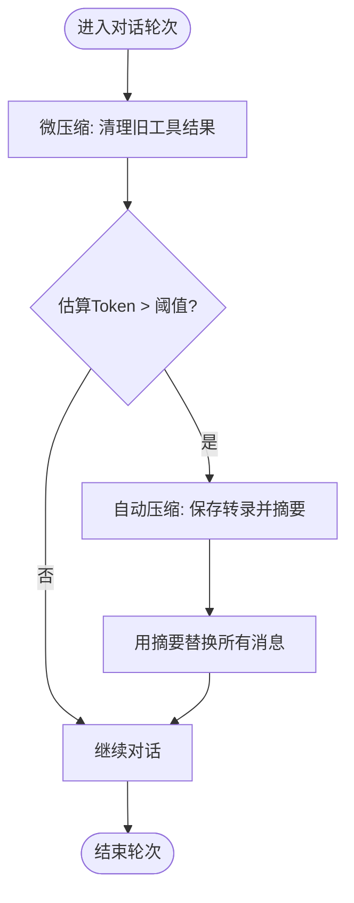
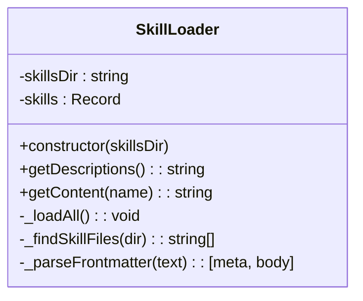
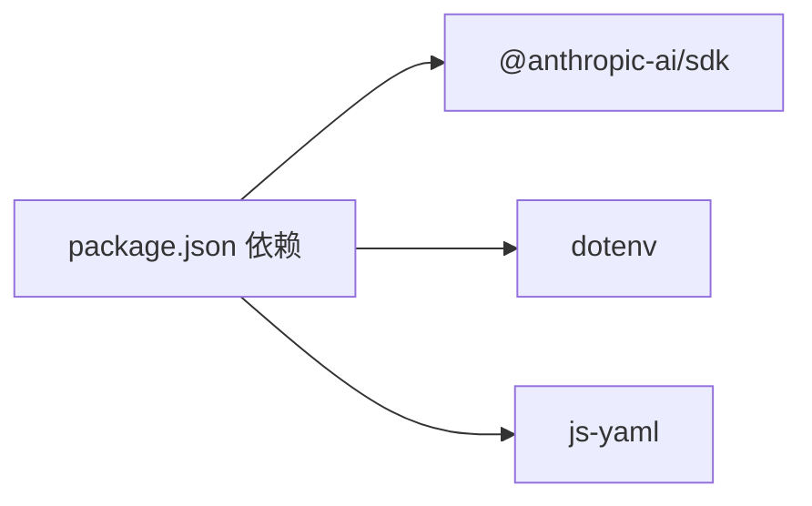

# 上下文隔离架构

<cite>
**本文引用的文件**
- [README.md](file://README.md)
- [package.json](file://package.json)
- [src/s01/index.ts](file://src/s01/index.ts)
- [src/s02/index.ts](file://src/s02/index.ts)
- [src/s03/index.ts](file://src/s03/index.ts)
- [src/s04/index.ts](file://src/s04/index.ts)
- [src/s05/index.ts](file://src/s05/index.ts)
- [src/s06/index.ts](file://src/s06/index.ts)
- [src/s05/skills/code-reviews/SKILL.md](file://src/s05/skills/code-reviews/SKILL.md)
- [learn-summary.md](file://learn-summary.md)
- [src/s06/.transcripts/transcript_1777018931.jsonl](file://src/s06/.transcripts/transcript_1777018931.jsonl)
</cite>

## 目录
1. [引言](#引言)
2. [项目结构](#项目结构)
3. [核心组件](#核心组件)
4. [架构总览](#架构总览)
5. [详细组件分析](#详细组件分析)
6. [依赖关系分析](#依赖关系分析)
7. [性能考量](#性能考量)
8. [故障排查指南](#故障排查指南)
9. [结论](#结论)
10. [附录](#附录)

## 引言
本文件围绕“上下文隔离架构”进行系统化说明，重点阐述子代理（子智能体）架构的设计理念与实现方式，涵盖以下主题：
- 独立运行环境的创建与隔离
- 对话历史的隔离保护与状态管理
- 上下文切换流程、内存管理与资源清理策略
- 完全隔离的执行环境，防止不同代理间干扰与数据泄露
- 架构图解、组件交互流程与配置选项说明
- 性能优化建议与故障恢复机制

该仓库以阶段化示例展示了从基础工具调用到上下文压缩的演进过程，其中第04阶段明确提出了“进程隔离带来上下文隔离”的关键洞察，并在第06阶段引入了“分层压缩”机制以控制上下文长度，为无限会话提供支撑。

## 项目结构
该项目采用按阶段划分的模块化组织方式，每个阶段对应一个独立的源码目录，逐步引入新的能力：
- s01：基础工具调用（bash）
- s02：扩展工具集（读写文件、编辑）
- s03：计划型任务（TodoManager）
- s04：上下文隔离（子代理）
- s05：按需知识（技能加载）
- s06：上下文压缩（分层压缩）

图表来源
- [src/s01/index.ts:1-158](file://src/s01/index.ts#L1-L158)
- [src/s02/index.ts:1-213](file://src/s02/index.ts#L1-L213)
- [src/s03/index.ts:1-335](file://src/s03/index.ts#L1-L335)
- [src/s04/index.ts:1-314](file://src/s04/index.ts#L1-L314)
- [src/s05/index.ts:1-332](file://src/s05/index.ts#L1-L332)
- [src/s06/index.ts:1-413](file://src/s06/index.ts#L1-L413)

章节来源
- [README.md:1-3](file://README.md#L1-L3)
- [package.json:1-25](file://package.json#L1-L25)

## 核心组件
- 父代理（Parent Agent）
  - 负责与用户交互、调度任务、汇总子代理结果
  - 维护父上下文（messages），保持历史清洁
- 子代理（Subagent）
  - 从“全新上下文”启动，仅在完成任务后返回最终文本
  - 执行受限工具集，避免递归派生
- 工具系统
  - 统一的工具注册与分发机制，支持 bash、读写文件、编辑、任务派生、技能加载、压缩等
- 技能加载器（SkillLoader）
  - 动态扫描技能目录，解析 frontmatter 元数据，按需注入系统提示
- 上下文压缩器（Context Compressor）
  - 分层压缩：微压缩（保留最近工具结果）、自动压缩（转存并摘要）、手动压缩（即时摘要）

章节来源
- [src/s04/index.ts:148-195](file://src/s04/index.ts#L148-L195)
- [src/s05/index.ts:46-144](file://src/s05/index.ts#L46-L144)
- [src/s06/index.ts:82-196](file://src/s06/index.ts#L82-L196)

## 架构总览
整体架构以“父-子代理”为核心，配合工具系统与技能加载，形成可扩展的智能体体系；上下文压缩贯穿每一轮对话，确保长会话稳定运行。

图表来源
- [src/s04/index.ts:148-195](file://src/s04/index.ts#L148-L195)
- [src/s05/index.ts:46-144](file://src/s05/index.ts#L46-L144)
- [src/s06/index.ts:82-196](file://src/s06/index.ts#L82-L196)

## 详细组件分析

### 子代理架构与上下文隔离
- 设计理念
  - “进程隔离带来上下文隔离”，子代理拥有独立的 messages 列表，任务完成后仅返回最终文本，丢弃子上下文
  - 父代理保持自身上下文清洁，避免历史污染
- 关键实现点
  - 子代理使用全新 messages 初始化，限定工具集（不含 task），设置最大轮次
  - 父代理通过 task 工具触发子代理，接收其最终文本作为工具结果
- 隔离边界
  - 文件系统共享但上下文不共享
  - 子代理生命周期受控，超时或无工具调用即终止

图表来源
- [src/s04/index.ts:148-195](file://src/s04/index.ts#L148-L195)
- [src/s04/index.ts:221-279](file://src/s04/index.ts#L221-L279)

章节来源
- [src/s04/index.ts:1-314](file://src/s04/index.ts#L1-L314)

### 上下文切换流程
- 触发条件
  - 父代理检测到需要探索或子任务
  - 用户显式调用 task 工具
- 流程要点
  - 父代理构造子代理提示与工具集
  - 子代理在受限环境中执行工具调用
  - 子代理结束后，仅将最终文本返回父代理
  - 父代理继续基于最新上下文推进

图表来源
- [src/s04/index.ts:148-195](file://src/s04/index.ts#L148-L195)
- [src/s04/index.ts:221-279](file://src/s04/index.ts#L221-L279)

章节来源
- [src/s04/index.ts:1-314](file://src/s04/index.ts#L1-L314)

### 内存管理与资源清理
- 微压缩（Layer 1）
  - 每轮对话后，将早于最近 N 条工具结果的历史内容替换为占位符，保留 read_file 的输出以供引用
- 自动压缩（Layer 2）
  - 当上下文估算超过阈值时，保存完整对话到 .transcripts/ 并请求 LLM 摘要，用摘要替代全部消息
- 手动压缩（Layer 3）
  - 用户显式调用 compact 工具，立即触发压缩流程

图表来源
- [src/s06/index.ts:82-138](file://src/s06/index.ts#L82-L138)
- [src/s06/index.ts:150-196](file://src/s06/index.ts#L150-L196)
- [src/s06/index.ts:303-367](file://src/s06/index.ts#L303-L367)

章节来源
- [src/s06/index.ts:1-413](file://src/s06/index.ts#L1-L413)

### 技能加载与按需知识
- 技能目录扫描与解析
  - 递归扫描 skills/* 目录，识别 SKILL.md，解析 YAML frontmatter 获取元数据
- 注入策略
  - 将技能简述注入系统提示（第一层元数据）
  - 模型调用 load_skill 时，返回技能全文（第二层正文）
- 使用场景
  - 在面对不熟悉的领域时，按需加载专家知识，避免系统提示过长

图表来源
- [src/s05/index.ts:46-144](file://src/s05/index.ts#L46-L144)

章节来源
- [src/s05/index.ts:1-332](file://src/s05/index.ts#L1-L332)
- [src/s05/skills/code-reviews/SKILL.md:1-157](file://src/s05/skills/code-reviews/SKILL.md#L1-L157)

### 工具系统与安全边界
- 工具注册与分发
  - 通过 TOOL_HANDLERS 映射工具名到处理器函数
  - 对 bash、文件读写、编辑等操作进行路径合法性校验，防止越权访问
- 错误处理
  - 工具调用异常统一捕获并返回错误信息，避免中断对话流程
- 工具集差异
  - 子代理工具集不含 task，防止递归派生
  - 父代理工具集包含 task，用于任务派生

章节来源
- [src/s02/index.ts:118-135](file://src/s02/index.ts#L118-L135)
- [src/s04/index.ts:117-122](file://src/s04/index.ts#L117-L122)
- [src/s04/index.ts:198-216](file://src/s04/index.ts#L198-L216)

## 依赖关系分析
- 外部依赖
  - anthropic SDK：调用大模型 API
  - dotenv：加载环境变量
  - js-yaml：解析技能文档 frontmatter
- 内部模块
  - s04 中的子代理与 s06 的压缩器相互独立，通过工具接口耦合
  - s05 的技能加载器与 s05 主程序通过工具接口耦合

图表来源
- [package.json:13-22](file://package.json#L13-L22)

章节来源
- [package.json:1-25](file://package.json#L1-L25)

## 性能考量
- 上下文长度控制
  - 微压缩：减少冗余工具结果，降低 token 占用
  - 自动压缩：在达到阈值时触发，显著降低消息体量
- 计算开销
  - 压缩摘要由 LLM 生成，成本较高；应结合业务场景合理设置阈值
- I/O 与磁盘
  - 转录文件保存在 .transcripts/，建议定期清理旧文件，避免磁盘膨胀
- 资源回收
  - 子代理生命周期短、上下文丢弃，有助于减少内存占用

章节来源
- [src/s06/index.ts:59-61](file://src/s06/index.ts#L59-L61)
- [src/s06/index.ts:150-196](file://src/s06/index.ts#L150-L196)

## 故障排查指南
- 常见问题
  - 路径越界错误：检查工具输入路径是否位于工作区根目录内
  - 工具调用失败：查看工具处理器中的异常捕获与错误返回
  - 上下文溢出：确认阈值设置与压缩策略是否生效
- 排查步骤
  - 启用日志输出，观察工具调用与结果
  - 检查 .transcripts/ 是否正确生成转录文件
  - 验证环境变量（API 密钥、模型 ID、基础 URL）是否正确
- 恢复机制
  - 手动压缩：调用 compact 工具立即触发摘要与替换
  - 重启会话：清空历史消息，重新开始

章节来源
- [src/s06/index.ts:330-367](file://src/s06/index.ts#L330-L367)
- [src/s06/.transcripts/transcript_1777018931.jsonl:1-8](file://src/s06/.transcripts/transcript_1777018931.jsonl#L1-L8)

## 结论
本项目通过“父-子代理”架构实现了强隔离的上下文管理：子代理在全新上下文中执行受限任务，完成后仅返回最终文本，从而避免上下文污染；结合分层压缩机制，系统能够在长时间会话中保持稳定与高效。该设计既满足了功能扩展的需求，又兼顾了安全性与资源控制，为构建可扩展、可维护的智能体系统提供了清晰范式。

## 附录
- 配置项与参数
  - ANTHROPIC_API_KEY、ANTHROPIC_BASE_URL、MODEL_ID：来自环境变量
  - THRESHOLD：上下文压缩阈值（字符估算）
  - KEEP_RECENT：微压缩保留的最近工具结果数量
  - PRESERVE_RESULT_TOOLS：不被压缩的工具集合（如 read_file）
  - TRANSCRIPT_DIR：转录文件保存目录
- 最佳实践
  - 为子代理设置最大轮次与超时，避免无限循环
  - 合理设置压缩阈值，平衡成本与效果
  - 定期清理 .transcripts/，避免磁盘压力
  - 对工具输入进行严格的路径与参数校验

章节来源
- [src/s06/index.ts:49-52](file://src/s06/index.ts#L49-L52)
- [src/s06/index.ts:150-196](file://src/s06/index.ts#L150-L196)
- [learn-summary.md:48-51](file://learn-summary.md#L48-L51)