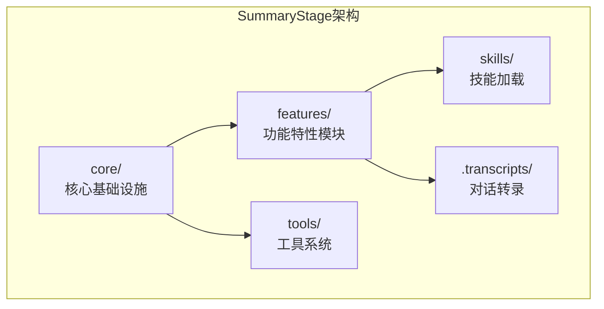
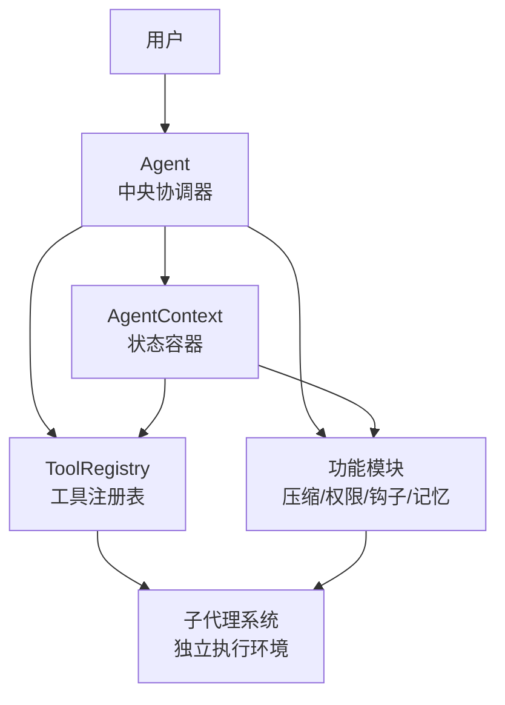
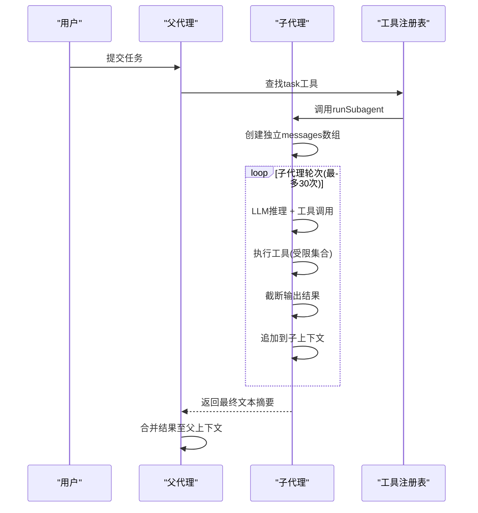
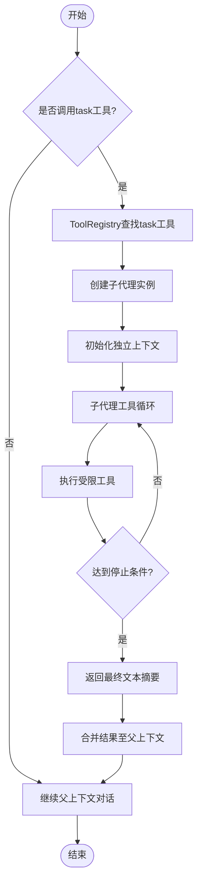
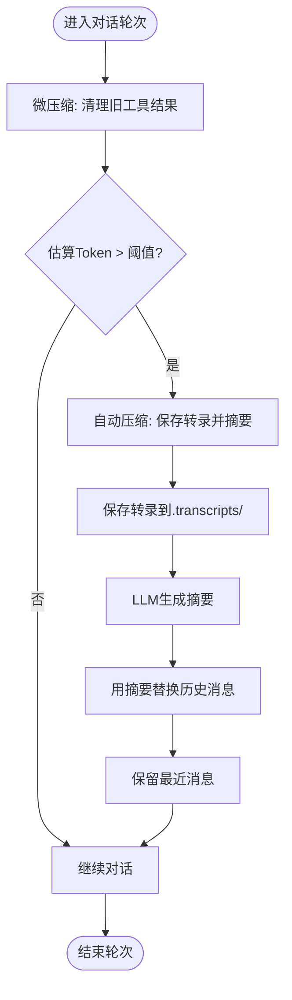
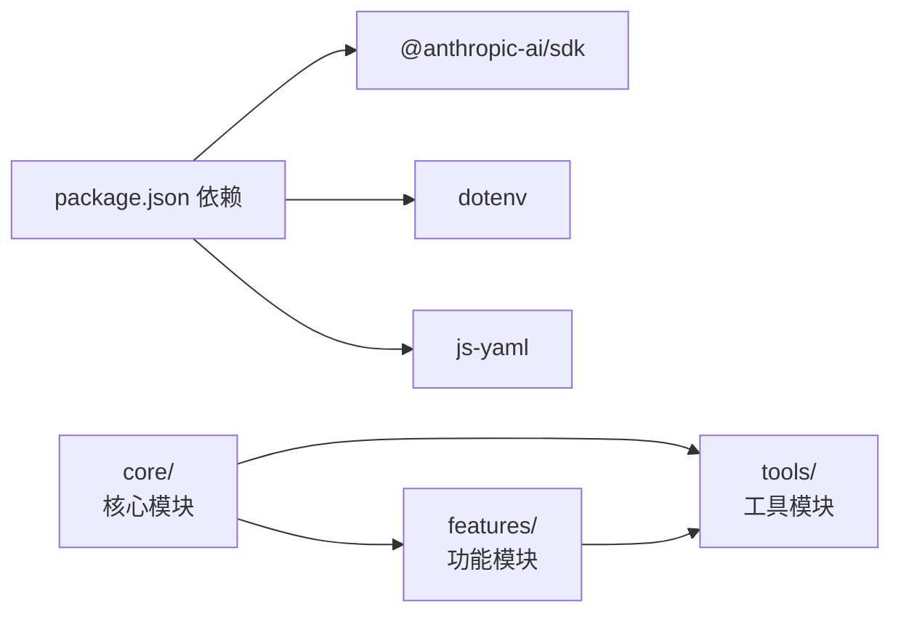

# 上下文隔离架构

<cite>
**本文引用的文件**
- [SummaryStage/src/features/subagent/subagent.ts](file://SummaryStage/src/features/subagent/subagent.ts)
- [SummaryStage/src/features/subagent/index.ts](file://SummaryStage/src/features/subagent/index.ts)
- [SummaryStage/src/core/agent.ts](file://SummaryStage/src/core/agent.ts)
- [SummaryStage/src/core/context.ts](file://SummaryStage/src/core/context.ts)
- [SummaryStage/src/core/types.ts](file://SummaryStage/src/core/types.ts)
- [SummaryStage/src/tools/registry.ts](file://SummaryStage/src/tools/registry.ts)
- [SummaryStage/src/tools/index.ts](file://SummaryStage/src/tools/index.ts)
- [SummaryStage/src/main.ts](file://SummaryStage/src/main.ts)
- [SummaryStage/src/features/compression/compression.ts](file://SummaryStage/src/features/compression/compression.ts)
- [SummaryStage/src/features/permissions/permission-manager.ts](file://SummaryStage/src/features/permissions/permission-manager.ts)
- [SummaryStage/src/features/hooks/hook-manager.ts](file://SummaryStage/src/features/hooks/hook-manager.ts)
- [SummaryStage/src/features/memory/memory-manager.ts](file://SummaryStage/src/features/memory/memory-manager.ts)
- [SummaryStage/package.json](file://SummaryStage/package.json)
- [SummaryStage/stage1.ts](file://SummaryStage/stage1.ts)
</cite>

## 目录
1. [引言](#引言)
2. [项目结构](#项目结构)
3. [核心组件](#核心组件)
4. [架构总览](#架构总览)
5. [详细组件分析](#详细组件分析)
6. [依赖关系分析](#依赖关系分析)
7. [性能考量](#性能考量)
8. [故障排查指南](#故障排查指南)
9. [结论](#结论)
10. [附录](#附录)

## 引言
本文件围绕"上下文隔离架构"进行系统化说明，重点阐述基于SummaryStage的新子代理系统的设计理念与实现方式，涵盖以下主题：
- 独立运行环境的创建与隔离
- 对话历史的隔离保护与状态管理
- 上下文切换流程、内存管理与资源清理策略
- 完全隔离的执行环境，防止不同代理间干扰与数据泄露
- 架构图解、组件交互流程与配置选项说明
- 性能优化建议与故障恢复机制

该仓库以SummaryStage为核心，展示了从基础工具调用到上下文压缩的完整演进过程。新子代理系统显著扩展了隔离机制、安全边界和工具可用性，替代原有的基本委托能力，形成了更加完善和安全的智能体体系。

## 项目结构
该项目采用模块化的SummaryStage架构，将功能拆分为独立的特性模块：
- core：核心基础设施（Agent、Context、Types）
- features：功能特性模块（子代理、压缩、权限、钩子、记忆）
- tools：工具系统（bash、文件操作、注册表）
- skills：技能加载系统
- .transcripts：对话转录存储

**章节来源**
- [SummaryStage/src/main.ts:1-39](file://SummaryStage/src/main.ts#L1-L39)
- [SummaryStage/package.json:1-26](file://SummaryStage/package.json#L1-L26)

## 核心组件
- Agent组装器（Agent）
  - 负责创建AgentContext并注册所有功能模块
  - 提供enableXxx()方法按需启用功能
  - 实现REPL循环和CLI命令处理
- AgentContext（Agent上下文）
  - 核心状态容器，包含LLM客户端、模型配置、工作目录、消息历史
  - 工具注册表和各功能模块引用
- 子代理系统（Subagent）
  - 基于独立上下文的子任务执行器
  - 严格的安全边界和工具限制
  - 最大轮次控制和输出截断
- 工具注册表（ToolRegistry）
  - 集中管理工具定义和处理器
  - 支持动态注册和查找
- 功能模块
  - 压缩系统、权限管理、钩子系统、记忆管理

**章节来源**
- [SummaryStage/src/core/agent.ts:46-127](file://SummaryStage/src/core/agent.ts#L46-L127)
- [SummaryStage/src/core/context.ts:22-48](file://SummaryStage/src/core/context.ts#L22-L48)
- [SummaryStage/src/features/subagent/subagent.ts:187-240](file://SummaryStage/src/features/subagent/subagent.ts#L187-L240)
- [SummaryStage/src/tools/registry.ts:27-89](file://SummaryStage/src/tools/registry.ts#L27-L89)

## 架构总览
整体架构采用模块化设计，Agent作为中央协调器，通过ToolRegistry统一调度各类工具和功能模块。子代理系统作为核心隔离组件，提供独立的执行环境和严格的安全边界。

**图表来源**
- [SummaryStage/src/core/agent.ts:46-127](file://SummaryStage/src/core/agent.ts#L46-L127)
- [SummaryStage/src/core/context.ts:22-48](file://SummaryStage/src/core/context.ts#L22-L48)
- [SummaryStage/src/features/subagent/index.ts:47-49](file://SummaryStage/src/features/subagent/index.ts#L47-L49)

## 详细组件分析

### 子代理架构与上下文隔离
- 设计理念
  - 子代理拥有完全独立的messages数组，不与父代理共享对话历史
  - 子代理与父代理共享文件系统（workDir），但不共享上下文状态
  - 通过CHILD_TOOLS严格限制可用工具，防止递归派生
- 关键实现点
  - runSubagent函数创建独立上下文，最多执行maxTurns轮工具调用
  - 子代理使用独立的系统提示词和工具定义
  - 工具调用结果被截断并限制最大输出长度
- 隔离边界
  - 文件系统：共享同一工作目录，但通过路径安全检查防止越权访问
  - 上下文：完全隔离的消息历史，子代理结束后丢弃所有中间状态
  - 工具：子代理工具集不包含task、todo、load_skill等父级功能

**图表来源**
- [SummaryStage/src/features/subagent/subagent.ts:196-231](file://SummaryStage/src/features/subagent/subagent.ts#L196-L231)
- [SummaryStage/src/features/subagent/index.ts:35-39](file://SummaryStage/src/features/subagent/index.ts#L35-L39)

**章节来源**
- [SummaryStage/src/features/subagent/subagent.ts:177-240](file://SummaryStage/src/features/subagent/subagent.ts#L177-L240)
- [SummaryStage/src/features/subagent/index.ts:16-32](file://SummaryStage/src/features/subagent/index.ts#L16-L32)

### 上下文切换流程
- 触发条件
  - 用户调用task工具或LLM自动决定委派子任务
  - 父代理检测到需要探索或复杂子任务
- 流程要点
  - 父代理通过ToolRegistry查找task工具定义
  - 调用runSubagent创建独立执行环境
  - 子代理在受限环境中执行工具调用
  - 子代理结束后，仅将最终摘要返回父代理
  - 父代理继续基于最新上下文推进

**图表来源**
- [SummaryStage/src/features/subagent/index.ts:35-39](file://SummaryStage/src/features/subagent/index.ts#L35-L39)
- [SummaryStage/src/features/subagent/subagent.ts:196-231](file://SummaryStage/src/features/subagent/subagent.ts#L196-L231)

**章节来源**
- [SummaryStage/src/features/subagent/subagent.ts:187-240](file://SummaryStage/src/features/subagent/subagent.ts#L187-L240)
- [SummaryStage/src/features/subagent/index.ts:47-49](file://SummaryStage/src/features/subagent/index.ts#L47-L49)

### 内存管理与资源清理
- 微压缩（Layer 1）
  - 每轮对话后自动清理旧工具结果，保留最近KEEP_RECENT条
  - 长度超过100字符的工具结果被替换为"[Previous: used tool_name]"
  - 特定工具结果（如read_file）被保留用于参考
- 自动压缩（Layer 2）
  - 当估算token数超过阈值时触发LLM摘要
  - 保存完整对话到.transcripts/目录作为备份
  - 用摘要替换历史消息，同时保留最近消息确保上下文连续性
- 手动压缩（Layer 3）
  - 用户通过/compact命令触发立即压缩
  - 复用自动压缩逻辑，确保一致性

**图表来源**
- [SummaryStage/src/features/compression/compression.ts:37-80](file://SummaryStage/src/features/compression/compression.ts#L37-L80)
- [SummaryStage/src/features/compression/compression.ts:92-162](file://SummaryStage/src/features/compression/compression.ts#L92-L162)

**章节来源**
- [SummaryStage/src/features/compression/compression.ts:26-28](file://SummaryStage/src/features/compression/compression.ts#L26-L28)
- [SummaryStage/src/features/compression/compression.ts:37-80](file://SummaryStage/src/features/compression/compression.ts#L37-L80)
- [SummaryStage/src/features/compression/compression.ts:92-162](file://SummaryStage/src/features/compression/compression.ts#L92-L162)

### 权限管理与安全边界
- 权限决策管道
  - 基础bash安全检查：阻止危险命令（如rm -rf /、sudo）
  - deny规则匹配：预定义的禁止操作
  - 模式检查：default（默认）、plan（只读）、auto（自动）
  - allow规则匹配：预定义的允许操作
  - 用户询问：兜底机制，询问用户授权
- 工具分类
  - 只读工具：read_file
  - 写入工具：write_file、edit_file、bash
  - 安全工具：自动批准的工具集
- 配置管理
  - 支持从hooks.json加载自定义规则
  - 动态模式切换（/mode命令）
  - 规则列表查看（/rules命令）

**章节来源**
- [SummaryStage/src/features/permissions/permission-manager.ts:114-150](file://SummaryStage/src/features/permissions/permission-manager.ts#L114-L150)
- [SummaryStage/src/features/permissions/permission-manager.ts:159-171](file://SummaryStage/src/features/permissions/permission-manager.ts#L159-L171)
- [SummaryStage/src/features/permissions/permission-manager.ts:188-207](file://SummaryStage/src/features/permissions/permission-manager.ts#L188-L207)

### 钩子系统与扩展机制
- 钩子事件类型
  - PreToolUse：工具调用前执行，可阻止或修改输入
  - PostToolUse：工具调用后执行，可注入附加信息
  - SessionStart：会话启动时执行
- 执行机制
  - 从hooks.json加载配置
  - 支持工作区信任检查（.claude标记文件）
  - 超时控制（30秒）和缓冲区限制
- 退出码约定
  - 0：正常通过（可选JSON输出修改输入/注入上下文）
  - 1：阻止工具执行（stderr为阻止原因）
  - 2：注入消息（stderr内容注入到对话）

**章节来源**
- [SummaryStage/src/features/hooks/hook-manager.ts:41-61](file://SummaryStage/src/features/hooks/hook-manager.ts#L41-L61)
- [SummaryStage/src/features/hooks/hook-manager.ts:105-114](file://SummaryStage/src/features/hooks/hook-manager.ts#L105-L114)
- [SummaryStage/src/features/hooks/hook-manager.ts:191-204](file://SummaryStage/src/features/hooks/hook-manager.ts#L191-L204)

### 记忆管理系统
- 记忆类型
  - user：用户偏好（如"我喜欢用tabs"）
  - feedback：用户纠正反馈（如"不要做X"）
  - project：项目约定/决策原因
  - reference：外部资源指针（如文档URL、看板地址）
- 存储格式
  - 每条记忆为带YAML frontmatter的Markdown文件
  - .memory/MEMORY.md作为聚合索引
- 功能特性
  - 自动加载所有记忆文件
  - 构建system prompt注入段落
  - 保存记忆时自动重建索引
  - 支持记忆引导提示词指导何时保存/不保存

**章节来源**
- [SummaryStage/src/features/memory/memory-manager.ts:48-91](file://SummaryStage/src/features/memory/memory-manager.ts#L48-L91)
- [SummaryStage/src/features/memory/memory-manager.ts:123-154](file://SummaryStage/src/features/memory/memory-manager.ts#L123-L154)
- [SummaryStage/src/features/memory/memory-manager.ts:189-204](file://SummaryStage/src/features/memory/memory-manager.ts#L189-L204)

## 依赖关系分析
- 外部依赖
  - @anthropic-ai/sdk：调用Claude大模型API
  - dotenv：加载环境变量
  - js-yaml：解析技能文档frontmatter
- 内部模块依赖
  - core模块为所有功能提供基础架构
  - features模块相互独立，通过Agent统一协调
  - tools模块提供通用工具能力
  - 子代理系统依赖工具注册表和上下文

**图表来源**
- [SummaryStage/package.json:14-18](file://SummaryStage/package.json#L14-L18)

**章节来源**
- [SummaryStage/package.json:1-26](file://SummaryStage/package.json#L1-L26)

## 性能考量
- 上下文长度控制
  - 微压缩：每轮清理旧工具结果，减少token占用
  - 自动压缩：在达到阈值时触发，显著降低消息体量
  - 输出截断：单次工具结果最大50KB，防止内存溢出
- 计算开销
  - 压缩摘要由LLM生成，成本较高；应结合业务场景合理设置阈值
  - 子代理最大轮次30次，防止无限循环消耗资源
- I/O与磁盘
  - 转录文件保存在.transcripts/，建议定期清理旧文件
  - 记忆文件存储在.memory/，自动管理索引文件大小
- 资源回收
  - 子代理生命周期短、上下文完全丢弃，有助于内存回收
  - 工具注册表支持动态注册/注销，灵活管理资源

**章节来源**
- [SummaryStage/src/features/compression/compression.ts:26-28](file://SummaryStage/src/features/compression/compression.ts#L26-L28)
- [SummaryStage/src/features/compression/compression.ts:92-162](file://SummaryStage/src/features/compression/compression.ts#L92-L162)
- [SummaryStage/src/core/types.ts:174-178](file://SummaryStage/src/core/types.ts#L174-L178)

## 故障排查指南
- 常见问题
  - 路径越界错误：检查工具输入路径是否位于工作区根目录内
  - 工具调用失败：查看工具处理器中的异常捕获与错误返回
  - 上下文溢出：确认阈值设置与压缩策略是否生效
  - 子代理无响应：检查最大轮次限制和工具可用性
- 排查步骤
  - 启用详细日志输出，观察工具调用与结果
  - 检查.transcripts/是否正确生成转录文件
  - 验证环境变量（API密钥、模型ID、基础URL）是否正确
  - 检查hooks.json配置文件格式和语法
- 恢复机制
  - 手动压缩：调用/compact命令立即触发摘要与替换
  - 重启会话：清空历史消息，重新开始
  - 权限模式切换：使用/mode命令切换权限级别
  - 规则重置：删除hooks.json恢复默认配置

**章节来源**
- [SummaryStage/src/core/agent.ts:178-235](file://SummaryStage/src/core/agent.ts#L178-L235)
- [SummaryStage/src/features/permissions/permission-manager.ts:255-263](file://SummaryStage/src/features/permissions/permission-manager.ts#L255-L263)

## 结论
本项目通过基于SummaryStage的全新子代理系统实现了更完善的上下文隔离架构：子代理在完全独立的环境中执行受限任务，拥有独立的文件系统访问权限但不共享对话历史；结合严格的权限管理和钩子扩展机制，系统能够在保证安全性的同时提供强大的功能扩展能力；通过三级渐进压缩机制，系统能够在长时间会话中保持稳定与高效。该设计既满足了功能扩展的需求，又兼顾了安全性与资源控制，为构建可扩展、可维护的智能体系统提供了清晰范式。

## 附录
- 配置项与参数
  - ANTHROPIC_API_KEY、ANTHROPIC_BASE_URL、MODEL_ID：来自环境变量
  - BASH_TIMEOUT：bash命令超时（120秒）
  - MAX_OUTPUT_LENGTH：单次工具结果最大长度（50KB）
  - DEFAULT_COMPACT_CONFIG：压缩配置（阈值50000，保留3条，保留read_file和bash）
  - DEFAULT_SUBAGENT_CONFIG：子代理配置（最大轮次30，最大输出长度50KB）
- 最佳实践
  - 为子代理设置合理的最大轮次与超时，避免无限循环
  - 合理设置压缩阈值，平衡成本与效果
  - 定期清理.transcripts/和.memory/目录，避免磁盘压力
  - 对工具输入进行严格的路径与参数校验
  - 使用权限模式控制工具调用风险
  - 利用钩子系统实现安全审计和扩展功能

**章节来源**
- [SummaryStage/src/core/types.ts:174-191](file://SummaryStage/src/core/types.ts#L174-L191)
- [SummaryStage/src/features/compression/compression.ts:18-20](file://SummaryStage/src/features/compression/compression.ts#L18-L20)
- [SummaryStage/src/features/subagent/subagent.ts:44-58](file://SummaryStage/src/features/subagent/subagent.ts#L44-L58)