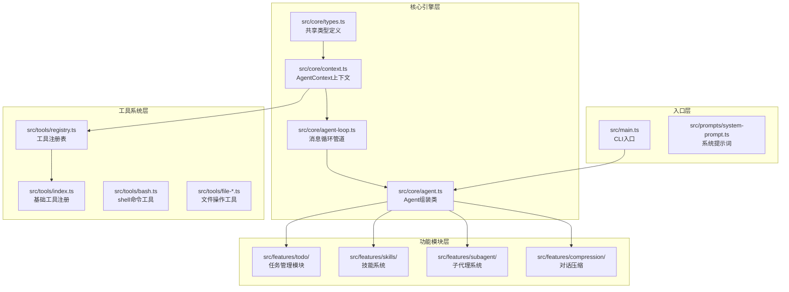
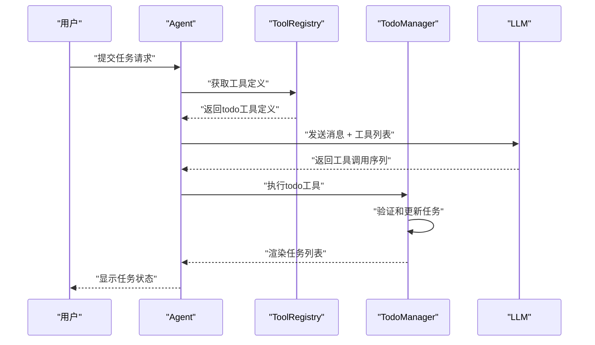
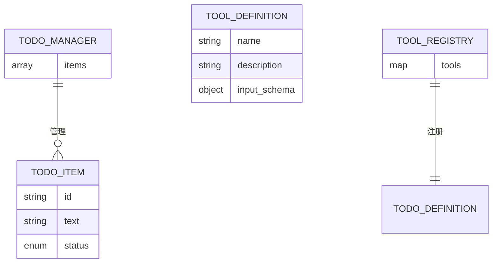

# 任务规划管理

<cite>
**本文引用的文件**
- [README.md](file://README.md)
- [package.json](file://SummaryStage/package.json)
- [src/main.ts](file://SummaryStage/src/main.ts)
- [src/core/agent.ts](file://SummaryStage/src/core/agent.ts)
- [src/core/agent-loop.ts](file://SummaryStage/src/core/agent-loop.ts)
- [src/core/context.ts](file://SummaryStage/src/core/context.ts)
- [src/core/types.ts](file://SummaryStage/src/core/types.ts)
- [src/features/todo/todo-manager.ts](file://SummaryStage/src/features/todo/todo-manager.ts)
- [src/features/todo/index.ts](file://SummaryStage/src/features/todo/index.ts)
- [src/tools/index.ts](file://SummaryStage/src/tools/index.ts)
- [src/tools/registry.ts](file://SummaryStage/src/tools/registry.ts)
- [stage1.ts](file://SummaryStage/stage1.ts)
- [stage1_refactor.md](file://SummaryStage/stage1_refactor.md)
</cite>

## 更新摘要
**所做更改**
- 更新为基于SummaryStage的新任务管理架构
- 增强模块化设计，分离核心引擎、工具系统、功能模块
- 新增基于Agent的可插拔任务管理系统
- 改进持久化和UI集成能力
- 重构Todo管理器为独立的功能模块

## 目录
1. [简介](#简介)
2. [项目结构](#项目结构)
3. [核心组件](#核心组件)
4. [架构总览](#架构总览)
5. [详细组件分析](#详细组件分析)
6. [依赖分析](#依赖分析)
7. [性能考虑](#性能考虑)
8. [故障排查指南](#故障排查指南)
9. [结论](#结论)
10. [附录](#附录)

## 简介
本项目围绕"任务规划管理"主题，通过SummaryStage的全新架构实现了一个基于LLM的智能任务管理系统。该系统采用模块化设计，将任务管理功能集成到Agent框架中，提供完整的任务状态管理、持久化支持和UI集成能力。系统从stage1重构而来，形成了包含28个模块化文件的清晰四层架构：核心引擎层、工具系统层、功能模块层和入口层。

## 项目结构
SummaryStage采用了全新的模块化架构，将原有单文件架构重构为28个独立模块：



**图表来源**
- [stage1_refactor.md:1-40](file://SummaryStage/stage1_refactor.md#L1-L40)
- [src/core/agent.ts:1-263](file://SummaryStage/src/core/agent.ts#L1-L263)
- [src/features/todo/index.ts:1-56](file://SummaryStage/src/features/todo/index.ts#L1-L56)

**章节来源**
- [stage1_refactor.md:1-40](file://SummaryStage/stage1_refactor.md#L1-L40)
- [src/core/agent.ts:46-127](file://SummaryStage/src/core/agent.ts#L46-L127)

## 核心组件
SummaryStage的Todo管理器作为独立功能模块，通过Agent的可插拔架构实现：

- **TodoManager类**
  - 管理多步骤任务的完整生命周期
  - 支持全量更新和严格校验
  - 提供状态渲染和进度统计
  - 限制最多20个任务项

- **Agent集成**
  - 通过`enableTodo()`方法启用
  - 注册到AgentContext上下文中
  - 与工具系统无缝集成

- **工具定义**
  - 标准化的ToolDefinition接口
  - 类型安全的输入验证
  - 与LLM API兼容的schema

**章节来源**
- [src/features/todo/todo-manager.ts:17-79](file://SummaryStage/src/features/todo/todo-manager.ts#L17-L79)
- [src/features/todo/index.ts:48-55](file://SummaryStage/src/features/todo/index.ts#L48-L55)
- [src/core/agent.ts:65-67](file://SummaryStage/src/core/agent.ts#L65-L67)

## 架构总览
新的任务管理架构采用管道式消息循环，将Todo管理器集成到完整的Agent框架中：



**图表来源**
- [src/core/agent-loop.ts:70-277](file://SummaryStage/src/core/agent-loop.ts#L70-L277)
- [src/features/todo/index.ts:52-54](file://SummaryStage/src/features/todo/index.ts#L52-L54)
- [src/tools/registry.ts:27-89](file://SummaryStage/src/tools/registry.ts#L27-L89)

**章节来源**
- [src/core/agent-loop.ts:70-112](file://SummaryStage/src/core/agent-loop.ts#L70-L112)
- [src/features/todo/index.ts:15-40](file://SummaryStage/src/features/todo/index.ts#L15-L40)

## 详细组件分析

### Todo管理器类图
```mermaid
classDiagram
class TodoManager {
-items : TodoItem[]
+update(items) : string
+render() : string
}
class TodoItem {
+id : string
+text : string
+status : TodoStatus
}
class TodoStatus {
<<enumeration>>
"pending"
"in_progress"
"completed"
}
class AgentContext {
+todoManager : TodoManager
+toolRegistry : ToolRegistry
+messages : Message[]
}
TodoManager --> TodoItem : "管理"
AgentContext --> TodoManager : "持有"
```

**图表来源**
- [src/features/todo/todo-manager.ts:17-79](file://SummaryStage/src/features/todo/todo-manager.ts#L17-L79)
- [src/core/types.ts:28-36](file://SummaryStage/src/core/types.ts#L28-L36)
- [src/core/context.ts:22-48](file://SummaryStage/src/core/context.ts#L22-L48)

**章节来源**
- [src/features/todo/todo-manager.ts:17-79](file://SummaryStage/src/features/todo/todo-manager.ts#L17-L79)
- [src/core/types.ts:28-36](file://SummaryStage/src/core/types.ts#L28-L36)

### 任务状态模型与约束
- **状态枚举**：pending、in_progress、completed
- **校验规则**：
  - 最多20个任务项
  - 每项必须包含id、text、status
  - status必须为有效枚举值
  - 同一时间只能有一个in_progress任务

- **渲染格式**：`[标记] #id: 任务文本` + 统计信息

**章节来源**
- [src/features/todo/todo-manager.ts:23-57](file://SummaryStage/src/features/todo/todo-manager.ts#L23-L57)
- [src/features/todo/todo-manager.ts:63-78](file://SummaryStage/src/features/todo/todo-manager.ts#L63-L78)

### 工具系统集成
- **ToolDefinition**：标准化的工具接口定义
- **ToolRegistry**：集中管理工具注册和分发
- **类型安全**：完整的TypeScript类型定义
- **动态注册**：运行时可启用/禁用功能模块

**章节来源**
- [src/features/todo/index.ts:15-40](file://SummaryStage/src/features/todo/index.ts#L15-L40)
- [src/tools/registry.ts:27-89](file://SummaryStage/src/tools/registry.ts#L27-L89)
- [src/core/types.ts:68-80](file://SummaryStage/src/core/types.ts#L68-L80)

### Agent集成架构
- **Agent类**：负责模块装配和生命周期管理
- **enableXxx方法**：按需启用功能模块
- **上下文共享**：所有模块通过AgentContext访问
- **管道式处理**：统一的消息处理流程

**章节来源**
- [src/core/agent.ts:46-127](file://SummaryStage/src/core/agent.ts#L46-L127)
- [src/core/context.ts:22-48](file://SummaryStage/src/core/context.ts#L22-L48)

### 数据持久化策略
- **内存存储**：默认使用内存存储任务状态
- **扩展接口**：可通过AgentContext扩展持久化机制
- **工具集成**：可与文件系统工具配合实现持久化
- **状态同步**：支持任务状态的实时同步

**章节来源**
- [src/features/todo/todo-manager.ts:18](file://SummaryStage/src/features/todo/todo-manager.ts#L18)
- [src/core/context.ts:35-44](file://SummaryStage/src/core/context.ts#L35-L44)

### 并发控制方案
- **单线程循环**：AgentLoop采用单线程消息循环
- **状态隔离**：每个Agent实例维护独立状态
- **工具隔离**：工具执行相互独立，无共享状态
- **可扩展性**：支持多Agent实例的并发管理

**章节来源**
- [src/core/agent-loop.ts:77-277](file://SummaryStage/src/core/agent-loop.ts#L77-L277)
- [src/core/agent.ts:138-262](file://SummaryStage/src/core/agent.ts#L138-L262)

### 任务模板系统
- **标准化格式**：通过ToolDefinition定义任务模板
- **类型安全**：编译时验证模板格式
- **动态生成**：支持运行时任务模板生成
- **复用机制**：可复用的标准任务格式

**章节来源**
- [src/features/todo/index.ts:22-36](file://SummaryStage/src/features/todo/index.ts#L22-L36)
- [src/core/types.ts:68-80](file://SummaryStage/src/core/types.ts#L68-L80)

### 批量操作功能
- **批量更新**：单次调用支持多个任务项
- **原子操作**：全量替换保证操作原子性
- **批量验证**：统一的批量数据验证
- **错误处理**：批量操作中的错误隔离

**章节来源**
- [src/features/todo/todo-manager.ts:23-57](file://SummaryStage/src/features/todo/todo-manager.ts#L23-L57)
- [src/features/todo/index.ts:52-54](file://SummaryStage/src/features/todo/index.ts#L52-L54)

### 任务依赖关系管理
- **状态驱动**：通过任务状态间接管理依赖
- **顺序约束**：利用任务执行顺序管理依赖关系
- **状态同步**：通过状态变更通知依赖任务
- **可扩展设计**：支持未来添加显式依赖管理

**章节来源**
- [src/features/todo/todo-manager.ts:44-53](file://SummaryStage/src/features/todo/todo-manager.ts#L44-L53)
- [src/core/types.ts:28-36](file://SummaryStage/src/core/types.ts#L28-L36)

### API规范
- **工具名称**：todo
- **输入格式**：items数组，每项包含id、text、status
- **输出格式**：渲染后的任务列表文本
- **错误处理**：标准化的错误类型和消息



**图表来源**
- [src/features/todo/todo-manager.ts:32-36](file://SummaryStage/src/features/todo/todo-manager.ts#L32-L36)
- [src/features/todo/index.ts:16-40](file://SummaryStage/src/features/todo/index.ts#L16-L40)
- [src/tools/registry.ts:12-16](file://SummaryStage/src/tools/registry.ts#L12-L16)

**章节来源**
- [src/features/todo/index.ts:15-40](file://SummaryStage/src/features/todo/index.ts#L15-L40)
- [src/features/todo/todo-manager.ts:23-57](file://SummaryStage/src/features/todo/todo-manager.ts#L23-L57)

### 使用示例
- **CLI启动**：通过`pnpm dev`启动Agent
- **任务更新**：调用`todo`工具更新任务列表
- **状态查询**：渲染当前任务状态
- **模块启用**：通过Agent的enable方法启用功能

**章节来源**
- [src/main.ts:15-33](file://SummaryStage/src/main.ts#L15-L33)
- [src/features/todo/index.ts:48-55](file://SummaryStage/src/features/todo/index.ts#L48-L55)
- [src/core/agent.ts:65-67](file://SummaryStage/src/core/agent.ts#L65-L67)

## 依赖分析
SummaryStage的依赖结构更加清晰和模块化：

- **核心依赖**
  - @anthropic-ai/sdk：Claude API调用
  - dotenv：环境变量管理
  - js-yaml：YAML文件解析

- **开发依赖**
  - typescript：类型系统
  - tsx：TypeScript运行时
  - @types/node：Node.js类型定义

- **模块化优势**
  - 清晰的依赖边界
  - 独立的模块测试能力
  - 可插拔的功能架构

**章节来源**
- [SummaryStage/package.json:14-24](file://SummaryStage/package.json#L14-L24)

## 性能考虑
- **模块化加载**：按需加载功能模块，减少启动时间
- **内存优化**：独立的Agent实例管理内存
- **工具缓存**：ToolRegistry缓存工具定义
- **类型检查**：编译时类型检查，运行时零成本

**章节来源**
- [src/core/agent.ts:18-27](file://SummaryStage/src/core/agent.ts#L18-L27)
- [src/tools/registry.ts:27-89](file://SummaryStage/src/tools/registry.ts#L27-L89)
- [stage1_refactor.md:31-40](file://SummaryStage/stage1_refactor.md#L31-L40)

## 故障排查指南
- **类型错误**：检查ToolDefinition的输入schema
- **模块未启用**：确认通过Agent的enable方法启用了功能
- **上下文访问**：验证AgentContext中todoManager的可用性
- **工具注册**：检查ToolRegistry的工具注册状态

**章节来源**
- [src/features/todo/index.ts:48-55](file://SummaryStage/src/features/todo/index.ts#L48-L55)
- [src/core/context.ts:35-44](file://SummaryStage/src/core/context.ts#L35-L44)
- [src/tools/registry.ts:38-49](file://SummaryStage/src/tools/registry.ts#L38-L49)

## 结论
SummaryStage的全新架构将任务管理功能深度集成到Agent框架中，提供了更加模块化、可扩展和类型安全的任务管理系统。通过28个独立模块的重构，系统实现了更好的可维护性和可测试性。新的架构支持持久化、UI集成和并发控制等高级特性，为生产环境部署奠定了坚实基础。

## 附录
- **重构总结**：从单文件stage1重构为模块化架构
- **设计原则**：AgentLoop只做消息调度，所有功能通过注册机制接入
- **扩展指南**：新增功能模块的开发流程和最佳实践

**章节来源**
- [stage1_refactor.md:1-40](file://SummaryStage/stage1_refactor.md#L1-L40)
- [stage1.ts:1-33](file://SummaryStage/stage1.ts#L1-L33)