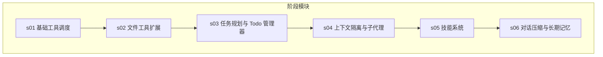
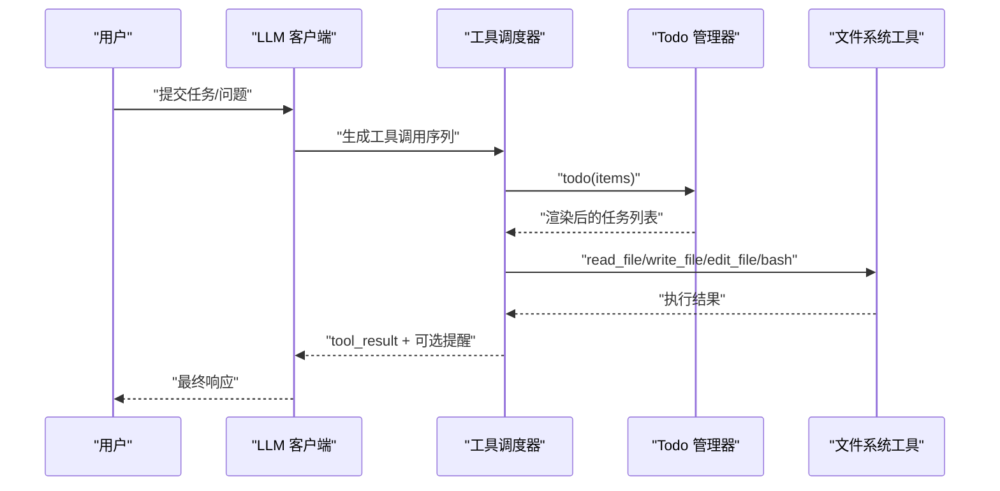
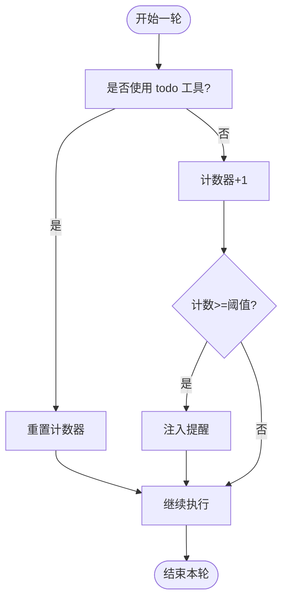
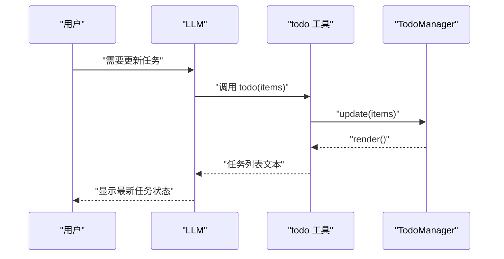
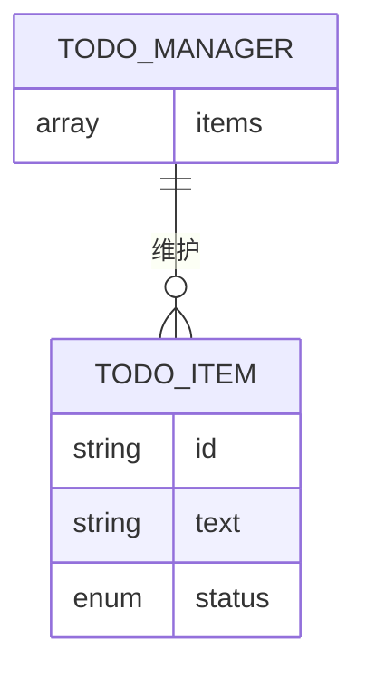
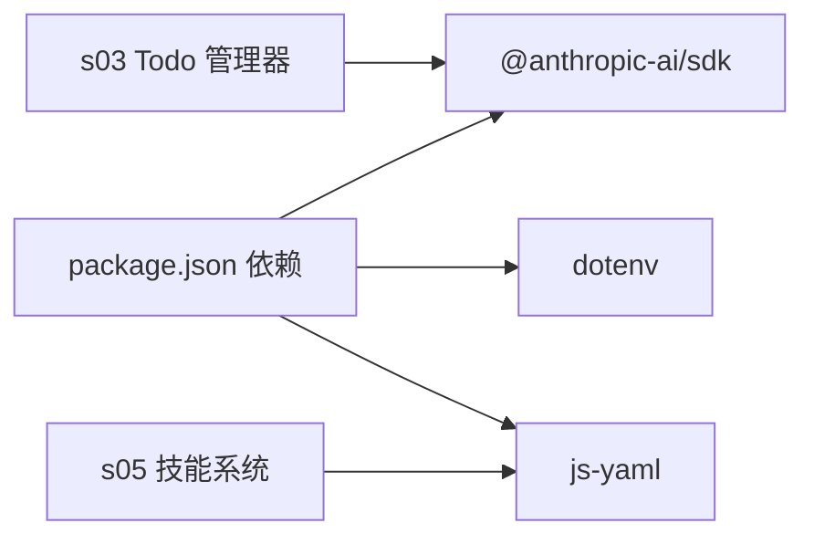

# 任务规划管理

<cite>
**本文引用的文件**
- [README.md](file://README.md)
- [package.json](file://package.json)
- [src/s01/index.ts](file://src/s01/index.ts)
- [src/s02/index.ts](file://src/s02/index.ts)
- [src/s03/index.ts](file://src/s03/index.ts)
- [src/s04/index.ts](file://src/s04/index.ts)
- [src/s05/index.ts](file://src/s05/index.ts)
- [src/s05/skills/code-reviews/SKILL.md](file://src/s05/skills/code-reviews/SKILL.md)
- [src/s06/index.ts](file://src/s06/index.ts)
- [src/s06/.transcripts/transcript_1777018931.jsonl](file://src/s06/.transcripts/transcript_1777018931.jsonl)
</cite>

## 目录
1. [简介](#简介)
2. [项目结构](#项目结构)
3. [核心组件](#核心组件)
4. [架构总览](#架构总览)
5. [详细组件分析](#详细组件分析)
6. [依赖分析](#依赖分析)
7. [性能考虑](#性能考虑)
8. [故障排查指南](#故障排查指南)
9. [结论](#结论)
10. [附录](#附录)

## 简介
本项目围绕“任务规划管理”主题，通过一系列逐步实现的阶段（s01 到 s06），构建一个以 LLM 为中枢的任务执行与状态管理框架。其中，s03 阶段引入了 Todo 管理器，用于多步骤任务的状态跟踪与提醒；s04 引入子代理与上下文隔离；s05 提供按需加载的技能系统；s06 实现对话压缩与长期记忆管理。本文档聚焦于 Todo 管理器的设计与实现，涵盖任务状态模型、优先级与提醒机制、任务 CRUD 流程、数据持久化与并发控制、模板与批量操作、依赖关系管理，以及 API 规范与使用示例。

## 项目结构
该项目采用分阶段模块化组织，每个阶段在独立目录中实现特定能力：
- s01：基础工具调度与命令执行
- s02：扩展工具集（读写编辑文件）
- s03：任务规划与 Todo 管理器
- s04：上下文隔离与子代理
- s05：按需知识加载（技能系统）
- s06：对话压缩与长期记忆



图表来源
- [src/s01/index.ts:1-158](file://src/s01/index.ts#L1-L158)
- [src/s02/index.ts:1-213](file://src/s02/index.ts#L1-L213)
- [src/s03/index.ts:1-335](file://src/s03/index.ts#L1-L335)
- [src/s04/index.ts:1-314](file://src/s04/index.ts#L1-L314)
- [src/s05/index.ts:1-332](file://src/s05/index.ts#L1-L332)
- [src/s06/index.ts:1-413](file://src/s06/index.ts#L1-L413)

章节来源
- [README.md:1-3](file://README.md#L1-L3)
- [package.json:1-25](file://package.json#L1-L25)

## 核心组件
本节聚焦 Todo 管理器及其周边工具链，说明其职责、输入输出、约束与交互方式。

- Todo 管理器（TodoManager）
  - 负责维护任务列表，支持更新、渲染与校验
  - 支持三种状态：待办、进行中、已完成
  - 限制最多 20 条任务，且同一时刻仅允许一条任务处于“进行中”
  - 渲染输出包含完成统计与标记

- 工具接口
  - todo：更新任务列表，触发渲染
  - bash/read_file/write_file/edit_file：文件系统操作
  - task/load_skill/compact：其他阶段工具（与任务管理相关）

- 提醒机制
  - 若连续若干轮未使用 todo 工具，注入提醒消息，促使用户更新任务状态

章节来源
- [src/s03/index.ts:62-131](file://src/s03/index.ts#L62-L131)
- [src/s03/index.ts:219-239](file://src/s03/index.ts#L219-L239)
- [src/s03/index.ts:242-299](file://src/s03/index.ts#L242-L299)

## 架构总览
下面的时序图展示了任务规划与执行的主流程：用户发起请求，LLM 生成工具调用，工具执行后将结果回传，若超过阈值则触发提醒或压缩。



图表来源
- [src/s03/index.ts:242-299](file://src/s03/index.ts#L242-L299)
- [src/s03/index.ts:219-239](file://src/s03/index.ts#L219-L239)
- [src/s03/index.ts:77-131](file://src/s03/index.ts#L77-L131)

## 详细组件分析

### Todo 管理器类图
```mermaid
classDiagram
class TodoManager {
-items : TodoItem[]
+update(items) : string
+render() : string
}
class TodoItem {
+id : string
+text : string
+status : TodoStatus
}
class TodoStatus {
<<enumeration>>
"pending"
"in_progress"
"completed"
}
TodoManager --> TodoItem : "维护"
TodoItem --> TodoStatus : "使用"
```

图表来源
- [src/s03/index.ts:62-131](file://src/s03/index.ts#L62-L131)
- [src/s03/index.ts:65-69](file://src/s03/index.ts#L65-L69)

章节来源
- [src/s03/index.ts:62-131](file://src/s03/index.ts#L62-L131)

### 任务状态模型与约束
- 状态枚举：pending、in_progress、completed
- 标记映射：用于渲染时的可视化标记
- 校验规则：
  - 最多 20 条任务
  - 每项必须有非空文本
  - 状态必须为枚举之一
  - 同一时刻仅允许一条任务处于 in_progress

章节来源
- [src/s03/index.ts:63-75](file://src/s03/index.ts#L63-L75)
- [src/s03/index.ts:80-117](file://src/s03/index.ts#L80-L117)

### 提醒机制与回合计数
- roundsSinceTodo 计数器：每轮工具调用后若未使用 todo，则递增
- 当计数达到阈值（例如 3）时，注入提醒文本，促使用户更新任务状态
- 使用 todo 后重置计数器



图表来源
- [src/s03/index.ts:281-283](file://src/s03/index.ts#L281-L283)
- [src/s03/index.ts:264-280](file://src/s03/index.ts#L264-L280)

章节来源
- [src/s03/index.ts:242-299](file://src/s03/index.ts#L242-L299)

### 任务 CRUD 流程
- 创建/更新
  - 通过工具调用 todo，传入 items 数组
  - 管理器对每项进行校验与规范化，更新内部状态并渲染
- 查询
  - 渲染当前任务列表，包含完成统计
- 删除
  - 通过更新任务列表，将目标任务标记为已完成或移除（取决于业务语义）
- 更新
  - 重新调用 todo，传入最新 items



图表来源
- [src/s03/index.ts:238-239](file://src/s03/index.ts#L238-L239)
- [src/s03/index.ts:80-117](file://src/s03/index.ts#L80-L117)
- [src/s03/index.ts:119-130](file://src/s03/index.ts#L119-L130)

章节来源
- [src/s03/index.ts:219-239](file://src/s03/index.ts#L219-L239)
- [src/s03/index.ts:80-130](file://src/s03/index.ts#L80-L130)

### 数据持久化策略
- 任务状态存储于内存中的 TodoManager 实例，不涉及外部持久化
- 若需持久化，可在应用层扩展：将渲染后的文本写入文件或数据库，并在启动时恢复
- 本仓库未提供持久化实现，建议结合文件系统工具或数据库适配器

章节来源
- [src/s03/index.ts:77-131](file://src/s03/index.ts#L77-L131)

### 并发控制方案
- 单线程事件循环：每次只处理一轮工具调用，避免并发冲突
- 任务状态更新为纯函数式校验与赋值，无共享可变资源
- 若扩展为多实例或多用户场景，建议引入锁或队列机制

章节来源
- [src/s03/index.ts:77-131](file://src/s03/index.ts#L77-L131)

### 任务模板系统
- 通过工具调用 todo 的 items 结构，可以复用“模板化”的任务条目
- 建议在上层逻辑中维护模板集合，按需填充 id、text、status 后提交给 todo

章节来源
- [src/s03/index.ts:228-229](file://src/s03/index.ts#L228-L229)

### 批量操作
- 批量更新：一次调用 todo 传入多个任务项，统一校验与渲染
- 批量删除：将多个任务标记为已完成或从列表中移除
- 批量查询：渲染当前完整列表

章节来源
- [src/s03/index.ts:80-117](file://src/s03/index.ts#L80-L117)
- [src/s03/index.ts:119-130](file://src/s03/index.ts#L119-L130)

### 任务依赖关系管理
- 当前实现未内置显式的依赖图或拓扑排序
- 可通过任务文本约定（如“前置任务：#id”）或在上层逻辑中维护依赖表，再由 TodoManager 渲染展示

章节来源
- [src/s03/index.ts:65-69](file://src/s03/index.ts#L65-L69)

### API 规范（基于现有工具）
- 工具名称：todo
- 输入模式：items 数组，每项包含 id、text、status
- 输出：渲染后的任务列表文本
- 错误：参数校验失败抛出错误；同一时刻 in_progress 多于 1 抛错



图表来源
- [src/s03/index.ts:65-69](file://src/s03/index.ts#L65-L69)
- [src/s03/index.ts:77-131](file://src/s03/index.ts#L77-L131)

章节来源
- [src/s03/index.ts:228-229](file://src/s03/index.ts#L228-L229)
- [src/s03/index.ts:238-239](file://src/s03/index.ts#L238-L239)

### 使用示例（路径参考）
- 在 s03 阶段中，通过工具调用 todo 更新任务列表，随后渲染输出
- 示例调用路径参考：
  - [src/s03/index.ts:238-239](file://src/s03/index.ts#L238-L239)
  - [src/s03/index.ts:80-117](file://src/s03/index.ts#L80-L117)
  - [src/s03/index.ts:119-130](file://src/s03/index.ts#L119-L130)

章节来源
- [src/s03/index.ts:219-239](file://src/s03/index.ts#L219-L239)
- [src/s03/index.ts:80-130](file://src/s03/index.ts#L80-L130)

## 依赖分析
- 第三方依赖
  - @anthropic-ai/sdk：调用 Claude API
  - dotenv：环境变量加载
  - js-yaml：解析技能文件的 YAML frontmatter
- 内部模块
  - s01/s02：基础工具与文件系统操作
  - s03：任务规划与 Todo 管理器
  - s04：上下文隔离与子代理
  - s05：技能系统
  - s06：对话压缩与长期记忆



图表来源
- [package.json:13-23](file://package.json#L13-L23)
- [src/s05/index.ts:27-27](file://src/s05/index.ts#L27-L27)
- [src/s03/index.ts:16-26](file://src/s03/index.ts#L16-L26)

章节来源
- [package.json:1-25](file://package.json#L1-L25)

## 性能考虑
- 任务数量限制：最多 20 条，降低渲染与校验开销
- 渲染统计：快速计算完成比例，便于用户感知进度
- 对话压缩：s06 提供微压缩与自动压缩，控制上下文长度，避免超出模型上下文上限

章节来源
- [src/s03/index.ts:81-83](file://src/s03/index.ts#L81-L83)
- [src/s03/index.ts:124-129](file://src/s03/index.ts#L124-L129)
- [src/s06/index.ts:59-61](file://src/s06/index.ts#L59-L61)
- [src/s06/index.ts:82-138](file://src/s06/index.ts#L82-L138)
- [src/s06/index.ts:150-196](file://src/s06/index.ts#L150-L196)

## 故障排查指南
- 参数校验错误
  - 文本为空：提示“文本必填”
  - 状态非法：提示“无效状态”
  - 同时存在多个 in_progress：提示“同一时刻仅允许一条任务处于进行中”
- 路径安全
  - 所有文件操作均通过安全路径检查，防止越界访问
- 工具调用异常
  - bash/read_file/write_file/edit_file 均捕获异常并返回错误信息
- 提醒机制
  - 若长时间未更新任务，系统会注入提醒，建议及时调用 todo

章节来源
- [src/s03/index.ts:94-113](file://src/s03/index.ts#L94-L113)
- [src/s03/index.ts:273-275](file://src/s03/index.ts#L273-L275)
- [src/s03/index.ts:281-283](file://src/s03/index.ts#L281-L283)
- [src/s02/index.ts:37-48](file://src/s02/index.ts#L37-L48)
- [src/s02/index.ts:50-89](file://src/s02/index.ts#L50-L89)
- [src/s02/index.ts:92-104](file://src/s02/index.ts#L92-L104)

## 结论
本项目在 s03 中实现了任务规划的核心能力：以 TodoManager 为中心的任务状态管理、严格的参数校验与渲染输出、以及基于回合计数的提醒机制。通过与其他阶段（上下文隔离、技能系统、对话压缩）的组合，形成了一个可扩展的任务驱动型智能体框架。对于生产化落地，建议补充持久化、依赖管理与并发控制，并根据团队工作流完善模板与批量操作能力。

## 附录
- 技能系统示例：代码审查技能文件，展示如何以“技能”形式按需加载专业知识
- 对话压缩示例：展示历史转录保存与摘要生成流程

章节来源
- [src/s05/skills/code-reviews/SKILL.md:1-157](file://src/s05/skills/code-reviews/SKILL.md#L1-L157)
- [src/s06/.transcripts/transcript_1777018931.jsonl:1-8](file://src/s06/.transcripts/transcript_1777018931.jsonl#L1-L8)