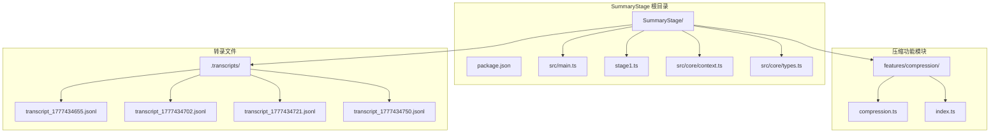
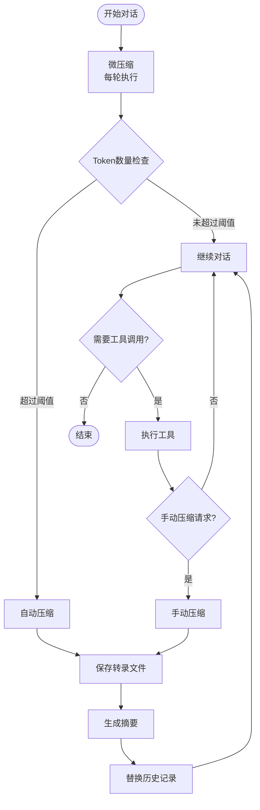
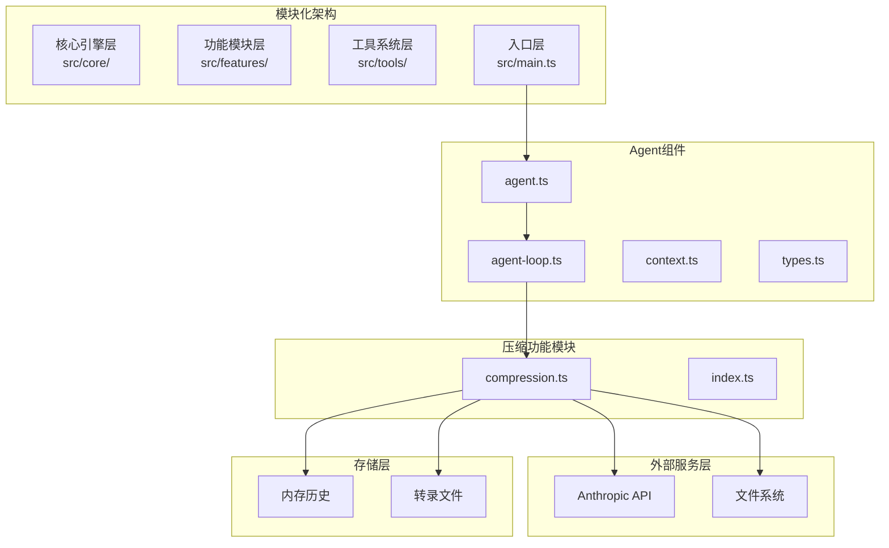
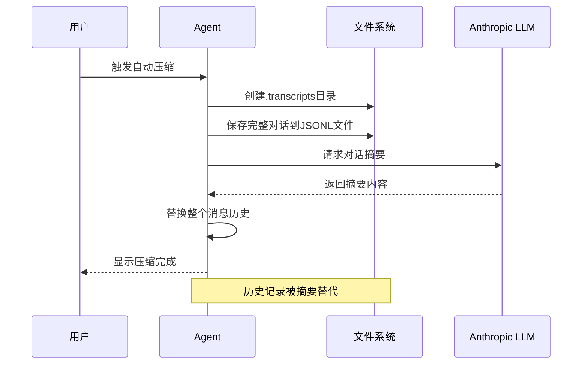

# 内存压缩机制

<cite>
**本文档引用的文件**
- [compression.ts](file://SummaryStage/src/features/compression/compression.ts)
- [index.ts](file://SummaryStage/src/features/compression/index.ts)
- [stage1.ts](file://SummaryStage/stage1.ts)
- [types.ts](file://SummaryStage/src/core/types.ts)
- [context.ts](file://SummaryStage/src/core/context.ts)
- [main.ts](file://SummaryStage/src/main.ts)
- [stage1_refactor.md](file://SummaryStage/stage1_refactor.md)
- [transcript_1777434655.jsonl](file://SummaryStage/.transcripts/transcript_1777434655.jsonl)
</cite>

## 更新摘要
**变更内容**
- 更新为基于SummaryStage的新压缩系统架构
- 新增模块化设计和分层架构说明
- 更新压缩算法实现细节和配置参数
- 增加新的自动压缩机制和转录文件管理
- 完善压缩效果评估和性能优化策略

## 目录
1. [简介](#简介)
2. [项目结构](#项目结构)
3. [核心组件](#核心组件)
4. [架构概览](#架构概览)
5. [详细组件分析](#详细组件分析)
6. [依赖关系分析](#依赖关系分析)
7. [性能考虑](#性能考虑)
8. [故障排除指南](#故障排除指南)
9. [结论](#结论)

## 简介

本项目实现了基于SummaryStage的三层内存压缩机制，旨在解决长对话场景下的内存管理和性能问题。该系统通过智能的对话历史压缩策略，在保持对话连贯性的同时最大化存储空间利用率。

**更新** 系统已从单文件架构重构为模块化设计，采用分层架构模式，包括：
- **微压缩（Layer 1）**：每轮自动执行，精简旧的工具调用结果
- **自动压缩（Layer 2）**：当token数量超过阈值时触发，进行深度压缩
- **手动压缩（Layer 3）**：用户主动触发的即时压缩

## 项目结构

项目采用模块化设计，主要文件组织如下：



**图表来源**
- [stage1_refactor.md:5-18](file://SummaryStage/stage1_refactor.md#L5-L18)
- [compression.ts:1-166](file://SummaryStage/src/features/compression/compression.ts#L1-L166)

**章节来源**
- [stage1_refactor.md:1-40](file://SummaryStage/stage1_refactor.md#L1-L40)
- [package.json:1-26](file://SummaryStage/package.json#L1-L26)

## 核心组件

### 三层压缩策略

系统实现了完整的三层压缩体系，每层都有明确的职责和触发条件：



**图表来源**
- [stage1.ts:837-920](file://SummaryStage/stage1.ts#L837-L920)
- [compression.ts:37-80](file://SummaryStage/src/features/compression/compression.ts#L37-L80)

### 微压缩机制

微压缩是系统中最频繁执行的压缩层，负责在每轮对话中精简历史记录：

- **执行频率**：每次对话轮次都会执行
- **目标对象**：非最新的工具调用结果
- **保留策略**：最近KEEP_RECENT条结果保持完整
- **压缩策略**：其他结果替换为占位符

**章节来源**
- [compression.ts:37-80](file://SummaryStage/src/features/compression/compression.ts#L37-L80)
- [types.ts:180-185](file://SummaryStage/src/core/types.ts#L180-L185)

### 自动压缩机制

自动压缩在token数量超过预设阈值时触发，进行深度压缩：

- **触发条件**：estimateTokens(messages) > COMPACT_THRESHOLD
- **执行步骤**：
  1. 保存完整对话到.transcripts/目录
  2. 使用LLM生成对话摘要
  3. 用摘要替换整个消息历史

**章节来源**
- [compression.ts:92-162](file://SummaryStage/src/features/compression/compression.ts#L92-L162)
- [stage1.ts:844-849](file://SummaryStage/stage1.ts#L844-L849)

### 手动压缩机制

手动压缩允许用户主动触发压缩操作：

- **触发方式**：通过工具调用"compact"
- **执行时机**：在当前对话轮次结束后立即执行
- **行为模式**：与自动压缩相同，但由用户控制

**章节来源**
- [stage1.ts:876-918](file://SummaryStage/stage1.ts#L876-L918)
- [compression.ts:19-44](file://SummaryStage/src/features/compression/index.ts#L19-L44)

## 架构概览

系统采用模块化架构，结合事件驱动的架构模式实现智能压缩：



**图表来源**
- [stage1_refactor.md:7-21](file://SummaryStage/stage1_refactor.md#L7-L21)
- [compression.ts:12-15](file://SummaryStage/src/features/compression/compression.ts#L12-L15)

## 详细组件分析

### 微压缩算法实现

微压缩算法通过以下步骤实现高效的历史精简：


**图表来源**
- [compression.ts:505-548](file://SummaryStage/src/features/compression/compression.ts#L505-L548)

#### 关键实现细节

1. **工具结果识别**：遍历所有用户消息中的tool_result内容块
2. **映射构建**：通过匹配tool_use_id关联工具调用名称
3. **智能保留**：保留最近KEEP_RECENT条结果和read_file工具输出
4. **占位符替换**：将压缩内容替换为"[Previous: used {tool_name}]"格式

**章节来源**
- [compression.ts:505-548](file://SummaryStage/src/features/compression/compression.ts#L505-L548)

### 自动压缩工作流程

自动压缩采用完整的摘要生成和历史替换流程：



**图表来源**
- [compression.ts:118-162](file://SummaryStage/src/features/compression/compression.ts#L118-L162)

#### 存储结构设计

自动压缩产生的转录文件采用JSON Lines格式：

- **文件命名**：transcript_{timestamp}.jsonl
- **内容格式**：每行一条JSON消息记录
- **存储位置**：.transcripts/目录
- **文件大小**：完整对话备份，便于后续检索

**章节来源**
- [compression.ts:92-102](file://SummaryStage/src/features/compression/compression.ts#L92-L102)
- [transcript_1777434655.jsonl:1-12](file://SummaryStage/.transcripts/transcript_1777434655.jsonl#L1-L12)

### Token估算机制

系统采用字符计数法估算token数量：

```mermaid
flowchart TD
Start([开始估算]) --> Serialize[序列化消息数组]
Serialize --> GetLength[获取字符串长度]
GetLength --> Divide[除以字符/token比率]
Divide --> Round[向下取整]
Round --> End([返回token估算值])
Style End fill:#e1f5fe
```

**图表来源**
- [compression.ts:26-28](file://SummaryStage/src/features/compression/compression.ts#L26-L28)

#### 估算精度分析

- **估算公式**：Math.floor(String(JSON.stringify(messages)).length / 4)
- **字符/token比率**：约4字符/1 token
- **适用范围**：适用于英文文本的近似估算
- **局限性**：对中文等多字节字符可能不够精确

**章节来源**
- [compression.ts:26-28](file://SummaryStage/src/features/compression/compression.ts#L26-L28)

## 依赖关系分析

系统采用模块化设计，依赖关系清晰：

```mermaid
graph TB
subgraph "系统依赖"
NodeJS[Node.js运行时]
Typescript[TypeScript类型系统]
end
subgraph "第三方库"
AnthropicSDK[@anthropic-ai/sdk]
Dotenv[dotenv]
Readline[node:readline]
ChildProcess[node:child_process]
end
subgraph "核心模块"
Compression[压缩算法]
Tools[工具函数]
Agent[Agent循环]
Context[AgentContext]
end
subgraph "功能模块"
Todo[todo管理]
Skills[技能系统]
Subagent[子代理]
Hooks[钩子系统]
Permissions[权限系统]
Memory[记忆管理]
end
NodeJS --> AnthropicSDK
NodeJS --> Dotenv
NodeJS --> Readline
NodeJS --> ChildProcess
Typescript --> Compression
Typescript --> Tools
Typescript --> Agent
Typescript --> Context
AnthropicSDK --> Compression
Dotenv --> Agent
Readline --> Agent
ChildProcess --> Tools
Compression --> Context
Todo --> Context
Skills --> Context
Subagent --> Context
Hooks --> Context
Permissions --> Context
Memory --> Context
```

**图表来源**
- [package.json:14-18](file://SummaryStage/package.json#L14-L18)
- [stage1_refactor.md:13-18](file://SummaryStage/stage1_refactor.md#L13-L18)

### 配置参数详解

系统支持多种配置参数，通过环境变量和常量设置：

| 参数名 | 类型 | 默认值 | 描述 | 作用域 |
|--------|------|--------|------|--------|
| ANTHROPIC_API_KEY | string | 无 | Anthropic API密钥 | 全局 |
| ANTHROPIC_BASE_URL | string | 无 | API基础URL | 全局 |
| MODEL_ID | string | claude-sonnet-4-20250514 | 模型标识符 | 全局 |
| COMPACT_THRESHOLD | number | 50000 | 自动压缩阈值 | 全局 |
| KEEP_RECENT | number | 3 | 保留最近结果数量 | 全局 |
| PRESERVE_RESULT_TOOLS | Set | ["read_file","bash"] | 需要保留的工具列表 | 全局 |

**章节来源**
- [types.ts:180-185](file://SummaryStage/src/core/types.ts#L180-L185)
- [stage1.ts:66-69](file://SummaryStage/stage1.ts#L66-L69)

## 性能考虑

### 内存优化策略

系统采用多种策略优化内存使用：

1. **增量压缩**：微压缩只处理必要的历史片段
2. **延迟加载**：压缩后的历史通过文件系统按需恢复
3. **智能保留**：重要工具结果（如read_file）保持完整
4. **批量处理**：工具调用结果批量处理，减少内存碎片

### 计算复杂度分析

- **微压缩**：O(n*m)，其中n为消息数量，m为工具调用数量
- **自动压缩**：O(n) + LLM调用时间，n为消息数量
- **Token估算**：O(n)，n为消息数量

### 存储优化方案

1. **分层存储**：近期活跃数据保留在内存，历史数据存储到文件
2. **压缩比优化**：通过占位符技术实现5-10倍压缩率
3. **增量备份**：只保存必要的转录文件，避免重复存储

## 故障排除指南

### 常见问题及解决方案

#### 1. API密钥配置错误

**症状**：启动时报错或API调用失败
**解决方案**：
- 检查.env文件中的ANTHROPIC_API_KEY
- 验证API密钥的有效性和权限
- 确认网络连接正常

#### 2. 路径访问权限问题

**症状**：文件读写操作失败
**解决方案**：
- 检查工作目录权限
- 验证.safePath函数的安全性
- 确认.transcripts目录可写

#### 3. Token估算不准确

**症状**：压缩触发时机异常
**解决方案**：
- 调整COMPACT_THRESHOLD参数值
- 考虑使用更精确的token计数器
- 监控实际token使用情况

#### 4. 压缩后信息丢失

**症状**：摘要过于简化导致上下文缺失
**解决方案**：
- 增加KEEP_RECENT值
- 调整PRESERVE_RESULT_TOOLS列表
- 实现选择性压缩策略

**章节来源**
- [stage1.ts:876-918](file://SummaryStage/stage1.ts#L876-L918)
- [compression.ts:19-44](file://SummaryStage/src/features/compression/index.ts#L19-L44)

### 调试技巧

1. **启用详细日志**：观察压缩触发点和执行过程
2. **监控内存使用**：定期检查内存占用情况
3. **验证压缩效果**：比较压缩前后的存储空间
4. **测试边界条件**：极端长度对话和大量工具调用场景

## 结论

本内存压缩机制通过模块化设计实现了高效的对话历史管理：

1. **微压缩层**提供了实时的内存清理能力，确保系统响应性
2. **自动压缩层**在必要时进行深度压缩，平衡存储和性能
3. **手动压缩层**提供了用户控制能力，满足特殊需求

**更新** 系统的关键优势包括：
- **模块化架构**：清晰的分层设计，易于维护和扩展
- **渐进式压缩**：从轻量级到深度压缩的平滑过渡
- **智能保留**：重要上下文信息的保护机制
- **可配置性**：灵活的参数调整适应不同使用场景
- **安全性**：严格的路径验证和输入检查

未来改进方向：
- 实现更精确的token计数算法
- 添加压缩效果的量化指标
- 支持更多类型的工具调用结果压缩
- 优化大文件处理的性能表现
- 增强转录文件的搜索和检索功能