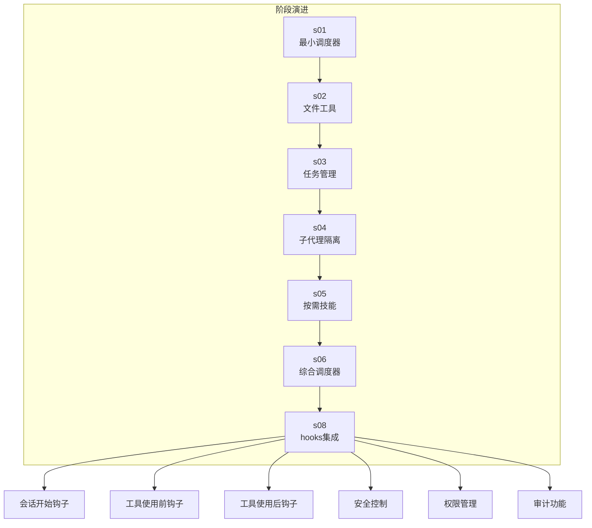
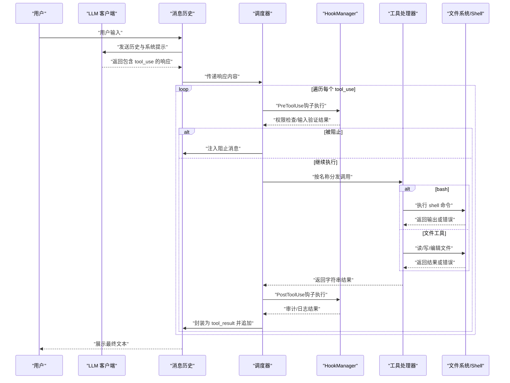
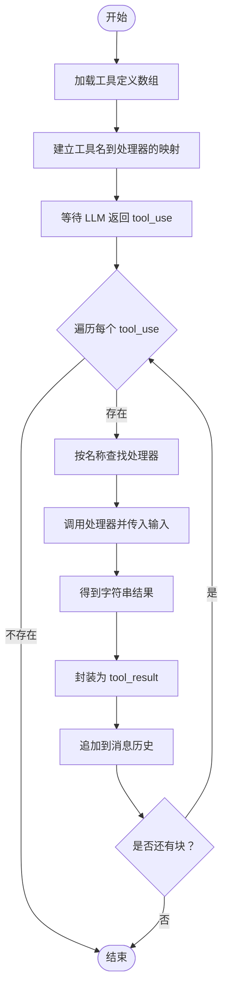
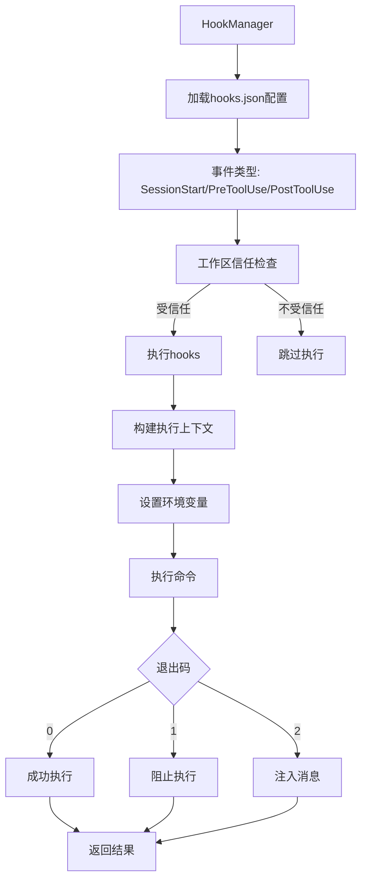
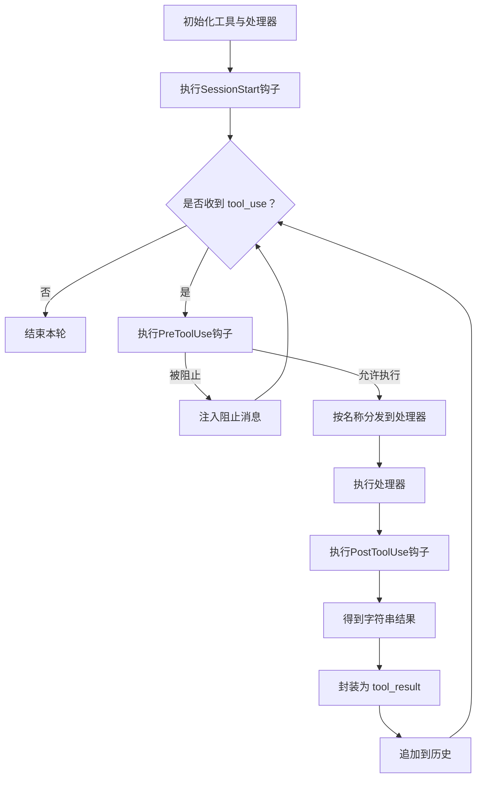
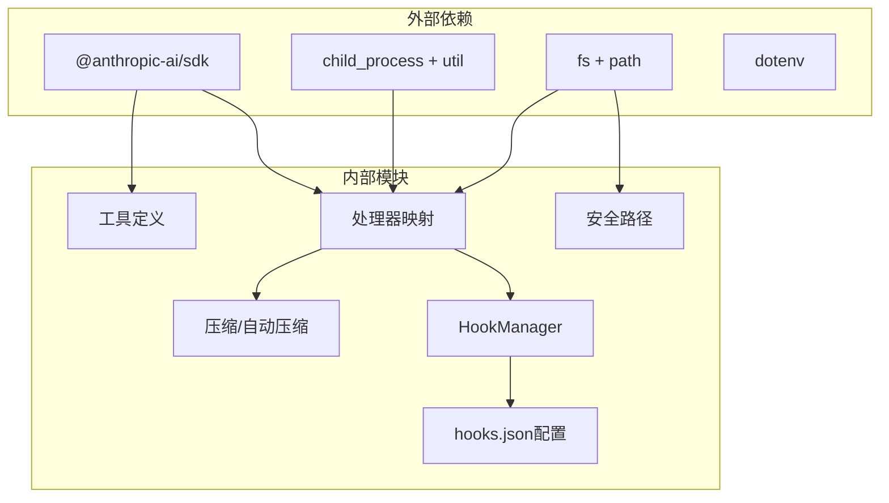

# 工具调度系统

<cite>
**本文引用的文件**
- [README.md](file://README.md)
- [package.json](file://package.json)
- [src/s01/index.ts](file://src/s01/index.ts)
- [src/s02/index.ts](file://src/s02/index.ts)
- [src/s02/greet.py](file://src/s02/greet.py)
- [src/s02/test.txt](file://src/s02/test.txt)
- [src/s03/index.ts](file://src/s03/index.ts)
- [src/s04/index.ts](file://src/s04/index.ts)
- [src/s05/index.ts](file://src/s05/index.ts)
- [src/s05/skills/code-reviews/SKILL.md](file://src/s05/skills/code-reviews/SKILL.md)
- [src/s06/index.ts](file://src/s06/index.ts)
- [src/s08/index.ts](file://src/s08/index.ts)
- [src/s08/hooks.json](file://src/s08/hooks.json)
</cite>

## 目录
1. [简介](#简介)
2. [项目结构](#项目结构)
3. [核心组件](#核心组件)
4. [架构总览](#架构总览)
5. [详细组件分析](#详细组件分析)
6. [依赖关系分析](#依赖关系分析)
7. [性能考量](#性能考量)
8. [故障排查指南](#故障排查指南)
9. [结论](#结论)
10. [附录](#附录)

## 简介
本文件系统性阐述"工具调度系统"的设计与实现，覆盖工具注册机制、工具处理器映射、工具调用流程与错误处理策略，并深入解析 bash、read_file、write_file、edit_file 四类核心工具的实现原理、输入参数校验、输出结果格式化与安全检查机制。**新增**完整的hooks系统支持，包括会话开始钩子、工具使用前钩子和工具使用后钩子的完整安全控制、权限管理和审计功能。同时提供扩展新工具类型的实践路径与工具调用全生命周期管理建议。

## 项目结构
该仓库采用按阶段演进的模块化组织方式，每个阶段在 src/s01 到 src/s08 中逐步引入更复杂的工具与调度能力：
- s01：仅支持 bash 工具的最小调度器
- s02：引入 read_file、write_file、edit_file 三类文件工具
- s03：加入 todo 任务管理与提醒机制
- s04：引入子代理（subagent）隔离上下文
- s05：按需加载技能（load_skill），动态扩展知识
- s06：综合版调度器，集成压缩与自动压缩、微压缩等内存管理策略
- **s08：集成hooks系统，新增安全控制、权限管理和审计功能**

**章节来源**
- [src/s01/index.ts:1-158](file://src/s01/index.ts#L1-L158)
- [src/s02/index.ts:1-213](file://src/s02/index.ts#L1-L213)
- [src/s03/index.ts:1-335](file://src/s03/index.ts#L1-L335)
- [src/s04/index.ts:1-314](file://src/s04/index.ts#L1-L314)
- [src/s05/index.ts:1-332](file://src/s05/index.ts#L1-L332)
- [src/s06/index.ts:1-413](file://src/s06/index.ts#L1-L413)
- [src/s08/index.ts:1-515](file://src/s08/index.ts#L1-L515)

## 核心组件
- 工具定义与输入模式
  - 每个工具以 JSON 形式声明名称、描述与输入模式（JSON Schema）。例如 bash 的输入必须包含命令字符串；read_file 需要路径，可选限制行数；write_file 需要路径与内容；edit_file 需要路径、旧文本与新文本。
- 工具处理器映射
  - 使用键值对记录工具名到处理器函数的映射，便于按名称分发调用。
- 工具执行循环
  - LLM 生成包含 tool_use 的消息块；调度器遍历块，按名称查找处理器并执行，将结果封装为 tool_result 追加回对话历史。
- **hooks系统**
  - **会话开始钩子（SessionStart）**：在会话启动时执行，用于初始化环境、注入消息或进行权限检查
  - **工具使用前钩子（PreToolUse）**：在工具执行前执行，用于输入验证、权限控制、安全检查和输入重写
  - **工具使用后钩子（PostToolUse）**：在工具执行后执行，用于审计、日志记录、输出检查和状态报告
  - **安全控制**：通过工作区信任标记文件控制hooks执行，防止在不受信任的工作区执行潜在危险操作
  - **权限管理**：支持权限决策结构化输出，允许钩子控制系统行为
  - **审计功能**：记录工具调用过程，提供完整的操作审计轨迹
- 安全与约束
  - 文件操作统一通过安全路径解析函数进行路径合法性校验，防止越权访问工作区外路径。
  - bash 执行设置超时，避免长时间阻塞。
- 结果压缩与内存管理
  - 微压缩：将较早的 tool_result 替换为简短占位符，保留最近若干条以维持可追溯性。
  - 自动压缩：当消息长度超过阈值时，保存完整对话、请求大模型摘要并替换为摘要消息，降低 token 消耗。

**章节来源**
- [src/s08/index.ts:91-252](file://src/s08/index.ts#L91-L252)
- [src/s08/hooks.json:1-59](file://src/s08/hooks.json#L1-L59)
- [src/s08/index.ts:354-454](file://src/s08/index.ts#L354-L454)

## 架构总览
下图展示了工具调度系统的核心交互，包括新增的hooks系统：LLM 生成工具调用请求，调度器根据工具名分发至对应处理器，处理器执行前后通过hooks系统进行安全控制和审计，最终由调度器封装为 tool_result 并写回历史。

**图表来源**
- [src/s08/index.ts:397-447](file://src/s08/index.ts#L397-L447)
- [src/s08/index.ts:464-467](file://src/s08/index.ts#L464-L467)

## 详细组件分析

### 工具注册机制与处理器映射
- 注册方式
  - 工具通过数组形式集中声明，包含名称、描述与输入模式；处理器通过对象字面量按名称映射到具体函数。
- 分发策略
  - 遍历 LLM 响应中的 tool_use 块，依据 block.name 查找处理器；若未找到则返回未知工具提示。
- 可扩展性
  - 新增工具只需在工具数组中添加定义，并在处理器映射中新增对应项；无需修改调度循环逻辑。

**章节来源**
- [src/s02/index.ts:118-135](file://src/s02/index.ts#L118-L135)
- [src/s03/index.ts:219-239](file://src/s03/index.ts#L219-L239)
- [src/s04/index.ts:137-146](file://src/s04/index.ts#L137-L146)
- [src/s05/index.ts:234-254](file://src/s05/index.ts#L234-L254)
- [src/s06/index.ts:280-300](file://src/s06/index.ts#L280-L300)

### hooks系统详解

#### HookManager类
- **核心职责**
  - 加载和管理hooks配置
  - 执行不同类型的hooks事件
  - 提供安全控制和权限管理
  - 支持审计和日志记录

- **hooks类型**
  - **SessionStart**：会话启动时执行
  - **PreToolUse**：工具执行前执行
  - **PostToolUse**：工具执行后执行

- **安全控制机制**
  - 工作区信任检查：通过`.claude`标记文件控制hooks执行
  - 超时控制：每个hooks执行最多30秒
  - 环境隔离：为每个hooks执行构建独立的环境变量

**图表来源**
- [src/s08/index.ts:91-252](file://src/s08/index.ts#L91-L252)

#### hooks.json配置文件
- **配置结构**
  - 每个事件类型包含一个hooks数组
  - 每个hooks包含matcher（工具名过滤器）和command（执行命令）

- **matcher规则**
  - `*`：匹配所有工具
  - 具体工具名：仅匹配指定工具

- **command执行规则**
  - 退出码0：正常执行，可选择输出JSON结构化数据
  - 退出码1：阻止工具执行
  - 退出码2：向消息历史注入警告消息

**章节来源**
- [src/s08/hooks.json:1-59](file://src/s08/hooks.json#L1-L59)
- [src/s08/index.ts:91-252](file://src/s08/index.ts#L91-L252)

### bash 工具
- 实现原理
  - 使用异步执行接口运行 shell 命令，设置工作目录与超时时间；合并标准输出与错误输出，去除空白字符；异常时捕获并返回错误信息。
- 输入参数
  - 必填：command（字符串）
- 输出结果
  - 成功：命令输出文本；失败：错误信息字符串
- 安全检查
  - 无命令注入防护（建议后续增加白名单/参数转义）
  - 设置超时避免长时间阻塞
- 使用方法
  - 在对话中请求 LLM 调用 bash 并传入命令字符串

**章节来源**
- [src/s01/index.ts:50-62](file://src/s01/index.ts#L50-L62)
- [src/s02/index.ts:92-104](file://src/s02/index.ts#L92-L104)
- [src/s03/index.ts:193-205](file://src/s03/index.ts#L193-L205)
- [src/s04/index.ts:102-114](file://src/s04/index.ts#L102-L114)
- [src/s05/index.ts:208-220](file://src/s05/index.ts#L208-L220)
- [src/s06/index.ts:254-266](file://src/s06/index.ts#L254-L266)

### read_file 工具
- 实现原理
  - 通过安全路径解析函数确保目标位于工作区内；读取 UTF-8 文本；可选限制显示行数并在截断时附加剩余行数提示；限制最大输出长度。
- 输入参数
  - 必填：path（字符串）；可选：limit（整数）
- 输出结果
  - 成功：文件内容文本；失败：错误信息字符串
- 安全检查
  - 路径合法性校验，防止越权访问
- 使用方法
  - 请求 LLM 读取指定路径文件，必要时设置行数限制

**章节来源**
- [src/s02/index.ts:50-63](file://src/s02/index.ts#L50-L63)
- [src/s03/index.ts:151-164](file://src/s03/index.ts#L151-L164)
- [src/s04/index.ts:60-73](file://src/s04/index.ts#L60-L73)
- [src/s05/index.ts:166-179](file://src/s05/index.ts#L166-L179)
- [src/s06/index.ts:212-225](file://src/s06/index.ts#L212-L225)

### write_file 工具
- 实现原理
  - 安全解析目标路径，确保父目录存在；以 UTF-8 写入内容；返回写入字节数与路径信息；异常时返回错误信息。
- 输入参数
  - 必填：path（字符串）、content（字符串）
- 输出结果
  - 成功：写入统计信息；失败：错误信息字符串
- 安全检查
  - 路径合法性校验；自动创建缺失目录
- 使用方法
  - 请求 LLM 将内容写入指定路径

**章节来源**
- [src/s02/index.ts:65-74](file://src/s02/index.ts#L65-L74)
- [src/s03/index.ts:166-175](file://src/s03/index.ts#L166-L175)
- [src/s04/index.ts:75-84](file://src/s04/index.ts#L75-L84)
- [src/s05/index.ts:181-190](file://src/s05/index.ts#L181-L190)
- [src/s06/index.ts:227-236](file://src/s06/index.ts#L227-L236)

### edit_file 工具
- 实现原理
  - 安全解析目标路径并读取内容；在全文中查找旧文本，若不存在则返回错误；否则替换为新文本并写回；返回编辑确认信息；异常时返回错误信息。
- 输入参数
  - 必填：path（字符串）、old_text（字符串）、new_text（字符串）
- 输出结果
  - 成功：编辑确认信息；失败：错误信息字符串
- 安全检查
  - 路径合法性校验；精确文本匹配后再替换
- 使用方法
  - 请求 LLM 在指定文件中精确替换某段文本

**章节来源**
- [src/s02/index.ts:76-89](file://src/s02/index.ts#L76-L89)
- [src/s03/index.ts:177-190](file://src/s03/index.ts#L177-L190)
- [src/s04/index.ts:86-99](file://src/s04/index.ts#L86-L99)
- [src/s05/index.ts:192-205](file://src/s05/index.ts#L192-L205)
- [src/s06/index.ts:238-251](file://src/s06/index.ts#L238-L251)

### 错误处理策略
- 统一捕获与降级
  - 所有工具处理器均使用 try/catch 包裹；异常时返回标准化错误字符串，避免中断调度循环。
- 未知工具处理
  - 若工具名不在映射中，返回"未知工具"提示，便于调试与扩展。
- 输出截断
  - 对长输出进行长度限制，防止 token 溢出。
- 超时控制
  - bash 执行设置超时，避免长时间阻塞。
- 路径安全
  - 所有文件操作前进行路径合法性校验，防止越权访问。
- **hooks错误处理**
  - hooks执行超时：记录超时信息
  - hooks执行错误：记录错误详情
  - 权限拒绝：阻止工具执行并返回原因

**章节来源**
- [src/s02/index.ts:160-171](file://src/s02/index.ts#L160-L171)
- [src/s03/index.ts:267-291](file://src/s03/index.ts#L267-L291)
- [src/s04/index.ts:168-186](file://src/s04/index.ts#L168-L186)
- [src/s05/index.ts:277-295](file://src/s05/index.ts#L277-L295)
- [src/s06/index.ts:338-356](file://src/s06/index.ts#L338-L356)
- [src/s08/index.ts:240-247](file://src/s08/index.ts#L240-L247)

### 工具调用流程与生命周期
- 生命周期阶段
  - 初始化：加载工具定义与处理器映射
  - 交互：LLM 生成工具调用请求
  - 分发：按名称查找处理器
  - 执行：调用处理器并等待结果
  - 封装：将结果封装为 tool_result
  - 追加：写回消息历史
  - 循环：继续下一轮直到不再触发工具调用
- **hooks集成流程**
  - SessionStart：会话启动时执行
  - PreToolUse：工具执行前执行安全检查
  - PostToolUse：工具执行后执行审计记录
- 关键流程图

**图表来源**
- [src/s08/index.ts:397-447](file://src/s08/index.ts#L397-L447)
- [src/s08/index.ts:464-467](file://src/s08/index.ts#L464-L467)

## 依赖关系分析
- 外部依赖
  - AI 模型 SDK：Anthropic SDK 用于消息生成与工具调用
  - 子进程执行：child_process 与 util.promisify 用于 bash 执行
  - 文件系统：fs 与 path 用于文件读写与路径解析
  - **环境配置：dotenv 用于加载环境变量**
- 内部耦合
  - 工具定义与处理器映射紧密耦合，便于扩展
  - 安全路径函数被多处复用，降低耦合度
  - 压缩与自动压缩作为独立层，与工具层解耦
  - **hooks系统作为独立模块，与主调度器松耦合**

**图表来源**
- [package.json:13-22](file://package.json#L13-L22)
- [src/s08/index.ts:25-23](file://src/s08/index.ts#L25-L23)
- [src/s08/index.ts:91-120](file://src/s08/index.ts#L91-L120)

**章节来源**
- [package.json:13-22](file://package.json#L13-L22)
- [src/s08/index.ts:25-23](file://src/s08/index.ts#L25-L23)
- [src/s08/index.ts:91-120](file://src/s08/index.ts#L91-L120)

## 性能考量
- Token 控制
  - 估算消息长度，超过阈值时触发自动压缩，显著降低后续调用成本
- 结果压缩
  - 微压缩将早期结果替换为占位符，保留最近若干条以维持可追溯性
- 输出截断
  - 对长输出进行截断，避免单次 tool_result 过大
- 超时与并发
  - bash 执行设置超时；当前实现串行执行，避免资源竞争
  - **hooks执行设置30秒超时，防止阻塞主流程**
- **安全开销**
  - hooks执行增加额外的系统调用开销
  - 工作区信任检查增加一次文件系统访问

**章节来源**
- [src/s06/index.ts:59-61](file://src/s06/index.ts#L59-L61)
- [src/s06/index.ts:82-138](file://src/s06/index.ts#L82-L138)
- [src/s06/index.ts:212-225](file://src/s06/index.ts#L212-L225)
- [src/s08/index.ts:58](file://src/s08/index.ts#L58)
- [src/s08/index.ts:127-132](file://src/s08/index.ts#L127-L132)

## 故障排查指南
- 常见问题
  - 路径越界：检查安全路径函数是否正确解析相对路径
  - 文件读写失败：确认路径存在且权限允许
  - bash 命令超时：检查命令复杂度或外部依赖
  - 未知工具：确认工具名拼写与处理器映射一致
  - **hooks执行失败：检查hooks.json配置语法和命令可执行性**
  - **工作区不受信任：确认.s08目录下存在.claude标记文件**
- 排查步骤
  - 打印 tool_use 详情与处理器返回值
  - 检查环境变量与模型配置
  - 验证输入模式与必填字段
  - **检查hooks执行日志和退出码**
  - **验证hooks命令的可执行性和权限**

**章节来源**
- [src/s02/index.ts:37-48](file://src/s02/index.ts#L37-L48)
- [src/s03/index.ts:137-149](file://src/s03/index.ts#L137-L149)
- [src/s04/index.ts:47-58](file://src/s04/index.ts#L47-L58)
- [src/s05/index.ts:153-164](file://src/s05/index.ts#L153-L164)
- [src/s06/index.ts:199-210](file://src/s06/index.ts#L199-L210)
- [src/s08/index.ts:240-247](file://src/s08/index.ts#L240-L247)

## 结论
该工具调度系统以清晰的工具定义与处理器映射为核心，结合安全路径校验、超时控制与结果压缩策略，在保证安全性的同时实现了高效的工具链路。**通过集成完整的hooks系统，系统现在具备了会话开始钩子、工具使用前钩子和工具使用后钩子的完整支持，包括安全控制、权限管理和审计功能**。通过逐步演进的阶段设计，系统从单一 bash 工具发展为支持文件操作、任务管理、子代理隔离、按需技能加载和hooks安全控制的综合平台。建议后续增强命令注入防护、输入参数严格校验与类型安全，以进一步提升生产可用性。

## 附录
- 扩展新工具类型实践
  - 步骤
    - 在工具数组中添加新工具定义（名称、描述、输入模式）
    - 在处理器映射中新增对应处理器函数
    - 在工具调用循环中自动生效（无需修改调度逻辑）
  - 示例参考
    - 新增工具定义：参考现有工具数组结构
    - 新增处理器映射：参考现有映射键值对
    - 新增处理器函数：参考现有 runXxx 函数签名与安全检查
- **hooks系统扩展实践**
  - **配置hooks.json文件，定义新的hooks规则**
  - **编写hooks脚本，处理权限检查、输入验证、审计记录等场景**
  - **利用环境变量HOOK_TOOL_INPUT、HOOK_TOOL_OUTPUT获取工具执行上下文**
  - **通过退出码控制工具执行流程：0=继续，1=阻止，2=注入消息**

**章节来源**
- [src/s02/index.ts:118-135](file://src/s02/index.ts#L118-L135)
- [src/s03/index.ts:219-239](file://src/s03/index.ts#L219-L239)
- [src/s04/index.ts:137-146](file://src/s04/index.ts#L137-L146)
- [src/s05/index.ts:234-254](file://src/s05/index.ts#L234-L254)
- [src/s06/index.ts:280-300](file://src/s06/index.ts#L280-L300)
- [src/s08/hooks.json:1-59](file://src/s08/hooks.json#L1-L59)
- [src/s08/index.ts:91-252](file://src/s08/index.ts#L91-L252)