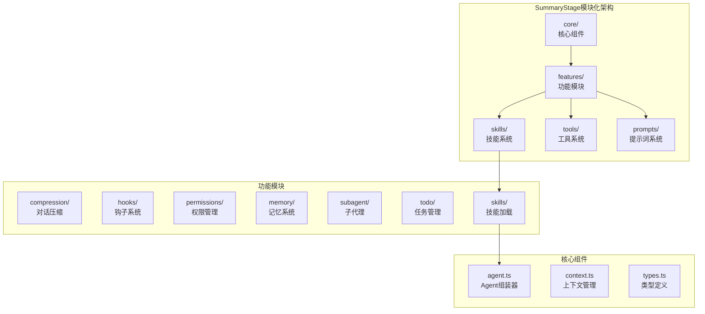
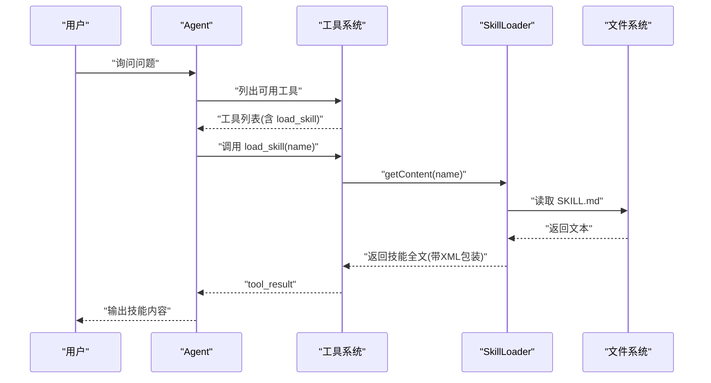
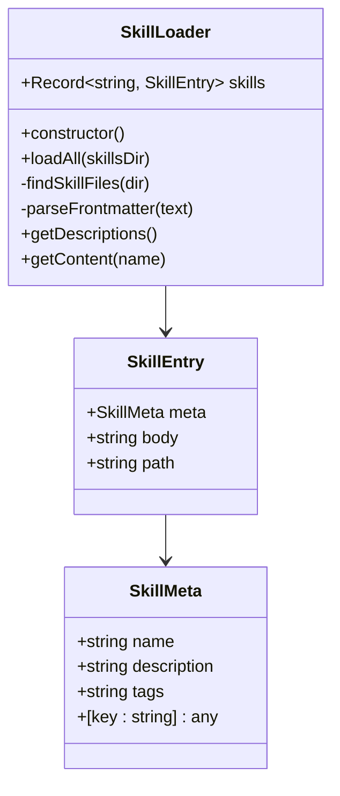
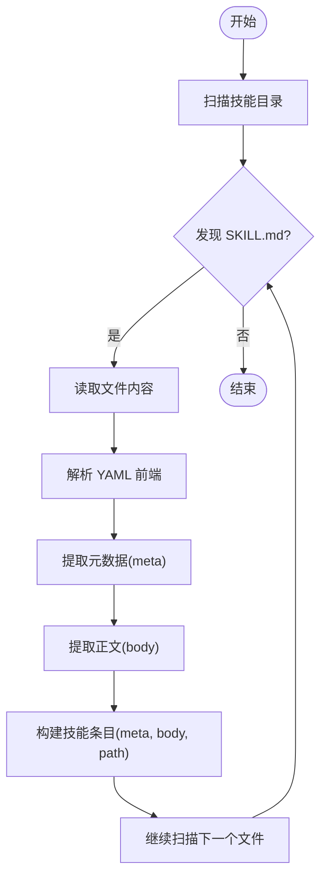
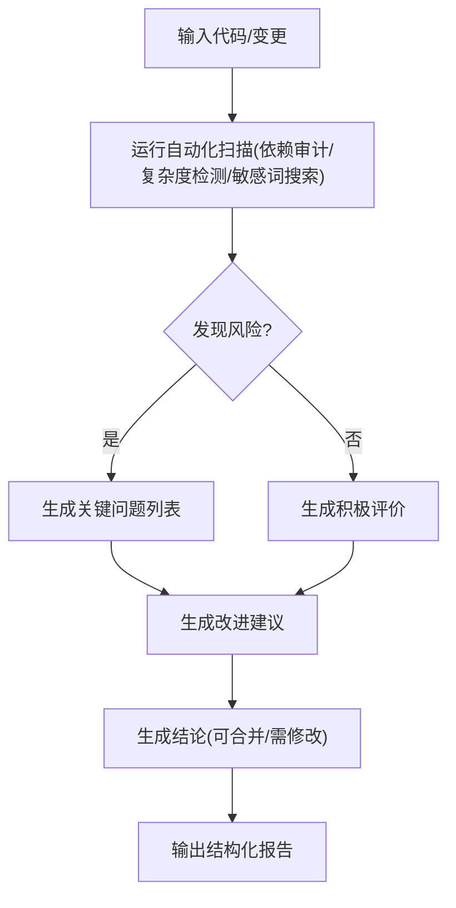
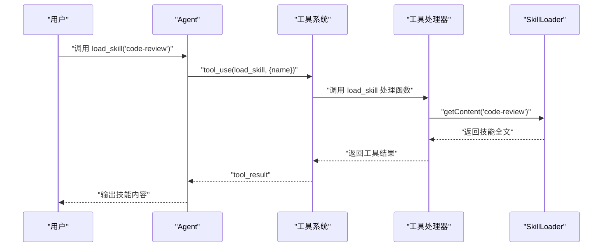
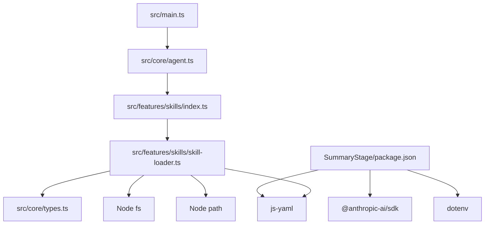

# 技能加载系统

<cite>
**本文档引用的文件**
- [README.md](file://README.md)
- [SummaryStage/package.json](file://SummaryStage/package.json)
- [SummaryStage/src/features/skills/skill-loader.ts](file://SummaryStage/src/features/skills/skill-loader.ts)
- [SummaryStage/src/features/skills/index.ts](file://SummaryStage/src/features/skills/index.ts)
- [SummaryStage/src/core/types.ts](file://SummaryStage/src/core/types.ts)
- [SummaryStage/src/core/agent.ts](file://SummaryStage/src/core/agent.ts)
- [SummaryStage/src/main.ts](file://SummaryStage/src/main.ts)
- [SummaryStage/skills/code-reviews/SKILL.md](file://SummaryStage/skills/code-reviews/SKILL.md)
- [SummaryStage/stage1.ts](file://SummaryStage/stage1.ts)
</cite>

## 更新摘要
**变更内容**
- 更新为基于SummaryStage的新技能加载架构
- 引入模块化设计，包含YAML前端内容解析和层次化组织
- 替代原有的简单技能管理，采用更完善的类型系统和注册机制
- 新增SkillLoader类的两层架构设计（元数据注入和内容加载）

## 目录
1. [简介](#简介)
2. [项目结构](#项目结构)
3. [核心组件](#核心组件)
4. [架构总览](#架构总览)
5. [详细组件分析](#详细组件分析)
6. [依赖关系分析](#依赖关系分析)
7. [性能考量](#性能考量)
8. [故障排查指南](#故障排查指南)
9. [结论](#结论)
10. [附录](#附录)

## 简介
本项目实现了一个基于SummaryStage的"技能加载系统"，通过在运行时按需加载技能（Skill）来增强模型的能力。系统采用模块化架构设计，技能以Markdown文件形式组织，使用YAML前端元数据（frontmatter）描述技能的基本信息，正文部分为技能的完整知识内容。系统通过Anthropic的API与模型交互，提供工具调用能力，其中包含专门用于加载技能的工具。该系统支持：
- 动态扫描技能目录，解析YAML前端元数据
- 将技能元数据注入系统提示，供模型选择加载
- 按需加载技能全文，作为工具结果返回给模型
- 安全路径限制，防止路径逃逸
- 多阶段上下文压缩，避免上下文过长
- 模块化设计，支持灵活的功能启用和禁用

**章节来源**
- [README.md:1-3](file://README.md#L1-L3)
- [SummaryStage/stage1.ts:1-33](file://SummaryStage/stage1.ts#L1-L33)

## 项目结构
仓库采用基于SummaryStage的模块化结构，核心功能集中在src目录下，包含多个功能模块（features）和核心组件（core）。技能加载系统作为features/skills模块的一部分，与其他功能模块（压缩、钩子、权限、记忆等）协同工作。

**图表来源**
- [SummaryStage/src/core/agent.ts:1-263](file://SummaryStage/src/core/agent.ts#L1-L263)
- [SummaryStage/src/features/skills/index.ts:1-47](file://SummaryStage/src/features/skills/index.ts#L1-L47)
- [SummaryStage/src/main.ts:1-39](file://SummaryStage/src/main.ts#L1-L39)

**章节来源**
- [SummaryStage/src/core/agent.ts:1-263](file://SummaryStage/src/core/agent.ts#L1-L263)
- [SummaryStage/src/features/skills/index.ts:1-47](file://SummaryStage/src/features/skills/index.ts#L1-L47)
- [SummaryStage/src/main.ts:1-39](file://SummaryStage/src/main.ts#L1-L39)

## 核心组件
- **SkillLoader类**
  - 负责扫描技能目录，解析YAML前端元数据，构建技能索引
  - 提供技能描述列表（用于系统提示）和技能全文（用于工具结果）
  - 采用两层架构：元数据层（Layer 1）和内容层（Layer 2）
- **技能注册系统**
  - 通过registerSkillsFeature函数注册技能加载功能
  - 创建SkillLoader实例并加载所有技能
  - 注册load_skill工具到工具注册表
- **Agent集成**
  - Agent类提供enableSkills方法启用技能加载功能
  - 支持异步加载技能文件
  - 将技能加载器挂载到Agent上下文中
- **类型系统**
  - SkillMeta接口定义技能元数据结构
  - SkillEntry接口定义完整技能条目
  - 支持扩展的元数据字段

**章节来源**
- [SummaryStage/src/features/skills/skill-loader.ts:18-96](file://SummaryStage/src/features/skills/skill-loader.ts#L18-L96)
- [SummaryStage/src/features/skills/index.ts:38-46](file://SummaryStage/src/features/skills/index.ts#L38-L46)
- [SummaryStage/src/core/agent.ts:74-76](file://SummaryStage/src/core/agent.ts#L74-L76)
- [SummaryStage/src/core/types.ts:42-55](file://SummaryStage/src/core/types.ts#L42-L55)

## 架构总览
技能加载系统采用两层架构设计，围绕"按需知识"展开：
- **Layer 1：系统提示中的技能简述**
  - 元数据层：包含技能名称、描述、标签等基本信息
  - 注入到系统提示词中，供模型选择合适的技能
- **Layer 2：按模型请求加载的技能全文**
  - 内容层：技能的完整知识内容，通过XML样式的标记块返回
  - 仅在模型明确请求时才加载，避免不必要的IO开销

**图表来源**
- [SummaryStage/src/features/skills/skill-loader.ts:85-94](file://SummaryStage/src/features/skills/skill-loader.ts#L85-L94)
- [SummaryStage/src/features/skills/index.ts:43-45](file://SummaryStage/src/features/skills/index.ts#L43-L45)

## 详细组件分析

### SkillLoader类
- **职责**
  - 扫描技能目录，递归查找所有SKILL.md文件
  - 解析YAML前端元数据，提取技能名称、描述、标签等
  - 构建技能字典，支持按名称查询技能描述和全文
  - 采用两层架构：元数据层用于系统提示，内容层用于工具调用
- **关键方法**
  - loadAll：加载指定目录下所有技能文件
  - findSkillFiles：递归遍历目录，收集SKILL.md路径
  - parseFrontmatter：使用正则匹配YAML前端，解析为对象
  - getDescriptions：生成系统提示中的技能简述列表
  - getContent：返回技能全文并包裹为工具结果格式
- **数据结构**
  - skills：键为技能名，值包含meta、body、path

**图表来源**
- [SummaryStage/src/features/skills/skill-loader.ts:18-96](file://SummaryStage/src/features/skills/skill-loader.ts#L18-L96)
- [SummaryStage/src/core/types.ts:42-55](file://SummaryStage/src/core/types.ts#L42-L55)

**章节来源**
- [SummaryStage/src/features/skills/skill-loader.ts:25-35](file://SummaryStage/src/features/skills/skill-loader.ts#L25-L35)
- [SummaryStage/src/features/skills/skill-loader.ts:37-53](file://SummaryStage/src/features/skills/skill-loader.ts#L37-L53)
- [SummaryStage/src/features/skills/skill-loader.ts:55-68](file://SummaryStage/src/features/skills/skill-loader.ts#L55-L68)
- [SummaryStage/src/features/skills/skill-loader.ts:70-83](file://SummaryStage/src/features/skills/skill-loader.ts#L70-L83)
- [SummaryStage/src/features/skills/skill-loader.ts:85-94](file://SummaryStage/src/features/skills/skill-loader.ts#L85-L94)

### 技能文件格式规范与YAML前端元数据
- **文件位置**
  - 技能文件统一命名为SKILL.md，位于技能根目录下
  - 支持嵌套目录结构，技能名称从目录名推断
- **YAML前端元数据**
  - 必填字段：name（技能名称）
  - 建议字段：description（技能描述）、tags（标签）
  - 支持任意扩展字段，通过[key: string]: any定义
- **内容组织**
  - 正文为技能的完整知识内容，可包含多语言代码示例、检查清单、输出格式等
  - 使用标准Markdown格式，支持代码块、列表、标题等
- **示例参考**
  - 代码审查技能的SKILL.md展示了完整的结构：检查清单、输出格式、常见模式、命令等

**图表来源**
- [SummaryStage/src/features/skills/skill-loader.ts:37-53](file://SummaryStage/src/features/skills/skill-loader.ts#L37-L53)
- [SummaryStage/src/features/skills/skill-loader.ts:55-68](file://SummaryStage/src/features/skills/skill-loader.ts#L55-L68)

**章节来源**
- [SummaryStage/skills/code-reviews/SKILL.md:1-157](file://SummaryStage/skills/code-reviews/SKILL.md#L1-L157)

### 代码审查技能实现原理
- **审查规则定义**
  - 安全性：注入漏洞、认证授权问题、敏感数据暴露、加密问题、依赖漏洞
  - 正确性：逻辑错误、竞态条件、资源泄漏、异常处理、类型安全
  - 性能：N+1查询、内存问题、阻塞操作、低效算法、缺失缓存
  - 可维护性：命名、复杂度、重复代码、死代码、注释质量
  - 测试：覆盖率、边界测试、外部依赖隔离、断言质量
- **代码分析算法**
  - 该技能未内置代码静态分析算法，而是提供检查清单和输出格式，指导模型进行人工或自动化扫描
  - 提供常用命令（如依赖审计、复杂度检测、敏感词搜索）作为辅助
- **报告生成机制**
  - 输出格式包含：摘要、关键问题、改进建议、积极评价、结论（是否可合并）
  - 使用结构化标题和编号，便于模型生成一致的报告

**图表来源**
- [SummaryStage/skills/code-reviews/SKILL.md:10-88](file://SummaryStage/skills/code-reviews/SKILL.md#L10-L88)
- [SummaryStage/skills/code-reviews/SKILL.md:130-157](file://SummaryStage/skills/code-reviews/SKILL.md#L130-L157)

**章节来源**
- [SummaryStage/skills/code-reviews/SKILL.md:10-88](file://SummaryStage/skills/code-reviews/SKILL.md#L10-L88)
- [SummaryStage/skills/code-reviews/SKILL.md:130-157](file://SummaryStage/skills/code-reviews/SKILL.md#L130-L157)

### 自定义技能开发指南
- **技能模板**
  - 创建目录并在其中放置SKILL.md
  - 在YAML前端中设置name、description、tags
  - 在正文编写技能知识，建议包含：检查清单、输出格式、常见模式、命令
- **最佳实践**
  - 使用清晰的标题层级和编号，便于模型解析
  - 提供具体示例（代码片段）和反例对比
  - 明确输出格式，减少模型生成偏差
  - 提供辅助命令，帮助快速定位问题
- **调试方法**
  - 验证YAML前端语法正确性
  - 使用系统提示查看技能是否被识别
  - 通过load_skill(name)获取技能全文，确认内容是否符合预期
  - 检查技能目录结构是否符合"根目录/技能名/SKILL.md"

**章节来源**
- [SummaryStage/src/features/skills/skill-loader.ts:70-83](file://SummaryStage/src/features/skills/skill-loader.ts#L70-L83)
- [SummaryStage/src/features/skills/skill-loader.ts:85-94](file://SummaryStage/src/features/skills/skill-loader.ts#L85-L94)

### API接口与扩展机制
- **工具接口**
  - load_skill：按名称加载技能全文
    - 输入：name（字符串）
    - 输出：技能正文（XML包装）
  - 其他工具：bash、read_file、write_file、edit_file
- **扩展机制**
  - 新增工具：在工具列表中添加新工具定义，并在工具处理器映射中注册处理函数
  - 新增技能：在技能目录下新增SKILL.md，系统自动发现并加载
  - 新增系统提示注入：在系统提示中加入技能描述列表（由技能加载器提供）
- **Agent集成**
  - enableSkills方法支持异步加载技能
  - 支持动态启用和禁用技能功能
  - 通过上下文传递技能加载器实例

**图表来源**
- [SummaryStage/src/features/skills/index.ts:43-45](file://SummaryStage/src/features/skills/index.ts#L43-L45)
- [SummaryStage/src/features/skills/skill-loader.ts:85-94](file://SummaryStage/src/features/skills/skill-loader.ts#L85-L94)

**章节来源**
- [SummaryStage/src/features/skills/index.ts:15-29](file://SummaryStage/src/features/skills/index.ts#L15-L29)
- [SummaryStage/src/features/skills/index.ts:38-46](file://SummaryStage/src/features/skills/index.ts#L38-L46)
- [SummaryStage/src/core/agent.ts:74-76](file://SummaryStage/src/core/agent.ts#L74-L76)

## 依赖关系分析
- **外部依赖**
  - @anthropic-ai/sdk：调用Claude API
  - js-yaml：解析YAML前端
  - dotenv：加载环境变量
- **内部模块**
  - SkillLoader依赖文件系统读取和YAML解析
  - Agent类依赖SkillLoader进行功能集成
  - 工具系统依赖Anthropic SDK发送消息和接收工具调用
  - 类型系统提供SkillMeta和SkillEntry接口定义

**图表来源**
- [SummaryStage/package.json:14-18](file://SummaryStage/package.json#L14-L18)
- [SummaryStage/src/main.ts:11-21](file://SummaryStage/src/main.ts#L11-L21)
- [SummaryStage/src/features/skills/index.ts:9-13](file://SummaryStage/src/features/skills/index.ts#L9-L13)
- [SummaryStage/src/features/skills/skill-loader.ts:13-16](file://SummaryStage/src/features/skills/skill-loader.ts#L13-L16)

**章节来源**
- [SummaryStage/package.json:14-18](file://SummaryStage/package.json#L14-L18)
- [SummaryStage/src/main.ts:9-21](file://SummaryStage/src/main.ts#L9-L21)
- [SummaryStage/src/features/skills/skill-loader.ts:13-16](file://SummaryStage/src/features/skills/skill-loader.ts#L13-L16)

## 性能考量
- **技能加载优化**
  - 仅在首次启动时扫描技能目录，后续按需加载，避免重复IO
  - YAML解析失败时降级为空元数据，保证稳定性
  - 支持异步加载，不影响Agent启动性能
- **工具调用优化**
  - 严格限制工具调用顺序和字段，减少无效往返
  - 采用两层架构，仅在需要时加载完整技能内容
- **上下文控制**
  - 微压缩：每轮清理旧工具结果，仅保留最近若干条
  - 自动压缩：超过阈值时保存转录并摘要，大幅降低token使用

**章节来源**
- [SummaryStage/src/features/skills/skill-loader.ts:25-35](file://SummaryStage/src/features/skills/skill-loader.ts#L25-L35)
- [SummaryStage/src/features/skills/skill-loader.ts:55-68](file://SummaryStage/src/features/skills/skill-loader.ts#L55-L68)

## 故障排查指南
- **路径逃逸**
  - 现象：访问文件时报错"路径逃逸"
  - 原因：传入路径超出工作区范围
  - 处理：确保路径相对工作区，使用安全路径函数
- **YAML前端解析失败**
  - 现象：技能未显示描述或标签为空
  - 原因：前端格式不合法
  - 处理：修正YAML语法，确保前后分隔符正确
- **未知技能名称**
  - 现象：load_skill返回错误提示
  - 原因：技能名不存在或拼写错误
  - 处理：核对技能目录结构和名称
- **技能加载失败**
  - 现象：技能未被加载或显示为"(no skills available)"
  - 原因：技能目录不存在或权限不足
  - 处理：检查技能目录路径和权限设置

**章节来源**
- [SummaryStage/src/features/skills/skill-loader.ts:88-91](file://SummaryStage/src/features/skills/skill-loader.ts#L88-L91)
- [SummaryStage/src/features/skills/skill-loader.ts:70-83](file://SummaryStage/src/features/skills/skill-loader.ts#L70-L83)

## 结论
基于SummaryStage的技能加载系统通过"按需知识"的方式，有效缓解了提示长度和上下文压力，同时提供了结构化的知识组织与注入机制。其核心在于：
- 统一的技能文件格式（YAML前端 + 正文）
- 自动化的技能发现与解析
- 安全的路径控制与工具调用
- 渐进式上下文压缩与管理
- 模块化设计，支持灵活的功能启用和禁用

该系统为后续扩展（如自定义工具、更多技能、子智能体协作）奠定了坚实基础，相比原有架构具有更好的可维护性和扩展性。

## 附录
- **迁移指南**
  - 从stage1.ts迁移到SummaryStage架构
  - 新增模块化设计和类型系统
  - 改进的错误处理和性能优化
- **相关学习记录**
  - 技能与记忆的区别、CLAUDE.md全局规则
  - 多轮对话、工具协议、REACT机制的重要性

**章节来源**
- [SummaryStage/stage1.ts:1-33](file://SummaryStage/stage1.ts#L1-L33)
- [SummaryStage/src/core/types.ts:42-55](file://SummaryStage/src/core/types.ts#L42-L55)