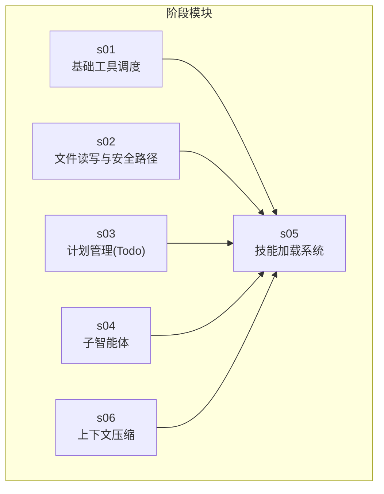
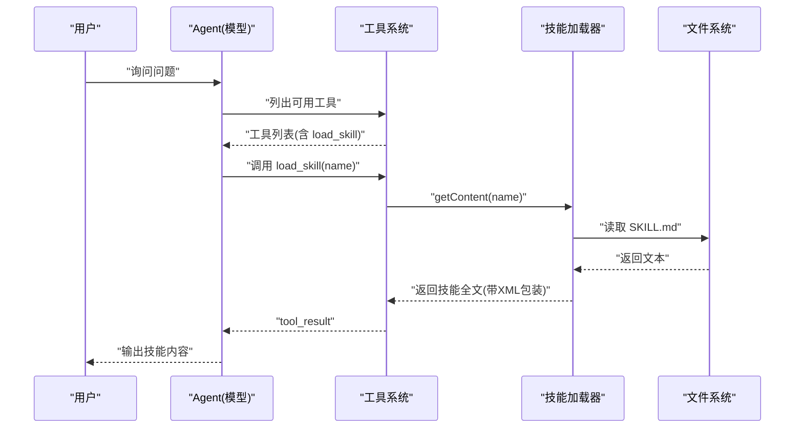
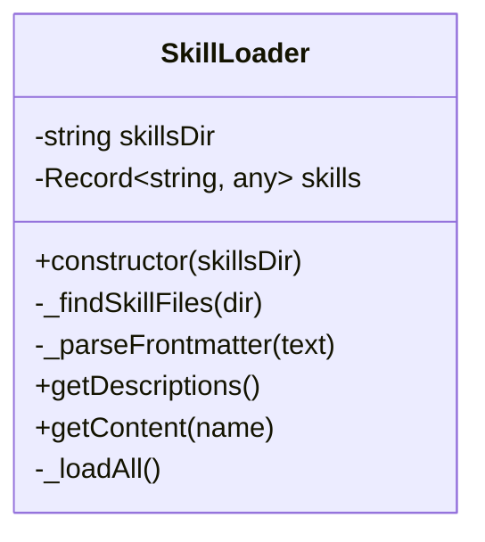
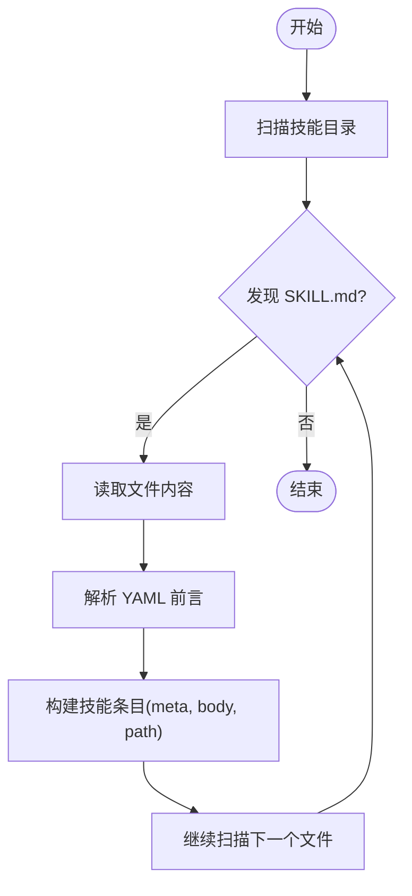
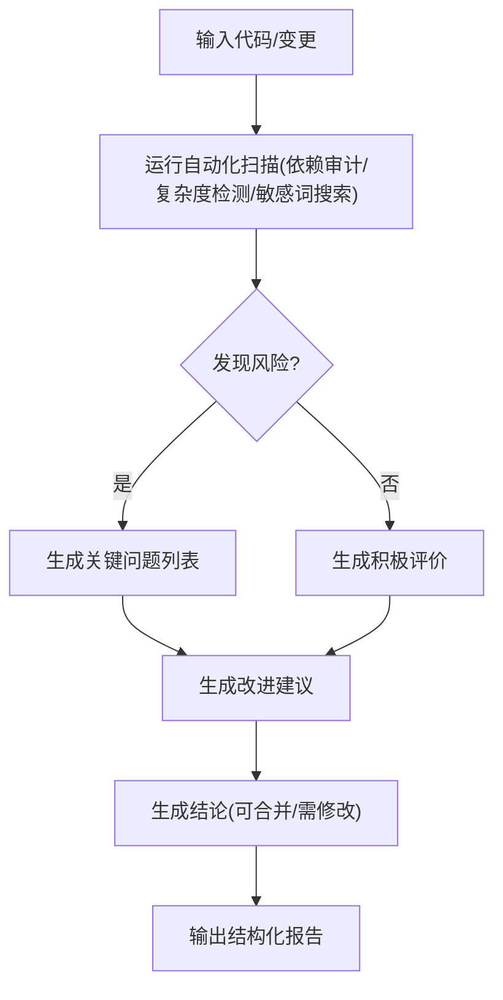
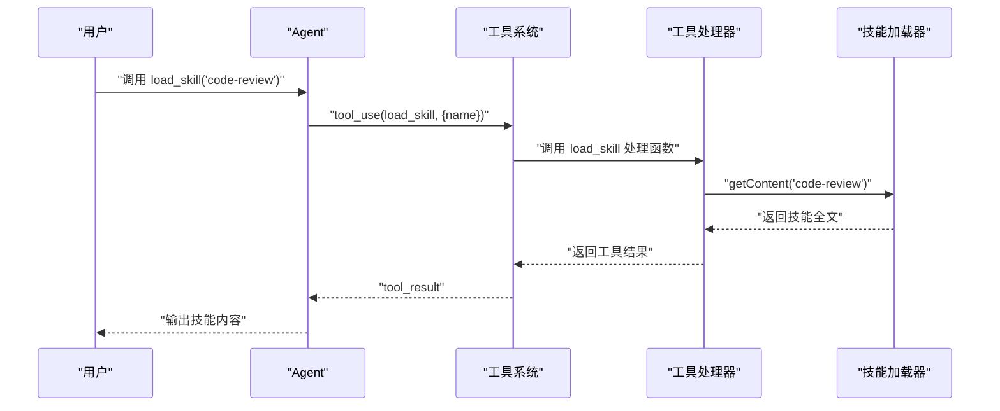
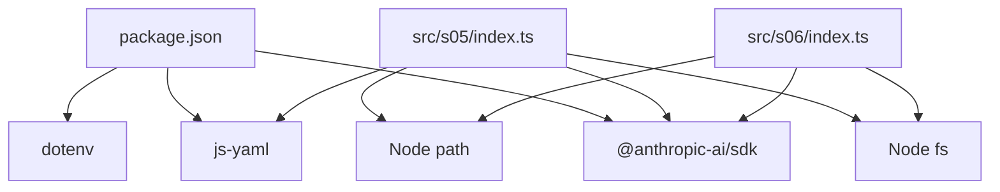

# 技能加载系统

<cite>
**本文档引用的文件**
- [README.md](file://README.md)
- [package.json](file://package.json)
- [src/s05/index.ts](file://src/s05/index.ts)
- [src/s05/skills/code-reviews/SKILL.md](file://src/s05/skills/code-reviews/SKILL.md)
- [src/s01/index.ts](file://src/s01/index.ts)
- [src/s02/index.ts](file://src/s02/index.ts)
- [src/s03/index.ts](file://src/s03/index.ts)
- [src/s04/index.ts](file://src/s04/index.ts)
- [src/s06/index.ts](file://src/s06/index.ts)
- [learn-summary.md](file://learn-summary.md)
</cite>

## 目录
1. [简介](#简介)
2. [项目结构](#项目结构)
3. [核心组件](#核心组件)
4. [架构总览](#架构总览)
5. [详细组件分析](#详细组件分析)
6. [依赖关系分析](#依赖关系分析)
7. [性能考量](#性能考量)
8. [故障排查指南](#故障排查指南)
9. [结论](#结论)
10. [附录](#附录)

## 简介
本项目实现了一个“技能加载系统”，通过在运行时按需加载技能（Skill）来增强模型的能力。技能以 Markdown 文件形式组织，采用 YAML 前言元数据（frontmatter）描述技能的基本信息，正文部分为技能的完整知识内容。系统通过 Anthropic 的 API 与模型交互，提供工具调用能力，其中包含一个专门用于加载技能的工具。该系统支持：
- 动态扫描技能目录，解析 YAML 前言元数据
- 将技能元数据注入系统提示，供模型选择加载
- 按需加载技能全文，作为工具结果返回给模型
- 安全路径限制，防止路径逃逸
- 多阶段上下文压缩，避免上下文过长

本系统是“一步步实现的最小 ClaudeCode”的一部分，展示了如何在实际工程中实现“按需知识”和“渐进式提示”。

**章节来源**
- [README.md:1-3](file://README.md#L1-L3)
- [learn-summary.md:38-47](file://learn-summary.md#L38-L47)

## 项目结构
仓库采用模块化结构，每个子目录代表一个阶段性的功能演示（s01 到 s06），其中 s05 展示了技能加载系统的核心实现；其他阶段展示了工具调度、计划管理、子智能体、上下文压缩等能力。

**图表来源**
- [src/s01/index.ts:1-158](file://src/s01/index.ts#L1-L158)
- [src/s02/index.ts:1-213](file://src/s02/index.ts#L1-L213)
- [src/s03/index.ts:1-335](file://src/s03/index.ts#L1-L335)
- [src/s04/index.ts:1-314](file://src/s04/index.ts#L1-L314)
- [src/s05/index.ts:1-332](file://src/s05/index.ts#L1-L332)
- [src/s06/index.ts:1-413](file://src/s06/index.ts#L1-L413)

**章节来源**
- [src/s01/index.ts:1-158](file://src/s01/index.ts#L1-L158)
- [src/s02/index.ts:1-213](file://src/s02/index.ts#L1-L213)
- [src/s03/index.ts:1-335](file://src/s03/index.ts#L1-L335)
- [src/s04/index.ts:1-314](file://src/s04/index.ts#L1-L314)
- [src/s05/index.ts:1-332](file://src/s05/index.ts#L1-L332)
- [src/s06/index.ts:1-413](file://src/s06/index.ts#L1-L413)

## 核心组件
- 技能加载器（SkillLoader）
  - 负责扫描技能目录，解析 YAML 前言元数据，构建技能索引
  - 提供技能描述列表（用于系统提示）和技能全文（用于工具结果）
- 工具系统
  - 包含 bash、read_file、write_file、edit_file、load_skill 等工具
  - load_skill 工具调用技能加载器返回技能全文
- 安全路径检查
  - 所有文件操作均通过安全路径函数进行路径校验，防止路径逃逸
- 上下文管理
  - 在 s06 中实现了微压缩（保留最近工具结果）和自动压缩（转存并摘要）

**章节来源**
- [src/s05/index.ts:46-144](file://src/s05/index.ts#L46-L144)
- [src/s05/index.ts:234-254](file://src/s05/index.ts#L234-L254)
- [src/s05/index.ts:153-164](file://src/s05/index.ts#L153-L164)
- [src/s06/index.ts:82-138](file://src/s06/index.ts#L82-L138)
- [src/s06/index.ts:150-196](file://src/s06/index.ts#L150-L196)

## 架构总览
技能加载系统围绕“按需知识”展开，分为两层：
- 层 1：系统提示中的技能简述（名称、描述、标签）
- 层 2：按模型请求加载的技能全文（包装为 XML 样式的标记块）

**图表来源**
- [src/s05/index.ts:146-151](file://src/s05/index.ts#L146-L151)
- [src/s05/index.ts:133-141](file://src/s05/index.ts#L133-L141)
- [src/s05/index.ts:253-254](file://src/s05/index.ts#L253-L254)

## 详细组件分析

### 技能加载器（SkillLoader）
- 职责
  - 扫描技能目录，递归查找所有 SKILL.md 文件
  - 解析 YAML 前言元数据，提取技能名称、描述、标签等
  - 构建技能字典，支持按名称查询技能描述和全文
- 关键方法
  - _findSkillFiles：递归遍历目录，收集 SKILL.md 路径
  - _parseFrontmatter：使用正则匹配 YAML 前言，解析为对象
  - getDescriptions：生成系统提示中的技能简述列表
  - getContent：返回技能全文并包裹为工具结果格式
- 数据结构
  - skills：键为技能名，值包含 meta、body、path

**图表来源**
- [src/s05/index.ts:46-144](file://src/s05/index.ts#L46-L144)

**章节来源**
- [src/s05/index.ts:55-90](file://src/s05/index.ts#L55-L90)
- [src/s05/index.ts:92-108](file://src/s05/index.ts#L92-L108)
- [src/s05/index.ts:110-131](file://src/s05/index.ts#L110-L131)
- [src/s05/index.ts:133-141](file://src/s05/index.ts#L133-L141)

### 技能文件格式规范与前言元数据
- 文件位置
  - 技能文件统一命名为 SKILL.md，位于技能根目录下
- 前言元数据（YAML）
  - 必填字段：name（技能名称）
  - 建议字段：description（技能描述）、tags（标签）
- 内容组织
  - 正文为技能的完整知识内容，可包含多语言代码示例、检查清单、输出格式等
- 示例参考
  - 代码审查技能的 SKILL.md 展示了完整的结构：检查清单、输出格式、常见模式、命令等

**图表来源**
- [src/s05/index.ts:75-90](file://src/s05/index.ts#L75-L90)
- [src/s05/index.ts:92-108](file://src/s05/index.ts#L92-L108)
- [src/s05/skills/code-reviews/SKILL.md:1-157](file://src/s05/skills/code-reviews/SKILL.md#L1-L157)

**章节来源**
- [src/s05/skills/code-reviews/SKILL.md:1-157](file://src/s05/skills/code-reviews/SKILL.md#L1-L157)

### 代码审查技能实现原理
- 审查规则定义
  - 安全性：注入漏洞、认证授权问题、敏感数据暴露、加密问题、依赖漏洞
  - 正确性：逻辑错误、竞态条件、资源泄漏、异常处理、类型安全
  - 性能：N+1 查询、内存问题、阻塞操作、低效算法、缺失缓存
  - 可维护性：命名、复杂度、重复代码、死代码、注释质量
  - 测试：覆盖率、边界测试、外部依赖隔离、断言质量
- 代码分析算法
  - 该技能未内置代码静态分析算法，而是提供检查清单和输出格式，指导模型进行人工或自动化扫描
  - 提供常用命令（如依赖审计、复杂度检测、敏感词搜索）作为辅助
- 报告生成机制
  - 输出格式包含：摘要、关键问题、改进建议、积极评价、结论（是否可合并）
  - 使用结构化标题和编号，便于模型生成一致的报告

**图表来源**
- [src/s05/skills/code-reviews/SKILL.md:10-88](file://src/s05/skills/code-reviews/SKILL.md#L10-L88)
- [src/s05/skills/code-reviews/SKILL.md:130-157](file://src/s05/skills/code-reviews/SKILL.md#L130-L157)

**章节来源**
- [src/s05/skills/code-reviews/SKILL.md:10-88](file://src/s05/skills/code-reviews/SKILL.md#L10-L88)
- [src/s05/skills/code-reviews/SKILL.md:130-157](file://src/s05/skills/code-reviews/SKILL.md#L130-L157)

### 自定义技能开发指南
- 技能模板
  - 创建目录并在其中放置 SKILL.md
  - 在 YAML 前言中设置 name、description、tags
  - 在正文编写技能知识，建议包含：检查清单、输出格式、常见模式、命令
- 最佳实践
  - 使用清晰的标题层级和编号，便于模型解析
  - 提供具体示例（代码片段）和反例对比
  - 明确输出格式，减少模型生成偏差
  - 提供辅助命令，帮助快速定位问题
- 调试方法
  - 验证 YAML 前言语法正确性
  - 使用系统提示查看技能是否被识别
  - 通过 load_skill(name) 获取技能全文，确认内容是否符合预期
  - 检查技能目录结构是否符合“根目录/技能名/SKILL.md”

**章节来源**
- [src/s05/index.ts:110-131](file://src/s05/index.ts#L110-L131)
- [src/s05/index.ts:133-141](file://src/s05/index.ts#L133-L141)
- [learn-summary.md:38-47](file://learn-summary.md#L38-L47)

### API 接口与扩展机制
- 工具接口
  - load_skill：按名称加载技能全文
    - 输入：name（字符串）
    - 输出：技能正文（XML 包装）
  - 其他工具：bash、read_file、write_file、edit_file
- 扩展机制
  - 新增工具：在工具列表中添加新工具定义，并在工具处理器映射中注册处理函数
  - 新增技能：在技能目录下新增 SKILL.md，系统自动发现并加载
  - 新增系统提示注入：在系统提示中加入技能描述列表（由技能加载器提供）

**图表来源**
- [src/s05/index.ts:234-254](file://src/s05/index.ts#L234-L254)
- [src/s05/index.ts:133-141](file://src/s05/index.ts#L133-L141)

**章节来源**
- [src/s05/index.ts:234-254](file://src/s05/index.ts#L234-L254)
- [src/s05/index.ts:146-151](file://src/s05/index.ts#L146-L151)

## 依赖关系分析
- 外部依赖
  - @anthropic-ai/sdk：调用 Claude API
  - js-yaml：解析 YAML 前言
  - dotenv：加载环境变量
- 内部模块
  - 技能加载器依赖文件系统读取和 YAML 解析
  - 工具系统依赖 Anthropic SDK 发送消息和接收工具调用
  - 上下文压缩模块依赖文件系统写入和模型摘要

**图表来源**
- [package.json:13-23](file://package.json#L13-L23)
- [src/s05/index.ts:25-27](file://src/s05/index.ts#L25-L27)
- [src/s06/index.ts:31-34](file://src/s06/index.ts#L31-L34)

**章节来源**
- [package.json:13-23](file://package.json#L13-L23)
- [src/s05/index.ts:25-27](file://src/s05/index.ts#L25-L27)
- [src/s06/index.ts:31-34](file://src/s06/index.ts#L31-L34)

## 性能考量
- 技能加载
  - 仅在首次启动时扫描技能目录，后续按需加载，避免重复 IO
  - YAML 解析失败时降级为空元数据，保证稳定性
- 工具调用
  - 严格限制工具调用顺序和字段，减少无效往返
- 上下文控制
  - 微压缩：每轮清理旧工具结果，仅保留最近若干条
  - 自动压缩：超过阈值时保存转录并摘要，大幅降低 token 使用

**章节来源**
- [src/s05/index.ts:55-73](file://src/s05/index.ts#L55-L73)
- [src/s06/index.ts:82-138](file://src/s06/index.ts#L82-L138)
- [src/s06/index.ts:150-196](file://src/s06/index.ts#L150-L196)

## 故障排查指南
- 路径逃逸
  - 现象：访问文件时报错“路径逃逸”
  - 原因：传入路径超出工作区范围
  - 处理：确保路径相对工作区，使用安全路径函数
- YAML 前言解析失败
  - 现象：技能未显示描述或标签为空
  - 原因：前言格式不合法
  - 处理：修正 YAML 语法，确保前后分隔符正确
- 未知技能名称
  - 现象：load_skill 返回错误提示
  - 原因：技能名不存在或拼写错误
  - 处理：核对技能目录结构和名称
- 工具调用错误
  - 现象：工具返回错误信息
  - 处理：检查工具输入参数、权限和命令可用性

**章节来源**
- [src/s05/index.ts:153-164](file://src/s05/index.ts#L153-L164)
- [src/s05/index.ts:92-108](file://src/s05/index.ts#L92-L108)
- [src/s05/index.ts:133-141](file://src/s05/index.ts#L133-L141)
- [src/s06/index.ts:254-266](file://src/s06/index.ts#L254-L266)

## 结论
技能加载系统通过“按需知识”的方式，有效缓解了提示长度和上下文压力，同时提供了结构化的知识组织与注入机制。其核心在于：
- 统一的技能文件格式（YAML 前言 + 正文）
- 自动化的技能发现与解析
- 安全的路径控制与工具调用
- 渐进式上下文压缩与管理

该系统为后续扩展（如自定义工具、更多技能、子智能体协作）奠定了坚实基础。

[无章节来源：本节为总结性内容]

## 附录
- 相关学习记录
  - 技能与记忆的区别、CLAUDE.md 全局规则
  - 多轮对话、工具协议、REACT 机制的重要性

**章节来源**
- [learn-summary.md:38-47](file://learn-summary.md#L38-L47)
- [learn-summary.md:48-51](file://learn-summary.md#L48-L51)