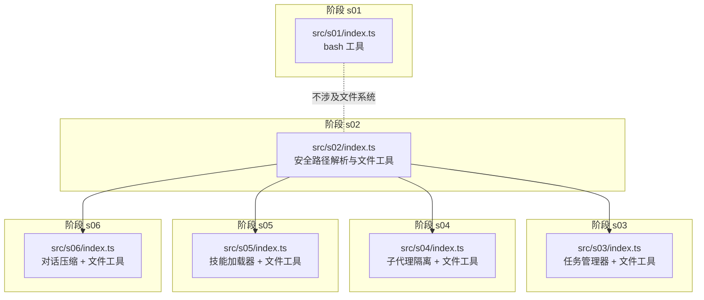
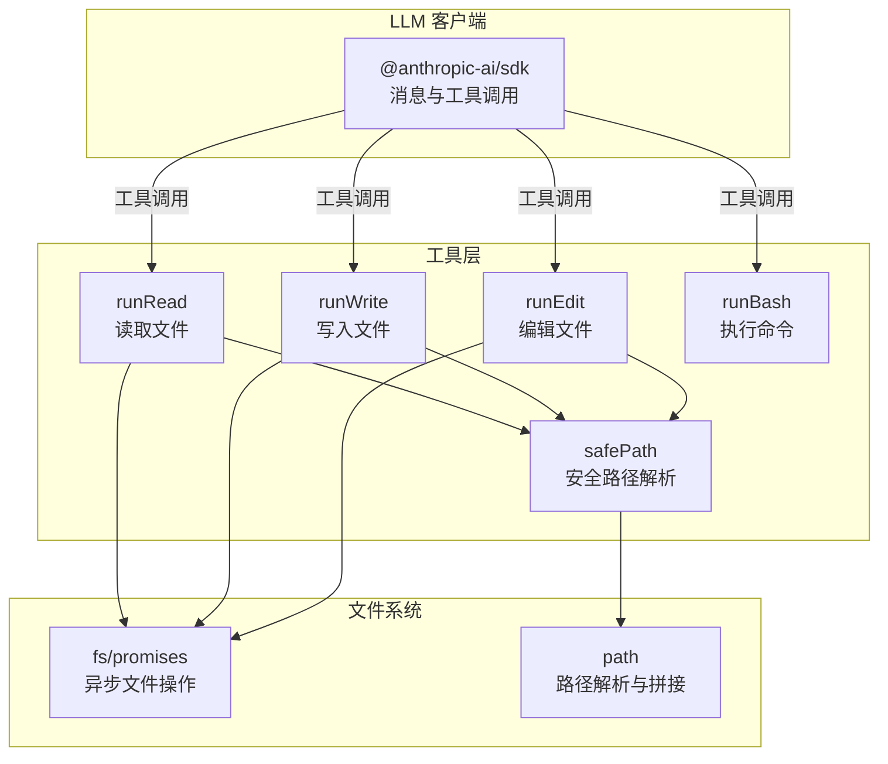
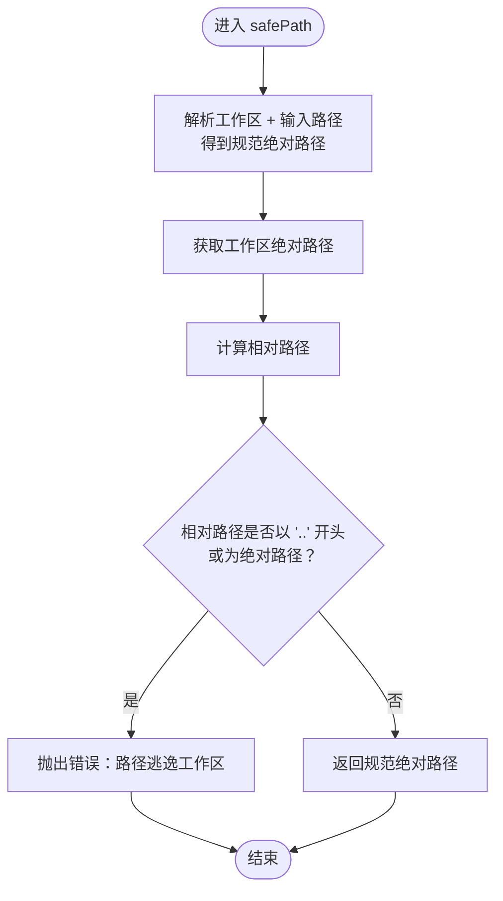
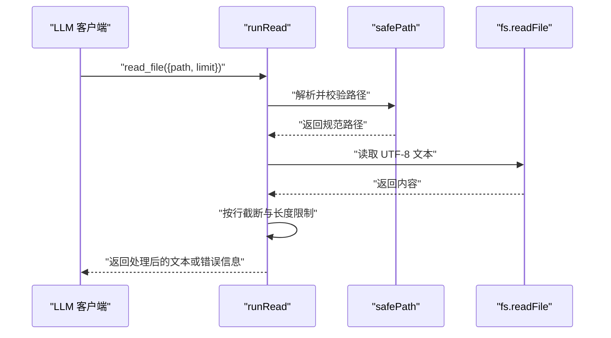
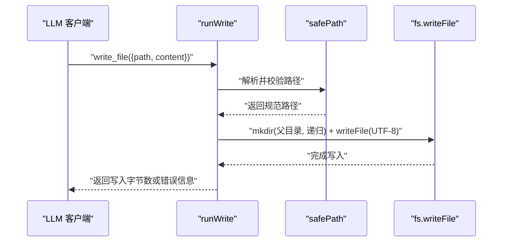
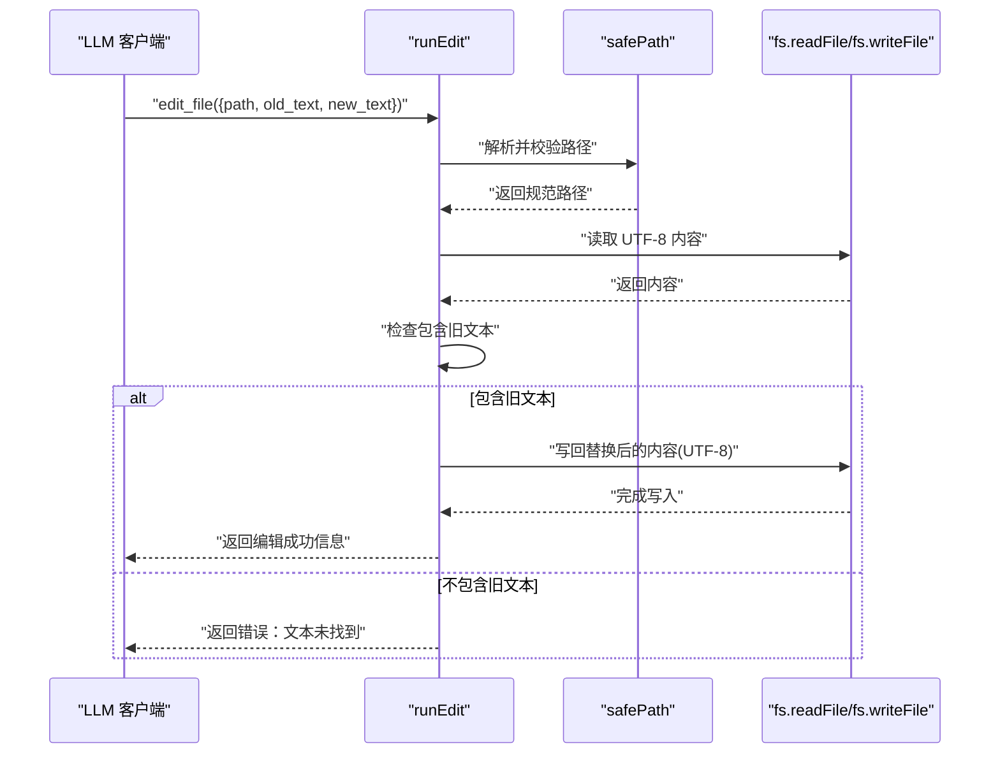
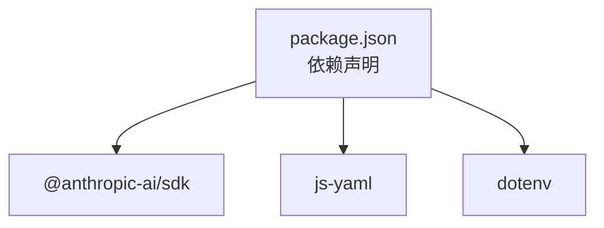

# 文件系统安全操作

<cite>
**本文档引用的文件**
- [README.md](file://README.md)
- [package.json](file://package.json)
- [src/s01/index.ts](file://src/s01/index.ts)
- [src/s02/index.ts](file://src/s02/index.ts)
- [src/s02/test.txt](file://src/s02/test.txt)
- [src/s02/greet.py](file://src/s02/greet.py)
- [src/s03/index.ts](file://src/s03/index.ts)
- [src/s04/index.ts](file://src/s04/index.ts)
- [src/s05/index.ts](file://src/s05/index.ts)
- [src/s05/skills/code-reviews/SKILL.md](file://src/s05/skills/code-reviews/SKILL.md)
- [src/s06/index.ts](file://src/s06/index.ts)
</cite>

## 目录
1. [简介](#简介)
2. [项目结构](#项目结构)
3. [核心组件](#核心组件)
4. [架构总览](#架构总览)
5. [详细组件分析](#详细组件分析)
6. [依赖关系分析](#依赖关系分析)
7. [性能考虑](#性能考虑)
8. [故障排除指南](#故障排除指南)
9. [结论](#结论)
10. [附录](#附录)

## 简介
本文件系统安全操作文档聚焦于安全路径解析与文件操作的实现，围绕安全路径解析函数 safePath 展开，系统性阐述其路径规范化、工作区边界检查与路径遍历攻击防范机制；同时深入说明文件读取、写入、编辑操作的安全实现，包括权限检查、文件大小限制与编码处理；并提供完整的 API 接口说明、参数验证规则、异常处理机制与错误码定义，辅以实际使用示例与安全最佳实践指南，帮助读者在不暴露真实文件系统边界的前提下安全地执行文件操作。

## 项目结构
该项目为一个逐步实现的“最小 Claude Code”系列，每个阶段（s01 到 s06）展示了不同的工程化能力，其中文件系统安全操作贯穿多个阶段：
- s02：基础工具实现，包含安全路径解析与文件读写编辑工具
- s03：引入任务管理器，保持与 s02 相同的文件系统安全策略
- s04：子代理隔离，沿用安全路径解析
- s05：技能加载器，扩展了文件系统访问范围但同样采用安全路径解析
- s06：对话压缩与持久化，保留安全路径解析
- s01：仅包含 bash 工具，不涉及文件系统操作

图表来源
- [src/s02/index.ts:1-213](file://src/s02/index.ts#L1-L213)
- [src/s03/index.ts:1-335](file://src/s03/index.ts#L1-L335)
- [src/s04/index.ts:1-314](file://src/s04/index.ts#L1-L314)
- [src/s05/index.ts:1-332](file://src/s05/index.ts#L1-L332)
- [src/s06/index.ts:1-413](file://src/s06/index.ts#L1-L413)
- [src/s01/index.ts:1-158](file://src/s01/index.ts#L1-L158)

章节来源
- [README.md:1-3](file://README.md#L1-L3)
- [package.json:1-25](file://package.json#L1-L25)

## 核心组件
本节聚焦安全路径解析函数 safePath 及其在文件读取、写入、编辑中的应用，以及相关的工具接口与异常处理机制。

- 安全路径解析函数 safePath
  - 功能：对输入路径进行规范化与边界检查，确保最终解析结果位于工作区目录之内，防止路径遍历攻击
  - 关键步骤：路径规范化、计算相对路径、判断是否逃逸工作区
  - 异常：当检测到逃逸时抛出错误
- 文件读取工具 runRead
  - 参数：文件路径、可选行数限制
  - 行为：读取 UTF-8 文本，按行截断，限制输出长度
  - 异常：捕获错误并返回错误信息字符串
- 文件写入工具 runWrite
  - 参数：文件路径、内容
  - 行为：确保父目录存在后写入 UTF-8 内容
  - 异常：捕获错误并返回错误信息字符串
- 文件编辑工具 runEdit
  - 参数：文件路径、旧文本、新文本
  - 行为：读取内容，若包含旧文本则替换并写回 UTF-8
  - 异常：捕获错误并返回错误信息字符串

章节来源
- [src/s02/index.ts:37-89](file://src/s02/index.ts#L37-L89)
- [src/s03/index.ts:137-190](file://src/s03/index.ts#L137-L190)
- [src/s04/index.ts:46-99](file://src/s04/index.ts#L46-L99)
- [src/s05/index.ts:153-205](file://src/s05/index.ts#L153-L205)
- [src/s06/index.ts:199-251](file://src/s06/index.ts#L199-L251)

## 架构总览
下图展示安全路径解析与文件工具在不同阶段的一致性与复用情况，以及与外部依赖的关系。

图表来源
- [src/s02/index.ts:11-18](file://src/s02/index.ts#L11-L18)
- [src/s03/index.ts:23-30](file://src/s03/index.ts#L23-L30)
- [src/s04/index.ts:18-25](file://src/s04/index.ts#L18-L25)
- [src/s05/index.ts:23-27](file://src/s05/index.ts#L23-L27)
- [src/s06/index.ts:27-34](file://src/s06/index.ts#L27-L34)

## 详细组件分析

### 安全路径解析函数 safePath 实现原理
- 路径规范化
  - 使用工作区根与输入路径进行解析，得到绝对规范路径
- 工作区边界检查
  - 计算规范路径相对于工作区的相对路径
  - 若相对路径以“..”开头或为绝对路径，则判定逃逸工作区
- 路径遍历攻击防范
  - 通过严格的相对路径判断，拒绝任何可能指向工作区外的路径
- 返回值
  - 成功时返回规范后的绝对路径；失败时抛出错误

图表来源
- [src/s02/index.ts:37-48](file://src/s02/index.ts#L37-L48)
- [src/s03/index.ts:137-149](file://src/s03/index.ts#L137-L149)
- [src/s04/index.ts:46-58](file://src/s04/index.ts#L46-L58)
- [src/s05/index.ts:153-164](file://src/s05/index.ts#L153-L164)
- [src/s06/index.ts:199-210](file://src/s06/index.ts#L199-L210)

章节来源
- [src/s02/index.ts:37-48](file://src/s02/index.ts#L37-L48)
- [src/s03/index.ts:137-149](file://src/s03/index.ts#L137-L149)
- [src/s04/index.ts:46-58](file://src/s04/index.ts#L46-L58)
- [src/s05/index.ts:153-164](file://src/s05/index.ts#L153-L164)
- [src/s06/index.ts:199-210](file://src/s06/index.ts#L199-L210)

### 文件读取工具 runRead 安全实现
- 参数与验证
  - path：必需，字符串，作为安全路径解析的输入
  - limit：可选，整数，用于限制输出行数
- 处理流程
  - 使用 safePath 对路径进行边界检查
  - 以 UTF-8 读取文件内容
  - 按行分割，必要时截断并追加剩余行提示
  - 限制输出长度，避免过大响应
- 异常处理
  - 捕获所有错误并返回错误信息字符串

图表来源
- [src/s02/index.ts:50-63](file://src/s02/index.ts#L50-L63)
- [src/s03/index.ts:151-164](file://src/s03/index.ts#L151-L164)
- [src/s04/index.ts:60-73](file://src/s04/index.ts#L60-L73)
- [src/s05/index.ts:166-179](file://src/s05/index.ts#L166-L179)
- [src/s06/index.ts:212-225](file://src/s06/index.ts#L212-L225)

章节来源
- [src/s02/index.ts:50-63](file://src/s02/index.ts#L50-L63)
- [src/s03/index.ts:151-164](file://src/s03/index.ts#L151-L164)
- [src/s04/index.ts:60-73](file://src/s04/index.ts#L60-L73)
- [src/s05/index.ts:166-179](file://src/s05/index.ts#L166-L179)
- [src/s06/index.ts:212-225](file://src/s06/index.ts#L212-L225)

### 文件写入工具 runWrite 安全实现
- 参数与验证
  - path：必需，字符串
  - content：必需，字符串
- 处理流程
  - 使用 safePath 对路径进行边界检查
  - 确保父目录存在（递归创建）
  - 以 UTF-8 写入内容
- 异常处理
  - 捕获所有错误并返回错误信息字符串

图表来源
- [src/s02/index.ts:65-74](file://src/s02/index.ts#L65-L74)
- [src/s03/index.ts:166-175](file://src/s03/index.ts#L166-L175)
- [src/s04/index.ts:75-84](file://src/s04/index.ts#L75-L84)
- [src/s05/index.ts:181-190](file://src/s05/index.ts#L181-L190)
- [src/s06/index.ts:227-236](file://src/s06/index.ts#L227-L236)

章节来源
- [src/s02/index.ts:65-74](file://src/s02/index.ts#L65-L74)
- [src/s03/index.ts:166-175](file://src/s03/index.ts#L166-L175)
- [src/s04/index.ts:75-84](file://src/s04/index.ts#L75-L84)
- [src/s05/index.ts:181-190](file://src/s05/index.ts#L181-L190)
- [src/s06/index.ts:227-236](file://src/s06/index.ts#L227-L236)

### 文件编辑工具 runEdit 安全实现
- 参数与验证
  - path：必需，字符串
  - old_text：必需，字符串（精确匹配）
  - new_text：必需，字符串
- 处理流程
  - 使用 safePath 对路径进行边界检查
  - 读取 UTF-8 内容
  - 检查是否包含旧文本，若不包含则返回错误
  - 替换后写回 UTF-8
- 异常处理
  - 捕获所有错误并返回错误信息字符串

图表来源
- [src/s02/index.ts:76-89](file://src/s02/index.ts#L76-L89)
- [src/s03/index.ts:177-190](file://src/s03/index.ts#L177-L190)
- [src/s04/index.ts:86-99](file://src/s04/index.ts#L86-L99)
- [src/s05/index.ts:192-205](file://src/s05/index.ts#L192-L205)
- [src/s06/index.ts:238-251](file://src/s06/index.ts#L238-L251)

章节来源
- [src/s02/index.ts:76-89](file://src/s02/index.ts#L76-L89)
- [src/s03/index.ts:177-190](file://src/s03/index.ts#L177-L190)
- [src/s04/index.ts:86-99](file://src/s04/index.ts#L86-L99)
- [src/s05/index.ts:192-205](file://src/s05/index.ts#L192-L205)
- [src/s06/index.ts:238-251](file://src/s06/index.ts#L238-L251)

### API 接口说明
- read_file
  - 描述：读取文件内容
  - 输入模式：{"type":"object","properties":{"path":{"type":"string"},"limit":{"type":"integer"}},"required":["path"]}
  - 输出：文本内容或错误信息字符串
- write_file
  - 描述：向文件写入内容
  - 输入模式：{"type":"object","properties":{"path":{"type":"string"},"content":{"type":"string"}},"required":["path","content"]}
  - 输出：写入字节数或错误信息字符串
- edit_file
  - 描述：在文件中替换精确文本
  - 输入模式：{"type":"object","properties":{"path":{"type":"string"},"old_text":{"type":"string"},"new_text":{"type":"string"}},"required":["path","old_text","new_text"]}
  - 输出：编辑结果或错误信息字符串
- bash（额外工具）
  - 描述：执行 shell 命令
  - 输入模式：{"type":"object","properties":{"command":{"type":"string"}},"required":["command"]}
  - 输出：命令输出或错误信息字符串

章节来源
- [src/s02/index.ts:118-127](file://src/s02/index.ts#L118-L127)
- [src/s03/index.ts:219-230](file://src/s03/index.ts#L219-L230)
- [src/s04/index.ts:136-146](file://src/s04/index.ts#L136-L146)
- [src/s05/index.ts:234-245](file://src/s05/index.ts#L234-L245)
- [src/s06/index.ts:280-291](file://src/s06/index.ts#L280-L291)

### 错误码与异常处理机制
- 路径逃逸错误
  - 触发条件：safePath 检测到相对路径以“..”开头或为绝对路径
  - 表现形式：抛出错误，工具层捕获并返回“Error: ...”格式字符串
- 文本未找到错误
  - 触发条件：edit_file 在内容中未找到旧文本
  - 表现形式：返回“Error: Text not found in ...”
- 其他文件系统错误
  - 触发条件：读取、写入、目录创建等过程中发生异常
  - 表现形式：捕获并返回“Error: ...”格式字符串

章节来源
- [src/s02/index.ts:42-44](file://src/s02/index.ts#L42-L44)
- [src/s02/index.ts:81-83](file://src/s02/index.ts#L81-L83)
- [src/s03/index.ts:142-145](file://src/s03/index.ts#L142-L145)
- [src/s03/index.ts:182-184](file://src/s03/index.ts#L182-L184)
- [src/s04/index.ts:51-54](file://src/s04/index.ts#L51-L54)
- [src/s04/index.ts:91-93](file://src/s04/index.ts#L91-L93)
- [src/s05/index.ts:157-160](file://src/s05/index.ts#L157-L160)
- [src/s05/index.ts:197-199](file://src/s05/index.ts#L197-L199)
- [src/s06/index.ts:203-206](file://src/s06/index.ts#L203-L206)
- [src/s06/index.ts:243-245](file://src/s06/index.ts#L243-L245)

### 实际使用示例
以下示例展示如何在不同阶段中安全地使用文件工具（以 s02 为例）：
- 读取文件
  - 输入：{"name":"read_file","input":{"path":"src/s02/test.txt","limit":10}}
  - 输出：文件内容（按行截断，限制长度），或错误信息字符串
- 写入文件
  - 输入：{"name":"write_file","input":{"path":"src/s02/test.txt","content":"新内容"}}
  - 输出：写入字节数，或错误信息字符串
- 编辑文件
  - 输入：{"name":"edit_file","input":{"path":"src/s02/test.txt","old_text":"旧文本","new_text":"新文本"}}
  - 输出：编辑结果，或错误信息字符串

章节来源
- [src/s02/index.ts:118-135](file://src/s02/index.ts#L118-L135)
- [src/s02/test.txt:1-1](file://src/s02/test.txt#L1-L1)

### 安全最佳实践指南
- 始终使用 safePath
  - 所有文件路径输入必须通过 safePath 解析与校验
- 严格限制输出大小
  - 读取工具默认限制输出长度，避免过大数据导致性能问题
- 精确文本替换
  - 使用 edit_file 时确保 old_text 精确匹配，避免意外替换
- 权限与可见性
  - 仅在需要时暴露文件工具，避免不必要的文件系统访问
- 日志与审计
  - 记录工具调用与错误信息，便于排查与审计

## 依赖关系分析
- 外部依赖
  - @anthropic-ai/sdk：用于与 LLM 交互，触发工具调用
  - js-yaml：用于解析技能文件的 YAML frontmatter（仅 s05）
  - dotenv：用于加载环境变量（如 API 密钥）
- 内部依赖
  - path：路径解析与拼接
  - fs/promises：异步文件系统操作
  - child_process：执行 shell 命令

图表来源
- [package.json:13-23](file://package.json#L13-L23)

章节来源
- [package.json:1-25](file://package.json#L1-L25)

## 性能考虑
- 输出长度限制
  - 读取工具对输出进行长度限制，避免大文件导致内存与带宽压力
- 行数限制
  - 通过 limit 参数控制行数，减少不必要的处理
- 递归目录创建
  - 写入前确保父目录存在，避免多次失败重试
- 命令超时
  - bash 工具设置超时，防止长时间阻塞

## 故障排除指南
- 路径逃逸错误
  - 现象：返回“Error: Path escapes workspace: ...”
  - 排查：确认输入路径未包含“..”或绝对路径
- 文本未找到
  - 现象：返回“Error: Text not found in ...”
  - 排查：确认旧文本与文件内容完全一致（区分大小写与空白字符）
- 文件读取失败
  - 现象：返回“Error: ...”
  - 排查：检查文件是否存在、权限是否足够、编码是否为 UTF-8
- 写入失败
  - 现象：返回“Error: ...”
  - 排查：检查目标路径父目录权限、磁盘空间、文件是否被占用

章节来源
- [src/s02/index.ts:42-44](file://src/s02/index.ts#L42-L44)
- [src/s02/index.ts:81-83](file://src/s02/index.ts#L81-L83)
- [src/s03/index.ts:142-145](file://src/s03/index.ts#L142-L145)
- [src/s03/index.ts:182-184](file://src/s03/index.ts#L182-L184)
- [src/s04/index.ts:51-54](file://src/s04/index.ts#L51-L54)
- [src/s04/index.ts:91-93](file://src/s04/index.ts#L91-L93)
- [src/s05/index.ts:157-160](file://src/s05/index.ts#L157-L160)
- [src/s05/index.ts:197-199](file://src/s05/index.ts#L197-L199)
- [src/s06/index.ts:203-206](file://src/s06/index.ts#L203-L206)
- [src/s06/index.ts:243-245](file://src/s06/index.ts#L243-L245)

## 结论
本项目通过统一的安全路径解析与严格的文件操作策略，在保障功能可用的同时有效防范了路径遍历攻击与越权访问风险。结合输出长度限制、精确文本替换与完善的异常处理机制，形成了稳定、可维护且安全的文件系统操作体系。建议在生产环境中持续遵循安全最佳实践，并根据具体场景进一步增强权限控制与审计能力。

## 附录
- 相关文件
  - 示例文件：src/s02/test.txt、src/s02/greet.py
  - 技能文件：src/s05/skills/code-reviews/SKILL.md

章节来源
- [src/s02/test.txt:1-1](file://src/s02/test.txt#L1-L1)
- [src/s02/greet.py:1-12](file://src/s02/greet.py#L1-L12)
- [src/s05/skills/code-reviews/SKILL.md:1-157](file://src/s05/skills/code-reviews/SKILL.md#L1-L157)