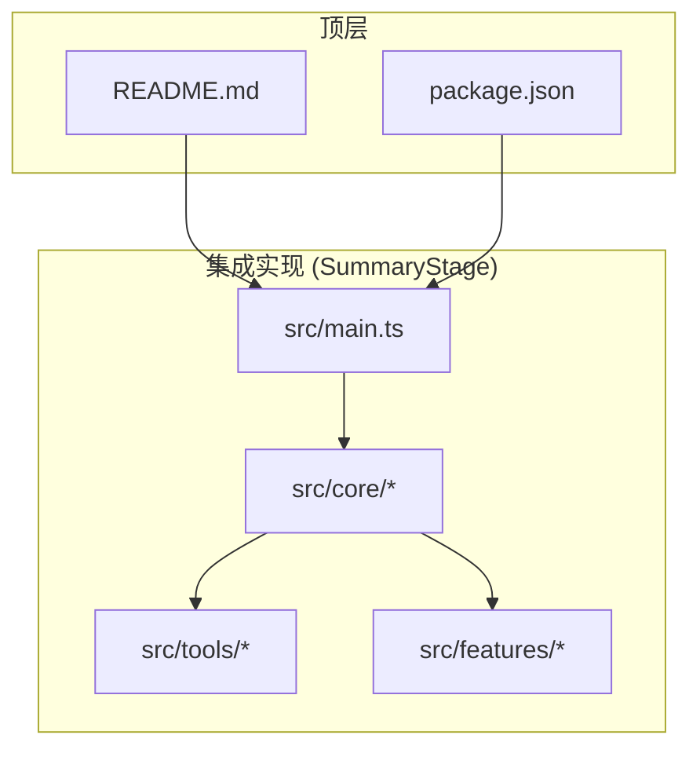
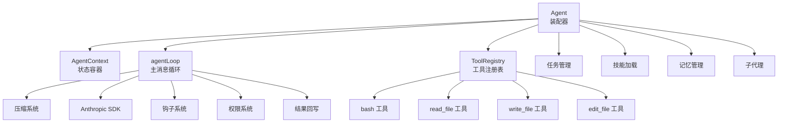
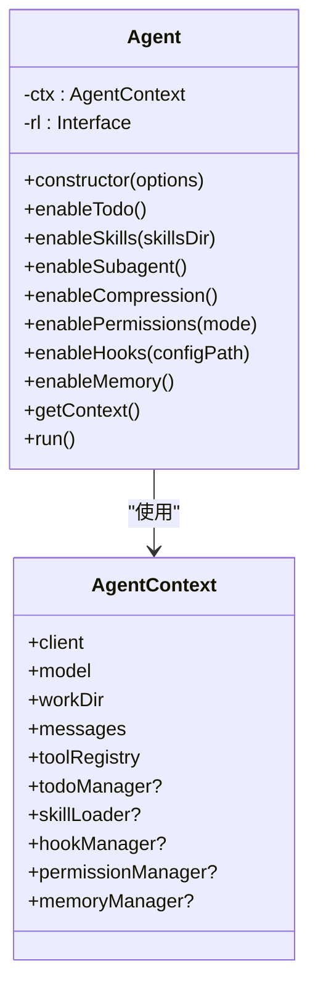
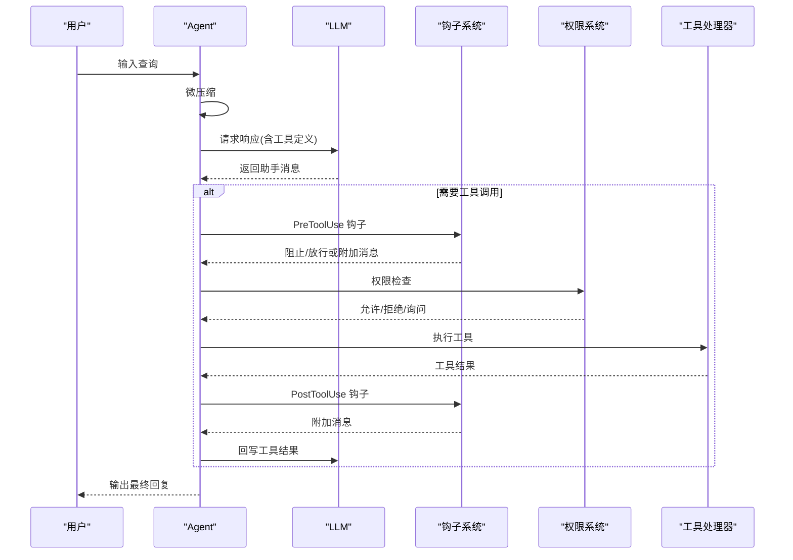
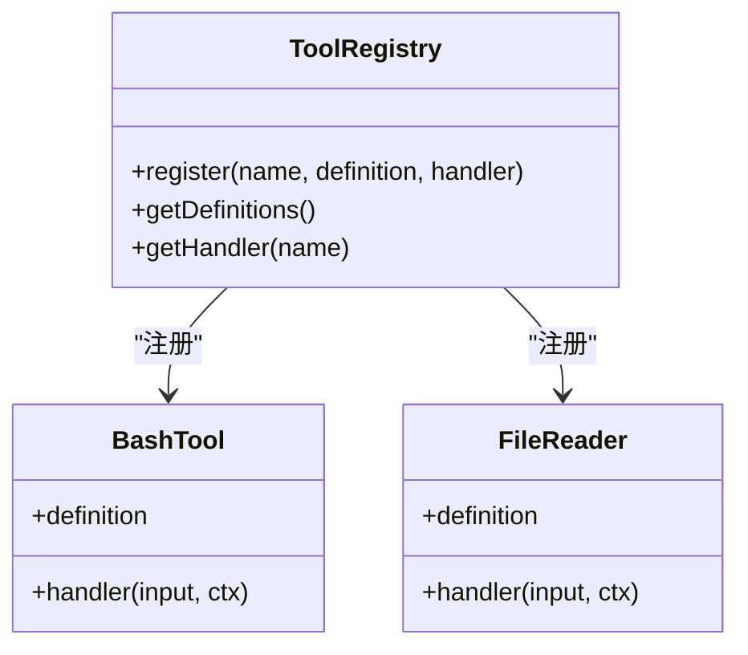
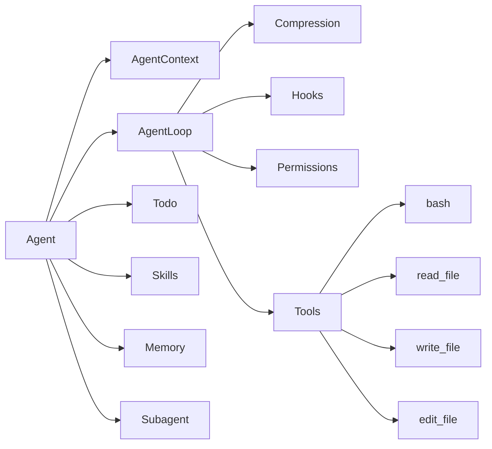

# 智能代理系统

<cite>
**本文档引用的文件**
- [README.md](file://README.md)
- [package.json](file://package.json)
- [SummaryStage/package.json](file://SummaryStage/package.json)
- [src/main.ts](file://SummaryStage/src/main.ts)
- [src/core/agent.ts](file://SummaryStage/src/core/agent.ts)
- [src/core/context.ts](file://SummaryStage/src/core/context.ts)
- [src/core/agent-loop.ts](file://SummaryStage/src/core/agent-loop.ts)
- [src/core/types.ts](file://SummaryStage/src/core/types.ts)
- [src/tools/index.ts](file://SummaryStage/src/tools/index.ts)
- [src/tools/bash.ts](file://SummaryStage/src/tools/bash.ts)
- [src/tools/file-read.ts](file://SummaryStage/src/tools/file-read.ts)
- [src/features/todo/todo-manager.ts](file://SummaryStage/src/features/todo/todo-manager.ts)
- [src/features/skills/skill-loader.ts](file://SummaryStage/src/features/skills/skill-loader.ts)
- [src/features/memory/memory-manager.ts](file://SummaryStage/src/features/memory/memory-manager.ts)
- [src/features/compression/compression.ts](file://SummaryStage/src/features/compression/compression.ts)
- [src/features/hooks/hook-manager.ts](file://SummaryStage/src/features/hooks/hook-manager.ts)
- [src/features/permissions/permission-manager.ts](file://SummaryStage/src/features/permissions/permission-manager.ts)
- [src/features/subagent/subagent.ts](file://SummaryStage/src/features/subagent/subagent.ts)
</cite>

## 目录
1. [简介](#简介)
2. [项目结构](#项目结构)
3. [核心组件](#核心组件)
4. [架构总览](#架构总览)
5. [详细组件分析](#详细组件分析)
6. [依赖关系分析](#依赖关系分析)
7. [性能考虑](#性能考虑)
8. [故障排除指南](#故障排除指南)
9. [结论](#结论)

## 简介
本项目是一个逐步实现的最小化 Claude Code 智能代理系统，提供一体化的 AI 代理框架。系统以模块化设计为核心，支持对话压缩、权限控制、钩子扩展、技能加载、任务管理、子代理协作与持久记忆等功能。通过统一的 Agent 上下文，各功能模块可按需启用，并在 REPL 交互界面中协同工作。

## 项目结构
项目采用分层与功能模块化的组织方式：
- 根目录包含顶层说明与通用配置
- SummaryStage 目录为集成后的主实现，包含核心 Agent、工具、功能模块与构建脚本
- src/s01 到 s10 目录展示阶段性实现，便于理解演进过程

**图表来源**
- [src/main.ts:1-39](file://SummaryStage/src/main.ts#L1-L39)
- [package.json:1-25](file://package.json#L1-L25)
- [SummaryStage/package.json:1-26](file://SummaryStage/package.json#L1-L26)

**章节来源**
- [README.md:1-3](file://README.md#L1-L3)
- [package.json:1-25](file://package.json#L1-L25)
- [SummaryStage/package.json:1-26](file://SummaryStage/package.json#L1-L26)

## 核心组件
- Agent 组装器：负责创建上下文、注册基础工具、按需启用功能模块，并启动 REPL 循环
- AgentContext：统一的状态容器，承载客户端、模型、工作目录、消息历史与工具注册表
- Agent 主循环：实现压缩、LLM 推理、工具执行管道、权限与钩子处理、结果回写与手动压缩
- 工具系统：基础工具（bash、文件读写编辑）与工具注册表
- 功能模块：任务管理、技能加载、记忆管理、压缩、钩子、权限、子代理

**章节来源**
- [src/core/agent.ts:46-263](file://SummaryStage/src/core/agent.ts#L46-L263)
- [src/core/context.ts:22-80](file://SummaryStage/src/core/context.ts#L22-L80)
- [src/core/agent-loop.ts:70-277](file://SummaryStage/src/core/agent-loop.ts#L70-L277)
- [src/tools/index.ts:38-63](file://SummaryStage/src/tools/index.ts#L38-L63)

## 架构总览
系统采用"上下文驱动 + 功能模块化"的架构，Agent 作为装配器协调各模块；每个模块通过 AgentContext 共享状态，遵循可选接入的设计原则，新增模块无需修改核心循环。

**图表来源**
- [src/core/agent.ts:46-127](file://SummaryStage/src/core/agent.ts#L46-L127)
- [src/core/agent-loop.ts:70-112](file://SummaryStage/src/core/agent-loop.ts#L70-L112)
- [src/tools/index.ts:38-63](file://SummaryStage/src/tools/index.ts#L38-L63)

## 详细组件分析

### Agent 组件
职责与流程：
- 构造函数创建 AgentContext 并注册基础工具
- 提供 enableXxx() 方法启用各功能模块
- run() 启动 REPL 循环，支持 CLI 命令（退出、手动压缩、权限模式切换、查看规则、查看记忆）

**图表来源**
- [src/core/agent.ts:46-127](file://SummaryStage/src/core/agent.ts#L46-L127)
- [src/core/context.ts:22-48](file://SummaryStage/src/core/context.ts#L22-L48)

**章节来源**
- [src/core/agent.ts:46-263](file://SummaryStage/src/core/agent.ts#L46-L263)

### Agent 主消息循环
核心流程：
- 每轮执行微压缩
- 当 token 超阈值且冷却时间已过，触发自动压缩
- 调用 LLM 获取响应，回写助手消息
- 工具执行管道：PreToolUse 钩子 → 权限检查 → 处理器执行 → PostToolUse 钩子
- 若调用 compact 工具，执行手动压缩并提前结束

**图表来源**
- [src/core/agent-loop.ts:70-277](file://SummaryStage/src/core/agent-loop.ts#L70-L277)

**章节来源**
- [src/core/agent-loop.ts:70-277](file://SummaryStage/src/core/agent-loop.ts#L70-L277)

### 工具系统
- 基础工具注册：bash、read_file、write_file、edit_file
- 工具定义符合 Anthropic API 格式，处理器通过闭包绑定 AgentContext
- 工具执行时进行路径安全校验与输出大小限制

**图表来源**
- [src/tools/index.ts:38-63](file://SummaryStage/src/tools/index.ts#L38-L63)
- [src/tools/bash.ts:21-58](file://SummaryStage/src/tools/bash.ts#L21-L58)
- [src/tools/file-read.ts:19-63](file://SummaryStage/src/tools/file-read.ts#L19-L63)

**章节来源**
- [src/tools/index.ts:25-63](file://SummaryStage/src/tools/index.ts#L25-L63)
- [src/tools/bash.ts:18-58](file://SummaryStage/src/tools/bash.ts#L18-L58)
- [src/tools/file-read.ts:16-63](file://SummaryStage/src/tools/file-read.ts#L16-L63)

### 任务管理 (Todo)
- 管理多步骤任务的 todo 列表，最多 20 项，同一时间仅允许一项处于 in_progress
- 提供更新与渲染功能，输出人类可读的任务进度

**章节来源**
- [src/features/todo/todo-manager.ts:17-80](file://SummaryStage/src/features/todo/todo-manager.ts#L17-L80)

### 技能加载 (Skills)
- 扫描 skills 目录下的 SKILL.md 文件，解析 YAML Frontmatter
- 两层架构：元数据注入系统提示词；完整技能内容通过工具按需返回

**章节来源**
- [src/features/skills/skill-loader.ts:18-96](file://SummaryStage/src/features/skills/skill-loader.ts#L18-L96)

### 记忆管理 (Memory)
- 支持跨会话持久记忆，类型包括 user、feedback、project、reference
- 提供加载、保存、索引重建与系统提示词注入功能

**章节来源**
- [src/features/memory/memory-manager.ts:48-205](file://SummaryStage/src/features/memory/memory-manager.ts#L48-L205)

### 对话压缩 (Compression)
- 三级压缩：
  - 微压缩：每轮精简旧工具结果
  - 自动压缩：token 超阈值时用 LLM 总结旧对话
  - 手动压缩：通过 compact 工具触发
- 保留最近若干条消息，确保上下文连续性

**章节来源**
- [src/features/compression/compression.ts:26-166](file://SummaryStage/src/features/compression/compression.ts#L26-L166)

### 钩子系统 (Hooks)
- 支持 PreToolUse、PostToolUse、SessionStart 三类事件
- 通过外部命令执行，约定退出码与环境变量传递上下文
- 可阻止工具执行、注入消息或覆盖权限决策

**章节来源**
- [src/features/hooks/hook-manager.ts:41-217](file://SummaryStage/src/features/hooks/hook-manager.ts#L41-L217)

### 权限系统 (Permissions)
- 分层决策：基础 bash 安全检查 → deny 规则 → 模式检查 → allow 规则 → 询问用户
- 支持三种模式：default（默认）、plan（仅只读）、auto（自动）
- 提供规则匹配（glob 模式）与交互式确认

**章节来源**
- [src/features/permissions/permission-manager.ts:114-265](file://SummaryStage/src/features/permissions/permission-manager.ts#L114-L265)

### 子代理 (Subagent)
- 在独立上下文中执行子任务，共享父代理的客户端与工作目录
- 工具集受限，避免递归生成子代理
- 限制最大轮次，仅返回最终文本摘要

**章节来源**
- [src/features/subagent/subagent.ts:187-241](file://SummaryStage/src/features/subagent/subagent.ts#L187-L241)

## 依赖关系分析
模块间耦合与协作：
- Agent 依赖 AgentContext 与工具注册表
- AgentLoop 依赖压缩、钩子、权限与工具系统
- 各功能模块通过 AgentContext 可选接入，保持低耦合
- 工具处理器通过闭包访问 AgentContext，实现对工作目录与客户端的统一访问

**图表来源**
- [src/core/agent.ts:46-127](file://SummaryStage/src/core/agent.ts#L46-L127)
- [src/core/agent-loop.ts:70-112](file://SummaryStage/src/core/agent-loop.ts#L70-L112)
- [src/tools/index.ts:38-63](file://SummaryStage/src/tools/index.ts#L38-L63)

**章节来源**
- [src/core/agent.ts:46-127](file://SummaryStage/src/core/agent.ts#L46-L127)
- [src/core/agent-loop.ts:70-112](file://SummaryStage/src/core/agent-loop.ts#L70-L112)

## 性能考虑
- Token 估算与压缩：通过粗略估算字符长度换算 token，结合微压缩与自动压缩降低上下文开销
- 输出大小限制：工具结果与 bash 输出设置最大缓冲与截断，避免内存膨胀
- 冷却机制：自动压缩触发后设置冷却时间，防止频繁压缩带来的额外成本
- 子代理轮次限制：防止长时间占用资源

[本节为通用指导，无需具体文件分析]

## 故障排除指南
常见问题与定位：
- 工具执行失败：检查工具处理器的错误返回与日志输出
- 权限拒绝：核对权限规则与模式，必要时切换到更宽松模式或添加允许规则
- 钩子超时/错误：检查外部命令执行环境与超时设置
- 记忆保存失败：确认记忆类型与文件名合法性
- 压缩异常：检查转录文件保存与 LLM 总结请求

**章节来源**
- [src/core/agent-loop.ts:231-233](file://SummaryStage/src/core/agent-loop.ts#L231-L233)
- [src/features/hooks/hook-manager.ts:204-211](file://SummaryStage/src/features/hooks/hook-manager.ts#L204-L211)
- [src/features/memory/memory-manager.ts:123-154](file://SummaryStage/src/features/memory/memory-manager.ts#L123-L154)

## 结论
该智能代理系统以模块化与可插拔为核心设计理念，通过统一的 AgentContext 与工具注册表实现各功能模块的灵活组合。系统在安全性（权限与钩子）、可维护性（对话压缩与记忆管理）与可扩展性（技能加载与子代理）方面提供了完整的解决方案，适合在本地开发环境中进行持续迭代与实验。