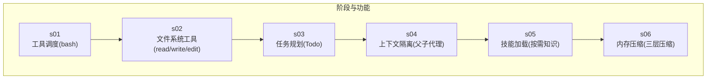
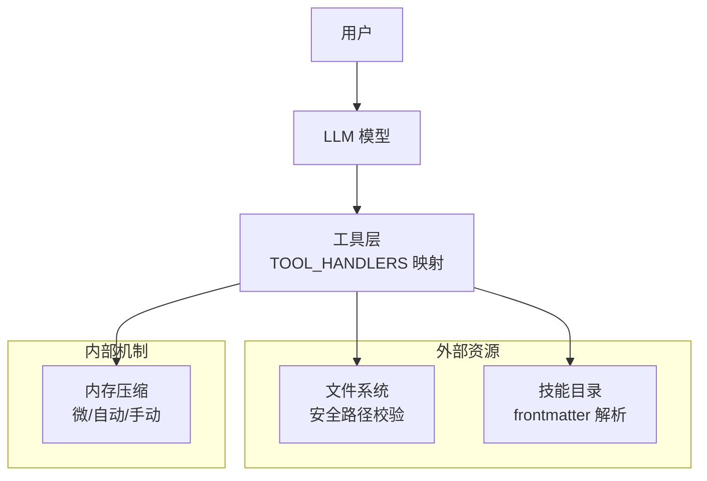
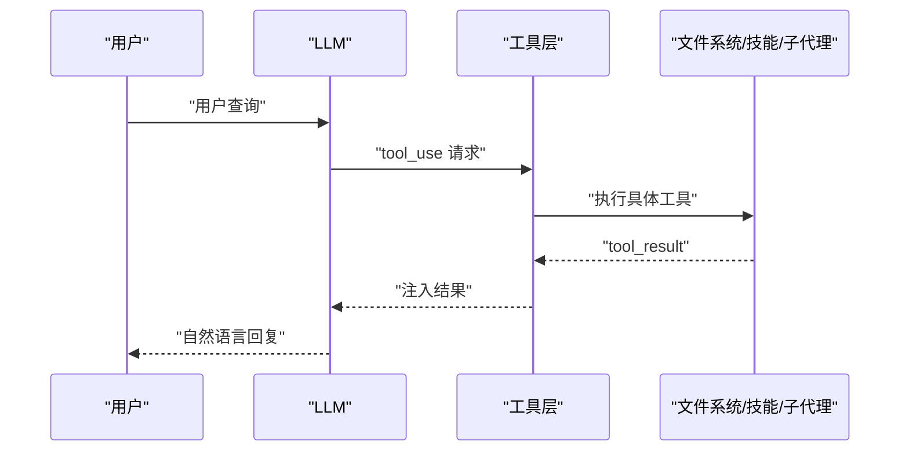
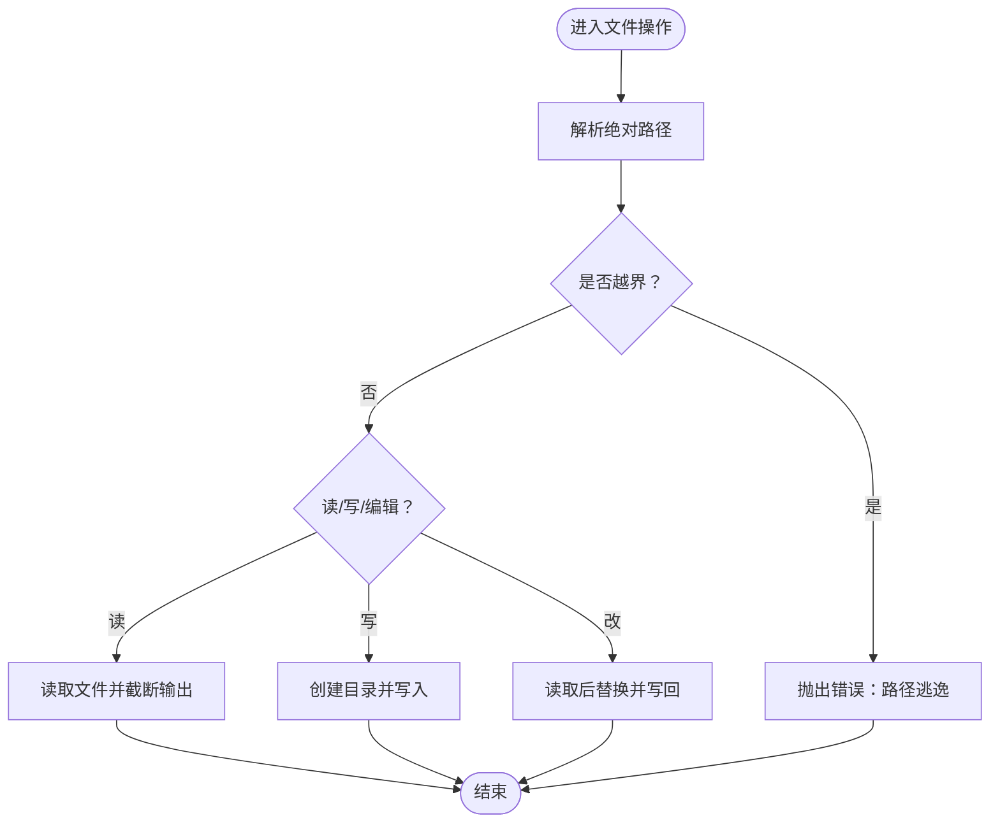
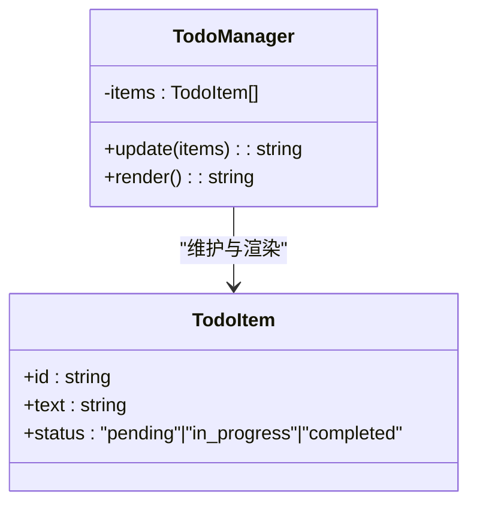
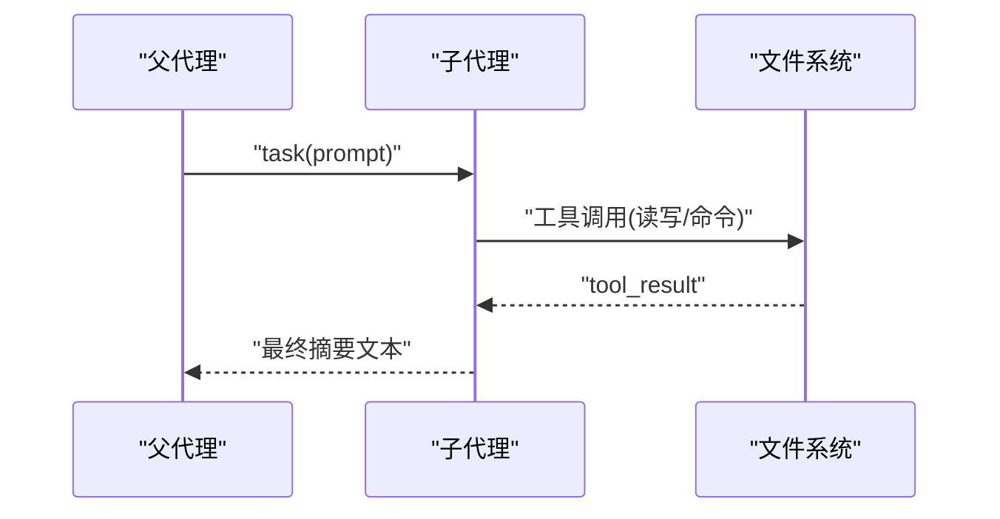
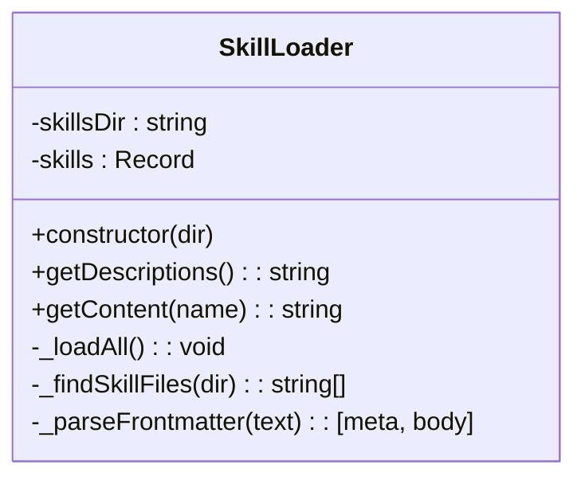
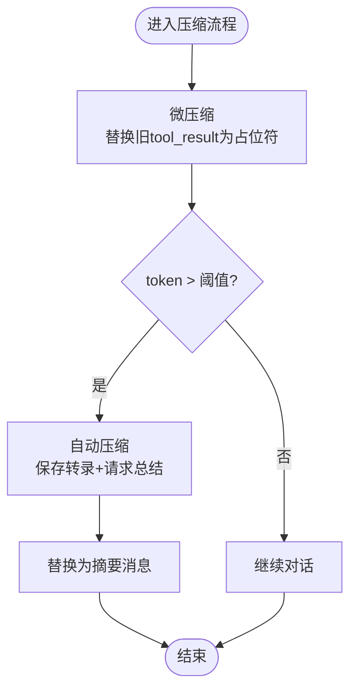
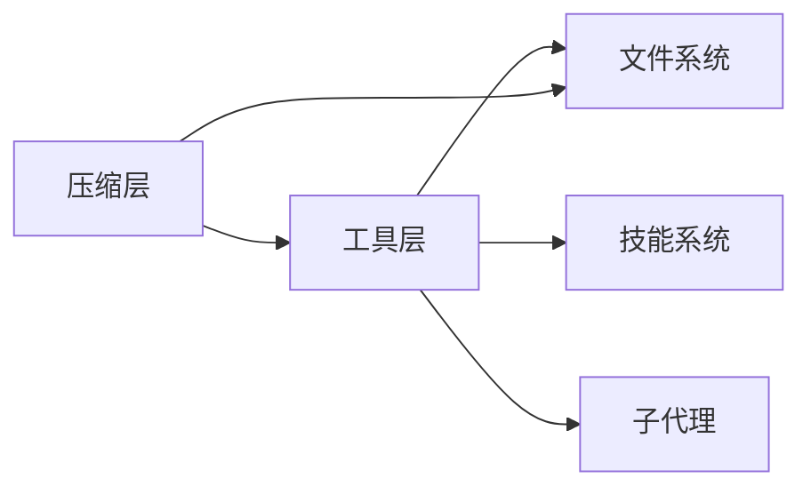

# 核心功能详解

<cite>
**本文引用的文件**
- [README.md](file://README.md)
- [package.json](file://package.json)
- [src/s01/index.ts](file://src/s01/index.ts)
- [src/s02/index.ts](file://src/s02/index.ts)
- [src/s03/index.ts](file://src/s03/index.ts)
- [src/s04/index.ts](file://src/s04/index.ts)
- [src/s05/index.ts](file://src/s05/index.ts)
- [src/s05/skills/code-reviews/SKILL.md](file://src/s05/skills/code-reviews/SKILL.md)
- [src/s06/index.ts](file://src/s06/index.ts)
- [src/s06/.transcripts/transcript_1777018931.jsonl](file://src/s06/.transcripts/transcript_1777018931.jsonl)
- [src/s03/test.js](file://src/s03/test.js)
- [src/s03/test2.js](file://src/s03/test2.js)
- [src/s03/return.js](file://src/s03/return.js)
</cite>

## 目录
1. [简介](#简介)
2. [项目结构](#项目结构)
3. [核心组件](#核心组件)
4. [架构总览](#架构总览)
5. [详细组件分析](#详细组件分析)
6. [依赖分析](#依赖分析)
7. [性能考虑](#性能考虑)
8. [故障排除指南](#故障排除指南)
9. [结论](#结论)
10. [附录](#附录)

## 简介
本项目通过一系列逐步实现的阶段（s01 到 s06），构建了一个围绕 Claude 模型的“最小可用代理”系统。其核心目标是：
- 工具调度系统：将模型的推理与外部工具（命令执行、文件读写、技能加载、对话压缩等）解耦，形成可扩展的工具层。
- 文件系统安全操作：通过路径解析与工作区边界校验，防止越权访问。
- 任务规划管理：引入 Todo 管理器，强制模型在多步任务中保持进度可见与可控。
- 上下文隔离架构：通过子代理与独立上下文，避免历史信息污染主流程。
- 技能加载系统：按需加载“技能”知识，支持元数据描述与正文内容两层注入。
- 内存压缩机制：分层压缩策略（微压缩、自动压缩、手动压缩），保障长会话稳定性。

本文件面向不同技术背景读者，提供从高层架构到代码级细节的全面解读，并给出性能优化建议与最佳实践。

## 项目结构
项目采用按阶段组织的目录结构，每个阶段在 src/sXX 下实现特定能力：
- s01：基础工具调度（仅 bash）
- s02：扩展文件系统工具（read/write/edit）
- s03：任务规划（Todo 管理器与提醒机制）
- s04：上下文隔离（父代理与子代理）
- s05：技能加载系统（frontmatter 元数据 + 正文）
- s06：内存压缩（微压缩 + 自动压缩 + 手动压缩）

图表来源
- [src/s01/index.ts:1-158](file://src/s01/index.ts#L1-L158)
- [src/s02/index.ts:1-213](file://src/s02/index.ts#L1-L213)
- [src/s03/index.ts:1-335](file://src/s03/index.ts#L1-L335)
- [src/s04/index.ts:1-314](file://src/s04/index.ts#L1-L314)
- [src/s05/index.ts:1-332](file://src/s05/index.ts#L1-L332)
- [src/s06/index.ts:1-413](file://src/s06/index.ts#L1-L413)

章节来源
- [README.md:1-3](file://README.md#L1-L3)
- [package.json:1-25](file://package.json#L1-L25)

## 核心组件
本节概述六大核心能力及其职责边界：
- 工具调度系统：定义工具清单、输入模式与处理器映射，负责将模型的 tool_use 分发给具体实现。
- 文件系统安全操作：统一的安全路径解析与工作区边界校验，保障只在允许范围内进行文件读写。
- 任务规划管理：Todo 管理器负责校验与渲染任务列表，配合“回合计数提醒”维持模型的自我监督。
- 上下文隔离架构：父代理负责总体协调，子代理拥有独立上下文，仅返回最终摘要，避免上下文污染。
- 技能加载系统：扫描技能目录，解析 frontmatter 元数据，按需返回完整技能正文。
- 内存压缩机制：三层压缩策略（微压缩、自动压缩、手动压缩），在不丢失关键信息的前提下控制上下文长度。

章节来源
- [src/s01/index.ts:31-43](file://src/s01/index.ts#L31-L43)
- [src/s02/index.ts:37-48](file://src/s02/index.ts#L37-L48)
- [src/s03/index.ts:77-131](file://src/s03/index.ts#L77-L131)
- [src/s04/index.ts:148-195](file://src/s04/index.ts#L148-L195)
- [src/s05/index.ts:46-144](file://src/s05/index.ts#L46-L144)
- [src/s06/index.ts:82-196](file://src/s06/index.ts#L82-L196)

## 架构总览
整体架构由“模型 + 工具层 + 外部资源”三部分组成。工具层根据模型的 tool_use 动态调用对应能力；文件系统与技能目录作为外部资源被安全访问；压缩层贯穿会话生命周期，保证长时对话稳定。

图表来源
- [src/s02/index.ts:118-135](file://src/s02/index.ts#L118-L135)
- [src/s05/index.ts:234-254](file://src/s05/index.ts#L234-L254)
- [src/s06/index.ts:280-300](file://src/s06/index.ts#L280-L300)

## 详细组件分析

### 组件一：工具调度系统
- 设计原理
  - 将工具清单与处理器映射解耦，便于新增工具而不修改模型交互逻辑。
  - 使用 Anthropic SDK 的工具调用接口，模型以 tool_use 形式请求工具，系统返回 tool_result。
- 实现要点
  - 工具清单定义了名称、描述与输入模式（JSON Schema）。
  - TOOL_HANDLERS 将工具名映射到具体实现函数。
  - 对于每个工具调用，系统收集结果并注入到消息流，驱动下一轮推理。
- 使用场景
  - s01：仅 bash 命令执行。
  - s02：增加文件读写与编辑。
  - s03：加入任务规划工具 todo。
  - s04：加入子代理任务工具 task。
  - s05：加入技能加载工具 load_skill。
  - s06：加入手动压缩工具 compact。
- API 接口说明
  - 工具调用触发条件：stop_reason 为 tool_use。
  - 返回格式：tool_result 包含 tool_use_id 与 content。
- 配置选项
  - 模型 ID、系统提示词、工具清单、最大 token 数等通过环境变量与常量配置。

图表来源
- [src/s02/index.ts:138-179](file://src/s02/index.ts#L138-L179)
- [src/s05/index.ts:257-298](file://src/s05/index.ts#L257-L298)
- [src/s06/index.ts:303-367](file://src/s06/index.ts#L303-L367)

章节来源
- [src/s01/index.ts:31-43](file://src/s01/index.ts#L31-L43)
- [src/s02/index.ts:118-135](file://src/s02/index.ts#L118-L135)
- [src/s03/index.ts:219-239](file://src/s03/index.ts#L219-L239)
- [src/s04/index.ts:198-216](file://src/s04/index.ts#L198-L216)
- [src/s05/index.ts:234-254](file://src/s05/index.ts#L234-L254)
- [src/s06/index.ts:280-300](file://src/s06/index.ts#L280-L300)

### 组件二：文件系统安全操作
- 设计原理
  - 通过 path.resolve 与 path.relative 计算相对路径，若相对路径以 “..” 开头或为绝对路径，则判定越界并抛错。
  - 对文件读取限制大小与行数，避免过大输出影响性能。
- 实现要点
  - safePath：工作区边界校验。
  - runRead/runWrite/runEdit：封装文件读写与替换逻辑。
- 使用场景
  - 在工具层中统一调用，确保所有文件操作均受控。
- 配置选项
  - 读取限制行数与输出上限（字节数）。
- 安全建议
  - 严格禁止绝对路径与上级目录访问。
  - 对写入前先 mkdir 递归创建目录，降低失败率。

图表来源
- [src/s02/index.ts:37-48](file://src/s02/index.ts#L37-L48)
- [src/s02/index.ts:50-89](file://src/s02/index.ts#L50-L89)
- [src/s03/index.ts:138-149](file://src/s03/index.ts#L138-L149)
- [src/s03/index.ts:151-190](file://src/s03/index.ts#L151-L190)
- [src/s04/index.ts:47-58](file://src/s04/index.ts#L47-L58)
- [src/s04/index.ts:60-99](file://src/s04/index.ts#L60-L99)

章节来源
- [src/s02/index.ts:37-89](file://src/s02/index.ts#L37-L89)
- [src/s03/index.ts:138-190](file://src/s03/index.ts#L138-L190)
- [src/s04/index.ts:47-99](file://src/s04/index.ts#L47-L99)

### 组件三：任务规划管理
- 设计原理
  - 引入 TodoManager，要求每轮更新任务列表，且同一时间只能有一个 in_progress 任务。
  - 若模型连续若干轮未更新任务，注入提醒文本，促使模型继续推进。
- 实现要点
  - 校验 items 结构与状态枚举，渲染当前进度。
  - roundsSinceTodo 计数器与阈值控制提醒注入。
- 使用场景
  - s03 中作为工具之一（todo），与文件工具协同完成多步任务。
- 配置选项
  - 最大任务数量、单个 in_progress 限制、提醒阈值。

图表来源
- [src/s03/index.ts:77-131](file://src/s03/index.ts#L77-L131)

章节来源
- [src/s03/index.ts:62-131](file://src/s03/index.ts#L62-L131)
- [src/s03/index.ts:242-299](file://src/s03/index.ts#L242-L299)

### 组件四：上下文隔离架构
- 设计原理
  - 父代理负责总体任务与工具分派；子代理拥有全新上下文，仅返回最终摘要。
  - 子代理工具集不含 task，避免递归子任务。
- 实现要点
  - runSubagent：接收 prompt，循环工具调用，最终汇总文本返回。
  - 父代理工具集包含 task，调用子代理并注入结果。
- 使用场景
  - s04 中通过 task 工具委托子任务，保持父上下文清晰。
- 配置选项
  - 子代理最大迭代次数、系统提示词、工具集合。

图表来源
- [src/s04/index.ts:148-195](file://src/s04/index.ts#L148-L195)
- [src/s04/index.ts:221-279](file://src/s04/index.ts#L221-L279)

章节来源
- [src/s04/index.ts:148-195](file://src/s04/index.ts#L148-L195)
- [src/s04/index.ts:198-216](file://src/s04/index.ts#L198-L216)
- [src/s04/index.ts:221-279](file://src/s04/index.ts#L221-L279)

### 组件五：技能加载系统
- 设计原理
  - 技能以目录形式组织，每个技能包含 frontmatter（YAML）与正文（Markdown）。
  - 系统提示词注入技能元数据（名称、描述、标签），模型按需调用 load_skill 获取完整技能。
- 实现要点
  - SkillLoader：扫描目录、解析 frontmatter、缓存技能元数据与正文。
  - getDescriptions：用于系统提示词的简要技能列表。
  - getContent：返回带包装的技能正文，便于模型直接使用。
- 使用场景
  - s05 中通过 load_skill 工具按需加载“代码评审”等技能。
- 配置选项
  - 技能目录位置、frontmatter 字段（name/description/tags）。

图表来源
- [src/s05/index.ts:46-144](file://src/s05/index.ts#L46-L144)

章节来源
- [src/s05/index.ts:46-144](file://src/s05/index.ts#L46-L144)
- [src/s05/index.ts:234-254](file://src/s05/index.ts#L234-L254)
- [src/s05/skills/code-reviews/SKILL.md:1-157](file://src/s05/skills/code-reviews/SKILL.md#L1-L157)

### 组件六：内存压缩机制
- 设计原理
  - 三层压缩策略：
    - 微压缩：每轮将较旧的 tool_result 替换为占位符，保留最近 N 份结果。
    - 自动压缩：当上下文 token 超过阈值时，保存完整转录并请求模型总结，替换为摘要。
    - 手动压缩：模型显式调用 compact 触发即时压缩。
- 实现要点
  - estimateTokens：粗略估算 token 数（字符数/4）。
  - microCompact：遍历消息中的 tool_result，替换旧结果。
  - autoCompact：保存转录、请求模型总结、替换为摘要消息。
  - 保留 read_file 结果，避免重复读取造成性能损失。
- 使用场景
  - s06 中贯穿 agentLoop，保障长时间会话稳定。
- 配置选项
  - THRESHOLD、KEEP_RECENT、PRESERVE_RESULT_TOOLS、转录目录。

图表来源
- [src/s06/index.ts:59-61](file://src/s06/index.ts#L59-L61)
- [src/s06/index.ts:82-138](file://src/s06/index.ts#L82-L138)
- [src/s06/index.ts:150-196](file://src/s06/index.ts#L150-L196)

章节来源
- [src/s06/index.ts:49-52](file://src/s06/index.ts#L49-L52)
- [src/s06/index.ts:59-61](file://src/s06/index.ts#L59-L61)
- [src/s06/index.ts:82-138](file://src/s06/index.ts#L82-L138)
- [src/s06/index.ts:150-196](file://src/s06/index.ts#L150-L196)
- [src/s06/index.ts:303-367](file://src/s06/index.ts#L303-L367)

## 依赖分析
- 组件耦合
  - 工具层与文件系统/技能/子代理存在直接依赖；压缩层与工具层存在间接依赖（通过消息长度）。
  - 技能加载系统与文件系统共同构成“外部知识源”，受安全路径约束。
- 外部依赖
  - Anthropic SDK：模型调用与工具调用。
  - js-yaml：解析技能 frontmatter。
  - dotenv：读取环境变量。
- 潜在环路
  - 当前结构无循环依赖；子代理不包含 task 工具，避免递归。

图表来源
- [src/s02/index.ts:118-135](file://src/s02/index.ts#L118-L135)
- [src/s05/index.ts:234-254](file://src/s05/index.ts#L234-L254)
- [src/s06/index.ts:280-300](file://src/s06/index.ts#L280-L300)

章节来源
- [package.json:13-23](file://package.json#L13-L23)

## 性能考虑
- 工具调用频率与上下文长度
  - 控制工具调用次数与输出大小，避免频繁大块文本注入。
  - 合理设置微压缩保留数量（KEEP_RECENT），减少冗余。
- token 估算与阈值
  - estimateTokens 为近似估算，建议结合实际模型 token 化策略调整阈值。
- 文件读取与写入
  - 对大文件读取设置行数/字节数限制，必要时分块处理。
- 子代理迭代次数
  - 子代理最大迭代次数应与任务复杂度匹配，避免超时。
- 技能加载
  - frontmatter 解析成本低，正文较大时建议按需加载，避免一次性注入过多内容。

## 故障排除指南
- 路径逃逸错误
  - 现象：报错“路径逃逸工作区”。
  - 排查：确认传入路径是否为相对路径且不包含 “..”。
  - 参考
    - [src/s02/index.ts:37-48](file://src/s02/index.ts#L37-L48)
    - [src/s03/index.ts:138-149](file://src/s03/index.ts#L138-L149)
- 文件读写异常
  - 现象：读取/写入失败或权限不足。
  - 排查：确认工作区目录权限、文件是否存在、编码是否为 UTF-8。
  - 参考
    - [src/s02/index.ts:50-89](file://src/s02/index.ts#L50-L89)
    - [src/s03/index.ts:151-190](file://src/s03/index.ts#L151-L190)
- 工具调用无响应
  - 现象：模型发出 tool_use 但系统未返回 tool_result。
  - 排查：检查 TOOL_HANDLERS 是否包含对应工具名；确认工具实现是否抛错。
  - 参考
    - [src/s02/index.ts:129-135](file://src/s02/index.ts#L129-L135)
    - [src/s05/index.ts:247-254](file://src/s05/index.ts#L247-L254)
- 压缩触发不及时
  - 现象：上下文持续增长导致 token 超限。
  - 排查：检查 estimateTokens 估算是否过低；适当降低 KEEP_RECENT 或提前触发手动压缩。
  - 参考
    - [src/s06/index.ts:59-61](file://src/s06/index.ts#L59-L61)
    - [src/s06/index.ts:307-311](file://src/s06/index.ts#L307-L311)

章节来源
- [src/s02/index.ts:37-89](file://src/s02/index.ts#L37-L89)
- [src/s05/index.ts:247-254](file://src/s05/index.ts#L247-L254)
- [src/s06/index.ts:59-61](file://src/s06/index.ts#L59-L61)

## 结论
本项目通过六个阶段逐步构建了具备工具调度、文件安全、任务规划、上下文隔离、技能加载与内存压缩的完整代理框架。各组件职责清晰、边界明确，既满足工程化扩展需求，又兼顾安全性与稳定性。建议在生产环境中进一步完善日志追踪、错误重试与资源配额控制，并结合业务场景调优压缩阈值与工具调用策略。

## 附录
- 示例文件对比
  - s03 中 test.js 与 test2.js 内容一致，演示了文件复制与读取验证。
  - 参考
    - [src/s03/test.js:1-69](file://src/s03/test.js#L1-L69)
    - [src/s03/test2.js:1-69](file://src/s03/test2.js#L1-L69)
    - [src/s03/return.js:1-161](file://src/s03/return.js#L1-L161)
- 转录样例
  - s06 的 .transcripts 目录保存了完整对话转录，便于复盘与调试。
  - 参考
    - [src/s06/.transcripts/transcript_1777018931.jsonl:1-8](file://src/s06/.transcripts/transcript_1777018931.jsonl#L1-L8)