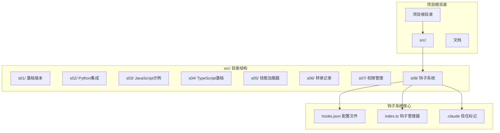
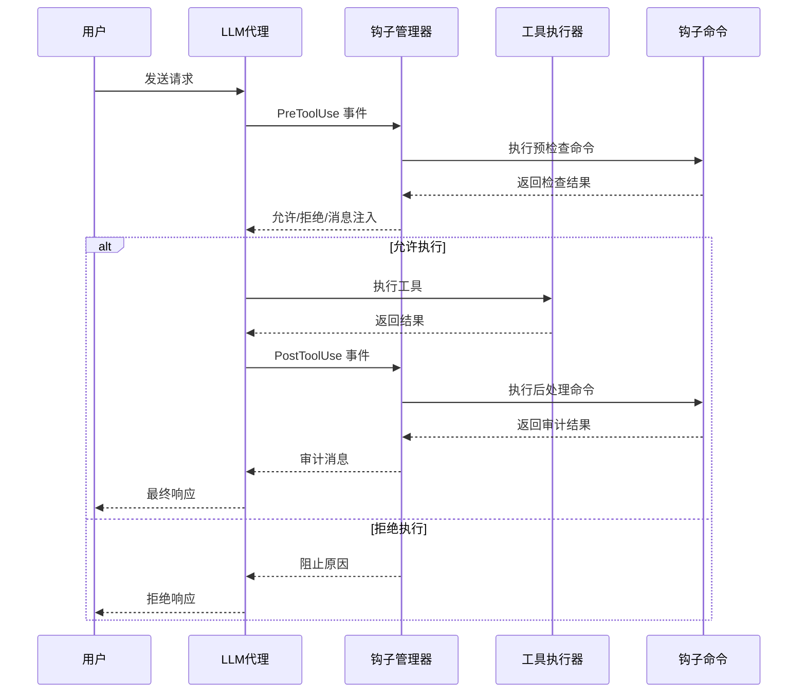
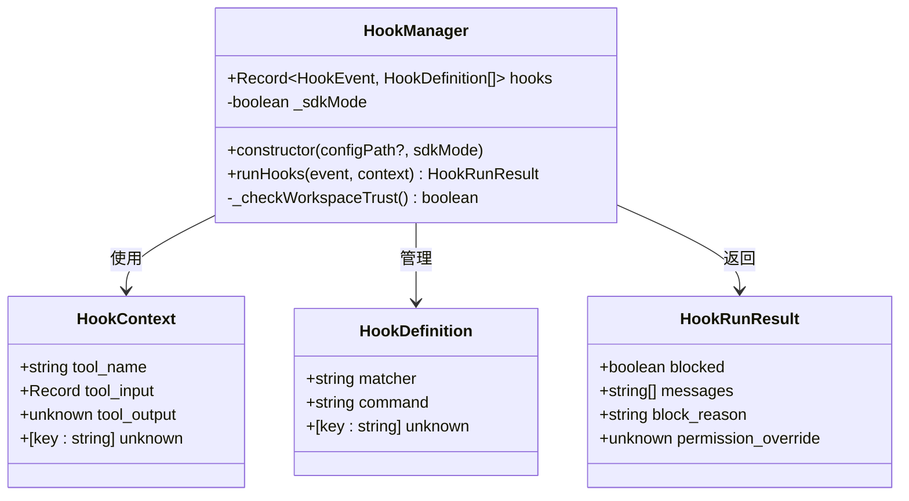
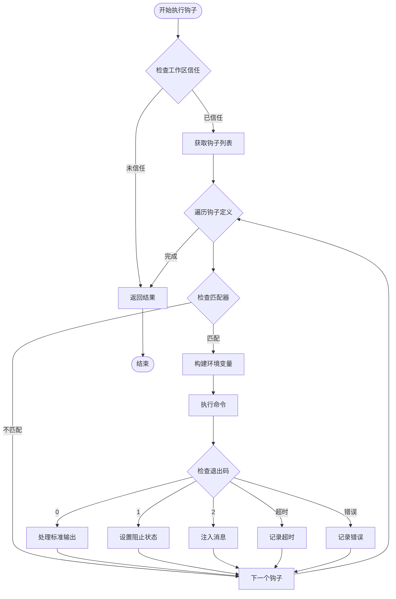
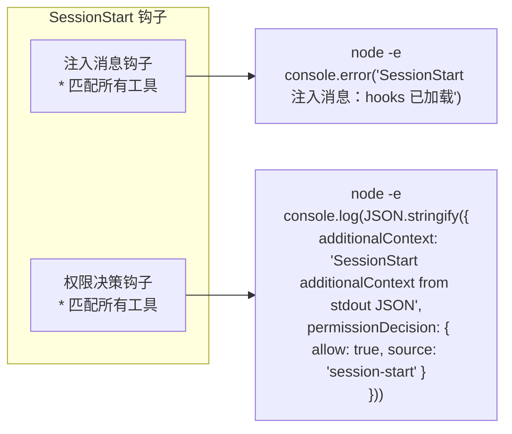
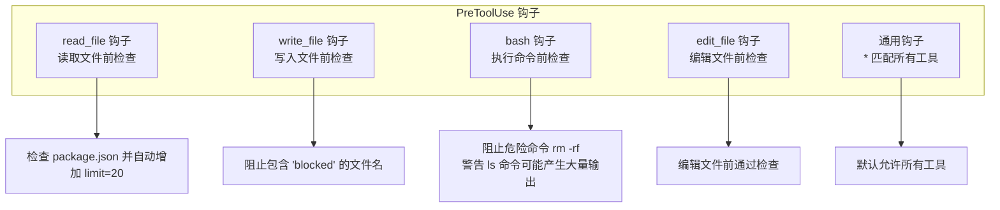
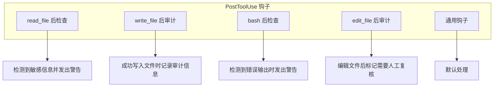
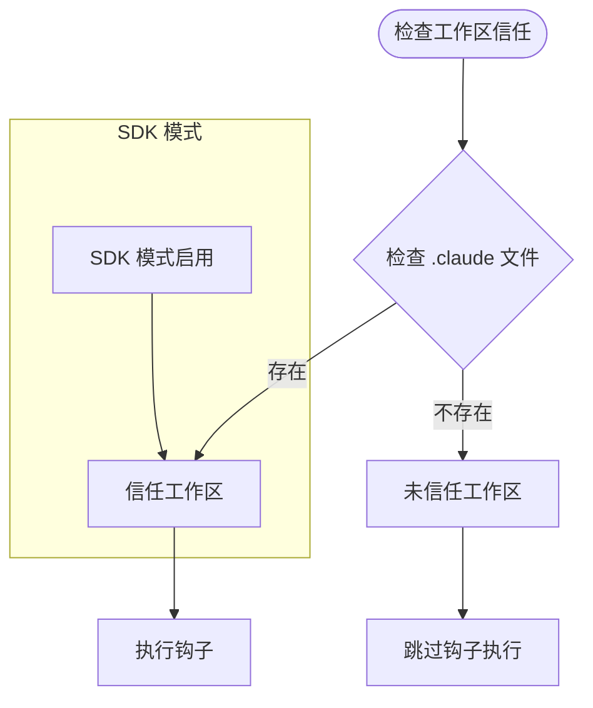

# 钩子系统

<cite>
**本文档引用的文件**
- [src/s08/hooks.json](file://src/s08/hooks.json)
- [src/s08/index.ts](file://src/s08/index.ts)
- [src/s08/.claude](file://src/s08/.claude)
- [src/s08/package.json](file://src/s08/package.json)
- [src/s08/tsconfig.json](file://src/s08/tsconfig.json)
- [package.json](file://package.json)
- [README.md](file://README.md)
- [src/s01/index.ts](file://src/s01/index.ts)
- [src/s05/index.ts](file://src/s05/index.ts)
- [src/s07/index.ts](file://src/s07/index.ts)
</cite>

## 目录
1. [简介](#简介)
2. [项目结构](#项目结构)
3. [核心组件](#核心组件)
4. [架构概览](#架构概览)
5. [详细组件分析](#详细组件分析)
6. [钩子配置详解](#钩子配置详解)
7. [依赖关系分析](#依赖关系分析)
8. [性能考虑](#性能考虑)
9. [故障排除指南](#故障排除指南)
10. [结论](#结论)

## 简介

钩子系统是 Mini-Claude-Code 项目中的一个关键安全机制，它为工具调用提供了可扩展的权限控制和审计功能。该系统允许开发者在不修改核心代码的情况下，通过配置文件定义各种钩子规则，实现对 LLM 工具使用的实时监控、过滤和决策。

钩子系统支持三种事件类型：
- **SessionStart**: 会话开始时触发
- **PreToolUse**: 工具使用前触发（用于预检查）
- **PostToolUse**: 工具使用后触发（用于后处理）

每个钩子都可以匹配特定的工具名称或通配符，并执行相应的命令来实现安全策略。

## 项目结构

该项目采用分阶段开发的方式，每个阶段展示不同的功能特性：



**图表来源**
- [src/s08/hooks.json:1-59](file://src/s08/hooks.json#L1-L59)
- [src/s08/index.ts:1-515](file://src/s08/index.ts#L1-L515)

**章节来源**
- [src/s08/hooks.json:1-59](file://src/s08/hooks.json#L1-L59)
- [src/s08/index.ts:1-515](file://src/s08/index.ts#L1-L515)

## 核心组件

钩子系统由以下核心组件构成：

### HookManager 类
这是钩子系统的核心管理器，负责：
- 加载和解析钩子配置
- 执行钩子命令
- 处理钩子结果和消息注入
- 管理工作区信任状态

### 钩子事件类型
系统支持三种事件类型：
- **PreToolUse**: 在工具执行前进行检查
- **PostToolUse**: 在工具执行后进行审计
- **SessionStart**: 会话开始时初始化

### 钩子配置结构
每个钩子定义包含：
- **matcher**: 工具名称匹配器（支持通配符）
- **command**: 要执行的命令
- **环境变量**: 自动注入的上下文信息

**章节来源**
- [src/s08/index.ts:91-252](file://src/s08/index.ts#L91-L252)
- [src/s08/hooks.json:1-59](file://src/s08/hooks.json#L1-L59)

## 架构概览

钩子系统采用事件驱动的架构模式，与 LLM 工具调度器紧密集成：



**图表来源**
- [src/s08/index.ts:397-447](file://src/s08/index.ts#L397-L447)
- [src/s08/index.ts:464-486](file://src/s08/index.ts#L464-L486)

## 详细组件分析

### HookManager 类分析



**图表来源**
- [src/s08/index.ts:91-252](file://src/s08/index.ts#L91-L252)

#### HookManager 核心方法

**runHooks 方法流程图**：



**图表来源**
- [src/s08/index.ts:140-251](file://src/s08/index.ts#L140-L251)

**章节来源**
- [src/s08/index.ts:91-252](file://src/s08/index.ts#L91-L252)

### 钩子配置文件分析

钩子配置文件采用 JSON 格式，支持三种事件类型的钩子定义：

#### SessionStart 钩子配置

SessionStart 钩子用于会话初始化时的安全检查和消息注入：



**图表来源**
- [src/s08/hooks.json:3-12](file://src/s08/hooks.json#L3-L12)

#### PreToolUse 钩子配置

PreToolUse 钩子在工具执行前进行安全检查：



**图表来源**
- [src/s08/hooks.json:13-34](file://src/s08/hooks.json#L13-L34)

#### PostToolUse 钩子配置

PostToolUse 钩子在工具执行后进行审计和通知：



**图表来源**
- [src/s08/hooks.json:35-56](file://src/s08/hooks.json#L35-L56)

**章节来源**
- [src/s08/hooks.json:1-59](file://src/s08/hooks.json#L1-L59)

### 工作区信任机制

钩子系统通过 `.claude` 文件实现工作区信任机制：



**图表来源**
- [src/s08/index.ts:127-132](file://src/s08/index.ts#L127-L132)
- [src/s08/index.ts:65-65](file://src/s08/index.ts#L65-L65)

**章节来源**
- [src/s08/index.ts:127-132](file://src/s08/index.ts#L127-L132)

## 钩子配置详解

### 钩子匹配器语法

钩子匹配器支持精确匹配和通配符匹配：
- `*`: 匹配所有工具
- `tool_name`: 精确匹配指定工具
- 支持环境变量注入：`HOOK_TOOL_NAME`, `HOOK_TOOL_INPUT`, `HOOK_TOOL_OUTPUT`

### 钩子命令执行机制

钩子命令通过 Node.js 的 `spawnSync` 方法执行，支持：
- Shell 执行
- 超时控制（默认 30 秒）
- 环境变量传递
- 标准输出和标准错误捕获

### 钩子结果处理

钩子命令的退出码决定处理方式：
- **0**: 正常执行，可选地从标准输出解析 JSON 结构化数据
- **1**: 阻止执行，命令的标准错误作为阻止原因
- **2**: 注入消息，命令的标准错误作为消息注入到对话中
- **超时**: 记录超时错误
- **其他错误**: 记录执行错误

**章节来源**
- [src/s08/index.ts:168-248](file://src/s08/index.ts#L168-L248)
- [src/s08/hooks.json:1-59](file://src/s08/hooks.json#L1-L59)

## 依赖关系分析

钩子系统与其他组件的依赖关系：

```mermaid
graph TB
subgraph "钩子系统依赖"
NodeFS[node:fs]
NodeChildProc[node:child_process]
Dotenv[dotenv]
Path[path]
FSAsync[node:fs/promises]
end
subgraph "外部依赖"
AnthropicSDK[@anthropic-ai/sdk]
JSYAML[js-yaml]
end
subgraph "项目内部依赖"
Tools[工具处理器]
AgentLoop[代理循环]
end
HookManager --> NodeFS
HookManager --> NodeChildProc
HookManager --> Dotenv
HookManager --> Path
HookManager --> FSAsync
AgentLoop --> HookManager
AgentLoop --> Tools
Tools --> AnthropicSDK
AgentLoop --> AnthropicSDK
```

**图表来源**
- [src/s08/index.ts:11-21](file://src/s08/index.ts#L11-L21)
- [src/s08/index.ts:354-354](file://src/s08/index.ts#L354-L354)

**章节来源**
- [src/s08/index.ts:11-21](file://src/s08/index.ts#L11-L21)
- [package.json:13-23](file://package.json#L13-L23)

## 性能考虑

### 钩子执行性能

- **超时限制**: 每个钩子命令最多执行 30 秒
- **缓冲区限制**: 标准输出和错误的最大缓冲区为 1MB
- **并发执行**: 钩子按顺序执行，避免资源竞争
- **内存管理**: 及时清理环境变量和临时数据

### 优化建议

1. **钩子命令优化**: 将复杂的钩子逻辑分解为多个简单命令
2. **匹配器优化**: 使用精确匹配器减少不必要的钩子执行
3. **日志优化**: 控制钩子输出量，避免影响性能
4. **缓存策略**: 对频繁检查的结果进行缓存

## 故障排除指南

### 常见问题及解决方案

#### 钩子未执行
**症状**: 钩子配置正确但无效果
**原因**: 工作区未建立信任关系
**解决**: 创建 `.claude` 文件或启用 SDK 模式

#### 钩子执行超时
**症状**: 钩子命令长时间无响应
**原因**: 命令执行时间过长或死锁
**解决**: 优化钩子命令逻辑，添加适当的超时处理

#### 钩子阻塞工具调用
**症状**: 工具调用被意外阻止
**原因**: 钩子规则过于严格
**解决**: 检查钩子匹配器和条件判断逻辑

#### 钩子消息注入失败
**症状**: 钩子消息未显示在对话中
**原因**: 钩子命令退出码不是 2 或标准错误为空
**解决**: 确保钩子命令正确设置退出码和输出消息

**章节来源**
- [src/s08/index.ts:240-247](file://src/s08/index.ts#L240-L247)

## 结论

钩子系统为 Mini-Claude-Code 提供了一个强大而灵活的安全框架。通过事件驱动的设计和可配置的钩子机制，开发者可以在不修改核心代码的情况下实现各种安全策略和审计功能。

### 主要优势

1. **可扩展性**: 支持自定义钩子规则和命令
2. **灵活性**: 通过匹配器实现细粒度的工具控制
3. **安全性**: 提供多层安全检查和审计功能
4. **易用性**: 通过配置文件即可实现复杂的安全策略

### 应用场景

- **企业级部署**: 实现合规性和审计要求
- **开发环境**: 提供开发工具的安全访问控制
- **研究用途**: 支持 AI 安全研究和测试
- **教育目的**: 展示 AI 工具安全的重要性和实现方式

钩子系统代表了现代 AI 应用安全架构的一个重要发展方向，为构建可信的 AI 工具调用系统提供了坚实的基础。