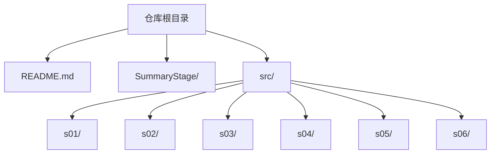
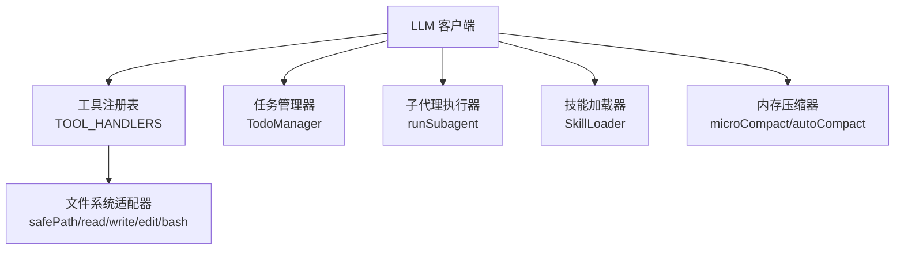
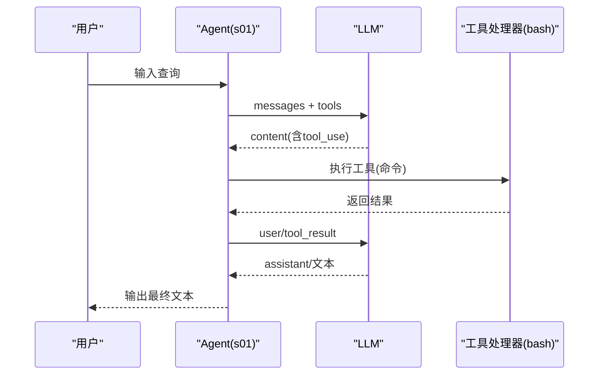
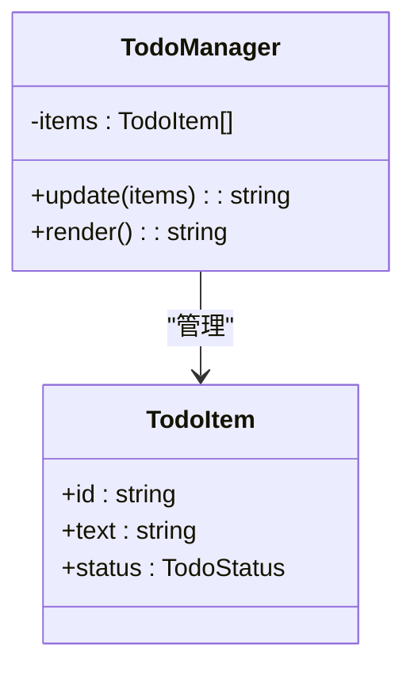
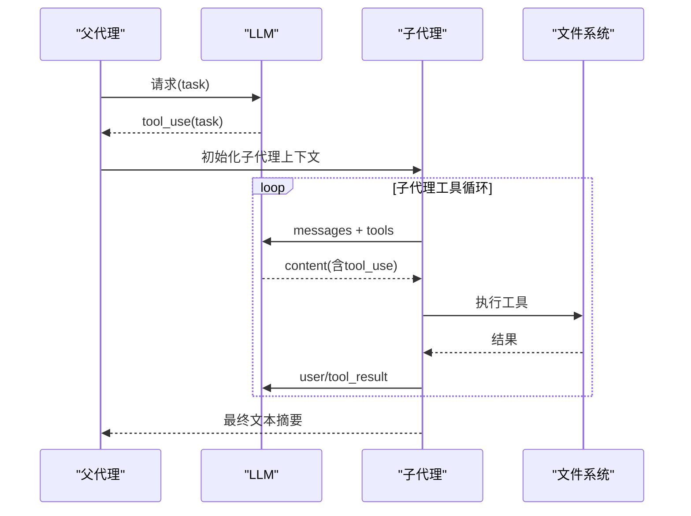
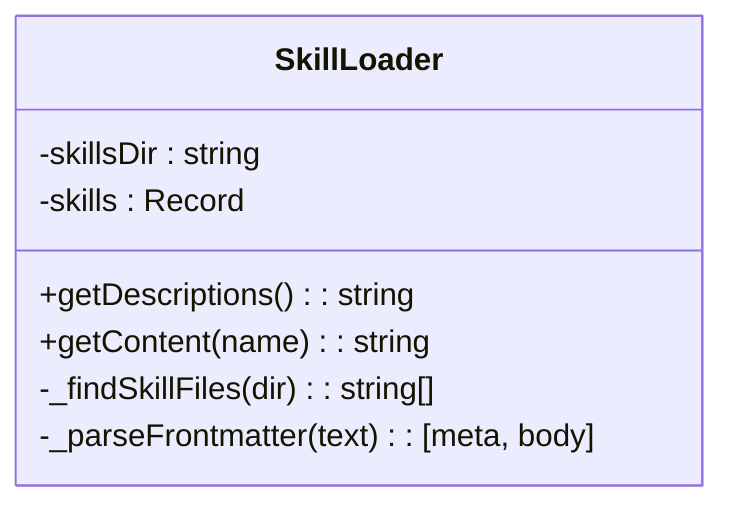

# 渐进式学习教程

<cite>
**本文引用的文件**
- [README.md](file://README.md)
- [s01 索引](file://src/s01/index.ts)
- [s02 索引](file://src/s02/index.ts)
- [s02 包配置](file://src/s02/package.json)
- [s02 测试文本](file://src/s02/test.txt)
- [s02 欢迎脚本](file://src/s02/greet.py)
- [s03 索引](file://src/s03/index.ts)
- [s03 包配置](file://src/s03/package.json)
- [s03 测试文件1](file://src/s03/test.js)
- [s03 测试文件2](file://src/s03/test2.js)
- [s03 返回示例](file://src/s03/return.js)
- [s04 索引](file://src/s04/index.ts)
- [s04 包配置](file://src/s04/package.json)
- [s05 索引](file://src/s05/index.ts)
- [s05 包配置](file://src/s05/package.json)
- [s05 技能目录](file://src/s05/skills/)
- [s05 代码评审技能](file://src/s05/skills/code-reviews/SKILL.md)
- [s06 索引](file://src/s06/index.ts)
- [s06 包配置](file://src/s06/package.json)
- [s06 返回示例](file://src/s06/return.js)
</cite>

## 目录
1. [简介](#简介)
2. [项目结构](#项目结构)
3. [核心组件](#核心组件)
4. [架构总览](#架构总览)
5. [详细组件分析](#详细组件分析)
6. [依赖关系分析](#依赖关系分析)
7. [性能考量](#性能考量)
8. [故障排除指南](#故障排除指南)
9. [结论](#结论)
10. [附录](#附录)

## 简介
本教程围绕 Mini-Claude-Code 的六个学习阶段（s01 到 s06），系统讲解如何逐步构建一个具备工具调用、文件系统操作、任务管理、上下文隔离、技能系统与内存管理能力的智能体。每个阶段在前一阶段基础上扩展功能，形成“可执行、可演示、可迭代”的渐进式学习路径。教程不仅解释核心概念与实现细节，还提供关键函数说明、实际使用示例以及阶段性练习与挑战任务，帮助读者从零到一掌握端到端的工程化实现。

## 项目结构
仓库采用按阶段分层的目录组织方式，每个阶段独立包含源码、配置与示例文件，便于对比学习与快速上手。

图表来源
- [README.md:1-3](file://README.md#L1-L3)
- [s01 索引:1-158](file://src/s01/index.ts#L1-L158)
- [s02 索引:1-213](file://src/s02/index.ts#L1-L213)
- [s03 索引:1-335](file://src/s03/index.ts#L1-L335)
- [s04 索引:1-314](file://src/s04/index.ts#L1-L314)
- [s05 索引:1-332](file://src/s05/index.ts#L1-L332)
- [s06 索引:1-413](file://src/s06/index.ts#L1-L413)

章节来源
- [README.md:1-3](file://README.md#L1-L3)

## 核心组件
- 工具调度与分发：统一定义工具清单与输入模式，按名称路由到具体处理器，支持错误捕获与结果回传。
- 文件系统安全访问：通过工作区白名单与路径解析，防止越权访问；提供读取、写入、编辑等原子操作。
- 计划与任务管理：引入 Todo 管理器，强制多步任务按计划推进，定期提醒保持进度。
- 上下文隔离：通过子代理机制，将探索或子任务在独立上下文中执行，完成后仅汇总结果返回父代理，避免历史污染。
- 技能系统：两层知识加载策略——系统提示注入元数据描述，按需加载完整技能内容，提升灵活性与安全性。
- 内存压缩：自动与手动两级压缩策略，结合令牌估算与转录持久化，维持长会话稳定性。

章节来源
- [s01 索引:31-43](file://src/s01/index.ts#L31-L43)
- [s02 索引:118-127](file://src/s02/index.ts#L118-L127)
- [s03 索引:62-131](file://src/s03/index.ts#L62-L131)
- [s04 索引:136-216](file://src/s04/index.ts#L136-L216)
- [s05 索引:46-144](file://src/s05/index.ts#L46-L144)
- [s06 索引:54-300](file://src/s06/index.ts#L54-L300)

## 架构总览
整体架构遵循“LLM + 工具调度 + 文件系统 + 上下文隔离 + 技能系统 + 内存压缩”的六层演进路径，每层在前一层之上增加新的抽象与约束，最终形成稳定、可扩展的智能体框架。

图表来源
- [s01 索引:76-124](file://src/s01/index.ts#L76-L124)
- [s02 索引:137-179](file://src/s02/index.ts#L137-L179)
- [s03 索引:242-299](file://src/s03/index.ts#L242-L299)
- [s04 索引:148-195](file://src/s04/index.ts#L148-L195)
- [s05 索引:257-298](file://src/s05/index.ts#L257-L298)
- [s06 索引:303-367](file://src/s06/index.ts#L303-L367)

## 详细组件分析

### s01：基础工具调用与交互循环
- 核心目标：实现 LLM 与工具的首次对接，支持 shell 命令执行，建立“请求-工具调用-结果回传”的闭环。
- 关键实现：
  - 工具定义与输入模式声明，限定命令参数类型与必填字段。
  - 工具处理器封装，统一异常处理与超时控制。
  - 一次对话回合的完整流程：发送消息 → 接收工具调用 → 执行工具 → 回传结果 → 继续对话直至停止原因非工具调用。
- 学习要点：
  - 理解 stop_reason 与 content 结构，区分 text 与 tool_use。
  - 掌握工具调用的幂等性与结果回传格式。
  - 体会“模型驱动工具”的思想与边界。
- 实际使用示例：
  - 在交互循环中输入任意自然语言指令，观察 LLM 是否调用 bash 工具并返回输出。
- 练习与挑战：
  - 练习：尝试在交互中执行不同类型的 shell 命令，观察输出与错误处理。
  - 挑战：为 bash 工具添加命令白名单与超时限制，防止危险命令执行。

图表来源
- [s01 索引:76-124](file://src/s01/index.ts#L76-L124)

章节来源
- [s01 索引:1-158](file://src/s01/index.ts#L1-L158)

### s02：文件系统操作与安全路径校验
- 核心目标：在 s01 基础上新增文件读写与编辑能力，同时引入安全路径校验，防止越权访问。
- 关键实现：
  - 新增 read_file、write_file、edit_file 工具，配套处理器实现。
  - safePath 函数对相对路径进行解析与校验，确保不逃逸工作区。
  - 工具注册表统一管理工具名到处理器的映射。
- 学习要点：
  - 路径安全的重要性与实现细节。
  - 文件读取的行数截断与长度限制策略。
  - 工具输入模式的约束与错误反馈。
- 实际使用示例：
  - 使用 write_file 创建文件，再用 read_file 查看内容。
  - 使用 edit_file 替换文件中的特定文本片段。
- 练习与挑战：
  - 练习：在工作区内创建多个文件，验证安全路径校验的有效性。
  - 挑战：为 edit_file 添加“精确匹配”失败的重试策略或提示。

图表来源
- [s02 索引:118-179](file://src/s02/index.ts#L118-L179)
- [s02 索引:37-89](file://src/s02/index.ts#L37-L89)

章节来源
- [s02 索引:1-213](file://src/s02/index.ts#L1-L213)
- [s02 包配置:1-23](file://src/s02/package.json#L1-L23)
- [s02 测试文本:1-1](file://src/s02/test.txt#L1-L1)
- [s02 欢迎脚本:1-12](file://src/s02/greet.py#L1-L12)

### s03：任务管理与计划驱动
- 核心目标：引入 Todo 管理器，强制多步任务按计划推进，避免模型遗忘与漂移。
- 关键实现：
  - TodoManager 校验任务条目数量、状态合法性与“进行中”唯一性。
  - 系统提示强调“先建/更新待办，再逐项执行”，并在超过阈值轮次未更新待办时注入提醒。
  - 工具注册表新增 todo 工具，用于更新任务列表。
- 学习要点：
  - 任务状态机的设计与渲染。
  - 提醒机制与回合计数的配合。
  - 多步任务的规划与执行分离。
- 实际使用示例：
  - 通过 todo 工具创建任务列表，标记进行中，逐步完成并更新状态。
  - 观察当连续多轮未更新待办时，模型是否会收到“更新待办”的提醒。
- 练习与挑战：
  - 练习：创建复杂任务（如复制文件、对比差异、验证结果），全程使用 todo 工具跟踪。
  - 挑战：实现“任务优先级”与“依赖关系”检查，增强计划健壮性。

图表来源
- [s03 索引:62-131](file://src/s03/index.ts#L62-L131)

章节来源
- [s03 索引:1-335](file://src/s03/index.ts#L1-L335)
- [s03 包配置:1-23](file://src/s03/package.json#L1-L23)
- [s03 测试文件1:1-69](file://src/s03/test.js#L1-L69)
- [s03 测试文件2:1-69](file://src/s03/test2.js#L1-L69)
- [s03 返回示例:1-161](file://src/s03/return.js#L1-L161)

### s04：上下文隔离与子代理
- 核心目标：通过子代理机制实现“进程隔离带来上下文隔离”，保护主代理的清晰度。
- 关键实现：
  - 父代理提供基础工具集与 task 工具，子代理拥有独立上下文与工具集。
  - 子代理执行上限与结果聚合，仅返回最终文本摘要。
  - 任务描述与提示词分离，便于职责划分。
- 学习要点：
  - 上下文隔离的必要性与收益。
  - 子代理生命周期与结果收敛。
  - 任务工具的输入模式与安全边界。
- 实际使用示例：
  - 使用 task 工具派生子任务，观察子代理执行过程与最终摘要返回。
- 练习与挑战：
  - 练习：为子代理设置更严格的工具集，禁止其使用某些高风险工具。
  - 挑战：实现子代理的并发调度与资源配额控制。

图表来源
- [s04 索引:148-195](file://src/s04/index.ts#L148-L195)
- [s04 索引:221-279](file://src/s04/index.ts#L221-L279)

章节来源
- [s04 索引:1-314](file://src/s04/index.ts#L1-L314)
- [s04 包配置:1-23](file://src/s04/package.json#L1-L23)

### s05：技能系统与按需知识加载
- 核心目标：实现两层知识加载策略：系统提示注入技能元数据，按需加载完整技能内容。
- 关键实现：
  - SkillLoader 递归扫描技能目录，解析 YAML Frontmatter，缓存技能元数据与正文。
  - 系统提示动态注入可用技能列表，模型调用 load_skill 获取完整技能。
  - 工具注册表新增 load_skill，返回技能正文包装。
- 学习要点：
  - 前言元数据与正文分离的设计优势。
  - 动态注入与按需加载的性能与安全平衡。
  - 技能命名规范与标签体系。
- 实际使用示例：
  - 在交互中调用 load_skill("code-review")，查看技能正文与审查清单。
- 练习与挑战：
  - 练习：新增一个技能（如“单元测试编写”），验证系统提示与按需加载流程。
  - 挑战：实现技能版本管理与变更通知机制。

图表来源
- [s05 索引:46-144](file://src/s05/index.ts#L46-L144)
- [s05 代码评审技能:1-157](file://src/s05/skills/code-reviews/SKILL.md#L1-L157)

章节来源
- [s05 索引:1-332](file://src/s05/index.ts#L1-L332)
- [s05 包配置:1-23](file://src/s05/package.json#L1-L23)
- [s05 技能目录](file://src/s05/skills/)
- [s05 代码评审技能:1-157](file://src/s05/skills/code-reviews/SKILL.md#L1-L157)

### s06：内存压缩与无限会话
- 核心目标：实现三层内存压缩策略，保障长会话稳定性与性能。
- 关键实现：
  - Layer 1: micro_compact 每轮清理旧工具结果，保留最近若干条，其余用占位符替代。
  - Layer 2: auto_compact 达阈值时触发，保存转录、请求 LLM 总结、替换历史消息。
  - Layer 3: compact 工具手动触发压缩，立即执行 Layer 2。
  - 令牌估算与阈值控制，转录持久化与摘要保留。
- 学习要点：
  - 三段式压缩策略的触发条件与副作用。
  - 转录保存与摘要保留的权衡。
  - 手动与自动压缩的协作模式。
- 实际使用示例：
  - 进行大量工具调用后，观察令牌估算与自动压缩触发。
  - 主动调用 compact 工具，验证立即压缩效果。
- 练习与挑战：
  - 练习：调整 KEEP_RECENT 与阈值，观察压缩效果与性能变化。
  - 挑战：实现增量摘要与跨会话一致性校验。

图表来源
- [s06 索引:303-367](file://src/s06/index.ts#L303-L367)
- [s06 索引:59-196](file://src/s06/index.ts#L59-L196)

章节来源
- [s06 索引:1-413](file://src/s06/index.ts#L1-L413)
- [s06 包配置:1-23](file://src/s06/package.json#L1-L23)
- [s06 返回示例:1-582](file://src/s06/return.js#L1-L582)

## 依赖关系分析
- s01 为基础交互层，依赖 LLM SDK 与 dotenv。
- s02 在 s01 基础上引入 Node 文件系统与路径模块，扩展工具集。
- s03 引入 Todo 管理器与系统提示强化，无新增外部依赖。
- s04 引入子代理执行器，复用工具集与文件系统适配器。
- s05 引入 YAML 解析与技能目录扫描，增强系统提示。
- s06 引入转录保存与摘要生成，依赖 LLM 进行总结。

图表来源
- [s02 包配置:13-16](file://src/s02/package.json#L13-L16)
- [s03 包配置:13-16](file://src/s03/package.json#L13-L16)
- [s04 包配置:13-16](file://src/s04/package.json#L13-L16)
- [s05 包配置:13-16](file://src/s05/package.json#L13-L16)
- [s06 包配置:13-16](file://src/s06/package.json#L13-L16)

章节来源
- [s02 包配置:1-23](file://src/s02/package.json#L1-L23)
- [s03 包配置:1-23](file://src/s03/package.json#L1-L23)
- [s04 包配置:1-23](file://src/s04/package.json#L1-L23)
- [s05 包配置:1-23](file://src/s05/package.json#L1-L23)
- [s06 包配置:1-23](file://src/s06/package.json#L1-L23)

## 性能考量
- 工具调用频率与 LLM 费用控制：合理使用任务与子代理，减少不必要的工具调用。
- 文件操作优化：大文件读取建议分块处理，避免一次性加载导致内存峰值。
- 令牌预算管理：通过阈值与压缩策略控制历史长度，避免超出模型上下文窗口。
- 路径与输入校验：提前拦截非法路径与参数，减少无效调用与错误处理开销。
- 并发与隔离：子代理并发执行时注意资源竞争与超时控制。

## 故障排除指南
- 工具调用失败：
  - 检查工具输入模式与必填字段是否满足。
  - 查看处理器异常捕获与错误返回格式。
- 文件系统错误：
  - 确认路径在工作区内，避免绝对路径与上级目录访问。
  - 检查文件权限与编码格式。
- 上下文溢出：
  - 启用自动压缩或主动调用 compact 工具。
  - 调整阈值与保留策略以适应任务规模。
- 技能加载异常：
  - 确认技能目录结构与 Frontmatter 格式。
  - 检查系统提示注入的技能列表是否正确。

章节来源
- [s01 索引:50-62](file://src/s01/index.ts#L50-L62)
- [s02 索引:50-89](file://src/s02/index.ts#L50-L89)
- [s03 索引:273-275](file://src/s03/index.ts#L273-L275)
- [s04 索引:168-186](file://src/s04/index.ts#L168-L186)
- [s05 索引:280-289](file://src/s05/index.ts#L280-L289)
- [s06 索引:307-311](file://src/s06/index.ts#L307-L311)

## 结论
通过 s01 到 s06 的六阶演进，我们构建了一个从“工具调用”到“上下文隔离”再到“技能系统与内存压缩”的完整智能体框架。每一阶段都围绕一个核心抽象展开，既保持了可理解性，又具备工程化落地价值。建议在掌握各阶段原理后，结合真实场景进行定制化扩展，如引入更多工具、完善错误恢复与审计日志、增强安全防护等。

## 附录
- 阶段性练习与挑战建议：
  - s01：尝试在交互中执行不同类型的 shell 命令，观察输出与错误处理。
  - s02：在工作区内创建多个文件，验证安全路径校验的有效性。
  - s03：创建复杂任务（如复制文件、对比差异、验证结果），全程使用 todo 工具跟踪。
  - s04：为子代理设置更严格的工具集，禁止其使用某些高风险工具。
  - s05：新增一个技能（如“单元测试编写”），验证系统提示与按需加载流程。
  - s06：调整 KEEP_RECENT 与阈值，观察压缩效果与性能变化。
- 参考文件路径：
  - s01：[src/s01/index.ts](file://src/s01/index.ts)
  - s02：[src/s02/index.ts](file://src/s02/index.ts)，[src/s02/test.txt](file://src/s02/test.txt)，[src/s02/greet.py](file://src/s02/greet.py)
  - s03：[src/s03/index.ts](file://src/s03/index.ts)，[src/s03/test.js](file://src/s03/test.js)，[src/s03/test2.js](file://src/s03/test2.js)
  - s04：[src/s04/index.ts](file://src/s04/index.ts)
  - s05：[src/s05/index.ts](file://src/s05/index.ts)，[src/s05/skills/code-reviews/SKILL.md](file://src/s05/skills/code-reviews/SKILL.md)
  - s06：[src/s06/index.ts](file://src/s06/index.ts)，[src/s06/return.js](file://src/s06/return.js)