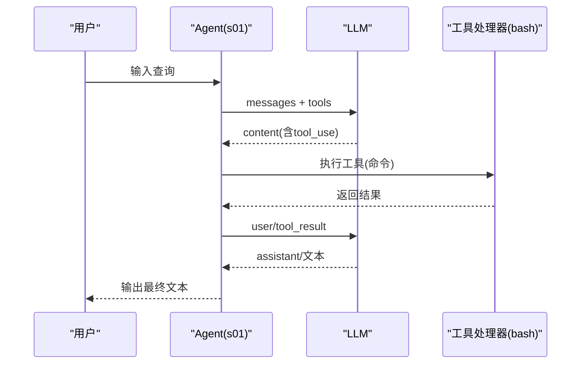
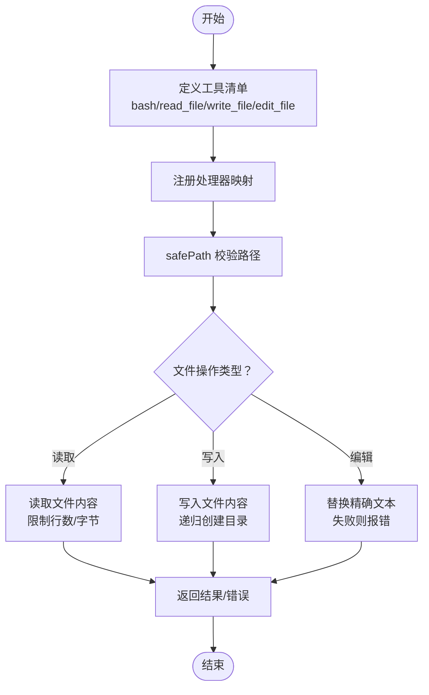
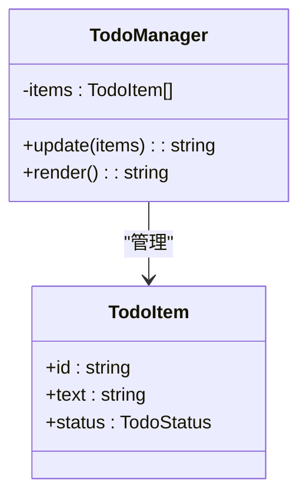
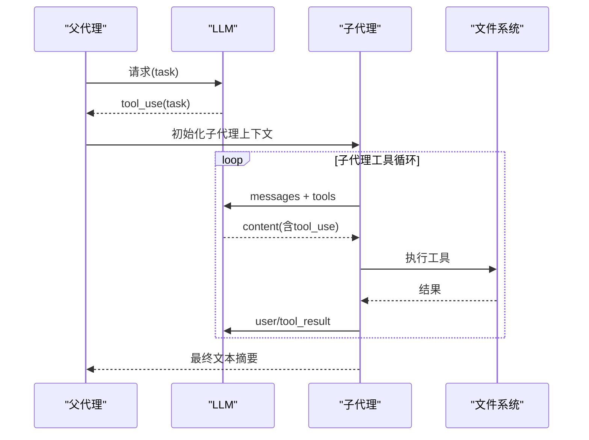
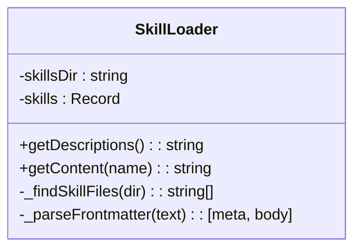
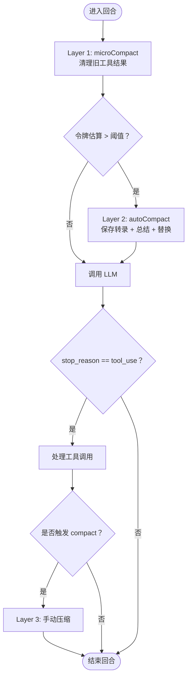
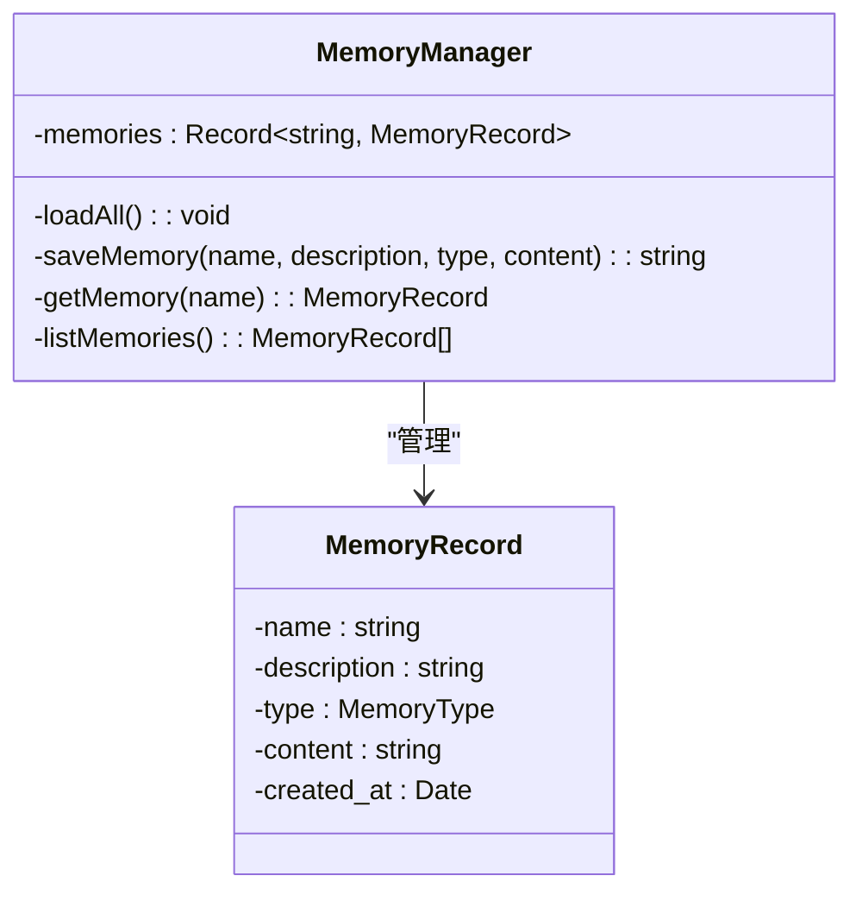
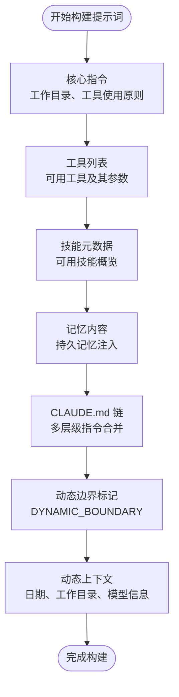
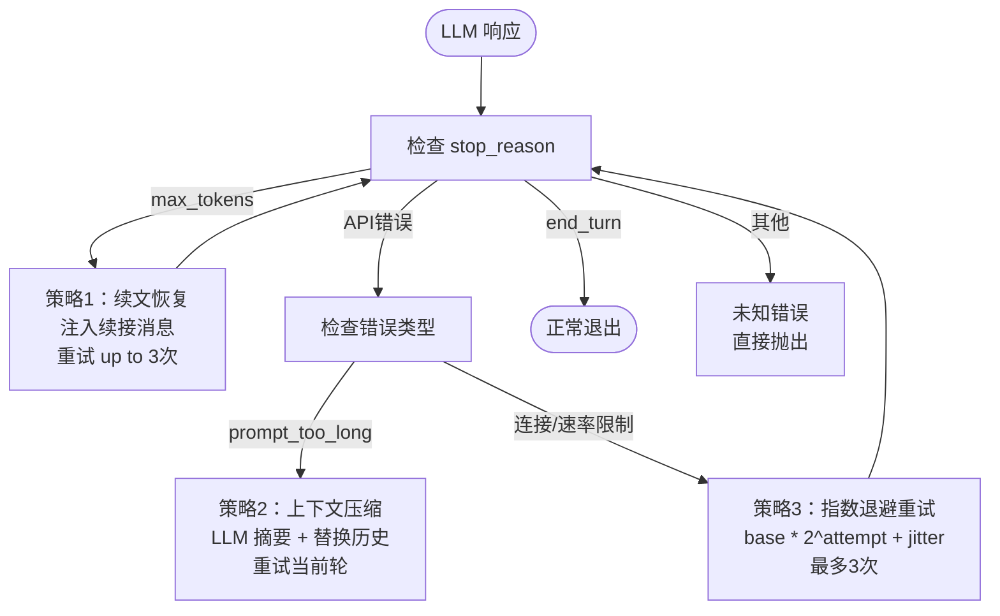

# 渐进式学习教程

<cite>
**本文引用的文件**
- [README.md](file://README.md)
- [SummaryStage/src/main.ts](file://SummaryStage/src/main.ts)
- [SummaryStage/src/core/agent.ts](file://SummaryStage/src/core/agent.ts)
- [SummaryStage/src/core/agent-loop.ts](file://SummaryStage/src/core/agent-loop.ts)
- [SummaryStage/src/core/context.ts](file://SummaryStage/src/core/context.ts)
- [SummaryStage/src/tools/index.ts](file://SummaryStage/src/tools/index.ts)
- [SummaryStage/src/features/todo/index.ts](file://SummaryStage/src/features/todo/index.ts)
- [SummaryStage/src/features/skills/index.ts](file://SummaryStage/src/features/skills/index.ts)
- [SummaryStage/src/features/compression/index.ts](file://SummaryStage/src/features/compression/index.ts)
- [SummaryStage/src/features/memory/index.ts](file://SummaryStage/src/features/memory/index.ts)
- [SummaryStage/src/features/hooks/index.ts](file://SummaryStage/src/features/hooks/index.ts)
- [SummaryStage/src/features/permissions/index.ts](file://SummaryStage/src/features/permissions/index.ts)
- [SummaryStage/src/features/subagent/index.ts](file://SummaryStage/src/features/subagent/index.ts)
- [SummaryStage/package.json](file://SummaryStage/package.json)
- [SummaryStage/skills/code-reviews/SKILL.md](file://SummaryStage/skills/code-reviews/SKILL.md)
- [SummaryStage/stage1.ts](file://SummaryStage/stage1.ts)
- [SummaryStage/stage1_refactor.md](file://SummaryStage/stage1_refactor.md)
- [src/s10/index.ts](file://src/s10/index.ts)
- [src/s10/index.py](file://src/s10/index.py)
- [src/s10/hooks.json](file://src/s10/hooks.json)
- [src/s10/package.json](file://src/s10/package.json)
- [src/s11/index.ts](file://src/s11/index.ts)
- [src/s11/index.py](file://src/s11/index.py)
- [src/s11/package.json](file://src/s11/package.json)
</cite>

## 目录
1. [简介](#简介)
2. [项目结构](#项目结构)
3. [核心组件](#核心组件)
4. [架构总览](#架构总览)
5. [详细组件分析](#详细组件分析)
6. [依赖关系分析](#依赖关系分析)
7. [性能考量](#性能考量)
8. [故障排除指南](#故障排除指南)
9. [结论](#结论)
10. [附录](#附录)

## 简介
本教程围绕 Mini-Claude-Code 的十二个学习阶段（s01 到 s11），系统讲解如何逐步构建一个具备工具调用、文件系统操作、任务管理、上下文隔离、技能系统、内存管理与错误恢复能力的智能体。每个阶段在前一阶段基础上扩展功能，形成"可执行、可演示、可迭代"的渐进式学习路径。教程不仅解释核心概念与实现细节，还提供关键函数说明、实际使用示例以及阶段性练习与挑战任务，帮助读者从零到一掌握端到端的工程化实现。

**重要更新**：本次更新新增了教育Harness实现的 s10 和 s11 阶段，提供系统提示词构建和错误恢复的完整教学示例。s10 展示了"系统提示词管道化构建"的教学理念，s11 实现了"三层错误恢复机制"的完整教学案例。

## 项目结构
仓库采用基于 SummaryStage 的全新模块化架构，核心入口位于 SummaryStage/src/main.ts，通过 Agent 组装器将各个功能模块有机组合。新增的 s10 和 s11 阶段提供了完整的教育Harness实现。

```mermaid
graph TB
root["仓库根目录"]
readme["README.md"]
summary["SummaryStage/"]
src["src/"]
main["src/main.ts<br/>CLI入口"]
core["src/core/"]
features["src/features/"]
tools["src/tools/"]
s01["s01/"]
s02["s02/"]
s03["s03/"]
s04["s04/"]
s05["s05/"]
s06["s06/"]
s07["s07/"]
s08["s08/"]
s09["s09/"]
s10["s10/<br/>系统提示词构建"]
s11["s11/<br/>错误恢复机制"]
-- 核心模块
core_agent["core/agent.ts<br/>Agent组装器"]
core_loop["core/agent-loop.ts<br/>消息循环"]
core_context["core/context.ts<br/>上下文管理"]
tools_index["tools/index.ts<br/>工具注册"]
-- 功能模块
feat_todo["features/todo/index.ts<br/>任务管理"]
feat_skills["features/skills/index.ts<br/>技能系统"]
feat_compress["features/compression/index.ts<br/>对话压缩"]
feat_memory["features/memory/index.ts<br/>持久记忆"]
feat_hooks["features/hooks/index.ts<br/>钩子系统"]
feat_perms["features/permissions/index.ts<br/>权限管理"]
feat_subagent["features/subagent/index.ts<br/>子代理"]
-- s10 教育Harness
s10_ts["s10/index.ts<br/>TypeScript实现"]
s10_py["s10/index.py<br/>Python对照实现"]
s10_hooks["s10/hooks.json<br/>钩子配置"]
-- s11 教育Harness
s11_ts["s11/index.ts<br/>TypeScript实现"]
s11_py["s11/index.py<br/>Python对照实现"]
root --> readme
root --> summary
root --> src
summary --> main
summary --> core
summary --> features
summary --> tools
src --> s01
src --> s02
src --> s03
src --> s04
src --> s05
src --> s06
src --> s07
src --> s08
src --> s09
src --> s10
src --> s11
-- 核心模块连接
main --> core_agent
core_agent --> core_loop
core_agent --> core_context
core_agent --> tools_index
-- 功能模块连接
core_agent --> feat_todo
core_agent --> feat_skills
core_agent --> feat_compress
core_agent --> feat_memory
core_agent --> feat_hooks
core_agent --> feat_perms
core_agent --> feat_subagent
-- s10连接
s10 --> s10_ts
s10 --> s10_py
s10 --> s10_hooks
-- s11连接
s11 --> s11_ts
s11 --> s11_py
```

**图表来源**
- [SummaryStage/src/main.ts:1-39](file://SummaryStage/src/main.ts#L1-L39)
- [SummaryStage/src/core/agent.ts:1-263](file://SummaryStage/src/core/agent.ts#L1-L263)
- [SummaryStage/src/core/agent-loop.ts:1-277](file://SummaryStage/src/core/agent-loop.ts#L1-L277)
- [SummaryStage/src/core/context.ts:1-80](file://SummaryStage/src/core/context.ts#L1-L80)
- [SummaryStage/src/tools/index.ts:1-63](file://SummaryStage/src/tools/index.ts#L1-L63)
- [src/s10/index.ts:1-827](file://src/s10/index.ts#L1-L827)
- [src/s11/index.ts:1-633](file://src/s11/index.ts#L1-L633)

**章节来源**
- [README.md:1-3](file://README.md#L1-L3)
- [SummaryStage/src/main.ts:1-39](file://SummaryStage/src/main.ts#L1-L39)

## 核心组件
- **Agent 组装器**：统一管理所有功能模块的生命周期，提供 enableXxx() 方法按需启用功能。
- **模块化工具注册**：通过 ToolRegistry 统一管理工具定义与处理器，支持动态注册与扩展。
- **可选功能管道**：在 agentLoop 中通过可选检查（ctx.hookManager、ctx.permissionManager）实现功能的动态接入。
- **上下文共享机制**：AgentContext 作为中央状态存储，所有模块通过它共享状态和依赖。
- **钩子系统**：提供 PreToolUse 和 PostToolUse 两种钩子类型，支持工具执行前后扩展。
- **权限管理**：支持 default、plan、auto 三种模式，可配置规则和用户交互确认。
- **持久记忆系统**：支持跨会话记忆保存，包含多种记忆类型分类。
- **对话压缩**：三层压缩策略（微压缩、自动压缩、手动压缩）保障长会话稳定性。
- **系统提示词构建器**：s10 阶段引入的模块化提示词构建系统，支持分段构建和动态边界。
- **错误恢复机制**：s11 阶段实现的三层错误恢复策略，包括续文恢复、上下文压缩和指数退避。

**章节来源**
- [SummaryStage/src/core/agent.ts:46-127](file://SummaryStage/src/core/agent.ts#L46-L127)
- [SummaryStage/src/core/agent-loop.ts:62-276](file://SummaryStage/src/core/agent-loop.ts#L62-L276)
- [SummaryStage/src/core/context.ts:22-48](file://SummaryStage/src/core/context.ts#L22-L48)
- [src/s10/index.ts:246-430](file://src/s10/index.ts#L246-L430)
- [src/s11/index.ts:106-140](file://src/s11/index.ts#L106-L140)

## 架构总览
整体架构采用"Agent 组装器 + 模块化功能 + 工具注册表"的三层架构，每层在前一层基础上增加新的抽象与约束，最终形成稳定、可扩展的智能体框架。新增的 s10 和 s11 阶段展示了教育Harness的完整实现。

```mermaid
graph TB
agent["Agent 组装器<br/>createAgentContext + registerBaseTools"]
context["AgentContext<br/>中央状态存储"]
registry["ToolRegistry<br/>工具注册表"]
loop["agentLoop<br/>消息循环管道"]
-- 功能模块
todo["TodoManager<br/>任务管理"]
skills["SkillLoader<br/>技能系统"]
compress["Compression<br/>对话压缩"]
memory["MemoryManager<br/>持久记忆"]
hooks["HookManager<br/>钩子系统"]
perms["PermissionManager<br/>权限管理"]
subagent["Subagent<br/>子代理"]
-- s10 教育Harness
promptBuilder["SystemPromptBuilder<br/>提示词构建器"]
memoryMgr["MemoryManager<br/>持久记忆管理"]
-- s11 教育Harness
recovery["三层错误恢复<br/>max_tokens/压缩/退避"]
-- 基础工具
bash["bash"]
read_file["read_file"]
write_file["write_file"]
edit_file["edit_file"]
agent --> context
agent --> registry
agent --> loop
context --> todo
context --> skills
context --> compress
context --> memory
context --> hooks
context --> perms
context --> subagent
-- s10连接
promptBuilder --> memoryMgr
-- s11连接
recovery --> bash
recovery --> read_file
recovery --> write_file
recovery --> edit_file
```

**图表来源**
- [SummaryStage/src/core/agent.ts:50-60](file://SummaryStage/src/core/agent.ts#L50-L60)
- [SummaryStage/src/core/agent-loop.ts:70-112](file://SummaryStage/src/core/agent-loop.ts#L70-L112)
- [SummaryStage/src/tools/index.ts:38-62](file://SummaryStage/src/tools/index.ts#L38-L62)
- [src/s10/index.ts:246-430](file://src/s10/index.ts#L246-L430)
- [src/s11/index.ts:380-566](file://src/s11/index.ts#L380-566)

## 详细组件分析

### s01：基础工具调用与交互循环
- **核心目标**：实现 LLM 与工具的首次对接，支持 shell 命令执行，建立"请求-工具调用-结果回传"的闭环。
- **关键实现**：
  - 工具定义与输入模式声明，限定命令参数类型与必填字段。
  - 工具处理器封装，统一异常处理与超时控制。
  - 一次对话回合的完整流程：发送消息 → 接收工具调用 → 执行工具 → 回传结果 → 继续对话直至停止原因非工具调用。
- **学习要点**：
  - 理解 stop_reason 与 content 结构，区分 text 与 tool_use。
  - 掌握工具调用的幂等性与结果回传格式。
  - 体会"模型驱动工具"的思想与边界。
- **实际使用示例**：
  - 在交互循环中输入任意自然语言指令，观察 LLM 是否调用 bash 工具并返回输出。
- **练习与挑战**：
  - 练习：尝试在交互中执行不同类型的 shell 命令，观察输出与错误处理。
  - 挑战：为 bash 工具添加命令白名单与超时限制，防止危险命令执行。



**图表来源**
- [SummaryStage/src/core/agent-loop.ts:100-112](file://SummaryStage/src/core/agent-loop.ts#L100-L112)

**章节来源**
- [SummaryStage/src/core/agent-loop.ts:1-277](file://SummaryStage/src/core/agent-loop.ts#L1-L277)
- [SummaryStage/src/tools/index.ts:38-62](file://SummaryStage/src/tools/index.ts#L38-L62)

### s02：文件系统操作与安全路径校验
- **核心目标**：在 s01 基础上新增文件读写与编辑能力，同时引入安全路径校验，防止越权访问。
- **关键实现**：
  - 新增 read_file、write_file、edit_file 工具，配套处理器实现。
  - safePath 函数对相对路径进行解析与校验，确保不逃逸工作区。
  - 工具注册表统一管理工具名到处理器的映射。
- **学习要点**：
  - 路径安全的重要性与实现细节。
  - 文件读取的行数截断与长度限制策略。
  - 工具输入模式的约束与错误反馈。
- **实际使用示例**：
  - 使用 write_file 创建文件，再用 read_file 查看内容。
  - 使用 edit_file 替换文件中的特定文本片段。
- **练习与挑战**：
  - 练习：在工作区内创建多个文件，验证安全路径校验的有效性。
  - 挑战：为 edit_file 添加"精确匹配"失败的重试策略或提示。



**图表来源**
- [SummaryStage/src/tools/index.ts:12-23](file://SummaryStage/src/tools/index.ts#L12-L23)

**章节来源**
- [SummaryStage/src/tools/index.ts:1-63](file://SummaryStage/src/tools/index.ts#L1-L63)

### s03：任务管理与计划驱动
- **核心目标**：引入 Todo 管理器，强制多步任务按计划推进，避免模型遗忘与漂移。
- **关键实现**：
  - TodoManager 校验任务条目数量、状态合法性与"进行中"唯一性。
  - 系统提示强调"先建/更新待办，再逐项执行"，并在超过阈值轮次未更新待办时注入提醒。
  - 工具注册表新增 todo 工具，用于更新任务列表。
- **学习要点**：
  - 任务状态机的设计与渲染。
  - 提醒机制与回合计数的配合。
  - 多步任务的规划与执行分离。
- **实际使用示例**：
  - 通过 todo 工具创建任务列表，标记进行中，逐步完成并更新状态。
  - 观察当连续多轮未更新待办时，模型是否会收到"更新待办"的提醒。
- **练习与挑战**：
  - 练习：创建复杂任务（如复制文件、对比差异、验证结果），全程使用 todo 工具跟踪。
  - 挑战：实现"任务优先级"与"依赖关系"检查，增强计划健壮性。



**图表来源**
- [SummaryStage/src/features/todo/index.ts:48-55](file://SummaryStage/src/features/todo/index.ts#L48-L55)

**章节来源**
- [SummaryStage/src/features/todo/index.ts:1-56](file://SummaryStage/src/features/todo/index.ts#L1-L56)

### s04：上下文隔离与子代理
- **核心目标**：通过子代理机制实现"进程隔离带来上下文隔离"，保护主代理的清晰度。
- **关键实现**：
  - 父代理提供基础工具集与 task 工具，子代理拥有独立上下文与工具集。
  - 子代理执行上限与结果聚合，仅返回最终文本摘要。
  - 任务描述与提示词分离，便于职责划分。
- **学习要点**：
  - 上下文隔离的必要性与收益。
  - 子代理生命周期与结果收敛。
  - 任务工具的输入模式与安全边界。
- **实际使用示例**：
  - 使用 task 工具派生子任务，观察子代理执行过程与最终摘要返回。
- **练习与挑战**：
  - 练习：为子代理设置更严格的工具集，禁止其使用某些高风险工具。
  - 挑战：实现子代理的并发调度与资源配额控制。



**图表来源**
- [SummaryStage/src/features/subagent/index.ts:35-39](file://SummaryStage/src/features/subagent/index.ts#L35-L39)

**章节来源**
- [SummaryStage/src/features/subagent/index.ts:1-50](file://SummaryStage/src/features/subagent/index.ts#L1-L50)

### s05：技能系统与按需知识加载
- **核心目标**：实现两层知识加载策略：系统提示注入技能元数据，按需加载完整技能内容。
- **关键实现**：
  - SkillLoader 递归扫描技能目录，解析 YAML Frontmatter，缓存技能元数据与正文。
  - 系统提示动态注入可用技能列表，模型调用 load_skill 获取完整技能。
  - 工具注册表新增 load_skill，返回技能正文包装。
- **学习要点**：
  - 前言元数据与正文分离的设计优势。
  - 动态注入与按需加载的性能与安全平衡。
  - 技能命名规范与标签体系。
- **实际使用示例**：
  - 在交互中调用 load_skill("code-review")，查看技能正文与审查清单。
- **练习与挑战**：
  - 练习：新增一个技能（如"单元测试编写"），验证系统提示与按需加载流程。
  - 挑战：实现技能版本管理与变更通知机制。



**图表来源**
- [SummaryStage/src/features/skills/index.ts:38-46](file://SummaryStage/src/features/skills/index.ts#L38-L46)

**章节来源**
- [SummaryStage/src/features/skills/index.ts:1-47](file://SummaryStage/src/features/skills/index.ts#L1-L47)
- [SummaryStage/skills/code-reviews/SKILL.md:1-157](file://SummaryStage/skills/code-reviews/SKILL.md#L1-L157)

### s06：内存压缩与无限会话
- **核心目标**：实现三层内存压缩策略，保障长会话稳定性与性能。
- **关键实现**：
  - Layer 1: micro_compact 每轮清理旧工具结果，保留最近若干条，其余用占位符替代。
  - Layer 2: auto_compact 达阈值时触发，保存转录、请求 LLM 总结、替换历史消息。
  - Layer 3: compact 工具手动触发压缩，立即执行 Layer 2。
  - 令牌估算与阈值控制，转录持久化与摘要保留。
- **学习要点**：
  - 三段式压缩策略的触发条件与副作用。
  - 转录保存与摘要保留的权衡。
  - 手动与自动压缩的协作模式。
- **实际使用示例**：
  - 进行大量工具调用后，观察令牌估算与自动压缩触发。
  - 主动调用 compact 工具，验证立即压缩效果。
- **练习与挑战**：
  - 练习：调整 KEEP_RECENT 与阈值，观察压缩效果与性能变化。
  - 挑战：实现增量摘要与跨会话一致性校验。



**图表来源**
- [SummaryStage/src/core/agent-loop.ts:77-97](file://SummaryStage/src/core/agent-loop.ts#L77-L97)

**章节来源**
- [SummaryStage/src/features/compression/index.ts:1-45](file://SummaryStage/src/features/compression/index.ts#L1-L45)
- [SummaryStage/src/core/agent-loop.ts:1-277](file://SummaryStage/src/core/agent-loop.ts#L1-L277)

### s09：持久记忆系统
- **核心目标**：实现跨会话持久记忆功能，支持用户偏好、项目约定、参考信息等不同类型的记忆。
- **关键实现**：
  - MemoryManager 负责记忆的加载、保存和管理。
  - 支持四种记忆类型：user（用户偏好）、feedback（反馈意见）、project（项目约定）、reference（参考资料）。
  - save_memory 工具允许智能体主动保存重要信息。
- **学习要点**：
  - 记忆分类与用途区分。
  - 跨会话一致性保证。
  - 记忆检索与应用策略。
- **实际使用示例**：
  - 使用 save_memory 工具保存用户偏好设置。
  - 在后续对话中调用记忆查看功能。
- **练习与挑战**：
  - 练习：保存不同类型的记忆，验证分类正确性。
  - 挑战：实现记忆搜索与智能检索功能。



**图表来源**
- [SummaryStage/src/features/memory/index.ts:57-76](file://SummaryStage/src/features/memory/index.ts#L57-L76)

**章节来源**
- [SummaryStage/src/features/memory/index.ts:1-77](file://SummaryStage/src/features/memory/index.ts#L1-L77)

### s10：系统提示词构建（教育Harness）
- **核心目标**：展示"系统提示词管道化构建"的教学理念，将系统提示词分解为清晰的独立部分。
- **关键实现**：
  - SystemPromptBuilder 类将提示词构建分解为六个独立部分：核心指令、工具列表、技能元数据、记忆内容、CLAUDE.md 链、动态上下文。
  - 使用 DYNAMIC_BOUNDARY 标记静态与动态部分的分界线。
  - 支持 per-turn system reminder 的单独注入，避免短期上下文混入长期指令。
  - 集成持久记忆管理器，支持跨会话记忆的动态注入。
- **学习要点**：
  - 分段构建的优势：每个部分有单一来源和职责，便于推理、测试和演进。
  - 静态与动态分离的策略：静态前缀缓存，动态后缀每轮重建。
  - CLAUDE.md 链的层次结构：用户全局、项目根目录、当前子目录的优先级。
  - 记忆引导的注入时机：在静态部分之后、动态边界之前。
- **实际使用示例**：
  - 运行 `/prompt` 命令查看完整构建的系统提示词。
  - 运行 `/sections` 命令查看各部分标题和边界标记。
  - 使用 `/memories` 命令查看已加载的记忆列表。
- **练习与挑战**：
  - 练习：在项目根目录创建 CLAUDE.md 文件，观察其在提示词中的体现。
  - 挑战：实现自定义的提示词构建器，添加新的内容部分（如环境变量、项目特定规则）。



**图表来源**
- [src/s10/index.ts:246-430](file://src/s10/index.ts#L246-L430)

**章节来源**
- [src/s10/index.ts:1-827](file://src/s10/index.ts#L1-L827)
- [src/s10/index.py:1-324](file://src/s10/index.py#L1-L324)
- [src/s10/hooks.json:1-59](file://src/s10/hooks.json#L1-L59)

### s11：错误恢复机制（教育Harness）
- **核心目标**：实现完整的三层错误恢复策略，确保智能体在面对各种错误时能够稳健运行。
- **关键实现**：
  - 策略1：max_tokens 续文恢复 - 当 LLM 输出被截断时，注入续接消息让其从断点继续。
  - 策略2：prompt_too_long 自动压缩 - 当上下文过长时，调用 LLM 生成摘要替换历史记录。
  - 策略3：连接/速率限制指数退避 - 当遇到临时网络错误时，使用指数退避重试。
  - 统一的错误分类与处理：区分 API 错误、连接错误和未知错误。
  - 主动压缩检查：即使没有触发错误，当 token 估算超过阈值时也主动压缩。
- **学习要点**：
  - 恢复优先级：max_tokens → prompt_too_long → 连接错误 → 失败优雅退出。
  - 指数退避算法：base * 2^attempt + 随机抖动，防止惊群效应。
  - 续文恢复的注入消息设计：明确指示从断点继续，避免重复总结。
  - 压缩策略的摘要质量：保留关键决策、失败尝试和剩余步骤。
- **实际使用示例**：
  - 观察恢复日志输出，了解不同错误类型的处理方式。
  - 测试长对话场景，验证自动压缩的效果。
  - 模拟网络错误，验证指数退避重试机制。
- **练习与挑战**：
  - 练习：调整 MAX_RECOVERY_ATTEMPTS 参数，观察恢复行为的变化。
  - 挑战：实现更精细的错误分类，区分不同类型的 API 错误并采用不同的恢复策略。



**图表来源**
- [src/s11/index.ts:380-566](file://src/s11/index.ts#L380-L566)

**章节来源**
- [src/s11/index.ts:1-633](file://src/s11/index.ts#L1-L633)
- [src/s11/index.py:1-264](file://src/s11/index.py#L1-L264)

## 依赖关系分析
- **SummaryStage**：基于模块化架构，依赖 Anthropic SDK、dotenv、js-yaml 等核心库。
- **Agent 组装器**：依赖所有功能模块，通过工厂方法模式实现模块化扩展。
- **工具注册表**：统一管理基础工具（bash、read_file、write_file、edit_file）。
- **功能模块**：各自独立，通过 AgentContext 进行状态共享。
- **可选功能**：钩子系统、权限管理、持久记忆等，按需启用。
- **s10 教育Harness**：依赖 Anthropic SDK 和 dotenv，实现系统提示词构建和持久记忆管理。
- **s11 教育Harness**：依赖 Anthropic SDK 和 dotenv，实现三层错误恢复机制。

```mermaid
graph LR
-- 核心依赖
anthropic["@anthropic-ai/sdk"] --> agent
dotenv["dotenv"] --> main
yaml["js-yaml"] --> skills
-- Agent 组装器依赖
agent --> tools
agent --> features
agent --> context
-- 功能模块依赖
features --> agent
features --> context
-- 工具依赖
tools --> agent
tools --> context
-- 可选功能
hooks --> agent
perms --> agent
memory --> agent
-- s10依赖
s10_ts["@anthropic-ai/sdk"] --> s10_ts
s10_ts --> dotenv
s10_py["@anthropic-ai/sdk"] --> s10_py
s10_py --> dotenv
-- s11依赖
s11_ts["@anthropic-ai/sdk"] --> s11_ts
s11_ts --> dotenv
s11_py["@anthropic-ai/sdk"] --> s11_py
s11_py --> dotenv
```

**图表来源**
- [SummaryStage/package.json:14-24](file://SummaryStage/package.json#L14-L24)
- [SummaryStage/src/core/agent.ts:16-26](file://SummaryStage/src/core/agent.ts#L16-L26)
- [src/s10/package.json:13-21](file://src/s10/package.json#L13-L21)
- [src/s11/package.json:14-22](file://src/s11/package.json#L14-L22)

**章节来源**
- [SummaryStage/package.json:1-26](file://SummaryStage/package.json#L1-L26)
- [src/s10/package.json:1-23](file://src/s10/package.json#L1-L23)
- [src/s11/package.json:1-24](file://src/s11/package.json#L1-L24)

## 性能考量
- **模块化加载**：按需启用功能模块，减少内存占用和启动时间。
- **工具执行优化**：通过钩子和权限系统的早期拦截，减少无效工具调用。
- **对话压缩策略**：三层压缩策略平衡性能与功能完整性。
- **上下文管理**：AgentContext 作为单一状态源，避免重复计算和状态同步开销。
- **异步处理**：工具执行采用异步模式，提高并发处理能力。
- **缓存机制**：技能加载和记忆管理采用缓存策略，减少重复 I/O 操作。
- **提示词构建优化**：s10 阶段将静态前缀缓存，只重建动态后缀，节省 token 开销。
- **错误恢复效率**：s11 阶段的指数退避算法避免了过度重试，提高了系统稳定性。

## 故障排除指南
- **Agent 启动失败**：
  - 检查 ANTHROPIC_API_KEY 环境变量配置。
  - 验证工作目录权限和路径有效性。
- **工具调用失败**：
  - 检查工具输入模式与必填字段是否满足。
  - 查看处理器异常捕获与错误返回格式。
- **功能模块加载异常**：
  - 确认模块注册函数正确调用。
  - 检查 AgentContext 中对应属性是否正确设置。
- **权限拒绝问题**：
  - 检查权限模式配置和规则设置。
  - 验证用户交互确认流程。
- **内存泄漏**：
  - 确认功能模块正确释放资源。
  - 检查工具处理器中的资源清理。
- **s10 提示词构建问题**：
  - 检查 CLAUDE.md 文件的 YAML frontmatter 格式。
  - 验证 MemoryManager 的文件读写权限。
- **s11 错误恢复问题**：
  - 检查网络连接和 API 密钥配置。
  - 验证指数退避参数设置是否合理。

**章节来源**
- [SummaryStage/src/core/agent.ts:138-261](file://SummaryStage/src/core/agent.ts#L138-L261)
- [SummaryStage/src/core/agent-loop.ts:231-233](file://SummaryStage/src/core/agent-loop.ts#L231-L233)
- [src/s10/index.ts:104-244](file://src/s10/index.ts#L104-L244)
- [src/s11/index.ts:403-483](file://src/s11/index.ts#L403-483)

## 结论
通过基于 SummaryStage 的全新模块化架构，我们构建了一个从"基础工具调用"到"上下文隔离"再到"技能系统与内存压缩"，最终扩展到"系统提示词构建和错误恢复"的完整智能体框架。新增的 s10 和 s11 阶段展示了教育Harness的完整实现，s10 强调了"系统提示词管道化构建"的教学理念，s11 实现了"三层错误恢复机制"的实践案例。

新架构通过 Agent 组装器和模块注册机制，实现了更好的可维护性、扩展性和安全性。每一阶段都围绕一个核心抽象展开，既保持了可理解性，又具备工程化落地价值。建议在掌握各阶段原理后，结合真实场景进行定制化扩展，如引入更多工具、完善错误恢复与审计日志、增强安全防护等。

## 附录
- **阶段性练习与挑战建议**：
  - s01：尝试在交互中执行不同类型的 shell 命令，观察输出与错误处理。
  - s02：在工作区内创建多个文件，验证安全路径校验的有效性。
  - s03：创建复杂任务（如复制文件、对比差异、验证结果），全程使用 todo 工具跟踪。
  - s04：为子代理设置更严格的工具集，禁止其使用某些高风险工具。
  - s05：新增一个技能（如"单元测试编写"），验证系统提示与按需加载流程。
  - s06：调整 KEEP_RECENT 与阈值，观察压缩效果与性能变化。
  - s09：使用 save_memory 工具保存不同类型的记忆，验证分类正确性。
  - s10：在项目根目录创建 CLAUDE.md 文件，观察其在提示词中的体现；练习使用 /prompt 和 /sections 命令。
  - s11：模拟不同类型的错误场景，验证三层恢复策略的有效性；调整恢复参数观察行为变化。
- **参考文件路径**：
  - s01：[SummaryStage/src/core/agent-loop.ts](file://SummaryStage/src/core/agent-loop.ts)
  - s02：[SummaryStage/src/tools/index.ts](file://SummaryStage/src/tools/index.ts)
  - s03：[SummaryStage/src/features/todo/index.ts](file://SummaryStage/src/features/todo/index.ts)
  - s04：[SummaryStage/src/features/subagent/index.ts](file://SummaryStage/src/features/subagent/index.ts)
  - s05：[SummaryStage/src/features/skills/index.ts](file://SummaryStage/src/features/skills/index.ts)
  - s06：[SummaryStage/src/features/compression/index.ts](file://SummaryStage/src/features/compression/index.ts)
  - s09：[SummaryStage/src/features/memory/index.ts](file://SummaryStage/src/features/memory/index.ts)
  - s10：[src/s10/index.ts](file://src/s10/index.ts), [src/s10/index.py](file://src/s10/index.py), [src/s10/hooks.json](file://src/s10/hooks.json)
  - s11：[src/s11/index.ts](file://src/s11/index.ts), [src/s11/index.py](file://src/s11/index.py)