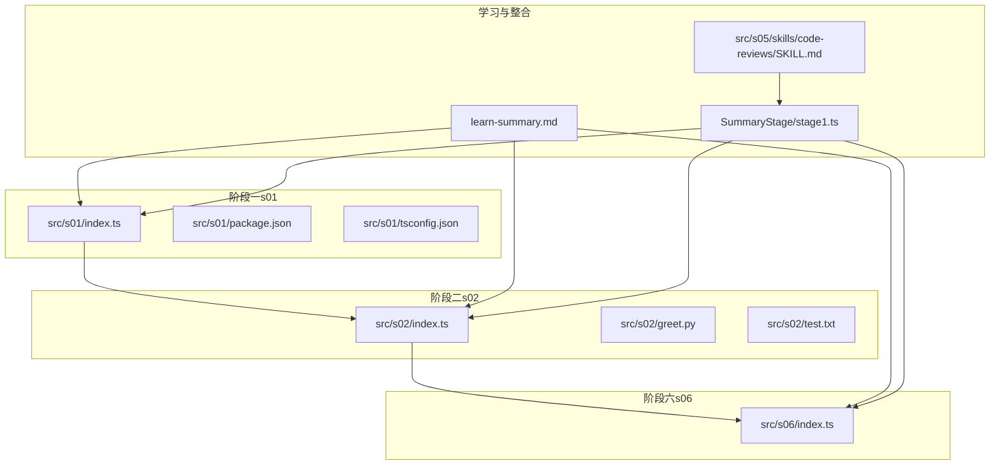
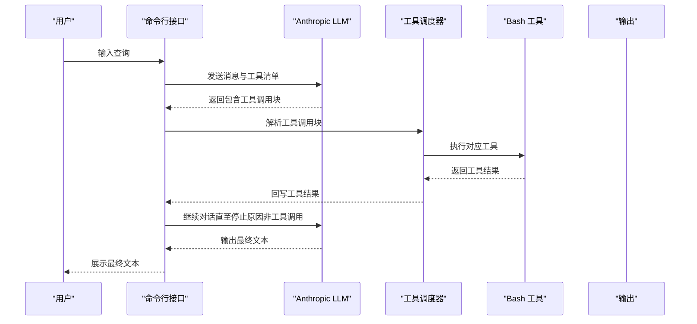
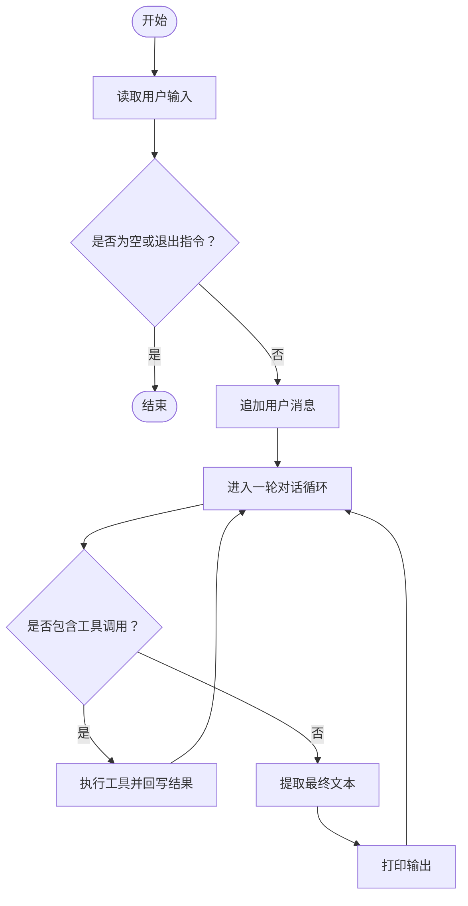
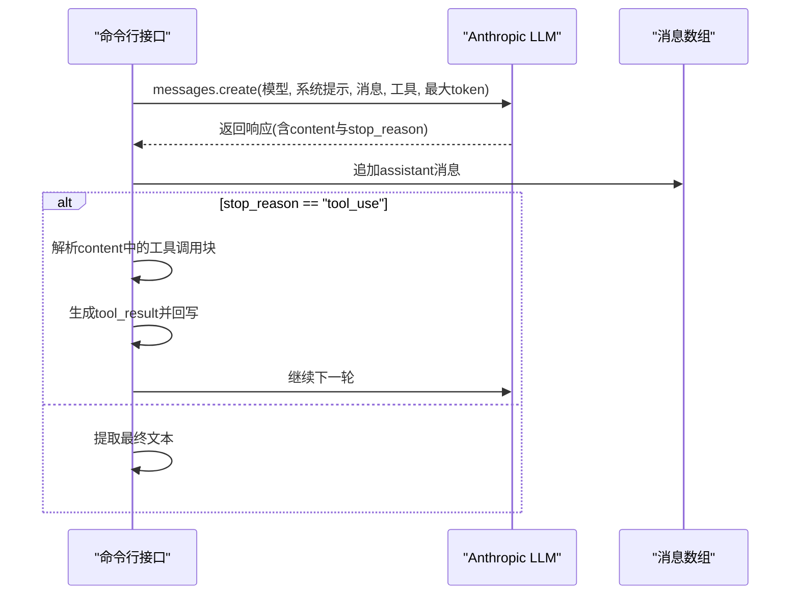
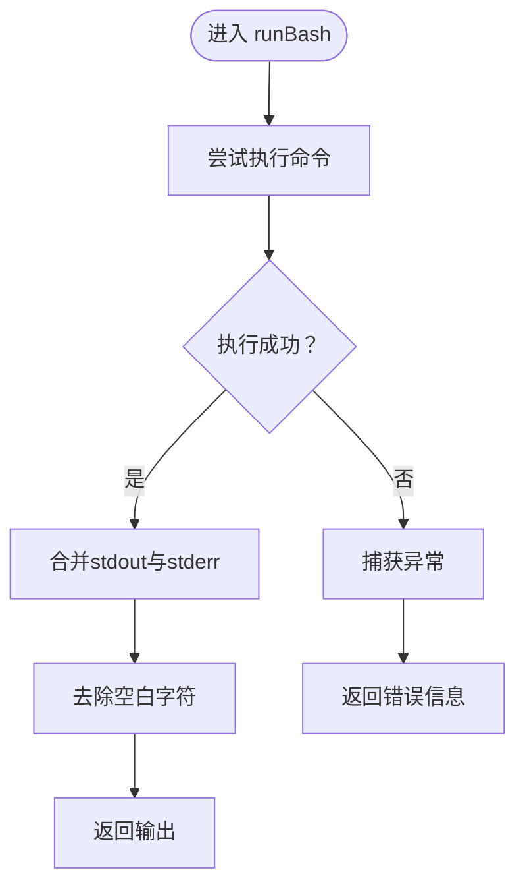
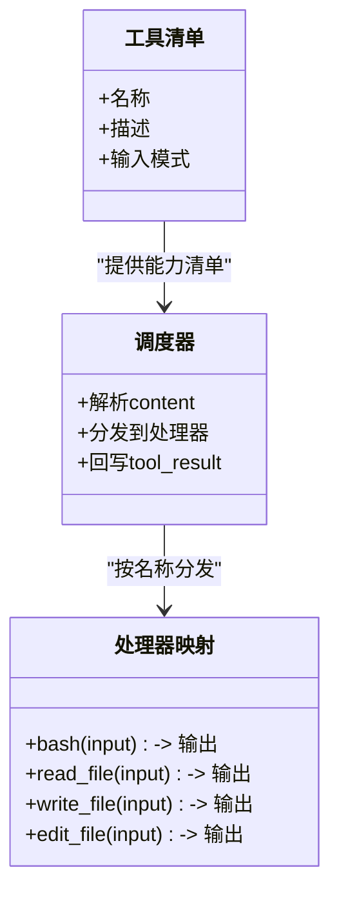
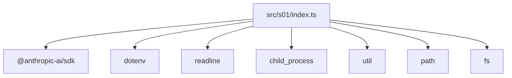

# 阶段一：基础工具调用

<cite>
**本文引用的文件**
- [README.md](file://README.md)
- [src/s01/index.ts](file://src/s01/index.ts)
- [src/s01/package.json](file://src/s01/package.json)
- [src/s01/tsconfig.json](file://src/s01/tsconfig.json)
- [src/s02/index.ts](file://src/s02/index.ts)
- [src/s02/greet.py](file://src/s02/greet.py)
- [src/s02/test.txt](file://src/s02/test.txt)
- [learn-summary.md](file://learn-summary.md)
- [src/s05/skills/code-reviews/SKILL.md](file://src/s05/skills/code-reviews/SKILL.md)
- [src/s06/index.ts](file://src/s06/index.ts)
- [SummaryStage/stage1.ts](file://SummaryStage/stage1.ts)
</cite>

## 目录
1. [引言](#引言)
2. [项目结构](#项目结构)
3. [核心组件](#核心组件)
4. [架构总览](#架构总览)
5. [详细组件分析](#详细组件分析)
6. [依赖关系分析](#依赖关系分析)
7. [性能考量](#性能考量)
8. [故障排查指南](#故障排查指南)
9. [结论](#结论)
10. [附录](#附录)

## 引言
本教程聚焦于“阶段一：基础工具调用”，目标是帮助你理解并掌握 AI 代理的基础架构，尤其是工具调用系统的设计原理与实现细节。我们将围绕以下主题展开：
- s01 的工具调度模式与命令行界面设计
- Bash 工具的实现与安全边界
- Anthropic API 的集成方式、消息处理机制与工具调用的工作原理
- 如何扩展工具功能与处理不同输入输出格式
- 实际使用场景与调试技巧

本教程以 s01 为基础，同时结合 s02 的工具扩展、s06 的上下文压缩、以及学习总结文档，帮助你建立从基础到进阶的完整认知。

## 项目结构
仓库采用按阶段划分的模块化组织方式，s01 提供最小可用的工具调用与交互循环；s02 在 s01 基础上引入文件读写与编辑工具；s06 展示了上下文压缩策略；learn-summary.md 提供了阶段性学习要点与最佳实践；s05 展示了技能加载机制；SummaryStage/stage1.ts 整合了六个阶段的能力，便于对比与迁移。

图表来源
- [src/s01/index.ts:1-158](file://src/s01/index.ts#L1-L158)
- [src/s02/index.ts:1-213](file://src/s02/index.ts#L1-L213)
- [src/s06/index.ts:1-413](file://src/s06/index.ts#L1-L413)
- [learn-summary.md:1-51](file://learn-summary.md#L1-L51)
- [SummaryStage/stage1.ts:1-981](file://SummaryStage/stage1.ts#L1-L981)
- [src/s05/skills/code-reviews/SKILL.md:1-157](file://src/s05/skills/code-reviews/SKILL.md#L1-L157)

章节来源
- [README.md:1-3](file://README.md#L1-L3)
- [src/s01/package.json:1-23](file://src/s01/package.json#L1-L23)
- [src/s01/tsconfig.json:1-11](file://src/s01/tsconfig.json#L1-L11)

## 核心组件
- 命令行交互与消息循环：基于 readline 的交互式 CLI，持续接收用户输入并驱动 LLM 与工具调用。
- Anthropic 客户端封装：统一初始化与环境变量配置，支持自定义 base URL。
- 工具定义与调度：通过工具清单与处理器映射，实现工具调用的分发与结果回写。
- Bash 工具：执行 shell 命令，带超时控制与输出合并。
- 文本提取：从 LLM 返回的复合内容中提取纯文本，作为最终输出展示。

章节来源
- [src/s01/index.ts:12-158](file://src/s01/index.ts#L12-L158)

## 架构总览
s01 的核心交互流程遵循“LLM -> 工具调用 -> 工具执行 -> 结果回写 -> 继续对话”的闭环。Anthropic API 的工具调用能力允许模型在一次推理中请求多个工具，随后由代理负责执行并回写结果，从而扩展模型的“可达性”。

图表来源
- [src/s01/index.ts:76-124](file://src/s01/index.ts#L76-L124)

## 详细组件分析

### 组件A：命令行界面与消息循环
- 交互设计：使用 readline 创建接口，持续读取用户输入，支持退出指令。
- 消息管理：将用户输入与 LLM 输出按回合追加到消息数组，保证角色交替。
- 循环控制：当 LLM 返回“工具调用”时进入工具执行循环，直到不再产生工具调用为止。

图表来源
- [src/s01/index.ts:126-155](file://src/s01/index.ts#L126-L155)

章节来源
- [src/s01/index.ts:126-155](file://src/s01/index.ts#L126-L155)

### 组件B：Anthropic API 集成与消息处理
- 初始化：从环境变量读取 API Key 与 Base URL，构造客户端实例。
- 请求参数：指定模型、系统提示、消息数组、工具清单与最大 token 数。
- 响应解析：将 LLM 的 content 追加到消息数组，并根据 stop_reason 判断是否继续工具调用循环。
- 文本提取：遍历 content 数组，拼接文本块，作为最终输出。

图表来源
- [src/s01/index.ts:76-90](file://src/s01/index.ts#L76-L90)
- [src/s01/index.ts:148-151](file://src/s01/index.ts#L148-L151)

章节来源
- [src/s01/index.ts:23-26](file://src/s01/index.ts#L23-L26)
- [src/s01/index.ts:76-90](file://src/s01/index.ts#L76-L90)
- [src/s01/index.ts:148-151](file://src/s01/index.ts#L148-L151)

### 组件C：Bash 工具实现与安全边界
- 执行机制：使用 child_process 执行命令，设置工作目录与超时，合并 stdout 与 stderr。
- 错误处理：捕获异常并返回错误信息，避免中断对话循环。
- 安全边界：s02/s06 中提供了安全路径校验函数，防止路径穿越；s01 当前未启用该校验，建议在生产环境中引入。

图表来源
- [src/s01/index.ts:50-62](file://src/s01/index.ts#L50-L62)

章节来源
- [src/s01/index.ts:50-62](file://src/s01/index.ts#L50-L62)

### 组件D：工具调度模式与扩展点
- 工具清单：定义工具名称、描述与输入模式，作为 LLM 的可用能力列表。
- 调度器：遍历 LLM 返回的 content，识别工具调用块，按名称分发至处理器。
- 处理器映射：将工具名映射到具体实现，如 Bash、读取文件、写入文件、编辑文件等。
- 扩展方法：新增工具只需在工具清单中声明，并在处理器映射中添加对应实现，即可无缝接入。

图表来源
- [src/s01/index.ts:31-43](file://src/s01/index.ts#L31-L43)
- [src/s01/index.ts:96-124](file://src/s01/index.ts#L96-L124)
- [src/s01/index.ts:131-135](file://src/s01/index.ts#L131-L135)

章节来源
- [src/s01/index.ts:31-43](file://src/s01/index.ts#L31-L43)
- [src/s01/index.ts:96-124](file://src/s01/index.ts#L96-L124)
- [src/s01/index.ts:131-135](file://src/s01/index.ts#L131-L135)

### 组件E：s02 的工具扩展与安全路径校验
- 文件工具：提供读取、写入、编辑文件的工具，支持行数限制与错误处理。
- 安全路径校验：通过路径解析与相对路径检查，防止路径穿越攻击。
- 与 s01 的差异：s02 在工具清单中增加了文件相关工具，并引入了安全校验；s01 仅包含 Bash 工具。

章节来源
- [src/s02/index.ts:50-89](file://src/s02/index.ts#L50-L89)
- [src/s02/index.ts:118-135](file://src/s02/index.ts#L118-L135)

### 组件F：s06 的上下文压缩与对话管理
- 微压缩：每轮自动清理旧的工具结果，仅保留最近若干条，其余用占位符替代。
- 自动压缩：当 token 超过阈值时，保存完整转录并让 LLM 总结，替换历史消息。
- 手动压缩：通过工具触发即时压缩，便于长会话的主动管理。

章节来源
- [src/s06/index.ts:82-138](file://src/s06/index.ts#L82-L138)
- [src/s06/index.ts:150-196](file://src/s06/index.ts#L150-L196)

## 依赖关系分析
- 运行时依赖：@anthropic-ai/sdk 用于调用 Anthropic API；dotenv 用于加载环境变量。
- 开发依赖：TypeScript、tsx 用于类型检查与运行时编译。
- Node 内置模块：readline、child_process、util、path、fs 等，支撑 CLI、工具执行与文件系统操作。

图表来源
- [src/s01/package.json:13-21](file://src/s01/package.json#L13-L21)
- [src/s01/index.ts:12-18](file://src/s01/index.ts#L12-L18)

章节来源
- [src/s01/package.json:13-21](file://src/s01/package.json#L13-L21)

## 性能考量
- 工具执行超时：Bash 工具默认超时为 120 秒，避免长时间阻塞导致会话卡死。
- 输出长度限制：对工具结果进行截断，防止过大输出影响上下文窗口。
- 上下文压缩：s06 提供三层压缩策略，有效控制 token 使用，延长会话寿命。
- 并发与稳定性：在多工具并行场景下，建议引入队列与并发控制，避免资源争用。

## 故障排查指南
- API 认证失败：确认 ANTHROPIC_API_KEY 与 ANTHROPIC_BASE_URL 是否正确配置。
- 工具调用未生效：检查工具清单与处理器映射是否一致，确保工具名大小写与输入模式匹配。
- Bash 执行异常：查看错误信息中的命令与工作目录，确认权限与路径正确。
- 路径穿越风险：在涉及文件操作时，务必使用安全路径校验函数，防止越权访问。
- 上下文溢出：当对话过长时，启用自动压缩或手动压缩工具，降低 token 使用。

章节来源
- [src/s01/index.ts:23-26](file://src/s01/index.ts#L23-L26)
- [src/s01/index.ts:59-61](file://src/s01/index.ts#L59-L61)
- [src/s02/index.ts:37-48](file://src/s02/index.ts#L37-L48)
- [src/s06/index.ts:150-196](file://src/s06/index.ts#L150-L196)

## 结论
阶段一通过最小化的工具调用与命令行交互，建立了 AI 代理的基础框架。在此基础上，s02 引入了文件工具与安全校验，s06 提供了上下文压缩策略，learn-summary.md 总结了关键约束与最佳实践。通过这些组件的组合，你可以逐步扩展代理能力，构建更稳定、可维护的智能体系统。

## 附录

### 实际使用场景
- 本地开发辅助：通过 Bash 工具快速执行构建、测试、部署脚本。
- 文件内容检索：使用读取工具查看配置、日志与源码片段。
- 快速修改：通过编辑工具进行小范围文本替换，配合版本控制进行回滚。
- 技能加载：结合 s05 的技能系统，在需要时按需加载专业知识。

### 调试技巧
- 观察 LLM 返回：打印 response 的 content 与 stop_reason，确认工具调用是否按预期触发。
- 分步执行：将复杂命令拆分为多个 Bash 调用，逐步验证中间结果。
- 日志记录：在工具执行前后输出关键信息，便于定位问题。
- 安全审计：定期审查工具清单与处理器映射，确保新增工具符合安全规范。