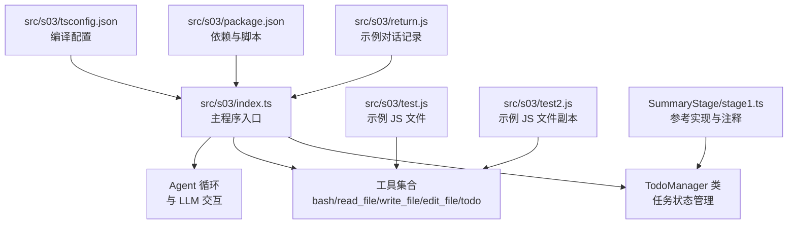
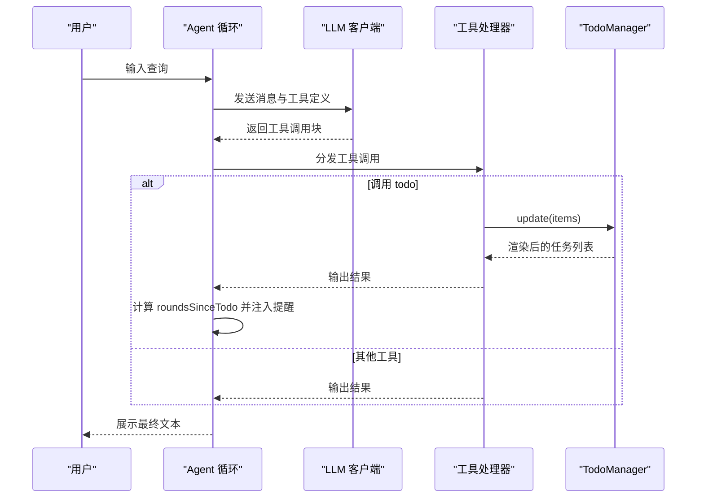
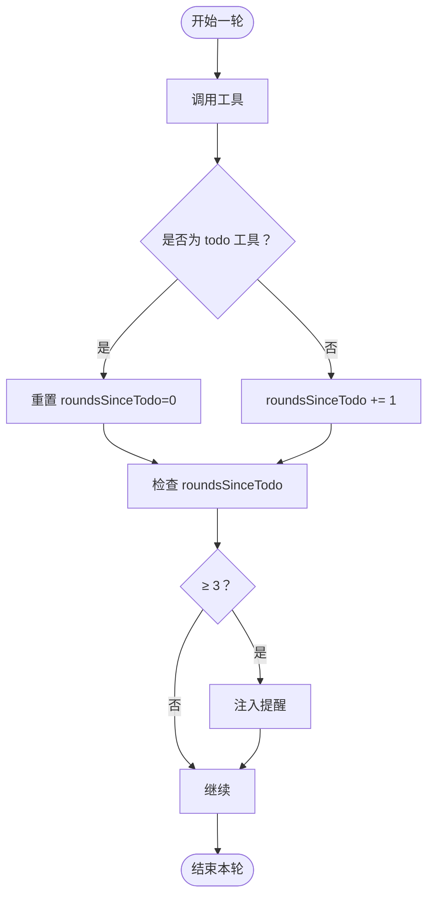
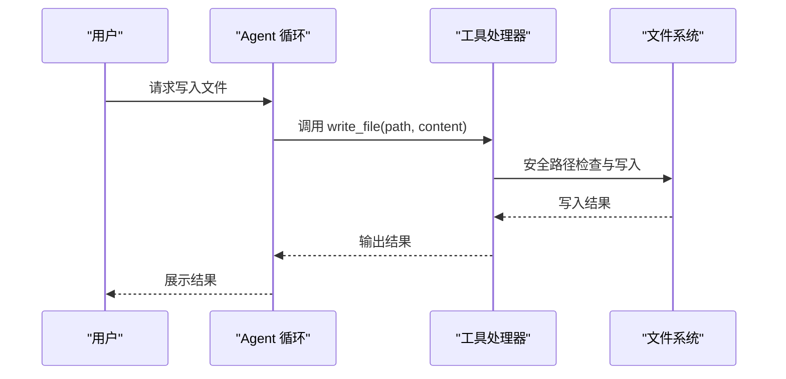
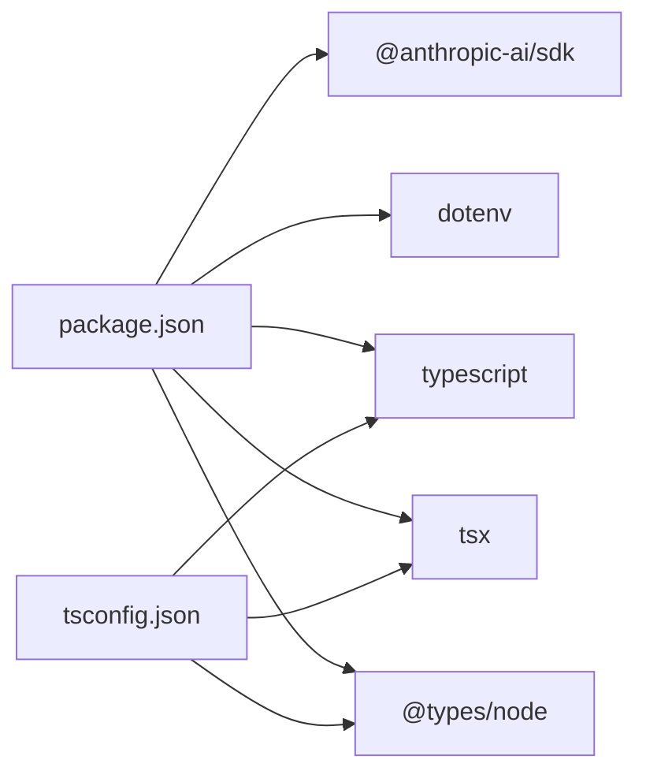

# 阶段三：任务规划管理

<cite>
**本文档引用的文件**
- [src/s03/index.ts](file://src/s03/index.ts)
- [src/s03/package.json](file://src/s03/package.json)
- [src/s03/tsconfig.json](file://src/s03/tsconfig.json)
- [src/s03/return.js](file://src/s03/return.js)
- [src/s03/test.js](file://src/s03/test.js)
- [src/s03/test2.js](file://src/s03/test2.js)
- [SummaryStage/stage1.ts](file://SummaryStage/stage1.ts)
</cite>

## 目录
1. [简介](#简介)
2. [项目结构](#项目结构)
3. [核心组件](#核心组件)
4. [架构总览](#架构总览)
5. [详细组件分析](#详细组件分析)
6. [依赖关系分析](#依赖关系分析)
7. [性能考虑](#性能考虑)
8. [故障排查指南](#故障排查指南)
9. [结论](#结论)
10. [附录](#附录)

## 简介
本教程面向“阶段三：任务规划管理”，围绕 Todo 管理器的设计与实现展开，重点讲解任务状态跟踪、提醒机制与状态同步功能。文档将结合 s03 的任务数据模型、状态转换逻辑与持久化机制，系统说明任务管理工具的使用方法（创建、更新、删除、查询），并通过多个 JavaScript 示例文件展示不同任务处理场景，最后给出任务优先级管理与批量操作的最佳实践建议。

## 项目结构
s03 目录包含一个基于 TypeScript 的交互式任务管理示例，以及若干演示文件：
- 入口脚本：src/s03/index.ts
- 依赖配置：src/s03/package.json、src/s03/tsconfig.json
- 示例演示：src/s03/return.js、src/s03/test.js、src/s03/test2.js
- 总结与参考实现：SummaryStage/stage1.ts（包含完整的 TodoManager 设计）



图表来源
- [src/s03/index.ts:1-335](file://src/s03/index.ts#L1-L335)
- [src/s03/return.js:1-161](file://src/s03/return.js#L1-L161)
- [src/s03/test.js:1-69](file://src/s03/test.js#L1-L69)
- [src/s03/test2.js:1-69](file://src/s03/test2.js#L1-L69)
- [src/s03/package.json:1-23](file://src/s03/package.json#L1-L23)
- [src/s03/tsconfig.json:1-11](file://src/s03/tsconfig.json#L1-L11)
- [SummaryStage/stage1.ts:199-271](file://SummaryStage/stage1.ts#L199-L271)

章节来源
- [src/s03/index.ts:1-335](file://src/s03/index.ts#L1-L335)
- [src/s03/package.json:1-23](file://src/s03/package.json#L1-L23)
- [src/s03/tsconfig.json:1-11](file://src/s03/tsconfig.json#L1-L11)
- [src/s03/return.js:1-161](file://src/s03/return.js#L1-L161)
- [src/s03/test.js:1-69](file://src/s03/test.js#L1-L69)
- [src/s03/test2.js:1-69](file://src/s03/test2.js#L1-L69)
- [SummaryStage/stage1.ts:199-271](file://SummaryStage/stage1.ts#L199-L271)

## 核心组件
- 任务数据模型
  - TodoStatus：任务状态枚举，包含 pending、in_progress、completed
  - TodoItem：任务条目，包含 id、text、status
- TodoManager：任务管理器，负责全量更新、校验与渲染
- 工具集合：bash、read_file、write_file、edit_file、todo
- Agent 循环：与 LLM 交互，处理工具调用，注入提醒

章节来源
- [src/s03/index.ts:62-131](file://src/s03/index.ts#L62-L131)
- [src/s03/index.ts:219-239](file://src/s03/index.ts#L219-L239)
- [src/s03/index.ts:242-299](file://src/s03/index.ts#L242-L299)

## 架构总览
s03 的整体架构围绕“任务驱动”的工作流展开：用户输入触发 Agent 循环，LLM 通过工具调用执行具体操作；TodoManager 负责维护任务列表的状态与可视化输出；当连续多轮未更新任务时，系统注入提醒以保持任务进度可见性。



图表来源
- [src/s03/index.ts:242-299](file://src/s03/index.ts#L242-L299)
- [src/s03/index.ts:232-239](file://src/s03/index.ts#L232-L239)
- [src/s03/index.ts:77-131](file://src/s03/index.ts#L77-L131)

## 详细组件分析

### 任务数据模型与状态转换
- 数据模型
  - TodoStatus：三种状态，分别映射为标记符号
  - TodoItem：包含 id、text、status 字段
- 状态转换规则
  - 全量替换：每次调用 todo 工具时，对传入数组进行严格校验后替换当前列表
  - 校验约束：
    - 最多 20 个任务
    - 文本字段必填且非空
    - 状态必须在枚举范围内
    - 同一时刻仅允许一个任务处于 in_progress
- 渲染输出
  - 使用标记符号直观显示任务状态
  - 统计已完成数量与总数

```mermaid
classDiagram
class TodoManager {
-items : TodoItem[]
+update(items) : string
+render() : string
}
class TodoItem {
+id : string
+text : string
+status : TodoStatus
}
class TodoStatus {
<<enumeration>>
"pending"
"in_progress"
"completed"
}
TodoManager --> TodoItem : "管理"
TodoItem --> TodoStatus : "使用"
```

图表来源
- [src/s03/index.ts:62-131](file://src/s03/index.ts#L62-L131)

章节来源
- [src/s03/index.ts:62-131](file://src/s03/index.ts#L62-L131)
- [SummaryStage/stage1.ts:203-271](file://SummaryStage/stage1.ts#L203-L271)

### 提醒机制与状态同步
- 提醒触发条件
  - roundsSinceTodo 计数：每轮工具调用后若未使用 todo，则递增；使用后重置为 0
  - 当 roundsSinceTodo ≥ 3 时，注入提醒文本，促使更新任务进度
- 状态同步
  - 每次工具调用结束后，将工具结果回写至消息历史，保证后续 LLM 能看到最新状态
  - TodoManager 的渲染结果作为工具输出返回给 LLM，形成闭环



图表来源
- [src/s03/index.ts:242-299](file://src/s03/index.ts#L242-L299)

章节来源
- [src/s03/index.ts:242-299](file://src/s03/index.ts#L242-L299)

### 工具实现与持久化
- 工具集合
  - bash：执行 shell 命令，带超时控制
  - read_file：读取文件内容，支持限制行数与长度
  - write_file：安全写入文件，自动创建目录
  - edit_file：精确文本替换，避免误改
  - todo：调用 TodoManager 更新任务列表
- 路径安全
  - safePath：限制文件访问范围，防止路径逃逸
- 持久化机制
  - 通过 write_file 与 edit_file 实现文件级持久化
  - TodoManager 仅在内存中维护任务状态，不直接写盘



图表来源
- [src/s03/index.ts:138-190](file://src/s03/index.ts#L138-L190)
- [src/s03/index.ts:232-239](file://src/s03/index.ts#L232-L239)

章节来源
- [src/s03/index.ts:138-190](file://src/s03/index.ts#L138-L190)
- [src/s03/index.ts:219-239](file://src/s03/index.ts#L219-L239)

### 示例文件分析：JavaScript 场景
- 示例演示（return.js）
  - 展示了从创建文件、复制文件到验证内容的完整流程
  - 每一步均通过 todo 工具更新任务状态，体现“先列清单、再逐项执行”的工作流
- 示例文件（test.js/test2.js）
  - 包含一组通用的随机数生成函数，可作为工具函数库使用
  - 两个文件内容完全一致，演示了复制与验证过程

章节来源
- [src/s03/return.js:1-161](file://src/s03/return.js#L1-L161)
- [src/s03/test.js:1-69](file://src/s03/test.js#L1-L69)
- [src/s03/test2.js:1-69](file://src/s03/test2.js#L1-L69)

### 任务管理工具使用指南
- 创建任务
  - 使用 todo 工具传入 items 数组，每个元素包含 id、text、status
  - 建议首次调用时设置至少一个 pending 任务，便于后续推进
- 更新任务
  - 在执行步骤前后调用 todo，将当前任务标记为 in_progress，完成后标记为 completed
  - 若需要调整顺序，可在一次调用中一次性更新全部任务
- 删除任务
  - 通过全量更新的方式移除不需要的条目，实现“删除”效果
- 查询任务
  - 调用 todo 后会返回当前任务列表的渲染文本，包含完成统计

章节来源
- [src/s03/index.ts:219-239](file://src/s03/index.ts#L219-L239)
- [src/s03/index.ts:119-131](file://src/s03/index.ts#L119-L131)

### 任务优先级管理与批量操作最佳实践
- 优先级管理
  - 使用任务顺序表达优先级：越靠前的任务优先执行
  - 通过 in_progress 严格控制同时只有一项任务进行中
- 批量操作
  - 在单次 todo 调用中一次性更新多个任务，减少往返次数
  - 合理拆分大任务为多个小任务，便于逐步推进与回滚
- 状态一致性
  - 每次工具调用后立即更新任务状态，避免遗漏
  - 使用渲染输出作为中间态，便于人工核对与审计

章节来源
- [src/s03/index.ts:80-117](file://src/s03/index.ts#L80-L117)
- [src/s03/index.ts:242-299](file://src/s03/index.ts#L242-L299)

## 依赖关系分析
- 运行时依赖
  - @anthropic-ai/sdk：调用 LLM 接口
  - dotenv：加载环境变量
- 开发依赖
  - typescript、tsx、@types/node：类型与开发体验
- 编译配置
  - ES2022 + NodeNext 模块解析，启用严格模式



图表来源
- [src/s03/package.json:13-21](file://src/s03/package.json#L13-L21)
- [src/s03/tsconfig.json:2-9](file://src/s03/tsconfig.json#L2-L9)

章节来源
- [src/s03/package.json:1-23](file://src/s03/package.json#L1-L23)
- [src/s03/tsconfig.json:1-11](file://src/s03/tsconfig.json#L1-L11)

## 性能考虑
- I/O 限制
  - 文件读写与命令执行受磁盘与系统资源影响，建议合理设置超时与日志级别
- LLM 调用
  - 工具调用与消息历史增长可能触发上下文压缩，注意控制消息长度
- 内存占用
  - TodoManager 仅在内存维护任务列表，适合短期任务管理；如需长期保存，应结合外部存储

## 故障排查指南
- 路径逃逸错误
  - 现象：提示路径逃逸
  - 原因：传入的路径超出工作区范围
  - 处理：使用相对路径，避免 .. 或绝对路径
- 文本未找到错误
  - 现象：编辑失败，提示文本未找到
  - 原因：目标文件内容不包含指定字符串
  - 处理：确认原文本与替换文本一致，避免多余空白字符
- 超时错误
  - 现象：命令执行超时
  - 原因：命令耗时过长或阻塞
  - 处理：优化命令或拆分为更小步骤

章节来源
- [src/s03/index.ts:138-190](file://src/s03/index.ts#L138-L190)

## 结论
s03 通过 TodoManager 实现了清晰的任务状态管理与可视化输出，并结合提醒机制确保任务进度的持续可见性。配合安全的文件工具与严格的校验规则，形成了可靠的多步骤任务执行闭环。建议在实际应用中遵循“先列清单、再逐项执行”的流程，合理拆分任务并及时更新状态，以获得最佳的协作与执行效率。

## 附录
- 快速启动
  - 安装依赖：使用包管理器安装依赖
  - 运行：通过脚本启动交互式会话
- 环境变量
  - ANTHROPIC_API_KEY：LLM 接口密钥
  - ANTHROPIC_BASE_URL：LLM 接口地址
  - MODEL_ID：模型标识

章节来源
- [src/s03/package.json:6-8](file://src/s03/package.json#L6-L8)
- [src/s03/index.ts:37-41](file://src/s03/index.ts#L37-L41)