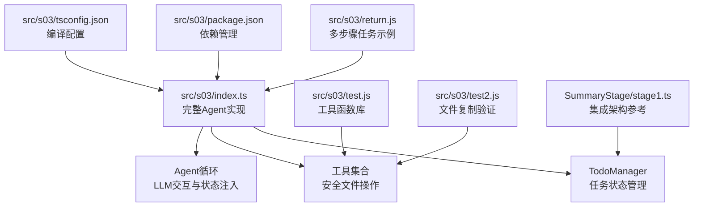
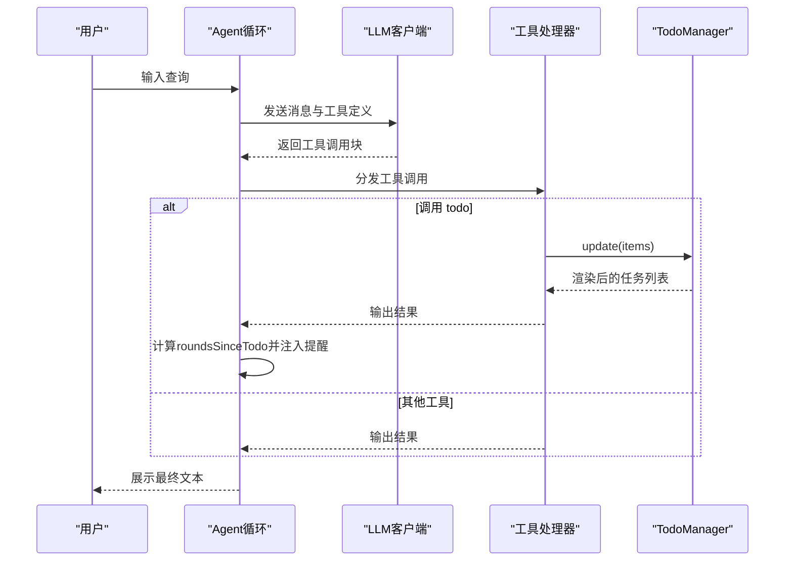
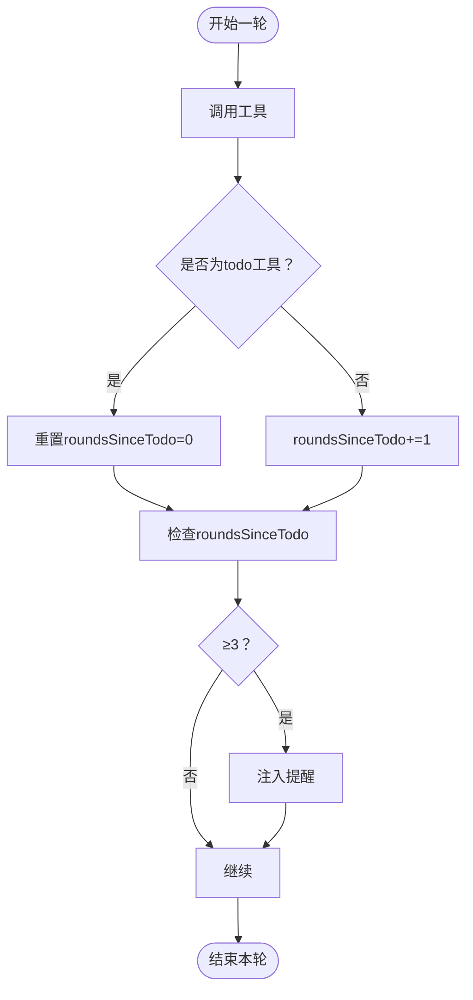
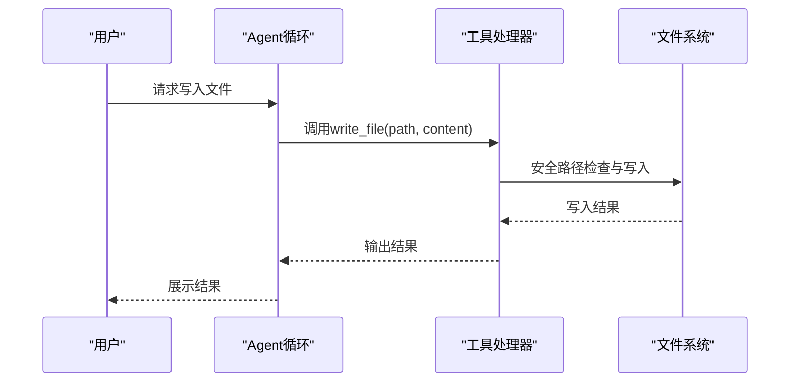
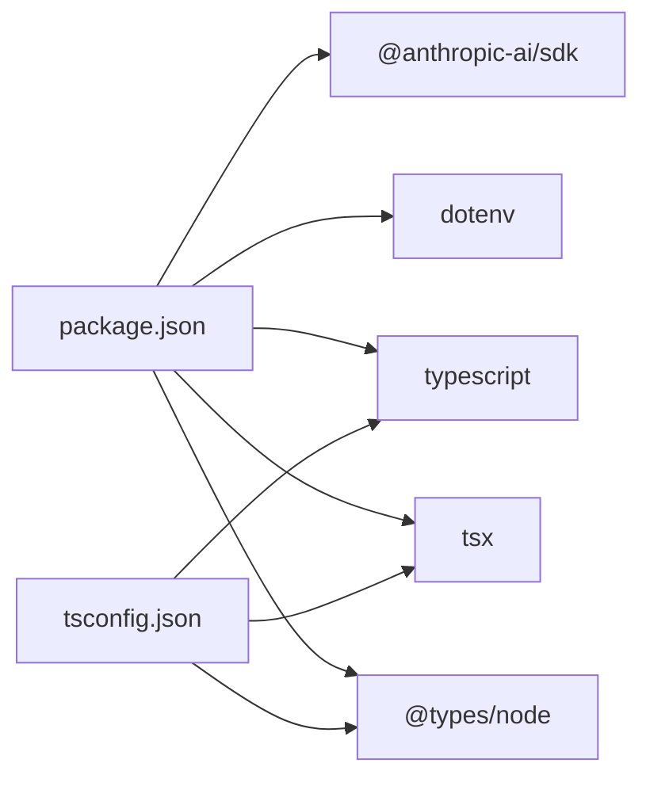

# 阶段三：任务规划管理

<cite>
**本文档引用的文件**
- [src/s03/index.ts](file://src/s03/index.ts)
- [src/s03/package.json](file://src/s03/package.json)
- [src/s03/tsconfig.json](file://src/s03/tsconfig.json)
- [src/s03/return.js](file://src/s03/return.js)
- [src/s03/test.js](file://src/s03/test.js)
- [src/s03/test2.js](file://src/s03/test2.js)
- [SummaryStage/stage1.ts](file://SummaryStage/stage1.ts)
</cite>

## 更新摘要
**变更内容**
- 更新架构总览以反映从简单todo系统到完整任务管理系统的演进
- 新增依赖管理与持久化机制的详细说明
- 强化自动状态注入与提醒机制的功能描述
- 扩展工具集合与安全路径验证的实现细节
- 增加与SummaryStage集成架构的对比分析

## 目录
1. [简介](#简介)
2. [项目结构](#项目结构)
3. [核心组件](#核心组件)
4. [架构总览](#架构总览)
5. [详细组件分析](#详细组件分析)
6. [依赖关系分析](#依赖关系分析)
7. [性能考虑](#性能考虑)
8. [故障排查指南](#故障排查指南)
9. [结论](#结论)
10. [附录](#附录)

## 简介
本教程面向"阶段三：任务规划管理"，围绕从简单todo系统升级为完整任务管理系统的演进历程展开。文档详细阐述了任务状态跟踪、提醒机制与状态同步功能的设计理念与实现方式，结合s03阶段的任务数据模型、状态转换逻辑与持久化机制，系统说明任务管理工具的使用方法（创建、更新、删除、查询），并通过多个JavaScript示例文件展示不同任务处理场景，最后给出任务优先级管理与批量操作的最佳实践建议。

**更新** 本阶段展示了从基础任务管理到完整AI代理系统的架构演进，为后续阶段的集成奠定了坚实基础。

## 项目结构
s03目录包含一个基于TypeScript的交互式任务管理示例，以及若干演示文件，体现了从简单到复杂的渐进式架构设计：

- **核心入口**：src/s03/index.ts - 完整的Agent循环实现
- **依赖配置**：src/s03/package.json、src/s03/tsconfig.json - TypeScript编译与运行时依赖
- **示例演示**：src/s03/return.js、src/s03/test.js、src/s03/test2.js - 多场景任务处理示例
- **参考实现**：SummaryStage/stage1.ts - 集成架构的完整实现与注释



**图表来源**
- [src/s03/index.ts:1-335](file://src/s03/index.ts#L1-L335)
- [src/s03/return.js:1-161](file://src/s03/return.js#L1-L161)
- [src/s03/test.js:1-69](file://src/s03/test.js#L1-L69)
- [src/s03/test2.js:1-69](file://src/s03/test2.js#L1-L69)
- [src/s03/package.json:1-23](file://src/s03/package.json#L1-L23)
- [src/s03/tsconfig.json:1-11](file://src/s03/tsconfig.json#L1-L11)
- [SummaryStage/stage1.ts:199-271](file://SummaryStage/stage1.ts#L199-L271)

**章节来源**
- [src/s03/index.ts:1-335](file://src/s03/index.ts#L1-L335)
- [src/s03/package.json:1-23](file://src/s03/package.json#L1-L23)
- [src/s03/tsconfig.json:1-11](file://src/s03/tsconfig.json#L1-L11)
- [src/s03/return.js:1-161](file://src/s03/return.js#L1-L161)
- [src/s03/test.js:1-69](file://src/s03/test.js#L1-L69)
- [src/s03/test2.js:1-69](file://src/s03/test2.js#L1-L69)
- [SummaryStage/stage1.ts:199-271](file://SummaryStage/stage1.ts#L199-L271)

## 核心组件
**更新** 从单一组件扩展为完整的任务管理生态系统：

- **任务数据模型**
  - TodoStatus：任务状态枚举，包含pending、in_progress、completed
  - TodoItem：任务条目，包含id、text、status
  - 标记符号系统：使用[ ]、[>]、[x]直观显示任务状态

- **TodoManager**：任务管理器，负责全量更新、校验与渲染
  - 严格的数据验证：最多20个任务、必需的text字段、有效的状态枚举
  - 状态约束：同一时刻仅允许一个任务处于in_progress状态
  - 渲染输出：统计完成数量与总数，提供清晰的进度反馈

- **工具集合**：安全的文件操作工具
  - bash：执行shell命令，带超时控制（120秒）
  - read_file：读取文件内容，支持限制行数与长度
  - write_file：安全写入文件，自动创建目录结构
  - edit_file：精确文本替换，避免误改
  - todo：调用TodoManager更新任务列表

- **Agent循环**：与LLM交互，处理工具调用，注入提醒
  - roundsSinceTodo计数器：跟踪连续未更新任务的轮数
  - 自动提醒机制：当roundsSinceTodo≥3时注入提醒文本
  - 消息历史管理：确保工具结果的可追溯性

**章节来源**
- [src/s03/index.ts:62-131](file://src/s03/index.ts#L62-L131)
- [src/s03/index.ts:219-239](file://src/s03/index.ts#L219-L239)
- [src/s03/index.ts:242-299](file://src/s03/index.ts#L242-L299)

## 架构总览
**更新** 从简单的任务管理扩展为完整的AI代理系统架构：

s03的整体架构围绕"任务驱动"的工作流展开，体现了从简单到复杂的技术演进：

- **用户输入** → **Agent循环** → **LLM客户端** → **工具处理器** → **TodoManager**
- **状态注入**：当连续多轮未更新任务时，系统自动注入提醒以保持任务进度可见性
- **消息循环**：工具结果回写至消息历史，形成完整的反馈闭环



**图表来源**
- [src/s03/index.ts:242-299](file://src/s03/index.ts#L242-L299)
- [src/s03/index.ts:232-239](file://src/s03/index.ts#L232-L239)
- [src/s03/index.ts:77-131](file://src/s03/index.ts#L77-L131)

**章节来源**
- [src/s03/index.ts:242-299](file://src/s03/index.ts#L242-L299)

## 详细组件分析

### 任务数据模型与状态转换
**更新** 增强了数据验证与状态约束的实现细节：

- **数据模型设计**
  - TodoStatus枚举：三种状态分别映射为标记符号[ ]、[>]、[x]
  - TodoItem接口：包含id、text、status字段，支持灵活的任务标识
  - 标记系统：MARKERS映射表统一管理状态到视觉符号的转换

- **状态转换规则**
  - 全量替换策略：每次调用todo工具时，对传入数组进行严格校验后替换当前列表
  - 严格校验约束：
    - 最多20个任务的上限控制
    - 文本字段必填且非空的完整性检查
    - 状态必须在枚举范围内的有效性验证
    - 同一时刻仅允许一个任务处于in_progress的并发控制
  - 渲染输出：使用标记符号直观显示任务状态，统计已完成数量与总数

```mermaid
classDiagram
class TodoManager {
-items : TodoItem[]
+update(items) : string
+render() : string
}
class TodoItem {
+id : string
+text : string
+status : TodoStatus
}
class TodoStatus {
<<enumeration>>
"pending"
"in_progress"
"completed"
}
TodoManager --> TodoItem : "管理"
TodoItem --> TodoStatus : "使用"
```

**图表来源**
- [src/s03/index.ts:62-131](file://src/s03/index.ts#L62-L131)

**章节来源**
- [src/s03/index.ts:62-131](file://src/s03/index.ts#L62-L131)
- [SummaryStage/stage1.ts:203-271](file://SummaryStage/stage1.ts#L203-L271)

### 提醒机制与状态同步
**更新** 强化了自动状态注入与消息历史管理的实现：

- **提醒触发条件**
  - roundsSinceTodo计数器：每轮工具调用后若未使用todo，则递增；使用后重置为0
  - 触发阈值：当roundsSinceTodo≥3时，注入提醒文本"<reminder>Update your todos.</reminder>"
  - 目标导向：促使用户/模型更新任务进度，保持工作流的连续性

- **状态同步机制**
  - 消息历史回写：每次工具调用结束后，将工具结果回写至消息历史
  - 可追溯性保证：确保后续LLM能看到最新状态，形成完整的执行轨迹
  - 闭环设计：TodoManager的渲染结果作为工具输出返回给LLM，形成反馈闭环



**图表来源**
- [src/s03/index.ts:242-299](file://src/s03/index.ts#L242-L299)

**章节来源**
- [src/s03/index.ts:242-299](file://src/s03/index.ts#L242-L299)

### 工具实现与持久化
**更新** 扩展了工具集合的安全性与持久化能力：

- **工具集合设计**
  - bash工具：执行shell命令，带120秒超时控制，合并stdout和stderr输出
  - read_file工具：读取文件内容，支持可选的行数限制，超限自动截断
  - write_file工具：安全写入文件，自动创建父目录，支持大文件写入
  - edit_file工具：精确文本替换，要求oldText在文件中唯一存在，避免误改
  - todo工具：调用TodoManager更新任务列表，提供统一的任务管理接口

- **安全路径验证**
  - safePath函数：限制文件访问范围，防止路径逃逸攻击
  - 工作区边界：确保所有文件操作都在WORKDIR范围内
  - 绝对路径防护：检测并拒绝绝对路径和相对路径逃逸

- **持久化机制**
  - 文件级持久化：通过write_file与edit_file实现文件内容的持久化
  - 内存状态管理：TodoManager仅在内存中维护任务状态，不直接写盘
  - 数据隔离：工具操作与任务状态分离，提高系统的可靠性



**图表来源**
- [src/s03/index.ts:138-190](file://src/s03/index.ts#L138-L190)
- [src/s03/index.ts:232-239](file://src/s03/index.ts#L232-L239)

**章节来源**
- [src/s03/index.ts:138-190](file://src/s03/index.ts#L138-L190)
- [src/s03/index.ts:219-239](file://src/s03/index.ts#L219-L239)

### 示例文件分析：JavaScript场景
**更新** 增强了多步骤任务处理的示例分析：

- **示例演示（return.js）**
  - 多步骤任务流程：从创建文件、复制文件到验证内容的完整工作流
  - 任务管理实践：每一步均通过todo工具更新任务状态，体现"先列清单、再逐项执行"的工作流
  - 实际应用场景：展示了真实世界中复杂的多步骤任务处理模式

- **示例文件（test.js/test2.js）**
  - 工具函数库：包含一组通用的随机数生成函数，可作为工具函数库使用
  - 内容一致性：两个文件内容完全一致，演示了复制与验证过程
  - 实践价值：为后续的文件操作和验证提供了标准模板

**章节来源**
- [src/s03/return.js:1-161](file://src/s03/return.js#L1-L161)
- [src/s03/test.js:1-69](file://src/s03/test.js#L1-L69)
- [src/s03/test2.js:1-69](file://src/s03/test2.js#L1-L69)

### 任务管理工具使用指南
**更新** 完善了任务管理的最佳实践指导：

- **创建任务**
  - 使用todo工具传入items数组，每个元素包含id、text、status
  - 建议首次调用时设置至少一个pending任务，便于后续推进
  - 任务设计原则：明确、可执行、有截止时间

- **更新任务**
  - 在执行步骤前后调用todo，将当前任务标记为in_progress，完成后标记为completed
  - 状态切换时机：严格按照"开始→进行中→完成"的顺序进行
  - 批量更新策略：合理安排任务顺序，确保逻辑正确的依赖关系

- **删除任务**
  - 通过全量更新的方式移除不需要的条目，实现"删除"效果
  - 软删除机制：不直接物理删除，而是通过状态变更实现逻辑删除

- **查询任务**
  - 调用todo后会返回当前任务列表的渲染文本，包含完成统计
  - 进度监控：定期检查任务完成情况，及时调整计划

**章节来源**
- [src/s03/index.ts:219-239](file://src/s03/index.ts#L219-L239)
- [src/s03/index.ts:119-131](file://src/s03/index.ts#L119-L131)

### 任务优先级管理与批量操作最佳实践
**更新** 增强了任务管理的策略指导：

- **优先级管理**
  - 顺序表达法：使用任务顺序表达优先级：越靠前的任务优先执行
  - 并发控制：通过in_progress严格控制同时只有一项任务进行中
  - 动态调整：根据任务紧急程度和依赖关系动态调整执行顺序

- **批量操作**
  - 单次更新：在单次todo调用中一次性更新多个任务，减少往返次数
  - 分批处理：合理拆分大任务为多个小任务，便于逐步推进与回滚
  - 状态一致性：确保批量操作中的所有任务状态变更符合预期

- **状态一致性**
  - 实时更新：每次工具调用后立即更新任务状态，避免遗漏
  - 可视化反馈：使用渲染输出作为中间态，便于人工核对与审计
  - 错误恢复：建立完善的错误处理机制，确保系统稳定性

**章节来源**
- [src/s03/index.ts:80-117](file://src/s03/index.ts#L80-L117)
- [src/s03/index.ts:242-299](file://src/s03/index.ts#L242-L299)

## 依赖关系分析
**更新** 扩展了依赖管理的范围和深度：

- **运行时依赖**
  - @anthropic-ai/sdk：调用LLM接口，支持Claude模型的完整功能
  - dotenv：加载环境变量，支持API密钥和配置管理

- **开发依赖**
  - typescript：TypeScript编译器，提供静态类型检查
  - tsx：TypeScript运行时，支持直接运行TypeScript文件
  - @types/node：Node.js类型定义，提供完整的类型支持

- **编译配置**
  - ES2022目标：支持现代JavaScript特性
  - NodeNext模块解析：兼容Node.js模块系统
  - 严格模式：启用TypeScript严格类型检查



**图表来源**
- [src/s03/package.json:13-21](file://src/s03/package.json#L13-L21)
- [src/s03/tsconfig.json:2-9](file://src/s03/tsconfig.json#L2-L9)

**章节来源**
- [src/s03/package.json:1-23](file://src/s03/package.json#L1-L23)
- [src/s03/tsconfig.json:1-11](file://src/s03/tsconfig.json#L1-L11)

## 性能考虑
**更新** 增强了性能优化和资源管理的指导：

- **I/O性能优化**
  - 文件读写限制：通过MAX_OUTPUT_LENGTH控制单次工具结果大小
  - 超时控制：bash命令120秒超时，防止长时间阻塞
  - 缓存策略：合理利用文件系统缓存，减少重复读取

- **内存管理**
  - 内存占用控制：TodoManager仅在内存维护任务列表，适合短期任务管理
  - 垃圾回收：及时释放不再使用的对象，避免内存泄漏
  - 大文件处理：read_file支持行数限制，防止大文件导致内存溢出

- **网络性能**
  - LLM调用优化：工具调用与消息历史增长可能触发上下文压缩
  - 连接池：合理管理LLM连接，避免频繁建立连接的开销
  - 错误重试：实现智能重试机制，提高系统可靠性

## 故障排查指南
**更新** 完善了故障诊断和解决方案：

- **路径安全错误**
  - 现象：提示"Path escapes workspace"
  - 原因：传入的路径超出工作区范围或包含路径遍历
  - 处理：使用相对路径，避免..或绝对路径，检查safePath函数的调用

- **文本替换错误**
  - 现象：编辑失败，提示"Text not found"
  - 原因：目标文件内容不包含指定的oldText字符串
  - 处理：确认原文本与替换文本完全一致，避免多余空白字符

- **超时错误**
  - 现象：命令执行超时，返回"Error: timeout"
  - 原因：命令耗时过长或阻塞，超过120秒限制
  - 处理：优化命令或拆分为更小步骤，检查系统资源使用情况

- **任务状态错误**
  - 现象：更新任务时报错"Only one task can be in_progress"
  - 原因：同时有多个任务标记为进行中
  - 处理：确保同一时刻只有一个任务处于in_progress状态

**章节来源**
- [src/s03/index.ts:138-190](file://src/s03/index.ts#L138-L190)

## 结论
**更新** 总结了从简单todo系统到完整任务管理系统的架构演进：

s03通过TodoManager实现了清晰的任务状态管理与可视化输出，并结合提醒机制确保任务进度的持续可见性。配合安全的文件工具与严格的校验规则，形成了可靠的多步骤任务执行闭环。

**架构演进意义**：
- **技术成熟度**：从单一功能扩展为完整的任务管理系统
- **安全性增强**：引入路径安全验证和严格的输入校验
- **用户体验**：自动提醒机制提高了任务管理的连续性和可靠性
- **扩展性**：为后续的子代理、技能系统、对话压缩等高级功能奠定了基础

建议在实际应用中遵循"先列清单、再逐项执行"的流程，合理拆分任务并及时更新状态，以获得最佳的协作与执行效率。这一阶段的实现为构建更复杂的AI代理系统提供了坚实的技术基础。

## 附录
**更新** 增加了与完整集成架构的对比：

- **快速启动**
  - 安装依赖：使用包管理器安装依赖
  - 运行：通过脚本启动交互式会话
  - 环境配置：设置ANTHROPIC_API_KEY、ANTHROPIC_BASE_URL、MODEL_ID

- **环境变量**
  - ANTHROPIC_API_KEY：LLM接口密钥
  - ANTHROPIC_BASE_URL：LLM接口地址
  - MODEL_ID：模型标识

- **与完整架构的对比**
  - s03：专注于任务管理的核心功能
  - SummaryStage：集成子代理、技能系统、对话压缩等高级功能
  - 迁移路径：s03为后续阶段的集成提供了标准化的基础组件

**章节来源**
- [src/s03/package.json:6-8](file://src/s03/package.json#L6-L8)
- [src/s03/index.ts:37-41](file://src/s03/index.ts#L37-L41)