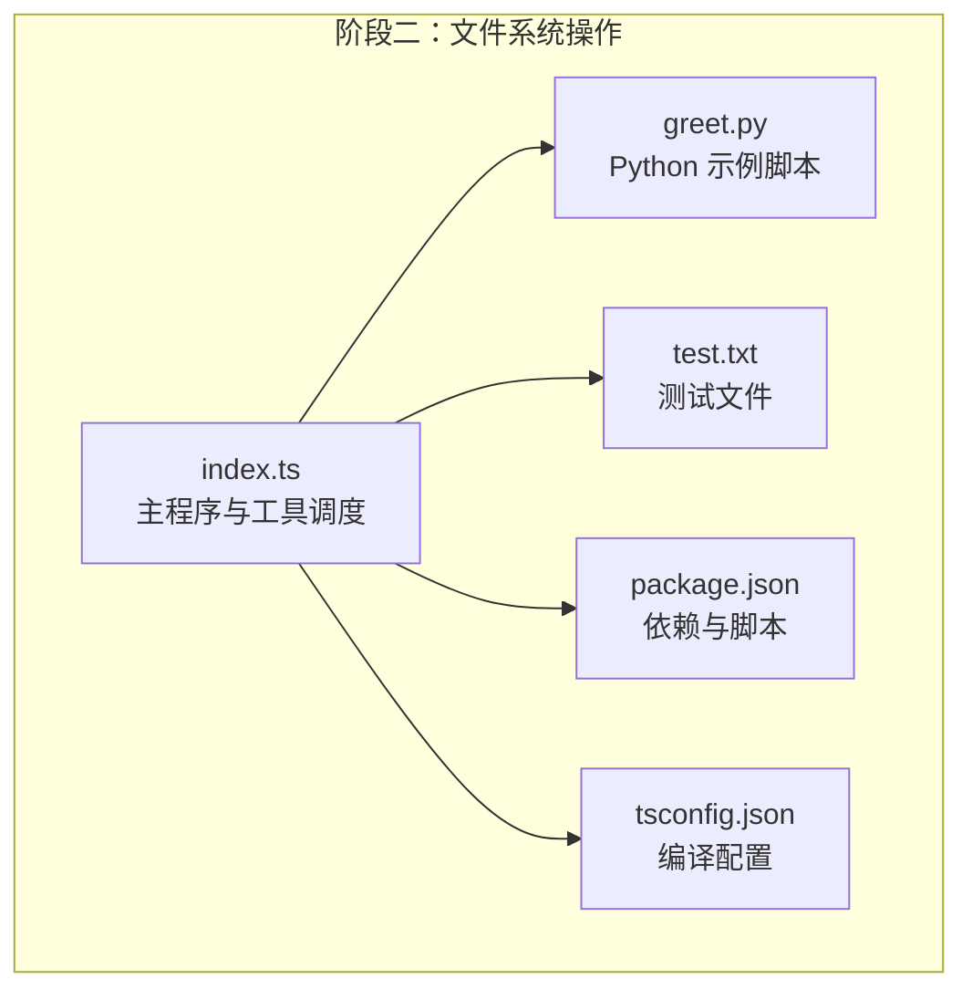
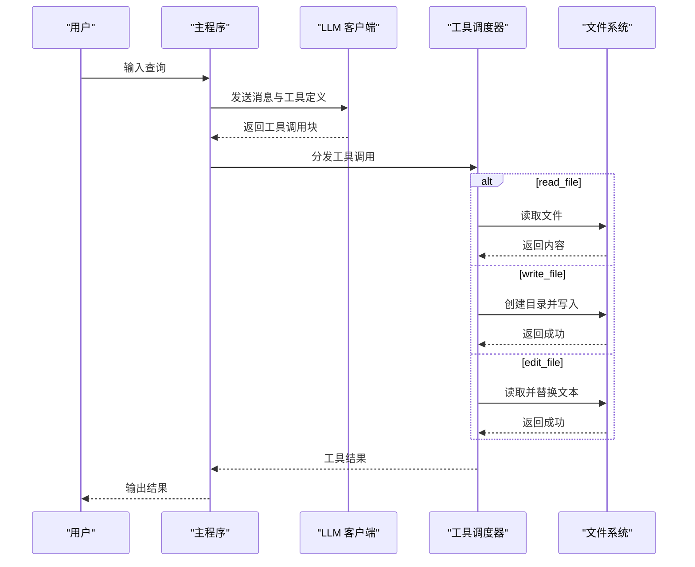
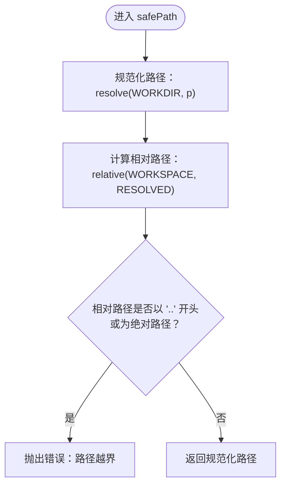
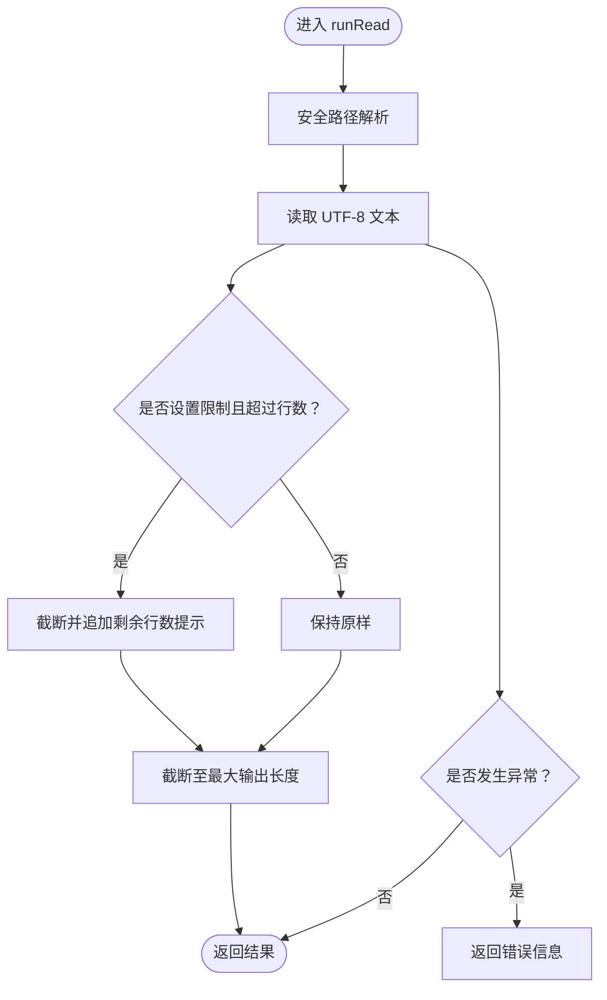
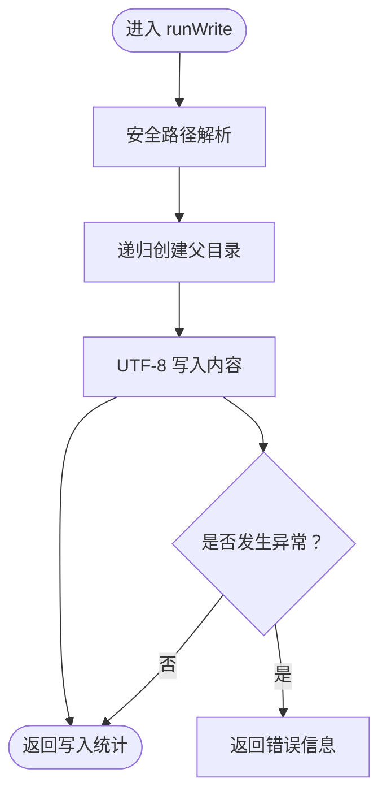
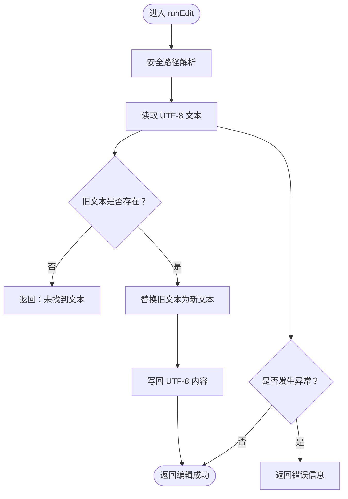
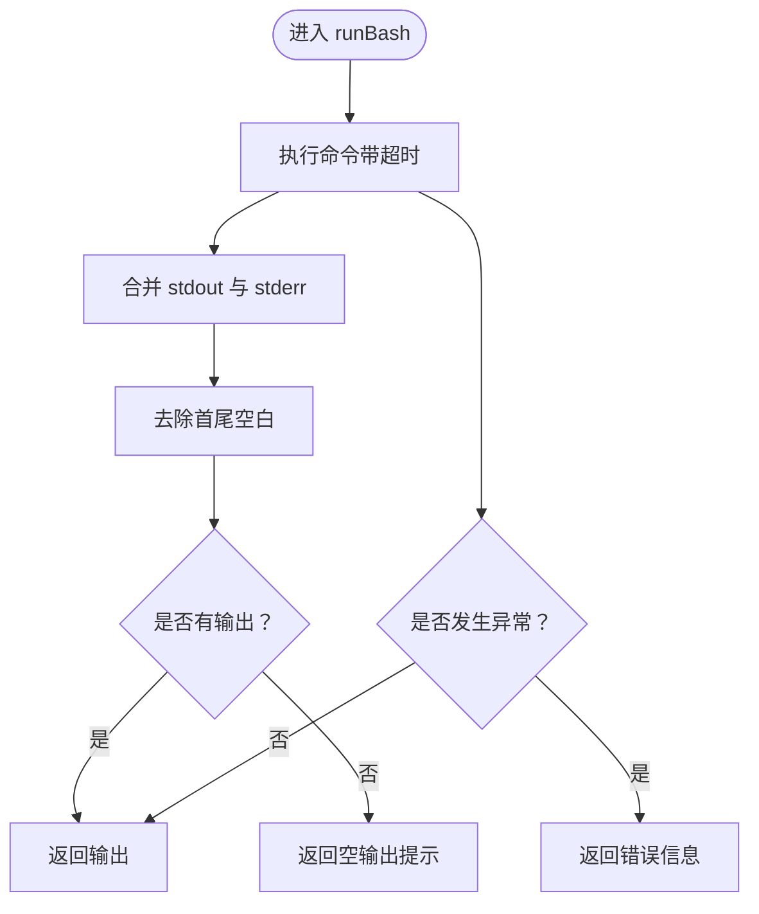
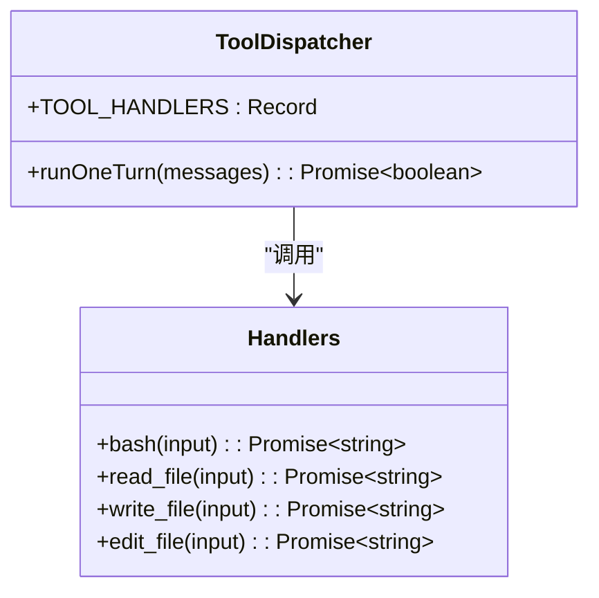
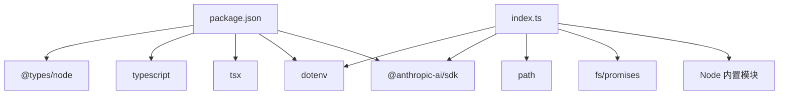

# 阶段二：文件系统操作

<cite>
**本文档引用的文件**
- [src/s02/index.ts](file://src/s02/index.ts)
- [src/s02/greet.py](file://src/s02/greet.py)
- [src/s02/test.txt](file://src/s02/test.txt)
- [src/s02/package.json](file://src/s02/package.json)
- [src/s02/tsconfig.json](file://src/s02/tsconfig.json)
- [SummaryStage/stage1.ts](file://SummaryStage/stage1.ts)
- [README.md](file://README.md)
</cite>

## 目录
1. [简介](#简介)
2. [项目结构](#项目结构)
3. [核心组件](#核心组件)
4. [架构总览](#架构总览)
5. [详细组件分析](#详细组件分析)
6. [依赖分析](#依赖分析)
7. [性能考虑](#性能考虑)
8. [故障排除指南](#故障排除指南)
9. [结论](#结论)
10. [附录](#附录)

## 简介
本阶段围绕“文件系统安全操作”展开，重点讲解以下主题：
- 安全路径解析机制：通过工作区边界校验，防范路径遍历攻击
- 文件读写与编辑工具：提供只读、写入、精确文本替换等能力
- 错误处理机制：统一捕获异常并返回可读的错误信息
- 安全最佳实践：权限最小化、输入校验、输出限制
- Python 脚本集成示例与测试文件使用方法

本阶段代码位于 src/s02，配套的 Python 示例脚本与测试文件均在此目录下。

**章节来源**
- [README.md:1-3](file://README.md#L1-L3)
- [SummaryStage/stage1.ts:8-14](file://SummaryStage/stage1.ts#L8-L14)

## 项目结构
src/s02 的关键文件与职责如下：
- index.ts：主程序入口，集成 LLM 对话、工具调度与文件系统操作
- greet.py：示例 Python 脚本，演示外部脚本调用与集成
- test.txt：测试文件，用于验证读写与编辑工具
- package.json：依赖与开发脚本配置
- tsconfig.json：TypeScript 编译选项

**图表来源**
- [src/s02/index.ts:1-213](file://src/s02/index.ts#L1-L213)
- [src/s02/greet.py:1-12](file://src/s02/greet.py#L1-L12)
- [src/s02/test.txt:1-1](file://src/s02/test.txt#L1-L1)
- [src/s02/package.json:1-23](file://src/s02/package.json#L1-L23)
- [src/s02/tsconfig.json:1-11](file://src/s02/tsconfig.json#L1-L11)

**章节来源**
- [src/s02/package.json:1-23](file://src/s02/package.json#L1-L23)
- [src/s02/tsconfig.json:1-11](file://src/s02/tsconfig.json#L1-L11)

## 核心组件
- 安全路径解析函数 safePath：对用户提供的相对路径进行规范化与边界检查，确保最终解析路径位于工作区之内
- 文件读取工具 runRead：读取 UTF-8 文本，支持行数限制与输出长度截断
- 文件写入工具 runWrite：自动创建父目录并写入 UTF-8 文本
- 文件编辑工具 runEdit：在文件中精确查找并替换指定文本
- Bash 工具 runBash：执行系统命令，带超时与输出合并
- 工具注册与调度：将工具名称映射到对应处理器，并在 LLM 返回工具调用块后执行

上述组件共同构成“安全文件系统操作”的核心能力，既满足实用需求，又严格遵循安全边界。

**章节来源**
- [src/s02/index.ts:37-48](file://src/s02/index.ts#L37-L48)
- [src/s02/index.ts:50-63](file://src/s02/index.ts#L50-L63)
- [src/s02/index.ts:65-74](file://src/s02/index.ts#L65-L74)
- [src/s02/index.ts:76-89](file://src/s02/index.ts#L76-L89)
- [src/s02/index.ts:92-104](file://src/s02/index.ts#L92-L104)
- [src/s02/index.ts:118-135](file://src/s02/index.ts#L118-L135)

## 架构总览
阶段二采用“LLM + 工具调度”的交互模式：用户通过标准输入发起查询，LLM 返回工具调用请求，工具调度器根据工具名分发到对应处理器，处理器完成文件系统操作后将结果返回给 LLM，形成多轮对话闭环。

**图表来源**
- [src/s02/index.ts:138-179](file://src/s02/index.ts#L138-L179)
- [src/s02/index.ts:118-135](file://src/s02/index.ts#L118-L135)

**章节来源**
- [src/s02/index.ts:181-213](file://src/s02/index.ts#L181-L213)

## 详细组件分析

### 安全路径解析机制
安全路径解析是防范路径遍历攻击的关键。其流程如下：
- 将用户输入的相对路径与工作区根目录拼接并规范化
- 计算规范化路径相对于工作区的相对路径
- 若相对路径以“..”开头或为绝对路径，则判定越界并抛出错误
- 否则返回规范化后的绝对路径

**图表来源**
- [src/s02/index.ts:37-48](file://src/s02/index.ts#L37-L48)

**章节来源**
- [src/s02/index.ts:37-48](file://src/s02/index.ts#L37-L48)

### 文件读取工具 runRead
- 输入：文件路径与可选行数限制
- 处理：先通过安全路径解析，再读取 UTF-8 文本
- 输出：若设置了限制且超过行数，则截断并提示剩余行数；最终输出受长度上限限制
- 错误：捕获异常并返回错误信息字符串

**图表来源**
- [src/s02/index.ts:50-63](file://src/s02/index.ts#L50-L63)

**章节来源**
- [src/s02/index.ts:50-63](file://src/s02/index.ts#L50-L63)

### 文件写入工具 runWrite
- 输入：文件路径与内容
- 处理：先通过安全路径解析，自动创建父目录，再以 UTF-8 写入
- 输出：返回写入字节数与目标路径
- 错误：捕获异常并返回错误信息字符串

**图表来源**
- [src/s02/index.ts:65-74](file://src/s02/index.ts#L65-L74)

**章节来源**
- [src/s02/index.ts:65-74](file://src/s02/index.ts#L65-L74)

### 文件编辑工具 runEdit
- 输入：文件路径、旧文本、新文本
- 处理：先通过安全路径解析，读取内容，确认旧文本存在后再进行替换写回
- 输出：返回编辑成功信息
- 错误：未找到旧文本或异常时返回错误信息字符串

**图表来源**
- [src/s02/index.ts:76-89](file://src/s02/index.ts#L76-L89)

**章节来源**
- [src/s02/index.ts:76-89](file://src/s02/index.ts#L76-L89)

### Bash 工具 runBash
- 输入：shell 命令
- 处理：执行命令，设置工作目录与超时时间，合并标准输出与错误输出
- 输出：返回命令输出或空输出提示
- 错误：捕获异常并返回错误信息字符串

**图表来源**
- [src/s02/index.ts:92-104](file://src/s02/index.ts#L92-L104)

**章节来源**
- [src/s02/index.ts:92-104](file://src/s02/index.ts#L92-L104)

### 工具注册与调度
- 工具定义：包含 bash、read_file、write_file、edit_file 四类工具及其输入模式
- 处理器映射：将工具名称映射到对应处理器
- 多轮调用：当 LLM 返回多个工具调用块时，依次执行并收集结果

**图表来源**
- [src/s02/index.ts:118-135](file://src/s02/index.ts#L118-L135)
- [src/s02/index.ts:138-179](file://src/s02/index.ts#L138-L179)

**章节来源**
- [src/s02/index.ts:118-135](file://src/s02/index.ts#L118-L135)
- [src/s02/index.ts:138-179](file://src/s02/index.ts#L138-L179)

## 依赖分析
- 运行时依赖：@anthropic-ai/sdk（LLM 客户端）、dotenv（环境变量加载）
- 开发依赖：tsx（TS 运行器）、typescript（类型系统）、@types/node（Node 类型）
- Node 内置模块：readline、process、child_process、util、path、fs/promises

**图表来源**
- [src/s02/package.json:13-22](file://src/s02/package.json#L13-L22)
- [src/s02/index.ts:11-18](file://src/s02/index.ts#L11-L18)

**章节来源**
- [src/s02/package.json:13-22](file://src/s02/package.json#L13-L22)
- [src/s02/index.ts:11-18](file://src/s02/index.ts#L11-L18)

## 性能考虑
- I/O 限制：读取与写入均为异步，避免阻塞主线程
- 输出截断：读取结果与工具输出均有限制长度，防止大文本导致内存压力
- 超时控制：Bash 命令执行设置超时，避免长时间阻塞
- 目录创建：写入前自动递归创建父目录，减少失败重试成本
- 文本替换：编辑工具仅进行一次替换，复杂场景建议使用更健壮的编辑策略

[本节为通用性能讨论，无需特定文件来源]

## 故障排除指南
- 路径越界错误：当路径包含“..”或解析后为绝对路径时触发。请使用相对路径并确保不指向工作区外
- 文件不存在：读取或编辑时若文件不存在会返回错误信息。请先确认文件路径正确
- 文本未找到：编辑工具要求旧文本必须存在于文件中，否则返回错误。请核对旧文本内容
- Bash 超时：命令执行超过设定超时会返回错误信息。请优化命令或拆分为更小步骤
- 权限不足：若无权限访问文件或目录，将返回错误信息。请检查文件权限与所属用户

**章节来源**
- [src/s02/index.ts:37-48](file://src/s02/index.ts#L37-L48)
- [src/s02/index.ts:50-63](file://src/s02/index.ts#L50-L63)
- [src/s02/index.ts:76-89](file://src/s02/index.ts#L76-L89)
- [src/s02/index.ts:92-104](file://src/s02/index.ts#L92-L104)

## 结论
阶段二通过“安全路径解析 + 文件系统工具 + 统一错误处理”的组合，构建了安全可靠的文件操作能力。该能力在保障安全的前提下，提供了读取、写入、编辑与命令执行等实用功能，适合在受限环境中与 LLM 协作完成自动化任务。

[本节为总结性内容，无需特定文件来源]

## 附录

### Python 脚本集成示例
- 示例脚本 greet.py 提供了一个简单的问候函数，可用于演示外部脚本调用与结果处理
- 可通过 Bash 工具运行 Python 脚本，或将脚本输出作为工具结果的一部分

**章节来源**
- [src/s02/greet.py:1-12](file://src/s02/greet.py#L1-L12)

### 测试文件使用方法
- test.txt 作为轻量测试文件，可用于验证读取与编辑工具
- 建议先读取文件确认内容，再进行写入或编辑操作，最后再次读取以验证结果

**章节来源**
- [src/s02/test.txt:1-1](file://src/s02/test.txt#L1-L1)

### 安全最佳实践
- 始终使用安全路径解析函数对用户输入进行校验
- 限制工具输出长度，避免大文本造成资源压力
- 为 Bash 命令设置合理超时，防止长时间阻塞
- 编辑工具应谨慎使用精确替换，必要时增加预检查与备份
- 最小权限原则：尽量以最低权限运行，避免不必要的系统命令

[本节为通用安全建议，无需特定文件来源]