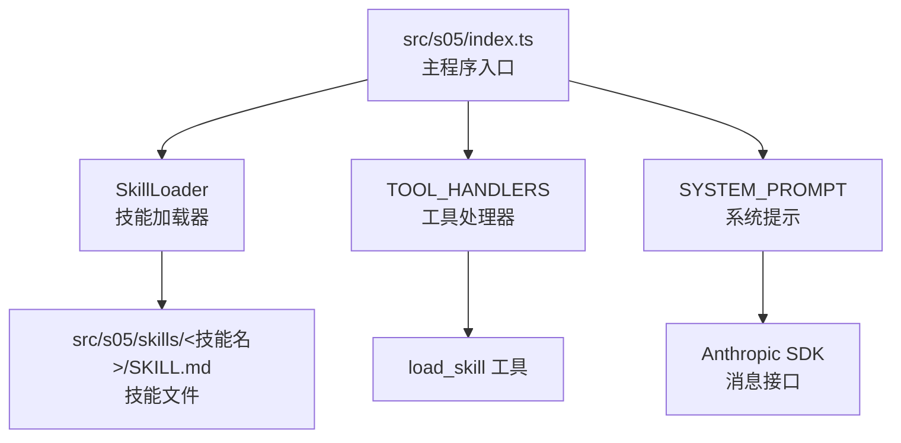
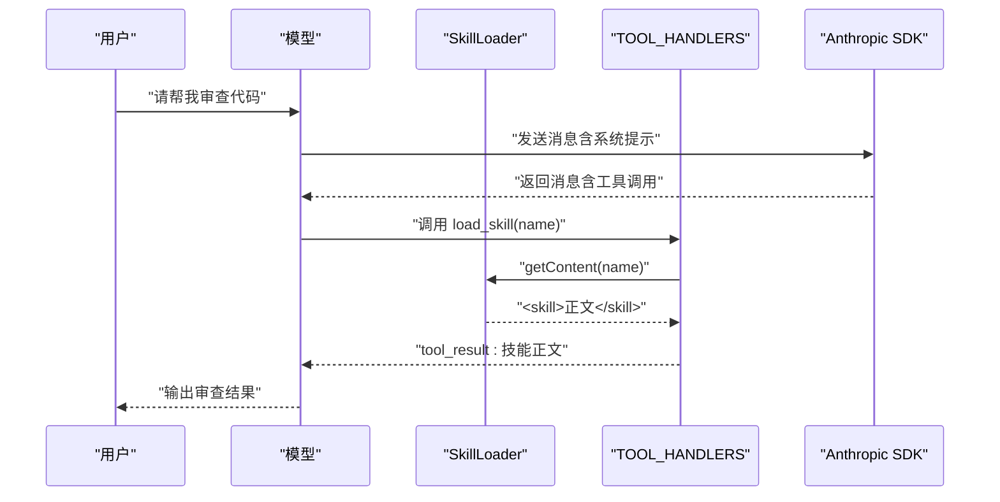
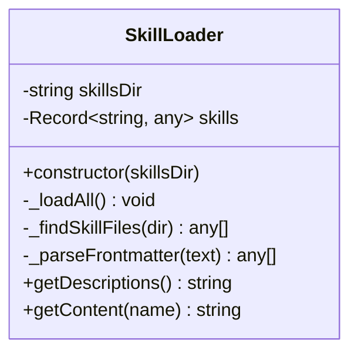
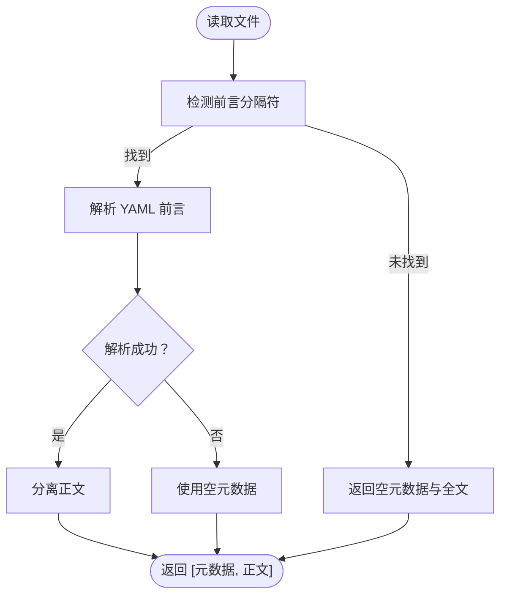
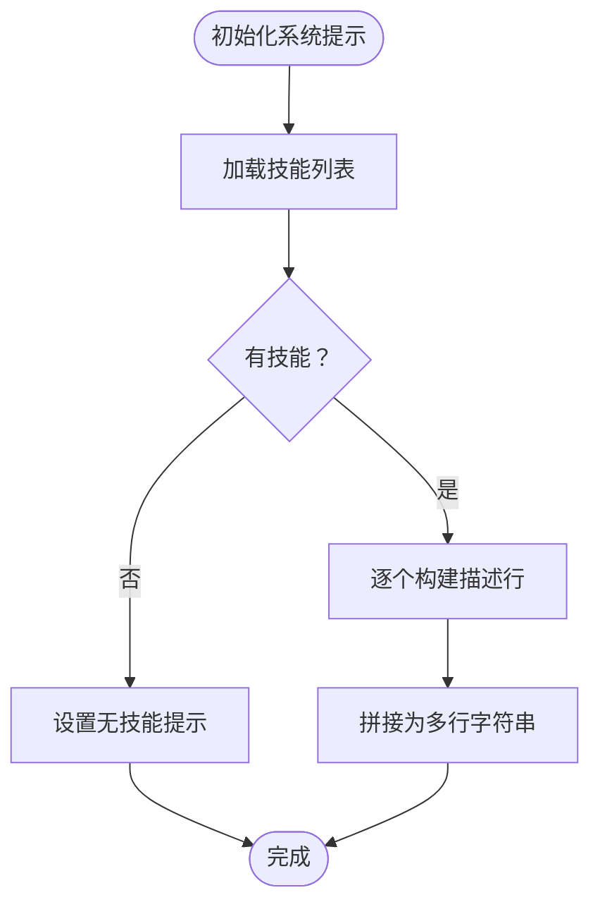
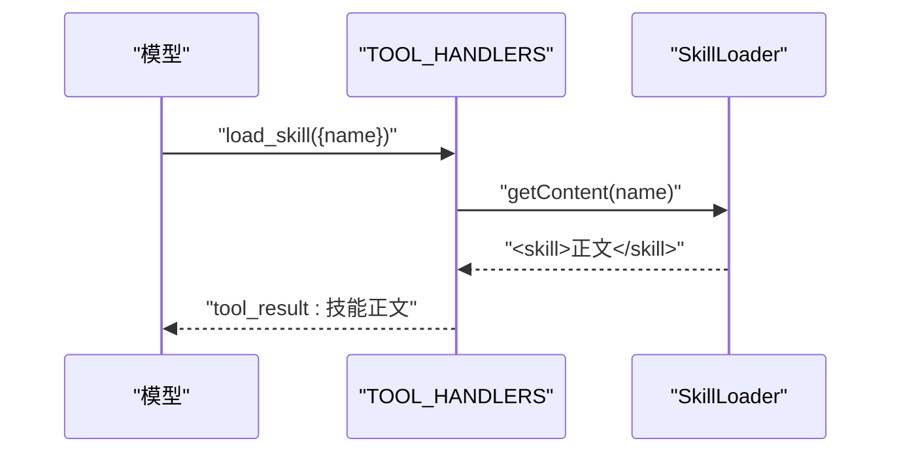
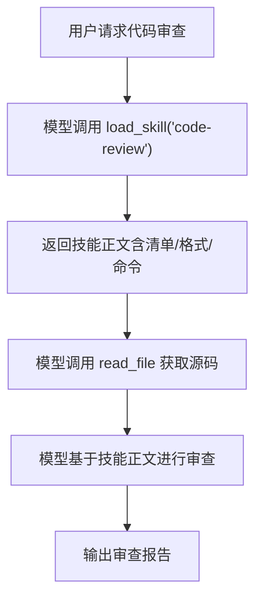
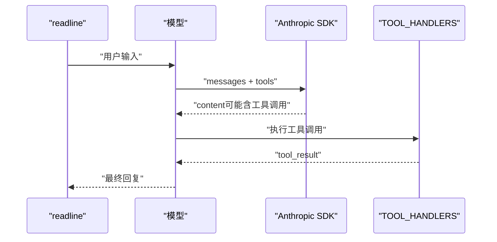
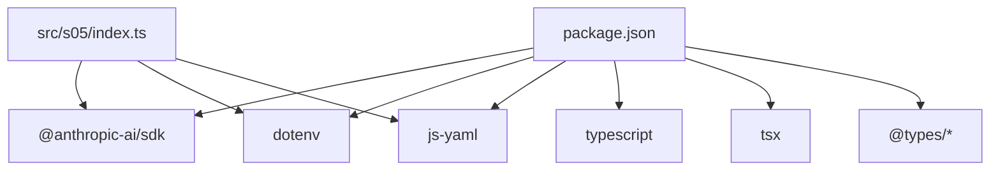

# 阶段五：技能系统

<cite>
**本文档引用的文件**
- [src/s05/index.ts](file://src/s05/index.ts)
- [src/s05/skills/code-reviews/SKILL.md](file://src/s05/skills/code-reviews/SKILL.md)
- [src/s05/package.json](file://src/s05/package.json)
- [src/s05/return.js](file://src/s05/return.js)
- [src/s05/tsconfig.json](file://src/s05/tsconfig.json)
- [package.json](file://package.json)
- [README.md](file://README.md)
</cite>

## 目录
1. [引言](#引言)
2. [项目结构](#项目结构)
3. [核心组件](#核心组件)
4. [架构总览](#架构总览)
5. [详细组件分析](#详细组件分析)
6. [依赖关系分析](#依赖关系分析)
7. [性能考虑](#性能考虑)
8. [故障排除指南](#故障排除指南)
9. [结论](#结论)
10. [附录](#附录)

## 引言
本阶段构建了“按需知识”（Harness）的技能加载系统，通过两层知识注入机制实现动态技能注入与调用：
- 层1：系统提示中仅注入技能元数据（名称、描述、标签），用于模型在对话开始时了解可用技能。
- 层2：当模型调用 `load_skill` 工具时，返回完整技能内容（技能正文），作为工具结果注入到后续对话中，指导模型执行具体任务。

该系统以 YAML 前言（frontmatter）解析为核心，支持在技能文件顶部声明元数据，并通过统一的 `SkillLoader` 类进行扫描、解析与缓存，最终由工具处理器将技能内容以结构化形式返回给模型。

## 项目结构
- 核心入口：src/s05/index.ts 实现了技能加载器、工具定义与对话循环。
- 技能目录：src/s05/skills 下的每个子目录包含一个 SKILL.md 文件，作为技能定义载体。
- 示例技能：src/s05/skills/code-reviews/SKILL.md 提供了完整的代码审查技能定义与工作流。
- 运行配置：src/s05/package.json 和 tsconfig.json 定义了运行环境与编译选项。
- 对话示例：src/s05/return.js 展示了从用户查询到模型调用工具再到生成代码审查报告的完整流程。

图表来源
- [src/s05/index.ts:46-142](file://src/s05/index.ts#L46-L142)
- [src/s05/index.ts:234-254](file://src/s05/index.ts#L234-L254)
- [src/s05/index.ts:146-151](file://src/s05/index.ts#L146-L151)

章节来源
- [src/s05/index.ts:1-332](file://src/s05/index.ts#L1-L332)
- [src/s05/package.json:1-23](file://src/s05/package.json#L1-L23)
- [src/s05/tsconfig.json:1-11](file://src/s05/tsconfig.json#L1-L11)

## 核心组件
- SkillLoader：负责扫描技能目录、解析 YAML 前言、缓存技能元数据与正文，并提供描述列表与内容获取能力。
- 工具定义与处理器：定义了 bash、read_file、write_file、edit_file、load_skill 等工具及其输入模式；load_skill 的处理器直接返回技能正文。
- 系统提示注入：在系统提示中注入技能元数据，使模型在对话前了解可用技能。
- 对话循环：根据模型的工具调用块执行相应处理器，将工具结果作为用户消息回传给模型。

章节来源
- [src/s05/index.ts:46-142](file://src/s05/index.ts#L46-L142)
- [src/s05/index.ts:234-254](file://src/s05/index.ts#L234-L254)
- [src/s05/index.ts:146-151](file://src/s05/index.ts#L146-L151)
- [src/s05/index.ts:257-298](file://src/s05/index.ts#L257-L298)

## 架构总览
技能系统采用“两层知识注入”模式：
- 层1（系统提示）：仅注入技能元数据（名称、描述、标签），帮助模型在对话开始时了解可用技能。
- 层2（工具结果）：当模型请求 `load_skill` 时，返回技能正文（包含工作流、检查清单、命令等），作为工具结果注入到对话中，指导模型完成具体任务。

图表来源
- [src/s05/index.ts:257-298](file://src/s05/index.ts#L257-L298)
- [src/s05/index.ts:243-254](file://src/s05/index.ts#L243-L254)
- [src/s05/index.ts:133-141](file://src/s05/index.ts#L133-L141)

## 详细组件分析

### SkillLoader 组件
SkillLoader 负责：
- 扫描技能目录，递归查找所有 SKILL.md 文件。
- 解析 YAML 前言（frontmatter），提取元数据（name、description、tags 等）。
- 缓存技能对象（包含元数据、正文与路径）。
- 生成系统提示中的技能描述列表。
- 按名称返回技能的完整正文（包裹在 `<skill>` 标签内）。

图表来源
- [src/s05/index.ts:46-142](file://src/s05/index.ts#L46-L142)

章节来源
- [src/s05/index.ts:46-142](file://src/s05/index.ts#L46-L142)

### YAML 前言解析机制
- 使用正则匹配 YAML 前言与正文分隔符（三横线）。
- 使用 js-yaml 库解析前言为对象，若解析失败则回退为空对象。
- 将解析后的元数据与正文分别存储，便于后续描述生成与内容返回。

图表来源
- [src/s05/index.ts:92-108](file://src/s05/index.ts#L92-L108)

章节来源
- [src/s05/index.ts:92-108](file://src/s05/index.ts#L92-L108)

### 系统提示注入与技能描述生成
- 在系统提示中列出所有可用技能的名称与描述，并可选显示标签。
- 描述生成逻辑遍历已加载的技能，优先使用元数据中的 description，否则使用默认文本。

图表来源
- [src/s05/index.ts:110-131](file://src/s05/index.ts#L110-L131)

章节来源
- [src/s05/index.ts:110-131](file://src/s05/index.ts#L110-L131)

### 工具定义与 load_skill 处理器
- 定义了多种工具（bash、read_file、write_file、edit_file、load_skill）及其输入模式。
- load_skill 处理器直接调用 SkillLoader.getContent 返回技能正文，并包裹在 `<skill>` 标签内，以便模型识别。

图表来源
- [src/s05/index.ts:243-254](file://src/s05/index.ts#L243-L254)
- [src/s05/index.ts:133-141](file://src/s05/index.ts#L133-L141)

章节来源
- [src/s05/index.ts:234-254](file://src/s05/index.ts#L234-L254)
- [src/s05/index.ts:133-141](file://src/s05/index.ts#L133-L141)

### 代码审查技能实现
- 技能文件：src/s05/skills/code-reviews/SKILL.md
- 结构要点：
  - YAML 前言包含 name、description 等元数据。
  - 正文包含审查清单、输出格式、常见模式、命令与工作流等。
- 使用方式：模型调用 load_skill("code-review") 后，返回技能正文，随后可结合 read_file 等工具读取目标文件并执行审查。

图表来源
- [src/s05/skills/code-reviews/SKILL.md:1-157](file://src/s05/skills/code-reviews/SKILL.md#L1-L157)
- [src/s05/index.ts:243-254](file://src/s05/index.ts#L243-L254)

章节来源
- [src/s05/skills/code-reviews/SKILL.md:1-157](file://src/s05/skills/code-reviews/SKILL.md#L1-L157)
- [src/s05/index.ts:243-254](file://src/s05/index.ts#L243-L254)

### 对话循环与工具调用
- runOneTurn：向模型发送消息（含系统提示与工具定义），接收模型的工具调用块，执行对应处理器并将结果作为用户消息回传。
- 支持连续工具调用，直到模型不再请求工具为止。

图表来源
- [src/s05/index.ts:257-298](file://src/s05/index.ts#L257-L298)

章节来源
- [src/s05/index.ts:257-298](file://src/s05/index.ts#L257-L298)

## 依赖关系分析
- 运行时依赖：
  - @anthropic-ai/sdk：与 Claude API 交互。
  - dotenv：加载环境变量。
  - js-yaml：解析 YAML 前言。
- 开发时依赖：
  - typescript、tsx、@types/*：类型与运行时支持。
- 项目级依赖：
  - package.json 中定义了脚本与依赖版本。

图表来源
- [package.json:1-25](file://package.json#L1-L25)
- [src/s05/package.json:1-23](file://src/s05/package.json#L1-L23)

章节来源
- [package.json:1-25](file://package.json#L1-L25)
- [src/s05/package.json:1-23](file://src/s05/package.json#L1-L23)

## 性能考虑
- 技能加载：SkillLoader 在初始化时一次性扫描并解析所有 SKILL.md，避免重复 IO；适合技能数量适中的场景。
- 文件读取：runRead 对大文件进行截断，但存在多字节字符被截断的风险，建议在后续版本中改进为按字节安全截断。
- 工具调用：load_skill 返回技能正文后，模型需要额外处理与分析，注意控制最大令牌数与工具调用次数，避免过度消耗资源。
- 命令执行：runBash 未做命令白名单或参数验证，存在命令注入风险，建议增加输入校验与沙箱限制。

## 故障排除指南
- 未知技能名称：当调用 load_skill 时，若技能不存在，会返回错误信息与可用技能列表，便于定位问题。
- 路径逃逸保护：safePath 会阻止访问工作区外的路径，若出现“路径逃逸”错误，请检查相对路径是否正确。
- 文件读取异常：runRead 在读取失败时返回错误信息，确认文件是否存在且具有读权限。
- 工具调用失败：检查 TOOL_HANDLERS 中对应工具的实现与输入参数是否符合 schema。
- 环境变量缺失：确保 ANTHROPIC_API_KEY、MODEL_ID 等必要环境变量已正确配置。

章节来源
- [src/s05/index.ts:133-141](file://src/s05/index.ts#L133-L141)
- [src/s05/index.ts:153-164](file://src/s05/index.ts#L153-L164)
- [src/s05/index.ts:166-179](file://src/s05/index.ts#L166-L179)
- [src/s05/index.ts:243-254](file://src/s05/index.ts#L243-L254)

## 结论
本阶段实现了灵活的技能加载与动态注入系统，通过 YAML 前言解析与两层知识注入，既能在系统提示中提供技能概览，又能在需要时按需加载完整技能内容。代码审查技能作为首个示例，展示了如何将领域知识结构化并融入模型工作流。后续可在以下方面进一步增强：
- 增强安全性：为 bash 等危险工具添加输入验证与沙箱限制。
- 提升健壮性：改进文件读取的多字节字符处理与错误类型化。
- 扩展能力：引入更多技能模板与元数据字段，支持更复杂的技能组合与条件加载。

## 附录

### 自定义技能开发指南
- 技能模板位置：在 src/s05/skills 下新建子目录，并在其中创建 SKILL.md。
- YAML 前言元数据：
  - name：技能唯一标识（与目录名一致更佳）。
  - description：技能简要描述，用于系统提示。
  - tags：可选标签，辅助分类与检索。
- 正文内容组织：
  - 明确的检查清单与输出格式，便于模型遵循。
  - 提供常用命令与参考示例，提升实用性。
  - 包含工作流步骤，指导模型逐步完成任务。
- 集成方法：
  - 无需修改主程序，新增 SKILL.md 即可自动被 SkillLoader 发现与加载。
  - 通过 load_skill 工具按需获取技能正文，结合其他工具完成任务。

章节来源
- [src/s05/index.ts:75-90](file://src/s05/index.ts#L75-L90)
- [src/s05/index.ts:92-108](file://src/s05/index.ts#L92-L108)
- [src/s05/skills/code-reviews/SKILL.md:1-157](file://src/s05/skills/code-reviews/SKILL.md#L1-L157)

### 最佳实践
- 使用明确的技能命名与描述，保持元数据简洁准确。
- 将复杂流程拆分为清晰的步骤与检查点，减少模型推理负担。
- 为工具调用提供示例输入与预期输出，降低歧义。
- 对于高风险工具（如 bash），务必加入输入验证与安全限制。
- 在大型文件处理中，优先考虑流式读取与分块处理，避免内存压力。