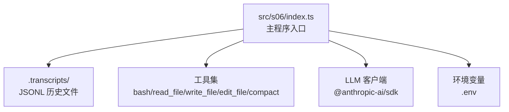
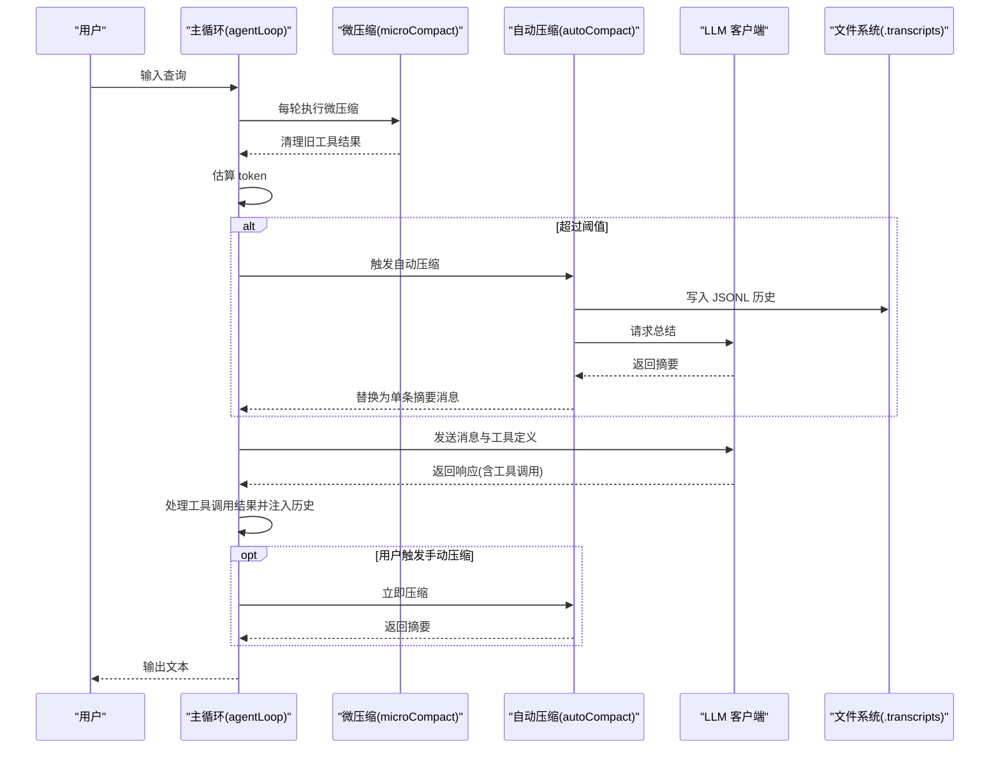
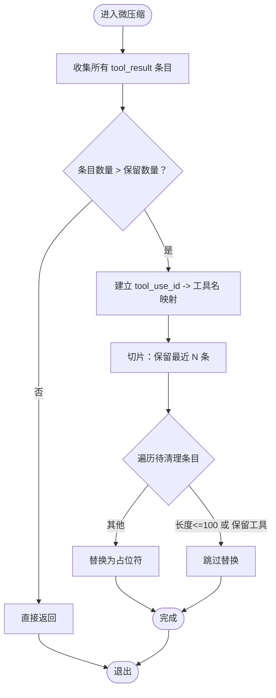
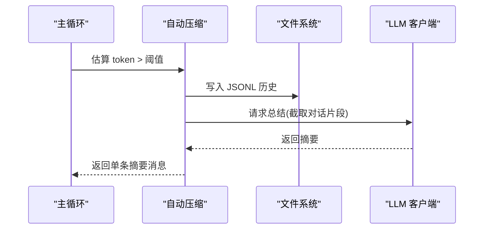
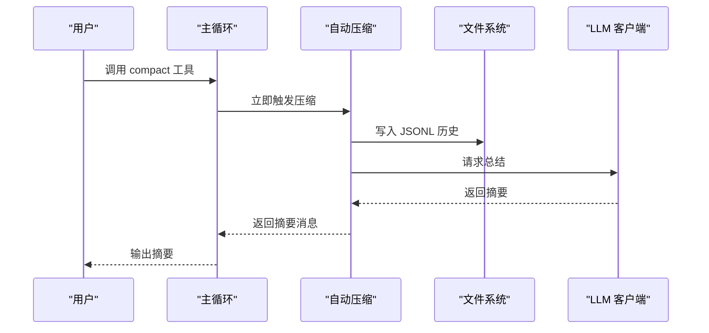
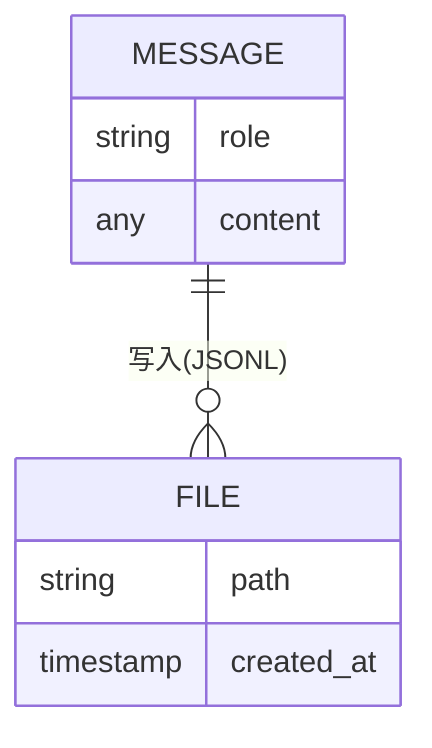
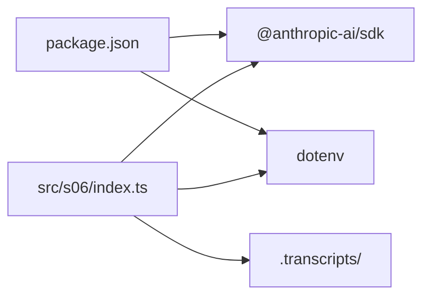

# 阶段六：内存管理

<cite>
**本文引用的文件**
- [src/s06/index.ts](file://src/s06/index.ts)
- [src/s06/package.json](file://src/s06/package.json)
- [src/s06/tsconfig.json](file://src/s06/tsconfig.json)
- [src/s06/return.js](file://src/s06/return.js)
- [src/s06/.transcripts/transcript_1777018931.jsonl](file://src/s06/.transcripts/transcript_1777018931.jsonl)
- [SummaryStage/stage1.ts](file://SummaryStage/stage1.ts)
</cite>

## 目录
1. [引言](#引言)
2. [项目结构](#项目结构)
3. [核心组件](#核心组件)
4. [架构总览](#架构总览)
5. [详细组件分析](#详细组件分析)
6. [依赖关系分析](#依赖关系分析)
7. [性能考量](#性能考量)
8. [故障排查指南](#故障排查指南)
9. [结论](#结论)
10. [附录](#附录)

## 引言
本教程聚焦于阶段六的“内存管理”主题，系统讲解三层次内存压缩策略与对话历史持久化机制。通过微压缩、自动压缩与手动压缩的组合，实现对长会话的持续清理与上下文窗口控制；通过 JSONL 文件持久化对话历史，确保在压缩后仍可回溯与审计。教程同时提供性能监控、存储管理与故障恢复的最佳实践，帮助读者在长时间运行的 AI 代理会话中稳定地管理资源。

## 项目结构
阶段六位于 src/s06，核心入口为 index.ts，负责：
- 三层次压缩策略的执行与调度
- 对话历史的持久化（.transcripts 目录下的 JSONL 文件）
- 工具调用与 LLM 交互的主循环

图表来源
- [src/s06/index.ts:370-413](file://src/s06/index.ts#L370-L413)
- [src/s06/package.json:13-21](file://src/s06/package.json#L13-L21)

章节来源
- [src/s06/index.ts:1-50](file://src/s06/index.ts#L1-L50)
- [src/s06/package.json:1-23](file://src/s06/package.json#L1-L23)
- [src/s06/tsconfig.json:1-11](file://src/s06/tsconfig.json#L1-L11)

## 核心组件
- 三层次压缩策略
  - 微压缩（每轮执行）：精简旧工具结果，保留最近若干条与特定工具结果
  - 自动压缩（阈值触发）：当 token 估算超过阈值时，保存完整历史并用 LLM 总结替换
  - 手动压缩（按需触发）：通过工具调用立即触发自动压缩
- 对话历史持久化
  - 使用 JSONL 格式逐条写入，便于后续检索与审计
  - 自动生成带时间戳的文件名，避免覆盖
- 工具集与安全
  - 安全路径校验，防止路径穿越
  - 工具调用结果注入到消息历史，供后续压缩策略处理

章节来源
- [src/s06/index.ts:72-138](file://src/s06/index.ts#L72-L138)
- [src/s06/index.ts:149-196](file://src/s06/index.ts#L149-L196)
- [src/s06/index.ts:280-301](file://src/s06/index.ts#L280-L301)
- [src/s06/index.ts:303-367](file://src/s06/index.ts#L303-L367)

## 架构总览
下图展示了 s06 的内存压缩与历史持久化在主循环中的位置与交互。

图表来源
- [src/s06/index.ts:303-367](file://src/s06/index.ts#L303-L367)
- [src/s06/index.ts:149-196](file://src/s06/index.ts#L149-L196)

## 详细组件分析

### 一、微压缩（Layer 1：每轮执行）
微压缩的目标是在不显著影响上下文质量的前提下，尽可能减少冗余的历史内容，特别是工具调用结果。其工作流程如下：
- 收集所有工具结果条目及其在消息数组中的位置
- 若工具结果数量不超过保留数量，则直接返回
- 建立工具调用 ID 到工具名称的映射（从助手消息的工具调用块中提取）
- 清理除最近若干条以外的工具结果，仅对较长的结果进行替换
- 特定工具（如 read_file）的结果被保留，避免重复读取带来的额外开销

图表来源
- [src/s06/index.ts:82-138](file://src/s06/index.ts#L82-L138)

章节来源
- [src/s06/index.ts:72-138](file://src/s06/index.ts#L72-L138)

### 二、自动压缩（Layer 2：阈值触发）
当估算的 token 数超过阈值时，自动触发压缩。该过程包括：
- 保存完整历史到 .transcripts 目录（JSONL 格式），文件名包含时间戳
- 向 LLM 请求对对话进行总结（包含已完成、当前状态、关键决策），并截取最后若干字符作为输入
- 用单条包含摘要与历史文件路径的消息替换整个历史

图表来源
- [src/s06/index.ts:149-196](file://src/s06/index.ts#L149-L196)

章节来源
- [src/s06/index.ts:149-196](file://src/s06/index.ts#L149-L196)

### 三、手动压缩（Layer 3：按需触发）
用户可在对话中调用 compact 工具触发手动压缩，流程与自动压缩一致，区别在于触发时机由用户决定。

图表来源
- [src/s06/index.ts:334-365](file://src/s06/index.ts#L334-L365)
- [src/s06/index.ts:149-196](file://src/s06/index.ts#L149-L196)

章节来源
- [src/s06/index.ts:280-301](file://src/s06/index.ts#L280-L301)
- [src/s06/index.ts:334-365](file://src/s06/index.ts#L334-L365)

### 四、对话历史持久化与检索
- 存储格式：JSONL（每行一条 JSON 对象），字段包含 role 与 content
- 组织方式：按时间顺序写入，文件名包含时间戳，便于排序与检索
- 检索机制：通过文件名或内容解析进行定位；摘要消息中包含历史文件路径，便于回溯

图表来源
- [src/s06/.transcripts/transcript_1777018931.jsonl:1-8](file://src/s06/.transcripts/transcript_1777018931.jsonl#L1-L8)
- [src/s06/index.ts:153-162](file://src/s06/index.ts#L153-L162)

章节来源
- [src/s06/.transcripts/transcript_1777018931.jsonl:1-8](file://src/s06/.transcripts/transcript_1777018931.jsonl#L1-L8)
- [src/s06/index.ts:153-162](file://src/s06/index.ts#L153-L162)

### 五、工具与安全
- 工具集：bash、read_file、write_file、edit_file、compact
- 安全路径校验：所有文件操作前均进行路径合法性检查，防止路径穿越
- 错误处理：工具调用异常被捕获并以错误消息形式注入历史

章节来源
- [src/s06/index.ts:280-301](file://src/s06/index.ts#L280-L301)
- [src/s06/index.ts:199-251](file://src/s06/index.ts#L199-L251)

## 依赖关系分析
- 外部依赖
  - @anthropic-ai/sdk：用于与 LLM 交互
  - dotenv：加载环境变量
- 内部模块
  - index.ts：主程序、压缩策略、工具集、主循环
  - .transcripts：历史文件目录（由自动压缩创建）

图表来源
- [src/s06/package.json:13-21](file://src/s06/package.json#L13-L21)
- [src/s06/index.ts:31-36](file://src/s06/index.ts#L31-L36)

章节来源
- [src/s06/package.json:1-23](file://src/s06/package.json#L1-L23)
- [src/s06/index.ts:31-36](file://src/s06/index.ts#L31-L36)

## 性能考量
- token 估算
  - 采用字符串化后按字符数估算 token 数量，简单高效，适合动态阈值控制
  - 估算精度受消息结构与文本长度影响，建议结合实际模型上下文长度进行调优
- 压缩策略权衡
  - 微压缩：每轮执行，成本低，适合持续清理冗余工具结果
  - 自动压缩：成本较高，但能显著降低上下文长度，适合长会话
  - 手动压缩：用户可控，适合在关键节点进行快速清理
- I/O 与存储
  - JSONL 写入为顺序写，性能良好；建议定期清理旧历史文件，避免目录膨胀
- 并发与稳定性
  - 工具调用与 LLM 请求可能阻塞，建议在高并发场景下引入队列与限流

[本节为通用性能指导，无需特定文件来源]

## 故障排查指南
- 常见问题与定位
  - 自动压缩未触发：检查 token 估算逻辑与阈值设置，确认 messages 结构正确
  - JSONL 写入失败：检查 .transcripts 目录权限与磁盘空间
  - 工具调用异常：查看工具处理函数的错误捕获与返回
- 排错步骤
  - 打印 messages 结构与 token 估算结果，确认是否符合预期
  - 检查 LLM 请求参数与返回内容，确认摘要生成成功
  - 验证安全路径校验逻辑，避免路径穿越导致的文件访问失败
- 恢复建议
  - 若压缩后丢失关键信息，可从 .transcripts 中读取历史文件进行回溯
  - 对频繁失败的工具调用，建议增加重试与降级策略

章节来源
- [src/s06/index.ts:303-367](file://src/s06/index.ts#L303-L367)
- [src/s06/index.ts:149-196](file://src/s06/index.ts#L149-L196)
- [src/s06/index.ts:199-251](file://src/s06/index.ts#L199-L251)

## 结论
阶段六通过三层次压缩策略与 JSONL 历史持久化，实现了对长会话的高效内存管理。微压缩保证每轮的轻量清理，自动压缩在阈值触发时进行深度压缩，手动压缩则赋予用户更高的控制力。配合安全路径校验与错误处理，该方案在保证功能完整性的同时，兼顾了性能与稳定性。建议在实际部署中结合业务场景调整阈值与保留策略，并建立完善的日志与监控体系。

[本节为总结性内容，无需特定文件来源]

## 附录

### A. 实际案例：长时间运行的 AI 代理会话
- 场景描述：代理需要持续与用户交互，涉及大量文件读写与工具调用，上下文不断增长
- 实施步骤
  - 启动主循环，每轮先执行微压缩
  - 当 token 估算超过阈值时，触发自动压缩并保存历史
  - 用户在关键节点调用 compact 工具进行手动压缩
  - 定期清理 .transcripts 中的历史文件，释放磁盘空间
- 关键收益
  - 上下文长度稳定，避免超出模型上下文限制
  - 历史可追溯，便于审计与回放

章节来源
- [src/s06/index.ts:303-367](file://src/s06/index.ts#L303-L367)
- [src/s06/index.ts:149-196](file://src/s06/index.ts#L149-L196)

### B. 与完整框架对比（来自 stage1.ts）
- 相同点
  - 三层次压缩策略与 JSONL 历史保存机制一致
  - 工具集与安全路径校验逻辑相似
- 差异点
  - s06 的实现更简洁，专注于内存管理与历史持久化
  - stage1.ts 展示了更完整的框架集成（技能系统、子代理等），可作为扩展参考

章节来源
- [SummaryStage/stage1.ts:487-599](file://SummaryStage/stage1.ts#L487-L599)
- [SummaryStage/stage1.ts:826-865](file://SummaryStage/stage1.ts#L826-L865)