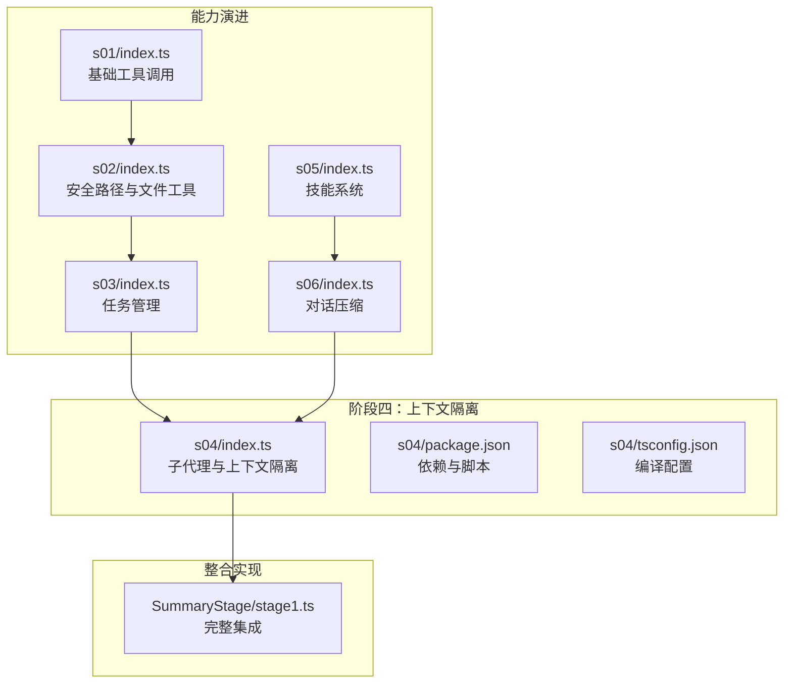
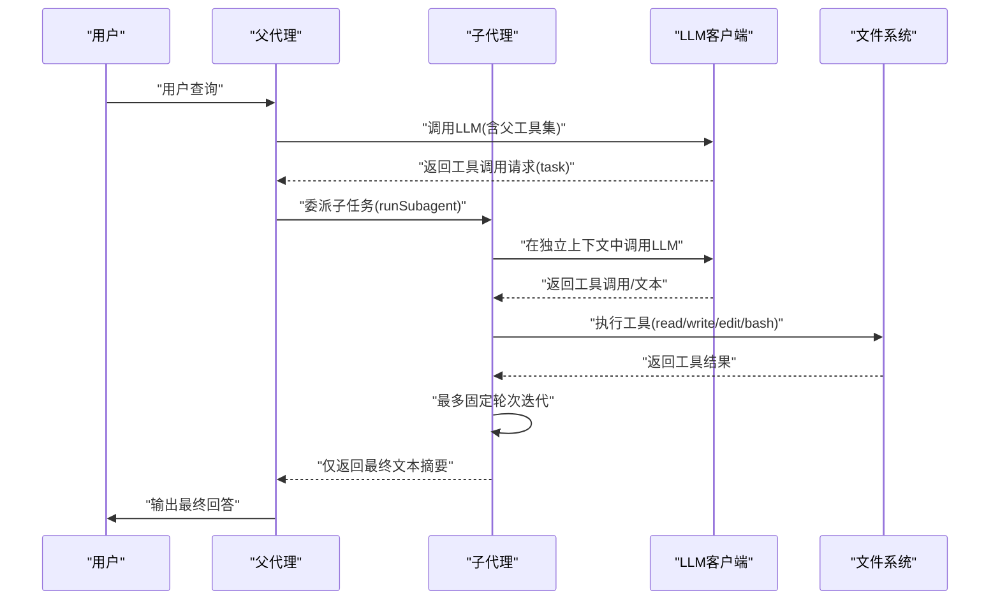
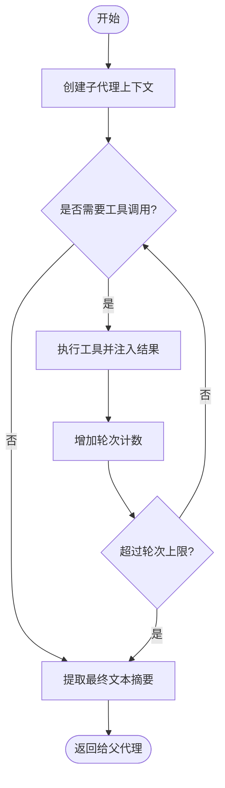
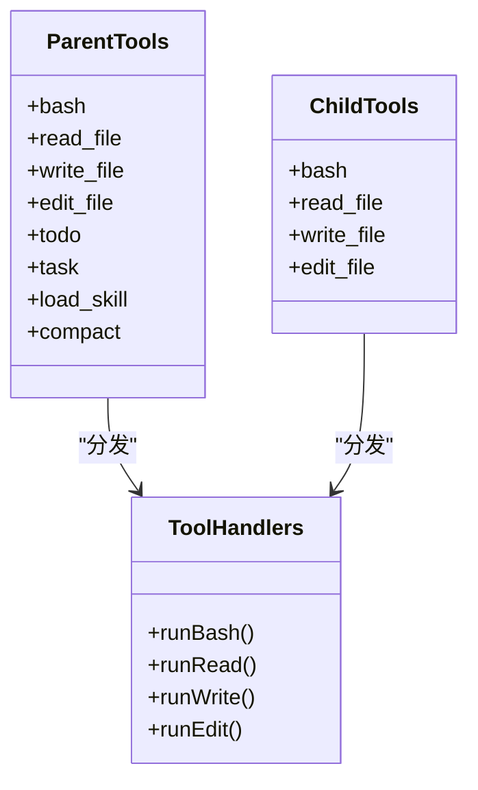
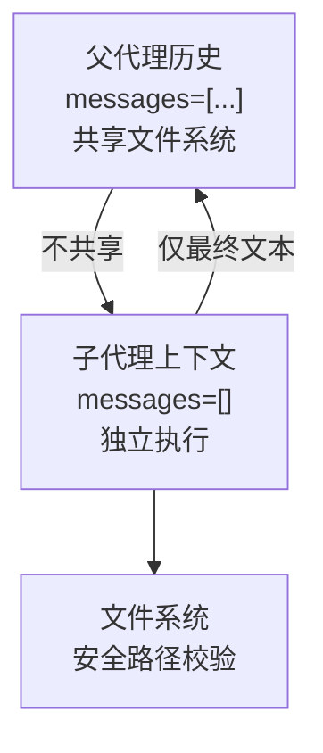
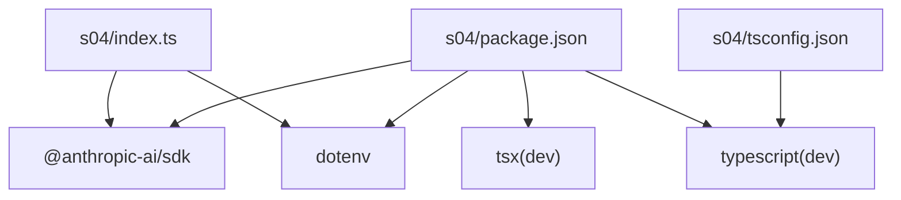

# 阶段四：上下文隔离

<cite>
**本文档引用的文件**
- [src/s04/index.ts](file://src/s04/index.ts)
- [src/s04/package.json](file://src/s04/package.json)
- [src/s04/tsconfig.json](file://src/s04/tsconfig.json)
- [src/s01/index.ts](file://src/s01/index.ts)
- [src/s02/index.ts](file://src/s02/index.ts)
- [src/s03/index.ts](file://src/s03/index.ts)
- [src/s05/index.ts](file://src/s05/index.ts)
- [src/s06/index.ts](file://src/s06/index.ts)
- [SummaryStage/stage1.ts](file://SummaryStage/stage1.ts)
</cite>

## 目录
1. [引言](#引言)
2. [项目结构](#项目结构)
3. [核心组件](#核心组件)
4. [架构总览](#架构总览)
5. [详细组件分析](#详细组件分析)
6. [依赖关系分析](#依赖关系分析)
7. [性能考量](#性能考量)
8. [故障排查指南](#故障排查指南)
9. [结论](#结论)
10. [附录](#附录)

## 引言
本阶段聚焦“上下文隔离”，目标是通过子代理架构实现完全隔离的执行环境，保护父代理的对话历史不受子任务污染。核心思想是“进程隔离带来上下文隔离”，即子代理在独立的消息上下文中运行，仅将最终摘要返回给父代理，从而避免工具调用痕迹进入父代理的历史。

该实现贯穿 s01–s06 的演进路径，从基础工具调用逐步引入安全路径校验、任务管理、技能系统与对话压缩，最终在 s04 中完成上下文隔离与子代理生命周期管理。

## 项目结构
- s04 目录包含独立的上下文隔离实现，提供子代理创建、工具调用与结果汇总。
- 其他阶段文件展示了能力的逐步叠加：s01 基础工具调用；s02 安全路径校验与文件工具；s03 任务管理；s05 技能系统；s06 对话压缩。
- SummaryStage/stage1.ts 整合了全部能力，包含子代理系统的完整实现与注释。

图表来源
- [src/s04/index.ts:1-314](file://src/s04/index.ts#L1-L314)
- [src/s01/index.ts:1-158](file://src/s01/index.ts#L1-L158)
- [src/s02/index.ts:1-213](file://src/s02/index.ts#L1-L213)
- [src/s03/index.ts:1-335](file://src/s03/index.ts#L1-L335)
- [src/s05/index.ts:1-332](file://src/s05/index.ts#L1-L332)
- [src/s06/index.ts:1-413](file://src/s06/index.ts#L1-L413)
- [SummaryStage/stage1.ts:1-981](file://SummaryStage/stage1.ts#L1-L981)

章节来源
- [src/s04/index.ts:1-314](file://src/s04/index.ts#L1-L314)
- [src/s04/package.json:1-23](file://src/s04/package.json#L1-L23)
- [src/s04/tsconfig.json:1-11](file://src/s04/tsconfig.json#L1-L11)

## 核心组件
- 子代理运行器：在独立上下文中执行任务，最多进行固定轮次的工具调用，仅返回最终文本摘要。
- 工具集划分：父代理工具集包含任务委派；子代理工具集排除任务委派，防止递归生成子代理。
- 上下文隔离策略：子代理使用全新消息数组，不共享父代理的历史；只将最终文本返回给父代理。
- 生命周期与轮次限制：子代理最多执行固定轮次，避免无限工具调用导致的资源耗尽。
- 结果过滤与安全：仅提取文本块，丢弃工具调用痕迹，确保父代理历史干净。

章节来源
- [src/s04/index.ts:136-195](file://src/s04/index.ts#L136-L195)
- [src/s04/index.ts:197-216](file://src/s04/index.ts#L197-L216)
- [src/s04/index.ts:148-195](file://src/s04/index.ts#L148-L195)

## 架构总览
上下文隔离通过“子代理”实现，父代理负责任务委派与最终结果汇总，子代理在独立上下文中完成具体工作并返回摘要。

图表来源
- [src/s04/index.ts:148-195](file://src/s04/index.ts#L148-L195)
- [src/s04/index.ts:220-279](file://src/s04/index.ts#L220-L279)

## 详细组件分析

### 子代理生命周期与状态同步
- 初始化：子代理接收用户提示，创建全新消息数组作为初始上下文。
- 迭代执行：每轮调用 LLM，若返回需要工具调用，则执行相应工具并将结果注入子代理上下文。
- 轮次限制：最多执行固定轮次，防止无限循环。
- 结果汇总：仅提取文本块，丢弃工具调用痕迹，返回最终摘要给父代理。
- 状态同步：子代理不维护外部状态，每次调用都是独立的上下文实例。

图表来源
- [src/s04/index.ts:148-195](file://src/s04/index.ts#L148-L195)

章节来源
- [src/s04/index.ts:148-195](file://src/s04/index.ts#L148-L195)

### 工具集与权限分离
- 父代理工具集：包含基础工具与专属工具（如任务委派、技能加载、手动压缩等）。
- 子代理工具集：仅包含基础工具，排除任务委派，防止递归生成子代理。
- 工具处理器：统一映射到对应处理函数，确保调用链清晰可控。

图表来源
- [src/s04/index.ts:136-146](file://src/s04/index.ts#L136-L146)
- [src/s04/index.ts:197-216](file://src/s04/index.ts#L197-L216)
- [src/s04/index.ts:116-122](file://src/s04/index.ts#L116-L122)

章节来源
- [src/s04/index.ts:116-122](file://src/s04/index.ts#L116-L122)
- [src/s04/index.ts:136-146](file://src/s04/index.ts#L136-L146)
- [src/s04/index.ts:197-216](file://src/s04/index.ts#L197-L216)

### 上下文隔离与历史保护机制
- 独立上下文：子代理使用全新消息数组，不继承父代理的历史。
- 历史保护：仅最终文本返回父代理，工具调用痕迹被丢弃。
- 文件系统共享：子代理与父代理共享同一工作目录，保证文件访问一致性。
- 路径安全：通过安全路径校验防止路径逃逸，确保文件操作安全。

图表来源
- [src/s04/index.ts:148-195](file://src/s04/index.ts#L148-L195)
- [src/s04/index.ts:47-58](file://src/s04/index.ts#L47-L58)

章节来源
- [src/s04/index.ts:47-58](file://src/s04/index.ts#L47-L58)
- [src/s04/index.ts:148-195](file://src/s04/index.ts#L148-L195)

### 实际使用场景与配置示例
- 场景一：复杂任务拆分
  - 父代理接收用户查询，识别为多步任务，调用任务委派工具生成子代理。
  - 子代理在独立上下文中执行具体步骤，完成后仅返回摘要。
  - 父代理将摘要整合为最终回答。
- 场景二：文件系统探索
  - 子代理在独立上下文中读取/编辑文件，避免污染父代理历史。
  - 父代理仅获得最终结论，不暴露中间工具调用细节。
- 配置要点
  - 确保 ANTHROPIC_API_KEY、ANTHROPIC_BASE_URL、MODEL_ID 等环境变量已设置。
  - 子代理工具集应排除任务委派，防止递归。
  - 设置合理的轮次上限，避免长时间占用资源。

章节来源
- [src/s04/index.ts:148-195](file://src/s04/index.ts#L148-L195)
- [src/s04/index.ts:220-279](file://src/s04/index.ts#L220-L279)
- [src/s04/package.json:13-21](file://src/s04/package.json#L13-L21)

### 与其他阶段的协同
- 与 s02 的协作：子代理沿用安全路径校验与文件工具，确保文件操作安全。
- 与 s03 的协作：父代理可结合任务管理，指导子代理按计划执行。
- 与 s05 的协作：子代理可按需加载技能知识，提升任务完成质量。
- 与 s06 的协作：父代理可对历史进行压缩，保持上下文窗口稳定。

章节来源
- [src/s02/index.ts:37-48](file://src/s02/index.ts#L37-L48)
- [src/s03/index.ts:77-131](file://src/s03/index.ts#L77-L131)
- [src/s05/index.ts:46-144](file://src/s05/index.ts#L46-L144)
- [src/s06/index.ts:149-196](file://src/s06/index.ts#L149-L196)

## 依赖关系分析
- 运行时依赖：@anthropic-ai/sdk 用于与 LLM 交互；dotenv 用于加载环境变量。
- 开发依赖：tsx 用于开发时热重载；typescript 与 tsconfig.json 提供类型检查与编译配置。
- 代码依赖：子代理实现依赖工具集与安全路径校验；父代理工具集扩展子代理工具集并添加专属工具。

图表来源
- [src/s04/index.ts:18-25](file://src/s04/index.ts#L18-L25)
- [src/s04/package.json:13-21](file://src/s04/package.json#L13-L21)
- [src/s04/tsconfig.json:2-9](file://src/s04/tsconfig.json#L2-L9)

章节来源
- [src/s04/package.json:13-21](file://src/s04/package.json#L13-L21)
- [src/s04/tsconfig.json:2-9](file://src/s04/tsconfig.json#L2-L9)

## 性能考量
- 轮次限制：子代理最多执行固定轮次，避免长时间占用 LLM 资源。
- 结果截断：工具结果与最终文本均设置长度上限，防止超长输出影响性能。
- 历史精简：父代理侧可结合微压缩与自动压缩，控制上下文大小。
- 超时控制：命令执行设置超时，避免阻塞。
- 并发与资源：子代理独立运行，减少相互干扰；合理设置并发数量以平衡吞吐与稳定性。

章节来源
- [src/s04/index.ts:102-114](file://src/s04/index.ts#L102-L114)
- [src/s04/index.ts:197-216](file://src/s04/index.ts#L197-L216)
- [src/s06/index.ts:59-61](file://src/s06/index.ts#L59-L61)
- [src/s06/index.ts:82-138](file://src/s06/index.ts#L82-L138)
- [src/s06/index.ts:150-196](file://src/s06/index.ts#L150-L196)

## 故障排查指南
- 路径逃逸错误
  - 现象：文件操作报错，提示路径逃逸。
  - 排查：确认传入路径位于工作目录范围内；检查安全路径校验逻辑。
- 工具调用失败
  - 现象：工具返回错误信息。
  - 排查：检查工具输入参数；确认命令执行权限与超时设置。
- 子代理未返回最终文本
  - 现象：父代理收到空结果或工具调用痕迹。
  - 排查：确认子代理仅提取文本块；检查轮次上限与 stop_reason。
- 环境变量缺失
  - 现象：初始化失败或 LLM 调用异常。
  - 排查：检查 ANTHROPIC_API_KEY、ANTHROPIC_BASE_URL、MODEL_ID 是否正确配置。

章节来源
- [src/s04/index.ts:47-58](file://src/s04/index.ts#L47-L58)
- [src/s04/index.ts:102-114](file://src/s04/index.ts#L102-L114)
- [src/s04/index.ts:188-195](file://src/s04/index.ts#L188-L195)
- [src/s04/package.json:13-21](file://src/s04/package.json#L13-L21)

## 结论
阶段四通过子代理架构实现了真正的上下文隔离：子代理在独立上下文中执行任务，仅返回最终摘要，从而保护父代理的历史完整性。配合安全路径校验、轮次限制与结果截断，系统在复杂应用场景中具备良好的稳定性与安全性。建议在生产环境中结合任务管理、技能系统与对话压缩，进一步提升整体效率与可维护性。

## 附录
- 关键实现路径
  - 子代理运行器：[runSubagent:148-195](file://src/s04/index.ts#L148-L195)
  - 父代理工具集：[PARENT_TOOLS:197-216](file://src/s04/index.ts#L197-L216)
  - 工具处理器映射：[TOOL_HANDLERS:116-122](file://src/s04/index.ts#L116-L122)
  - 安全路径校验：[safePath:47-58](file://src/s04/index.ts#L47-L58)
- 整合实现参考
  - 子代理系统（完整注释版）：[SummaryStage/stage1.ts:431-484](file://SummaryStage/stage1.ts#L431-L484)