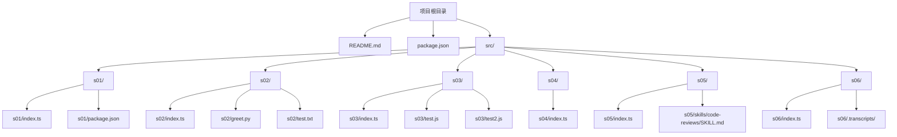
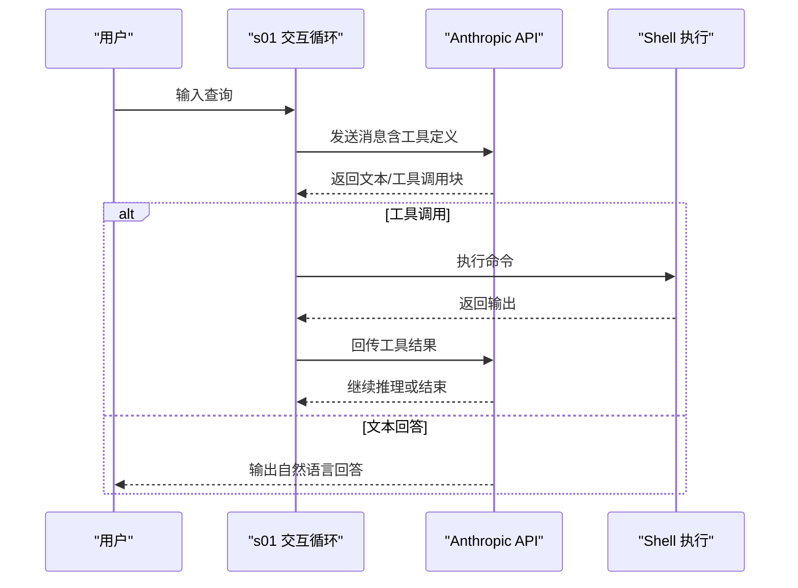
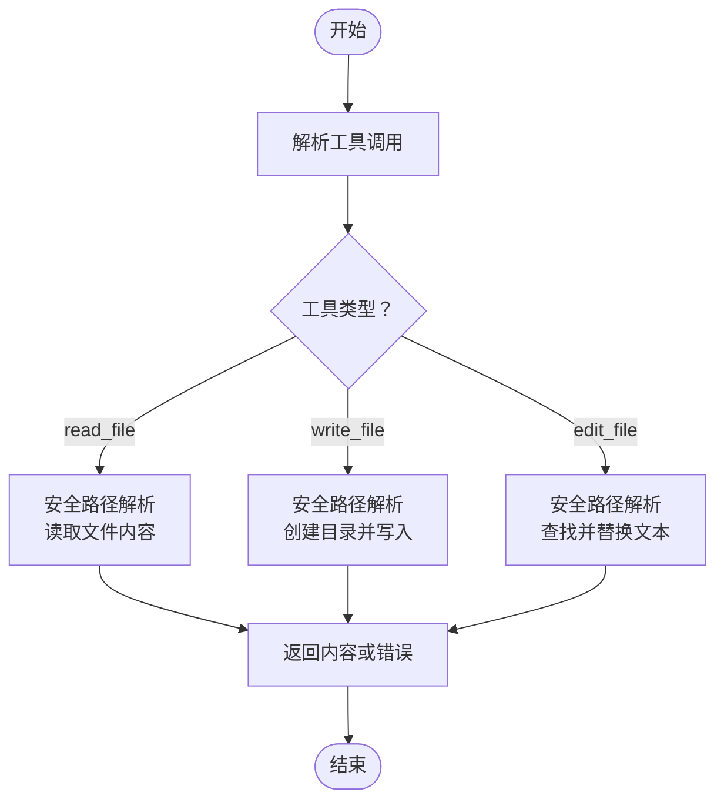
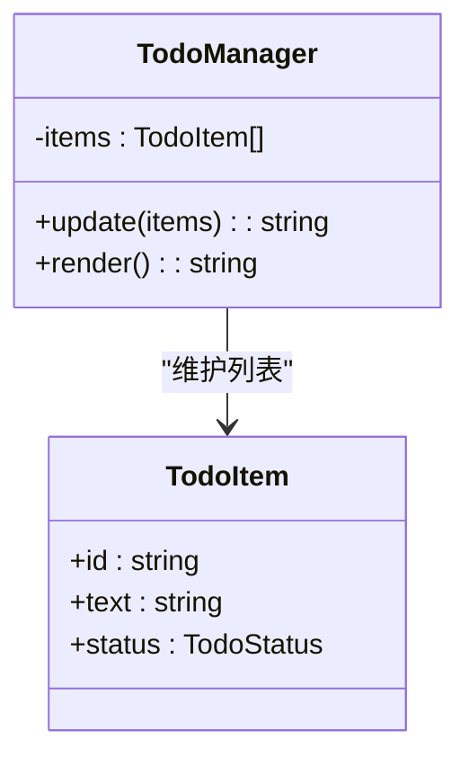
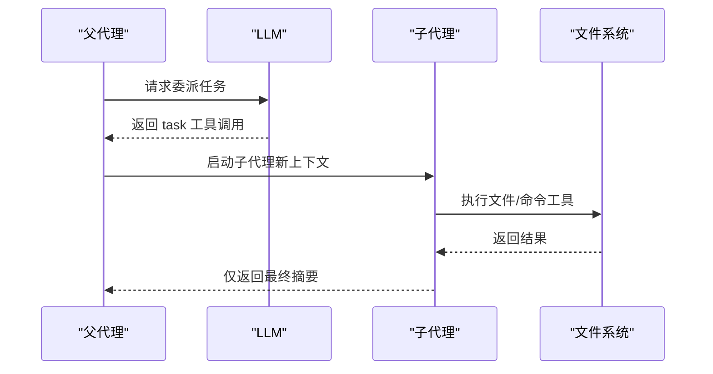
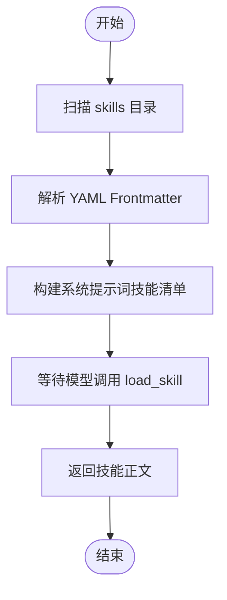
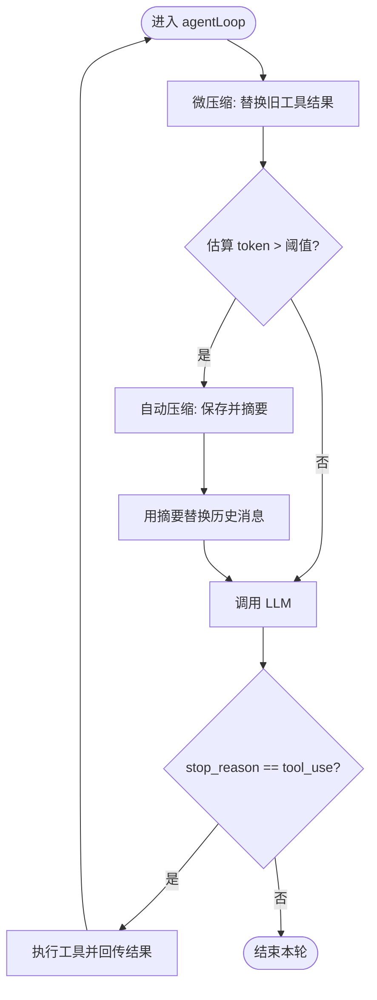
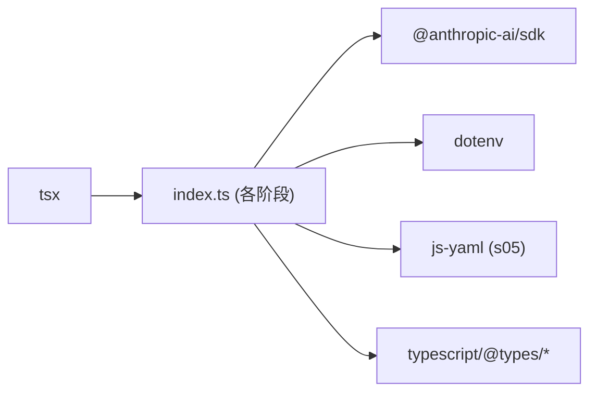

# 项目概述

<cite>
**本文引用的文件**
- [README.md](file://README.md)
- [package.json](file://package.json)
- [src/s01/index.ts](file://src/s01/index.ts)
- [src/s01/package.json](file://src/s01/package.json)
- [src/s02/index.ts](file://src/s02/index.ts)
- [src/s02/greet.py](file://src/s02/greet.py)
- [src/s02/test.txt](file://src/s02/test.txt)
- [src/s03/index.ts](file://src/s03/index.ts)
- [src/s03/test.js](file://src/s03/test.js)
- [src/s03/test2.js](file://src/s03/test2.js)
- [src/s04/index.ts](file://src/s04/index.ts)
- [src/s05/index.ts](file://src/s05/index.ts)
- [src/s05/skills/code-reviews/SKILL.md](file://src/s05/skills/code-reviews/SKILL.md)
- [src/s06/index.ts](file://src/s06/index.ts)
- [src/s06/.transcripts/transcript_1777018931.jsonl](file://src/s06/.transcripts/transcript_1777018931.jsonl)
</cite>

## 目录
1. [简介](#简介)
2. [项目结构](#项目结构)
3. [核心组件](#核心组件)
4. [架构总览](#架构总览)
5. [详细组件分析](#详细组件分析)
6. [依赖关系分析](#依赖关系分析)
7. [性能考量](#性能考量)
8. [故障排查指南](#故障排查指南)
9. [结论](#结论)
10. [附录](#附录)

## 简介
本项目“Mini-Claude-Code”是一个以 Anthropic Claude AI 模型为基础的渐进式智能代码代理系统。其目标是通过六个阶段（s01 到 s06）逐步构建一个具备工具调度、计划执行、上下文隔离、技能加载、压缩记忆与无限会话能力的可扩展智能体。项目采用 TypeScript/Node.js 作为主语言，辅以少量 Python 脚本与示例文件，结合 Anthropic SDK 实现与外部环境的交互。

项目的核心价值主张在于：
- 渐进式学习：从基础工具调用到复杂对话压缩，帮助初学者理解智能体的演进路径。
- 可复用架构：每个阶段聚焦一个“Harness”（约束/机制），便于在真实工程中按需组合。
- 安全与可控：严格的路径校验、上下文隔离与手动压缩触发，降低风险并提升稳定性。
- 工程即教学：通过真实文件读写、子代理与技能加载等实践，展示工程化落地思路。

## 项目结构
项目采用按阶段分层的目录组织方式，每个阶段位于独立子目录中，包含该阶段所需的入口脚本、依赖配置与示例文件。顶层 README 简要说明项目名称与目标；根级 package.json 提供统一的开发脚本与依赖；各阶段子目录内有各自 package.json 与 tsconfig.json，确保独立构建与运行。

图表来源
- [README.md](file://README.md)
- [package.json](file://package.json)
- [src/s01/index.ts](file://src/s01/index.ts)
- [src/s01/package.json](file://src/s01/package.json)
- [src/s02/index.ts](file://src/s02/index.ts)
- [src/s02/greet.py](file://src/s02/greet.py)
- [src/s02/test.txt](file://src/s02/test.txt)
- [src/s03/index.ts](file://src/s03/index.ts)
- [src/s03/test.js](file://src/s03/test.js)
- [src/s03/test2.js](file://src/s03/test2.js)
- [src/s04/index.ts](file://src/s04/index.ts)
- [src/s05/index.ts](file://src/s05/index.ts)
- [src/s05/skills/code-reviews/SKILL.md](file://src/s05/skills/code-reviews/SKILL.md)
- [src/s06/index.ts](file://src/s06/index.ts)
- [src/s06/.transcripts/transcript_1777018931.jsonl](file://src/s06/.transcripts/transcript_1777018931.jsonl)

章节来源
- [README.md](file://README.md)
- [package.json](file://package.json)

## 核心组件
- 智能体循环与工具调度：各阶段均围绕“用户输入 → LLM 推理 → 工具调用 → 结果回传”的循环展开，工具集随阶段演进逐步增强。
- 上下文管理：从无限制的历史累积到微压缩（保留最近若干结果）、自动压缩（转存并摘要）与手动压缩触发，保障长期会话的稳定性。
- 子代理与任务委派：父代理负责总体协调，子代理在全新上下文中执行具体任务，完成后仅返回摘要，避免上下文污染。
- 技能加载：按需加载领域知识（如代码审查），系统提示词动态注入可用技能清单，提升专业能力。
- 文件系统安全：严格路径解析与工作区边界检查，防止越权访问。
- 交互界面：基于 Node readline 的命令行交互，支持退出指令与多轮对话。

章节来源
- [src/s01/index.ts](file://src/s01/index.ts)
- [src/s02/index.ts](file://src/s02/index.ts)
- [src/s03/index.ts](file://src/s03/index.ts)
- [src/s04/index.ts](file://src/s04/index.ts)
- [src/s05/index.ts](file://src/s05/index.ts)
- [src/s06/index.ts](file://src/s06/index.ts)

## 架构总览
整个系统遵循“阶段化演进 + 机制叠加”的设计理念。每个阶段引入一个关键“Harness”，并在前一阶段基础上扩展工具集与控制流。下图展示了从 s01 到 s06 的演进路径与关键构件：

```mermaid
graph TB
subgraph "阶段 s01"
A1["命令行交互<br/>工具: bash"]
A1 --> A2["Anthropic API 调用"]
A2 --> A3["LLM 输出文本"]
A3 --> A4["等待工具调用"]
A4 --> A5["执行 bash 并返回结果"]
A5 --> A1
end
subgraph "阶段 s02"
B1["命令行交互<br/>工具: bash/read/write/edit"]
B1 --> B2["Anthropic API 调用"]
B2 --> B3["LLM 输出文本/工具调用"]
B3 --> B4["执行文件相关工具并返回结果"]
B4 --> B1
end
subgraph "阶段 s03"
C1["命令行交互<br/>工具: todo + 文件工具"]
C1 --> C2["Anthropic API 调用"]
C2 --> C3["LLM 输出文本/工具调用"]
C3 --> C4["Todo 管理器更新"]
C4 --> C1
end
subgraph "阶段 s04"
D1["父代理: 任务委派"]
D2["子代理: 新上下文执行"]
D1 --> D3["工具: bash/read/write/edit/task"]
D3 --> D4["子代理专用工具集"]
D4 --> D5["仅返回最终摘要"]
D5 --> D1
end
subgraph "阶段 s05"
E1["命令行交互<br/>工具: bash/read/write/edit/load_skill"]
E1 --> E2["技能加载器: 动态注入技能描述"]
E2 --> E3["LLM 输出文本/工具调用"]
E3 --> E4["按需加载技能正文"]
E4 --> E1
end
subgraph "阶段 s06"
F1["命令行交互<br/>工具: bash/read/write/edit/compact"]
F1 --> F2["微压缩: 保留最近工具结果"]
F2 --> F3["阈值检测: 自动压缩"]
F3 --> F4["转存与摘要: 保存到 .transcripts/"]
F4 --> F5["消息替换为摘要"]
F5 --> F1
end
```

图表来源
- [src/s01/index.ts](file://src/s01/index.ts)
- [src/s02/index.ts](file://src/s02/index.ts)
- [src/s03/index.ts](file://src/s03/index.ts)
- [src/s04/index.ts](file://src/s04/index.ts)
- [src/s05/index.ts](file://src/s05/index.ts)
- [src/s06/index.ts](file://src/s06/index.ts)

## 详细组件分析

### 阶段 s01：工具调度（bash）
- 目标：将 Claude 的推理能力与 shell 命令执行绑定，形成“提示词 → 工具调用 → 执行 → 结果回传”的闭环。
- 关键点：
  - 使用 Anthropic SDK 发起消息请求，启用工具定义与输出块解析。
  - 将命令执行结果以工具结果形式回传给模型，驱动下一步动作。
  - 交互循环支持退出指令与持续对话。
- 适用场景：快速探索工作区、执行一次性命令、验证环境状态。

图表来源
- [src/s01/index.ts](file://src/s01/index.ts)

章节来源
- [src/s01/index.ts](file://src/s01/index.ts)

### 阶段 s02：文件系统工具（read/write/edit）
- 目标：在 s01 基础上增加对文件系统的读写与编辑能力，使智能体能够直接修改代码与配置。
- 关键点：
  - 引入安全路径解析与工作区边界检查，防止越权访问。
  - 文件读取支持行数截断与字节上限，避免超长输出影响上下文。
  - 写入与编辑操作在安全路径下执行，并返回操作结果。
- 适用场景：自动化修复、模板生成、批量改写。

图表来源
- [src/s02/index.ts](file://src/s02/index.ts)

章节来源
- [src/s02/index.ts](file://src/s02/index.ts)
- [src/s02/greet.py](file://src/s02/greet.py)
- [src/s02/test.txt](file://src/s02/test.txt)

### 阶段 s03：计划与提醒（Todo 管理）
- 目标：通过 Todo 管理器强制模型在多步任务中保持进度可视化与阶段性更新，减少遗忘导致的停滞。
- 关键点：
  - Todo 状态约束：同一时间仅允许一项任务处于进行中。
  - 进度提醒：若连续多轮未更新 Todo，注入提醒以促使模型继续推进。
  - 与工具集集成：通过 todo 工具更新状态，配合文件工具完成任务。
- 适用场景：重构规划、版本发布流程、迁移任务分解。

图表来源
- [src/s03/index.ts](file://src/s03/index.ts)

章节来源
- [src/s03/index.ts](file://src/s03/index.ts)
- [src/s03/test.js](file://src/s03/test.js)
- [src/s03/test2.js](file://src/s03/test2.js)

### 阶段 s04：上下文隔离（子代理）
- 目标：通过子代理在全新上下文中执行任务，完成后仅返回摘要，从而保护父代理上下文的清晰度。
- 关键点：
  - 父代理工具集包含任务委派工具，用于启动子代理。
  - 子代理拥有基础工具集，但不递归 spawn，避免无限嵌套。
  - 子代理执行结束后，仅将最终文本摘要返回父代理。
- 适用场景：复杂分析、多步骤探索、跨模块协作。

图表来源
- [src/s04/index.ts](file://src/s04/index.ts)

章节来源
- [src/s04/index.ts](file://src/s04/index.ts)

### 阶段 s05：按需知识（技能加载）
- 目标：将领域知识以“技能”形式按需加载，避免在系统提示词中塞入大量静态内容。
- 关键点：
  - 技能目录扫描与 YAML Frontmatter 解析，提取元数据与正文。
  - 系统提示词动态注入可用技能清单（第一层：元数据）。
  - 模型调用 load_skill 时返回完整技能正文（第二层：正文）。
- 适用场景：代码审查、安全审计、性能优化、合规检查。

图表来源
- [src/s05/index.ts](file://src/s05/index.ts)
- [src/s05/skills/code-reviews/SKILL.md](file://src/s05/skills/code-reviews/SKILL.md)

章节来源
- [src/s05/index.ts](file://src/s05/index.ts)
- [src/s05/skills/code-reviews/SKILL.md](file://src/s05/skills/code-reviews/SKILL.md)

### 阶段 s06：记忆压缩与无限会话
- 目标：通过三层压缩机制（微压缩、自动压缩、手动压缩）控制上下文长度，实现长时间会话与历史留存。
- 关键点：
  - 微压缩：每轮将较旧的工具结果替换为占位符，仅保留最近若干条。
  - 自动压缩：当估算 token 超过阈值时，保存完整对话到 .transcripts/，并请求模型生成摘要，替换历史消息。
  - 手动压缩：模型调用 compact 工具时立即触发压缩。
- 适用场景：长期项目跟踪、多轮需求演化、知识沉淀与检索。

图表来源
- [src/s06/index.ts](file://src/s06/index.ts)

章节来源
- [src/s06/index.ts](file://src/s06/index.ts)
- [src/s06/.transcripts/transcript_1777018931.jsonl](file://src/s06/.transcripts/transcript_1777018931.jsonl)

## 依赖关系分析
- 运行时依赖：
  - @anthropic-ai/sdk：与 Anthropic API 交互，支持消息与工具调用。
  - dotenv：加载环境变量（API Key、Base URL、模型标识等）。
  - js-yaml（仅 s05）：解析技能 Markdown 的 YAML Frontmatter。
- 开发时依赖：
  - typescript、@types/node、tsx：类型定义与热重载开发体验。
- 项目脚本：
  - 根级与各阶段 package.json 中的 dev 脚本，统一通过 tsx 运行对应 index.ts。

图表来源
- [package.json](file://package.json)
- [src/s01/package.json](file://src/s01/package.json)
- [src/s05/index.ts](file://src/s05/index.ts)

章节来源
- [package.json](file://package.json)
- [src/s01/package.json](file://src/s01/package.json)

## 性能考量
- 上下文长度控制：通过微压缩与自动压缩将历史消息压缩为摘要，避免超出模型上下文限制。
- I/O 成本优化：仅在必要时保存完整对话至 .transcripts/，并以 JSON Lines 格式存储，便于后续检索。
- 工具调用批量化：在单轮对话中尽可能合并工具调用，减少往返次数。
- 超时与安全：命令执行设置超时，文件读写限制大小，路径解析严格校验，降低资源滥用风险。

## 故障排查指南
- 环境变量缺失：确认已正确配置 API Key、Base URL 与模型标识，否则 SDK 初始化失败。
- 路径越界：当出现“路径逃逸工作区”类错误时，检查相对路径与工作区边界，避免 ../ 或绝对路径。
- 工具调用异常：查看工具执行日志与错误返回，定位权限、文件不存在或命令失败等问题。
- 会话过长：若出现上下文溢出或性能下降，优先触发手动压缩或等待自动压缩生效。
- 技能加载失败：确认技能目录结构与 SKILL.md Frontmatter 格式正确，名称与描述可被系统提示词读取。

章节来源
- [src/s02/index.ts](file://src/s02/index.ts)
- [src/s06/index.ts](file://src/s06/index.ts)
- [src/s05/index.ts](file://src/s05/index.ts)

## 结论
Mini-Claude-Code 通过六个阶段清晰地展示了如何将一个简单的“工具调度”智能体，逐步演进为具备计划管理、上下文隔离、技能加载与记忆压缩能力的工程化智能代理。该体系既适合初学者循序渐进理解智能体架构，也为有经验的开发者提供了可复用的模块与最佳实践。建议在生产环境中结合业务场景，按需启用子代理、技能加载与压缩策略，并配套完善的日志与监控体系。

## 附录
- 实际使用场景与应用案例（概念性说明）：
  - 代码审查：通过技能加载与检查清单，自动识别安全、性能与可维护性问题。
  - 需求拆解与迭代：利用 Todo 管理器与子代理，将复杂需求分解为可追踪的任务并逐步完成。
  - 长期项目维护：借助压缩机制与转存摘要，持续跟踪项目进展并沉淀知识。
  - 自动化修复：在受控工作区内进行文件读写与编辑，减少人工干预。
  - 多语言协作：结合 Python 示例脚本与 JS/TS 工具，实现跨语言的协同处理。