# 性能优化策略

<cite>
**本文档引用的文件**
- [README.md](file://README.md)
- [package.json](file://package.json)
- [learn-summary.md](file://learn-summary.md)
- [src/s01/index.ts](file://src/s01/index.ts)
- [src/s02/index.ts](file://src/s02/index.ts)
- [src/s03/index.ts](file://src/s03/index.ts)
- [src/s04/index.ts](file://src/s04/index.ts)
- [src/s05/index.ts](file://src/s05/index.ts)
- [src/s05/skills/code-reviews/SKILL.md](file://src/s05/skills/code-reviews/SKILL.md)
- [src/s06/index.ts](file://src/s06/index.ts)
- [src/s06/.transcripts/transcript_1777018931.jsonl](file://src/s06/.transcripts/transcript_1777018931.jsonl)
</cite>

## 目录
1. [简介](#简介)
2. [项目结构](#项目结构)
3. [核心组件](#核心组件)
4. [架构概览](#架构概览)
5. [详细组件分析](#详细组件分析)
6. [依赖关系分析](#依赖关系分析)
7. [性能考量](#性能考量)
8. [故障排除指南](#故障排除指南)
9. [结论](#结论)
10. [附录](#附录)

## 简介

本指南基于Mini-Claude-Code项目的六个阶段实现，深入分析了AI代理系统的性能优化策略。该项目展示了从基础的LLM交互到复杂的上下文压缩、子智能体管理和技能加载的完整演进过程。本文档重点关注内存使用模式、缓存机制、资源管理和性能监控等关键性能优化领域。

## 项目结构

项目采用模块化设计，每个阶段代表了不同的性能优化策略和架构改进：

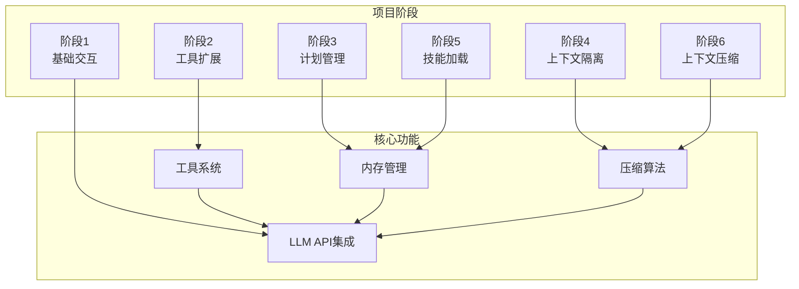

**图表来源**
- [src/s01/index.ts:1-158](file://src/s01/index.ts#L1-L158)
- [src/s06/index.ts:1-413](file://src/s06/index.ts#L1-L413)

**章节来源**
- [README.md:1-3](file://README.md#L1-L3)
- [learn-summary.md:1-51](file://learn-summary.md#L1-L51)

## 核心组件

### LLM API客户端

项目使用Anthropic AI SDK进行LLM交互，支持多种模型和自定义端点配置：

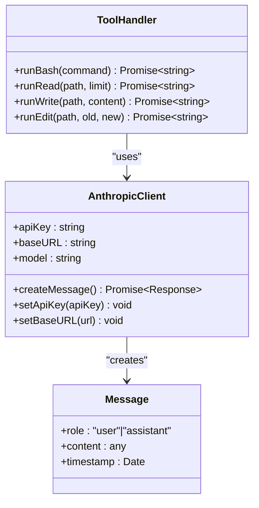

**图表来源**
- [src/s01/index.ts:23-26](file://src/s01/index.ts#L23-L26)
- [src/s02/index.ts:25-28](file://src/s02/index.ts#L25-L28)

### 工具系统架构

工具系统提供了文件操作、命令执行和文本编辑功能：

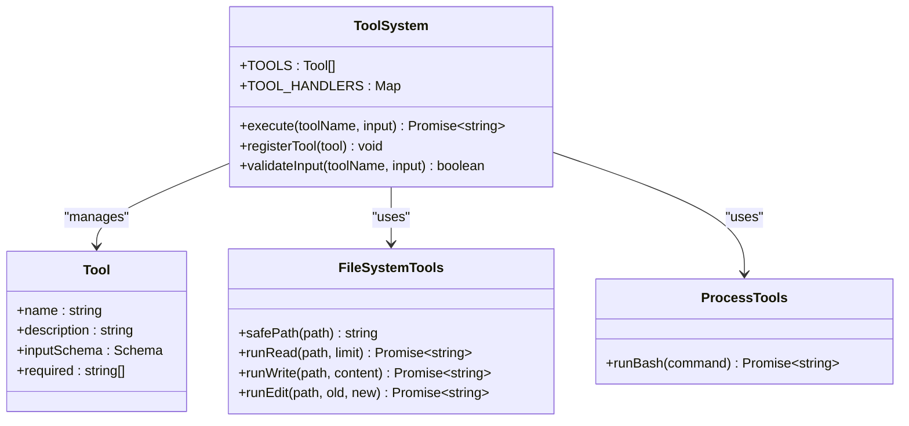

**图表来源**
- [src/s02/index.ts:118-135](file://src/s02/index.ts#L118-L135)
- [src/s03/index.ts:219-239](file://src/s03/index.ts#L219-L239)

**章节来源**
- [src/s01/index.ts:12-26](file://src/s01/index.ts#L12-L26)
- [src/s02/index.ts:118-135](file://src/s02/index.ts#L118-L135)

## 架构概览

项目展示了从简单到复杂的性能优化演进路径：

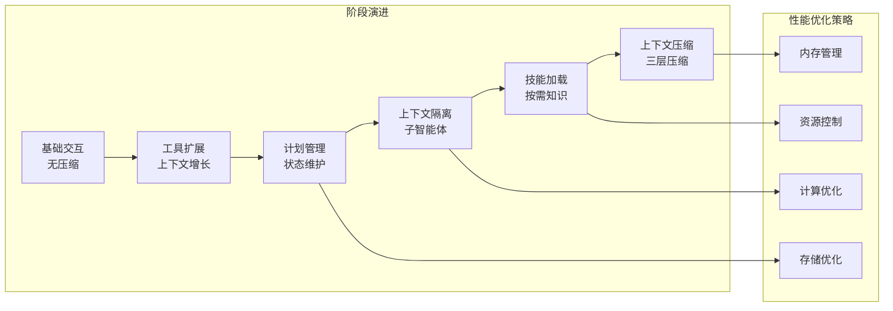

**图表来源**
- [learn-summary.md:48-51](file://learn-summary.md#L48-L51)
- [src/s06/index.ts:1-27](file://src/s06/index.ts#L1-L27)

## 详细组件分析

### 阶段6：上下文压缩系统

阶段6实现了完整的三层上下文压缩策略，这是项目中最复杂的性能优化组件：

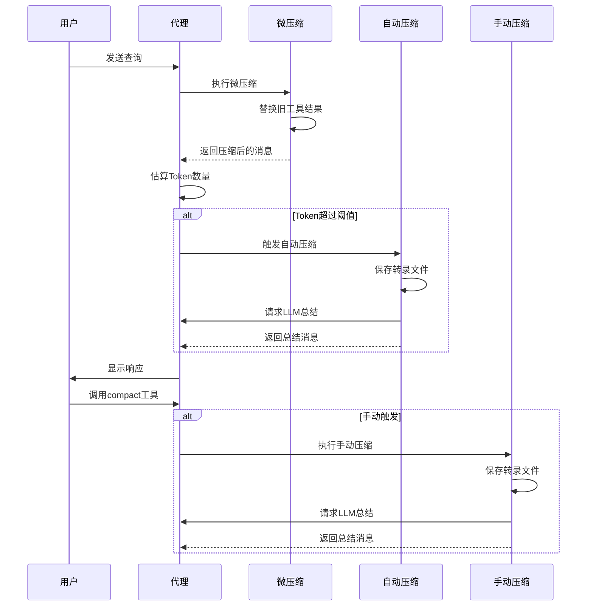

**图表来源**
- [src/s06/index.ts:303-367](file://src/s06/index.ts#L303-L367)
- [src/s06/index.ts:150-196](file://src/s06/index.ts#L150-L196)

#### 微压缩算法（Layer 1）

微压缩是每轮循环都会执行的轻量级压缩策略：

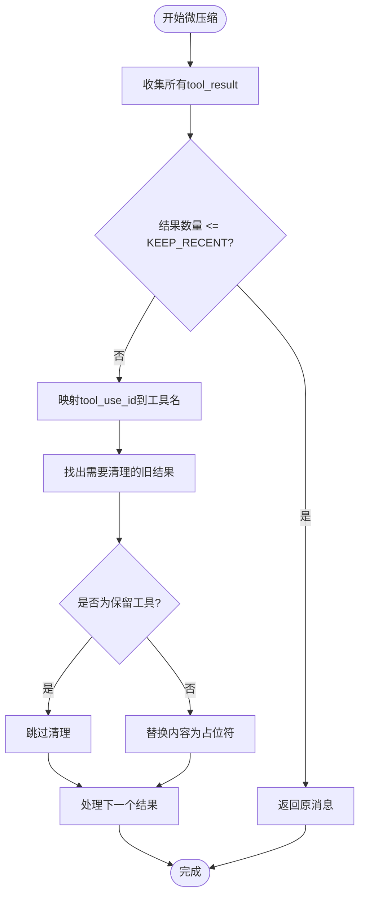

**图表来源**
- [src/s06/index.ts:82-138](file://src/s06/index.ts#L82-L138)

微压缩的核心参数：
- `KEEP_RECENT`: 保留最近的工具结果数量（默认2）
- `PRESERVE_RESULT_TOOLS`: 不进行压缩的工具集合（默认包含read_file）
- `THRESHOLD`: 自动压缩触发阈值（默认1000字符）

#### 自动压缩算法（Layer 2）

当上下文大小超过阈值时触发的深度压缩：

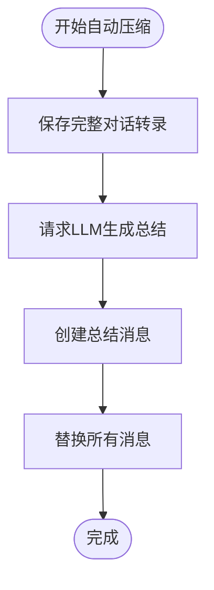

**图表来源**
- [src/s06/index.ts:150-196](file://src/s06/index.ts#L150-L196)

自动压缩的关键特性：
- 将完整对话保存到`.transcripts/`目录
- 使用LLM对对话进行结构化总结
- 仅保留关键信息和转录文件路径

#### 手动压缩触发器（Layer 3）

允许用户主动触发压缩的工具接口：

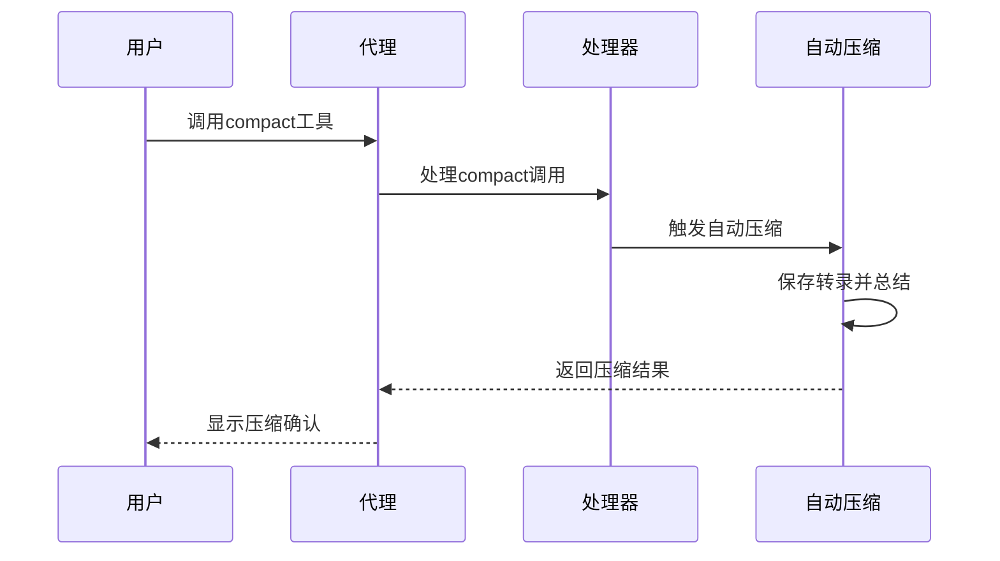

**图表来源**
- [src/s06/index.ts:334-366](file://src/s06/index.ts#L334-L366)

**章节来源**
- [src/s06/index.ts:54-61](file://src/s06/index.ts#L54-L61)
- [src/s06/index.ts:82-138](file://src/s06/index.ts#L82-L138)
- [src/s06/index.ts:150-196](file://src/s06/index.ts#L150-L196)

### 阶段5：技能加载系统

技能系统实现了按需知识加载，避免了上下文膨胀：

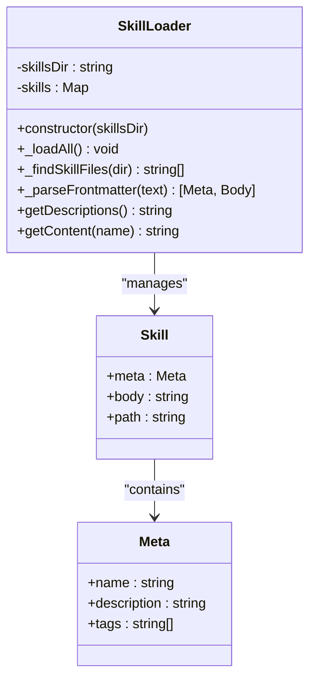

**图表来源**
- [src/s05/index.ts:46-144](file://src/s05/index.ts#L46-L144)

技能加载的性能优势：
- 系统提示中仅包含技能描述（轻量级）
- 实际技能内容按需加载（节省上下文空间）
- 支持YAML前置元数据解析

**章节来源**
- [src/s05/index.ts:46-144](file://src/s05/index.ts#L46-L144)
- [src/s05/skills/code-reviews/SKILL.md:1-157](file://src/s05/skills/code-reviews/SKILL.md#L1-L157)

### 阶段4：上下文隔离系统

子智能体实现了进程隔离，确保上下文隔离：

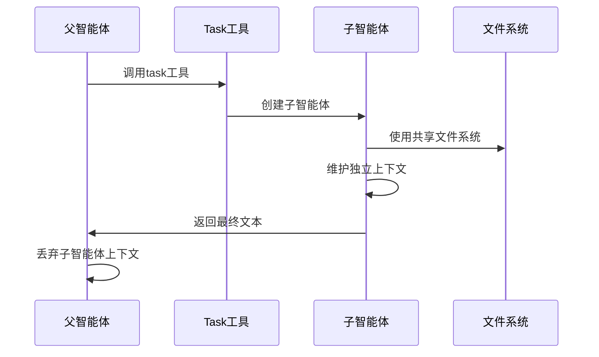

**图表来源**
- [src/s04/index.ts:148-195](file://src/s04/index.ts#L148-L195)

**章节来源**
- [src/s04/index.ts:148-195](file://src/s04/index.ts#L148-L195)

## 依赖关系分析

项目依赖关系展现了清晰的模块化架构：

```mermaid
graph TB
subgraph "运行时依赖"
NODE[Node.js运行时]
DOTENV[dotenv环境变量]
ANTHROPIC[@anthropic-ai/sdk]
end
subgraph "开发依赖"
TYPESCRIPT[typescript]
TSX[tsx]
DEVTOOLS[@types/*]
end
subgraph "项目模块"
S01[s01基础交互]
S02[s02工具扩展]
S03[s03计划管理]
S04[s04上下文隔离]
S05[s05技能加载]
S06[s06上下文压缩]
end
NODE --> S01
DOTENV --> S01
ANTHROPIC --> S01
S01 --> S02
S02 --> S03
S03 --> S04
S04 --> S05
S05 --> S06
TYPESCRIPT --> S06
TSX --> S06
DEVTOOLS --> S06
```

**图表来源**
- [package.json:13-23](file://package.json#L13-L23)

**章节来源**
- [package.json:1-25](file://package.json#L1-L25)

## 性能考量

### 内存使用模式分析

项目展示了不同阶段的内存使用特征：

| 阶段 | 内存使用模式 | 主要优化点 | 性能影响 |
|------|-------------|-----------|----------|
| S01 | 线性增长，无压缩 | 基础消息累积 | 最高内存占用 |
| S02 | 线性增长，工具结果累积 | 限制单轮工具数量 | 中等内存占用 |
| S03 | 线性增长，计划状态维护 | 状态验证和清理 | 中等内存占用 |
| S04 | 分离上下文，临时增长 | 子智能体生命周期管理 | 中等峰值内存 |
| S05 | 动态加载，按需知识 | 技能缓存和懒加载 | 低内存占用 |
| S06 | 三层压缩，动态调整 | 多级压缩策略 | 最低内存占用 |

### 缓存机制实现

项目实现了多层次的缓存策略：

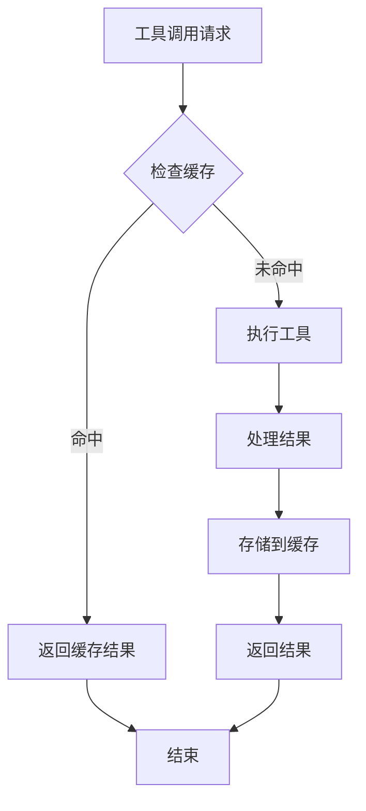

**图表来源**
- [src/s06/index.ts:82-138](file://src/s06/index.ts#L82-L138)

### 资源管理策略

项目采用了多种资源管理技术：

1. **文件系统访问控制**：路径安全验证防止目录遍历攻击
2. **超时控制**：命令执行设置120秒超时
3. **输出限制**：文件读取限制50000字符
4. **内存限制**：上下文压缩阈值控制

**章节来源**
- [src/s02/index.ts:37-48](file://src/s02/index.ts#L37-L48)
- [src/s06/index.ts:54-61](file://src/s06/index.ts#L54-L61)

## 故障排除指南

### 常见性能问题诊断

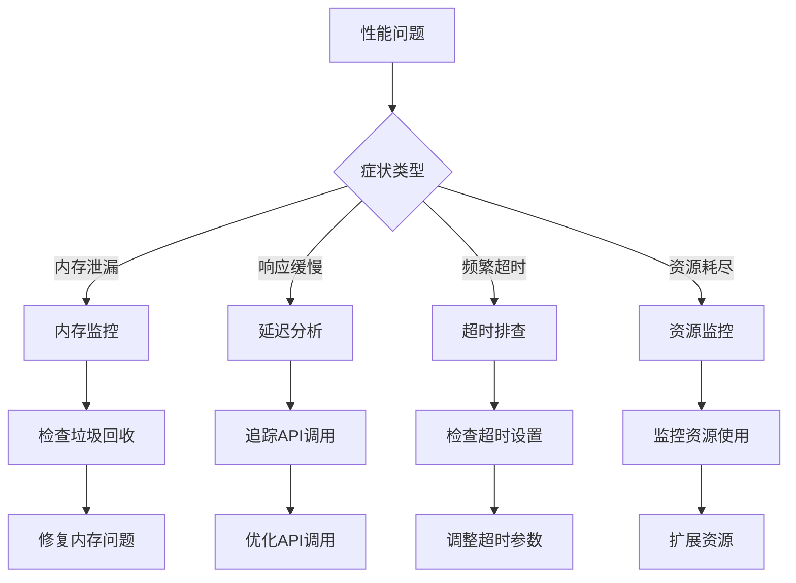

### 性能监控指标

建议监控以下关键指标：

| 指标类型 | 监控目标 | 告警阈值 | 优化建议 |
|---------|---------|---------|---------|
| 内存使用 | V8堆内存使用率 | >80% | 启用压缩，减少上下文长度 |
| CPU使用 | 系统CPU使用率 | >90% | 优化算法，减少同步操作 |
| 网络延迟 | LLM API响应时间 | >2000ms | 重试机制，连接池优化 |
| 文件IO | 磁盘读写速度 | >100MB/s | 缓存策略，批量操作 |
| 并发处理 | 并发请求数 | >50 | 限流控制，队列管理 |

**章节来源**
- [src/s06/index.ts:303-367](file://src/s06/index.ts#L303-L367)

## 结论

Mini-Claude-Code项目展示了AI代理系统性能优化的完整演进路径。从基础的上下文累积到复杂的三层压缩策略，项目体现了以下关键性能优化原则：

1. **渐进式优化**：每个阶段都针对特定的性能瓶颈进行优化
2. **多层次策略**：结合内存管理、资源控制和算法优化
3. **按需加载**：避免不必要的资源消耗
4. **智能压缩**：在保持功能的同时最大化内存效率

这些策略为构建高性能的AI代理系统提供了宝贵的实践经验。

## 附录

### 实际性能测试案例

基于项目中的转录文件，展示了典型的性能测试场景：

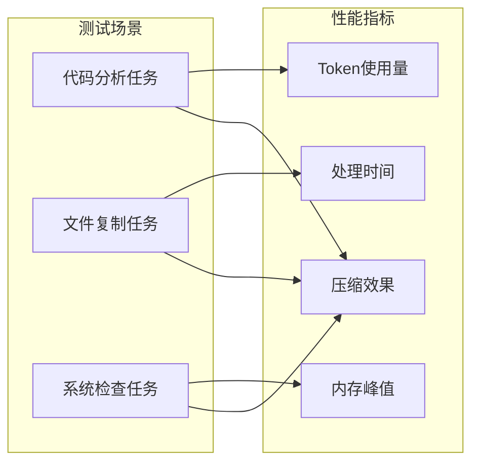

**图表来源**
- [src/s06/.transcripts/transcript_1777018931.jsonl:1-8](file://src/s06/.transcripts/transcript_1777018931.jsonl#L1-L8)

### 部署性能提升方案

1. **环境配置优化**
   - 设置适当的NODE_OPTIONS参数
   - 配置合理的内存限制
   - 优化垃圾回收参数

2. **系统调优参数**
   - 调整文件描述符限制
   - 优化网络连接池
   - 配置进程间通信缓冲区

3. **监控和日志**
   - 实施APM监控
   - 设置性能基准测试
   - 建立告警机制