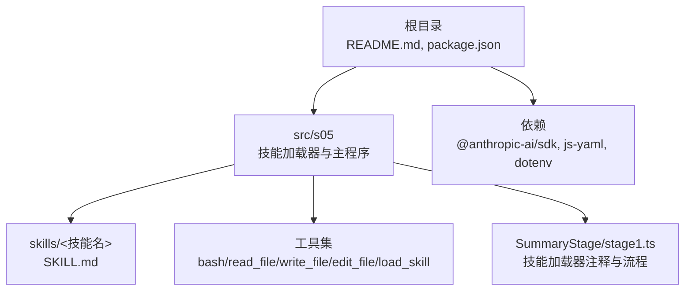
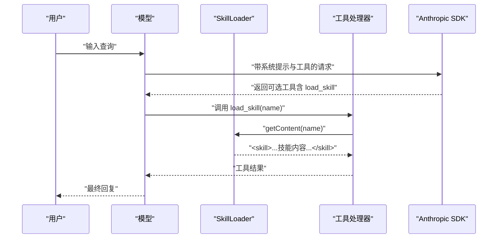
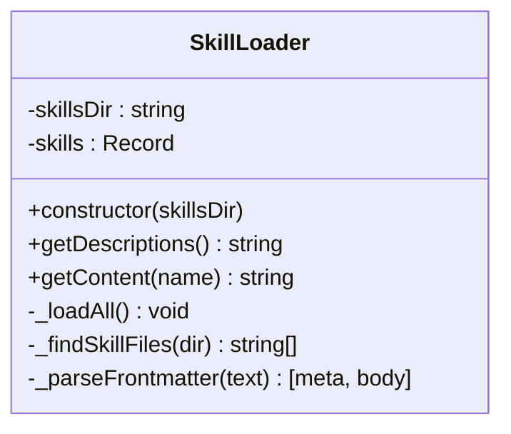
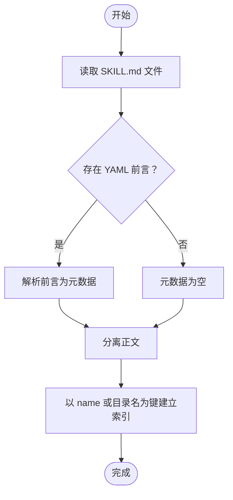
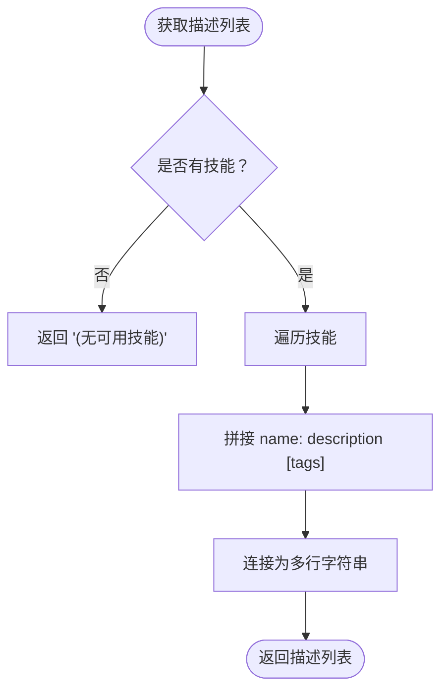
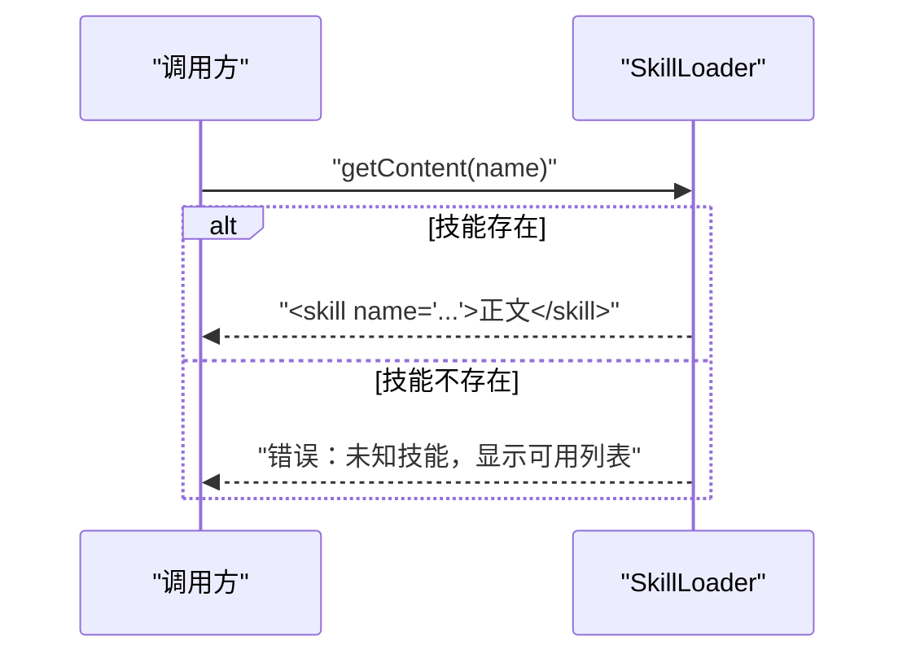
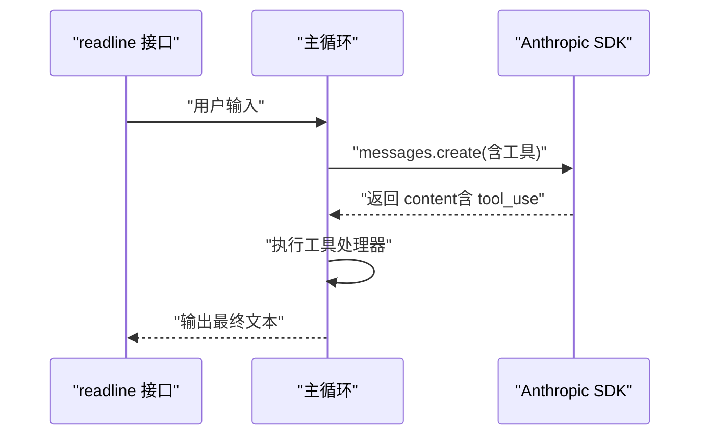
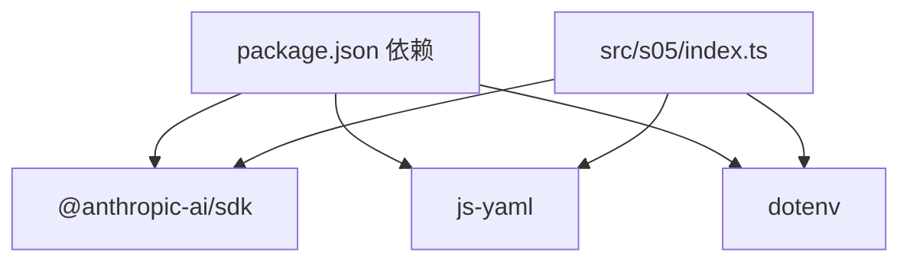

# 技能扩展机制

<cite>
**本文引用的文件**
- [README.md](file://README.md)
- [package.json](file://package.json)
- [src/s05/index.ts](file://src/s05/index.ts)
- [src/s05/skills/code-reviews/SKILL.md](file://src/s05/skills/code-reviews/SKILL.md)
- [src/s01/package.json](file://src/s01/package.json)
- [src/s02/package.json](file://src/s02/package.json)
- [src/s03/package.json](file://src/s03/package.json)
- [src/s04/package.json](file://src/s04/package.json)
- [src/s06/package.json](file://src/s06/package.json)
- [SummaryStage/stage1.ts](file://SummaryStage/stage1.ts)
</cite>

## 目录
1. [引言](#引言)
2. [项目结构](#项目结构)
3. [核心组件](#核心组件)
4. [架构总览](#架构总览)
5. [详细组件分析](#详细组件分析)
6. [依赖关系分析](#依赖关系分析)
7. [性能考虑](#性能考虑)
8. [故障排查指南](#故障排查指南)
9. [结论](#结论)
10. [附录：技能开发指南](#附录技能开发指南)

## 引言
本文件系统化阐述“技能扩展机制”的设计与实现，覆盖以下主题：
- 技能加载器的工作原理与两层架构（元数据层与内容层）
- YAML 前言元数据解析与技能内容组织结构
- 技能描述系统、标签管理与技能发现机制
- 技能开发完整指南（SKILL.md 编写、元数据配置、内容模板）
- 专业领域技能模块示例（代码审查、文档生成、测试编写）
- 技能版本管理、依赖声明与兼容性检查的实现要点

该机制以“按需加载”为核心思想：在系统提示中仅注入技能元数据（名称、描述、标签），当模型请求具体技能时才返回完整技能内容，从而平衡上下文长度与能力扩展。

## 项目结构
仓库采用多阶段实现的模块化结构，其中 s05 展示了完整的技能扩展机制；其他阶段文件展示了不同能力的演进路径。关键位置如下：
- 根目录包含项目说明与通用依赖
- src/s05 实现技能加载器、工具集与主循环
- src/s05/skills/code-reviews 提供一个完整的技能示例（SKILL.md）
- SummaryStage/stage1.ts 提供技能加载器的伪代码式注释与流程说明

图表来源
- [src/s05/index.ts:1-332](file://src/s05/index.ts#L1-L332)
- [src/s05/skills/code-reviews/SKILL.md:1-157](file://src/s05/skills/code-reviews/SKILL.md#L1-L157)
- [package.json:1-25](file://package.json#L1-L25)
- [SummaryStage/stage1.ts:274-349](file://SummaryStage/stage1.ts#L274-L349)

章节来源
- [README.md:1-3](file://README.md#L1-L3)
- [package.json:1-25](file://package.json#L1-L25)
- [src/s05/index.ts:1-332](file://src/s05/index.ts#L1-L332)
- [src/s05/skills/code-reviews/SKILL.md:1-157](file://src/s05/skills/code-reviews/SKILL.md#L1-L157)
- [SummaryStage/stage1.ts:274-349](file://SummaryStage/stage1.ts#L274-L349)

## 核心组件
- 技能加载器（SkillLoader）
  - 负责扫描 skills 目录，递归查找 SKILL.md 文件
  - 解析 YAML 前言元数据（frontmatter），分离元数据与正文
  - 维护技能索引，支持两层输出：
    - 元数据层：用于系统提示，包含名称、描述、可选标签
    - 内容层：按名称返回完整技能正文，包裹为工具结果
- 工具集（TOOLS）
  - 包含 bash、read_file、write_file、edit_file、load_skill 等工具
  - load_skill 由 SkillLoader 的 getContent 提供实现
- 主循环（runOneTurn/main）
  - 将系统提示（含技能列表）与用户消息发送给模型
  - 当模型选择工具时，执行对应处理器并将结果回传

章节来源
- [src/s05/index.ts:46-144](file://src/s05/index.ts#L46-L144)
- [src/s05/index.ts:234-254](file://src/s05/index.ts#L234-L254)
- [src/s05/index.ts:257-332](file://src/s05/index.ts#L257-L332)

## 架构总览
技能扩展机制采用“两层注入 + 按需加载”的架构：
- 第一层（元数据层）：在系统提示中列出可用技能及其简要描述与标签，帮助模型决策是否需要加载特定技能
- 第二层（内容层）：当模型调用 load_skill 时，SkillLoader 返回完整技能内容，作为工具结果注入对话历史

图表来源
- [src/s05/index.ts:234-254](file://src/s05/index.ts#L234-L254)
- [src/s05/index.ts:257-332](file://src/s05/index.ts#L257-L332)
- [src/s05/index.ts:133-141](file://src/s05/index.ts#L133-L141)

## 详细组件分析

### 技能加载器（SkillLoader）
- 目录扫描
  - 递归遍历 skills 目录，收集所有 SKILL.md 文件
  - 使用文件系统 API 读取文件内容
- YAML 前言解析
  - 使用正则匹配三横线分隔的前言块
  - 使用 YAML 解析器加载元数据，异常时回退为空对象
- 名称与索引
  - 优先使用元数据中的 name 字段，否则使用父目录名
  - 以名称为键保存元数据、正文与路径
- 输出接口
  - getDescriptions：拼接技能名称、描述与标签，用于系统提示
  - getContent：按名称返回包裹后的技能正文，作为工具结果

图表来源
- [src/s05/index.ts:46-144](file://src/s05/index.ts#L46-L144)

章节来源
- [src/s05/index.ts:46-144](file://src/s05/index.ts#L46-L144)
- [SummaryStage/stage1.ts:283-349](file://SummaryStage/stage1.ts#L283-L349)

### YAML 前言元数据解析与技能内容组织
- 前言格式
  - 使用三横线分隔的 YAML 块作为元数据，其后为正文
  - 若未检测到前言，正文即为完整内容
- 元数据字段
  - name：技能唯一标识（建议与目录名一致或语义明确）
  - description：技能简要描述（用于系统提示）
  - tags：可选标签（用于分类与检索）
- 正文组织
  - 技能正文采用 Markdown 结构，便于人类阅读与模型理解
  - 示例技能包含检查清单、输出格式、常见模式与命令等模块化内容

图表来源
- [src/s05/index.ts:92-108](file://src/s05/index.ts#L92-L108)
- [src/s05/skills/code-reviews/SKILL.md:1-157](file://src/s05/skills/code-reviews/SKILL.md#L1-L157)

章节来源
- [src/s05/index.ts:92-108](file://src/s05/index.ts#L92-L108)
- [src/s05/skills/code-reviews/SKILL.md:1-157](file://src/s05/skills/code-reviews/SKILL.md#L1-L157)

### 技能描述系统、标签管理与技能发现
- 描述系统
  - getDescriptions 会遍历已加载技能，拼接名称与描述
  - 若元数据缺少 description，则回退为“无描述”
- 标签管理
  - 若元数据包含 tags，将在描述后追加 [tags]
  - 标签可用于快速识别技能类别（如安全、性能、维护性）
- 技能发现机制
  - 通过递归扫描 skills 目录自动发现新技能
  - 加载完成后，系统提示中即时呈现可用技能列表

图表来源
- [src/s05/index.ts:110-131](file://src/s05/index.ts#L110-L131)

章节来源
- [src/s05/index.ts:110-131](file://src/s05/index.ts#L110-L131)

### 技能内容组织与输出封装
- 内容封装
  - getContent 对技能正文进行包裹，形成工具结果
  - 包裹格式包含技能名称属性，便于后续处理与溯源
- 错误处理
  - 当请求未知技能时，返回错误信息并提示可用技能列表

图表来源
- [src/s05/index.ts:133-141](file://src/s05/index.ts#L133-L141)

章节来源
- [src/s05/index.ts:133-141](file://src/s05/index.ts#L133-L141)

### 工具链与主循环
- 工具定义
  - bash、read_file、write_file、edit_file、load_skill
  - load_skill 的输入包含技能名称
- 工具处理器
  - 将工具名称映射到具体实现
  - load_skill 交由 SkillLoader 处理
- 主循环
  - 发送带工具的请求至模型
  - 收集工具调用，执行处理器，将结果作为工具结果回传
  - 循环直到模型不再请求工具

图表来源
- [src/s05/index.ts:234-254](file://src/s05/index.ts#L234-L254)
- [src/s05/index.ts:257-332](file://src/s05/index.ts#L257-L332)

章节来源
- [src/s05/index.ts:234-254](file://src/s05/index.ts#L234-L254)
- [src/s05/index.ts:257-332](file://src/s05/index.ts#L257-L332)

## 依赖关系分析
- 外部依赖
  - @anthropic-ai/sdk：与 Claude 模型交互
  - js-yaml：解析 YAML 前言
  - dotenv：加载环境变量（API 密钥、基础 URL、模型 ID）
- 内部模块
  - SkillLoader：负责技能发现与解析
  - 工具处理器：将工具名称映射到具体实现
  - 主循环：驱动对话与工具调用

图表来源
- [package.json:13-23](file://package.json#L13-L23)
- [src/s05/index.ts:23-27](file://src/s05/index.ts#L23-L27)

章节来源
- [package.json:1-25](file://package.json#L1-L25)
- [src/s05/index.ts:23-27](file://src/s05/index.ts#L23-L27)

## 性能考虑
- 上下文控制
  - 技能元数据仅在系统提示中注入，避免一次性携带大量技能正文
  - 仅在模型显式请求时才加载技能正文，降低上下文开销
- I/O 优化
  - 递归扫描 skills 目录时，按文件名过滤 SKILL.md，减少无关文件处理
  - 前言解析使用正则与 YAML 解析器，异常时快速回退为空对象
- 输出裁剪
  - 工具结果包含完整正文，但可通过外部流程对历史消息进行压缩与摘要（见其他阶段的压缩策略）

[本节为通用指导，无需特定文件引用]

## 故障排查指南
- 技能未出现在系统提示中
  - 检查 skills 目录是否存在且包含 SKILL.md
  - 确认 YAML 前言格式正确，三横线分隔清晰
- 请求未知技能报错
  - 确认技能名称与元数据中的 name 一致
  - 检查目录层级与父目录名是否被用作回退名称
- YAML 解析失败
  - 检查前言块语法，确保为合法 YAML
  - 注意缩进与特殊字符转义
- 工具调用无效
  - 确认工具名称与定义一致（load_skill）
  - 检查工具处理器映射是否正确

章节来源
- [src/s05/index.ts:110-141](file://src/s05/index.ts#L110-L141)
- [src/s05/index.ts:234-254](file://src/s05/index.ts#L234-L254)

## 结论
该技能扩展机制通过“两层注入 + 按需加载”的方式，在保持系统提示简洁的同时，提供了强大的领域知识扩展能力。YAML 前言与标准化的 SKILL.md 组织结构，使得技能的开发、维护与发现变得简单高效。结合标签与描述系统，模型可以更精准地选择所需技能，提升任务完成质量与效率。

[本节为总结，无需特定文件引用]

## 附录：技能开发指南

### 1. 目录与文件组织
- 在 skills 下创建以技能名命名的目录
- 在目录内放置 SKILL.md，作为技能的唯一入口文件
- 可根据需要在同级目录放置辅助资源（如脚本、样例）

章节来源
- [src/s05/skills/code-reviews/SKILL.md:1-157](file://src/s05/skills/code-reviews/SKILL.md#L1-L157)

### 2. SKILL.md 编写规范
- 前言（YAML）
  - name：技能唯一标识，建议与目录名一致
  - description：简明描述技能用途
  - tags：可选，用于分类（如 security、performance、maintainability）
- 正文（Markdown）
  - 使用清晰标题与分节，便于模型与人类阅读
  - 提供检查清单、输出格式、常见模式与命令等模块化内容
  - 示例参考：代码审查技能的结构与模板

章节来源
- [src/s05/skills/code-reviews/SKILL.md:1-157](file://src/s05/skills/code-reviews/SKILL.md#L1-L157)

### 3. 元数据配置最佳实践
- name 必填，确保与目录名一致或语义明确
- description 精炼，突出技能价值与适用场景
- tags 适度，避免过多导致提示冗长
- 如需跨语言或多技术栈，可在 description 中说明

章节来源
- [src/s05/index.ts:110-131](file://src/s05/index.ts#L110-L131)

### 4. 技能内容模板
- 模板结构建议
  - 概述与目标
  - 检查清单（按风险维度分组）
  - 输出格式与示例
  - 常见模式与反模式
  - 命令与工具推荐
- 示例参考：代码审查技能的模板与模块化组织

章节来源
- [src/s05/skills/code-reviews/SKILL.md:65-157](file://src/s05/skills/code-reviews/SKILL.md#L65-L157)

### 5. 专业领域技能模块示例
- 代码审查
  - 安全、正确性、性能、可维护性、测试五个维度
  - 提供检查清单、输出格式与常用命令
- 文档生成
  - 明确文档类型（API、架构、部署）、受众与风格
  - 提供模板与检查清单
- 测试编写
  - 单元测试、集成测试、端到端测试的要点
  - 覆盖率与边界条件检查清单

章节来源
- [src/s05/skills/code-reviews/SKILL.md:10-157](file://src/s05/skills/code-reviews/SKILL.md#L10-L157)

### 6. 版本管理、依赖声明与兼容性检查
- 版本管理
  - 在技能元数据中可增加 version 字段，用于追踪变更
  - 通过目录名或分支区分不同版本
- 依赖声明
  - 在技能正文中列出外部工具与命令（如 npm audit、pip-audit）
  - 提供安装与运行前置条件
- 兼容性检查
  - 在技能正文中加入环境探测与兼容性提示
  - 对于语言或框架特定问题，提供版本范围与替代方案

章节来源
- [src/s05/skills/code-reviews/SKILL.md:20-28](file://src/s05/skills/code-reviews/SKILL.md#L20-L28)
- [src/s05/skills/code-reviews/SKILL.md:130-147](file://src/s05/skills/code-reviews/SKILL.md#L130-L147)