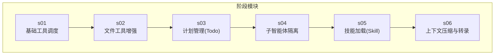
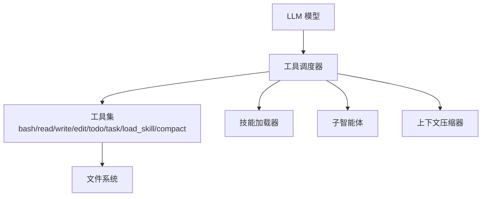
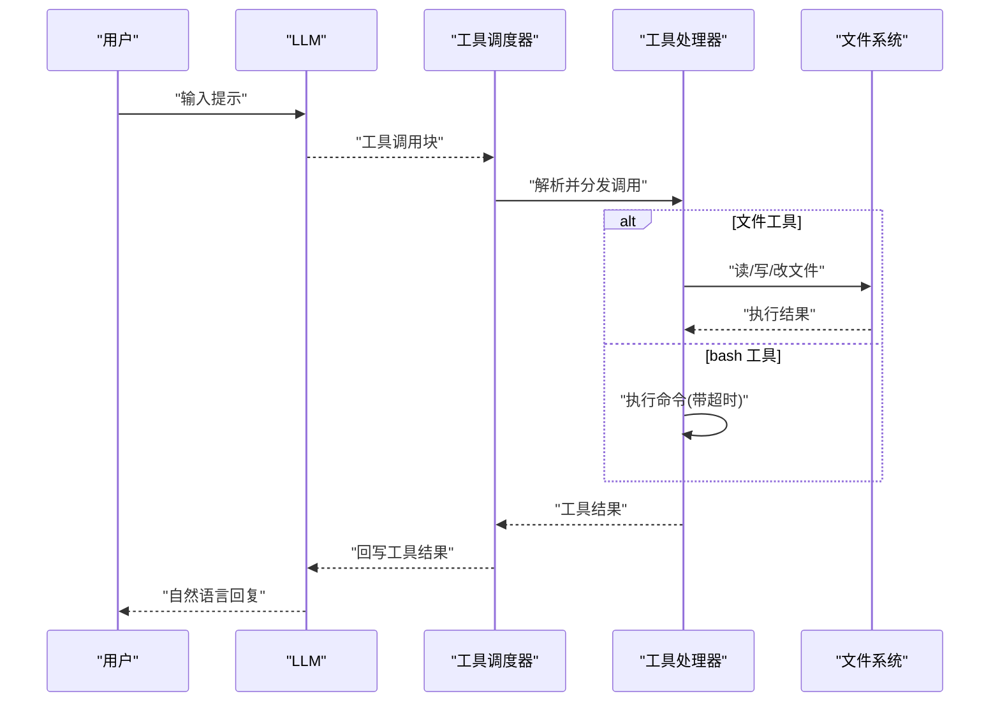
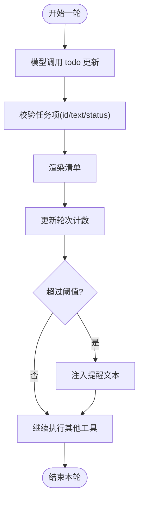
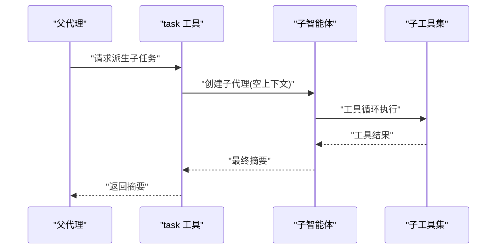
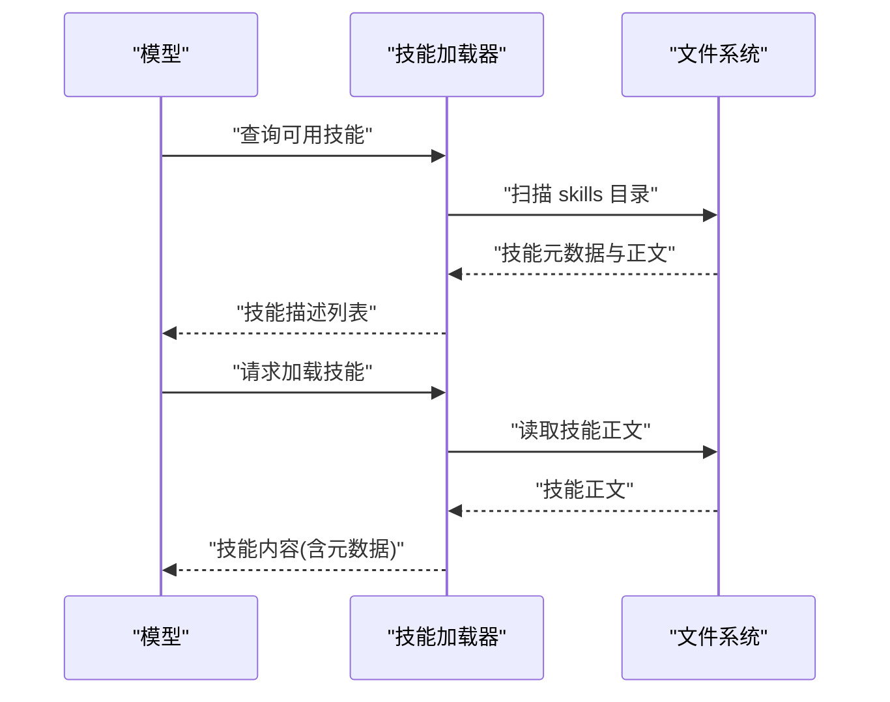
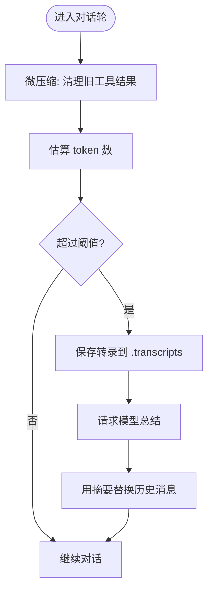
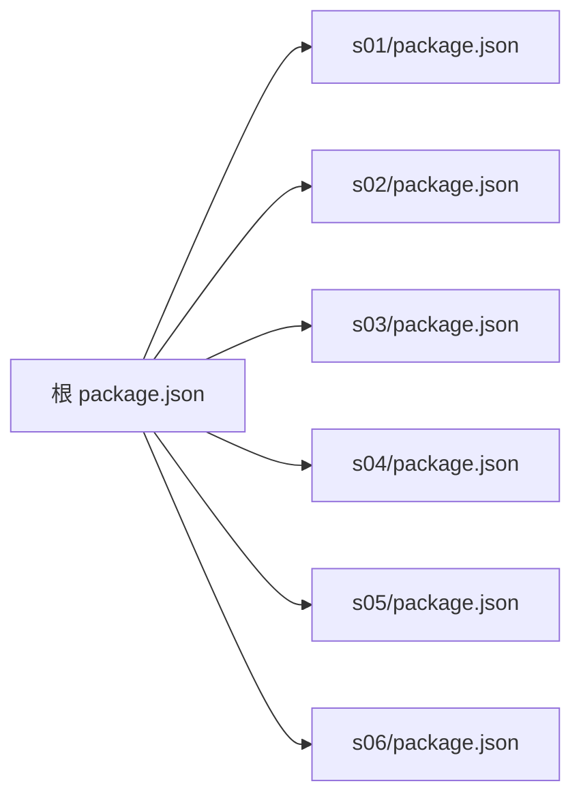

# 系统集成方案

<cite>
**本文引用的文件**
- [README.md](file://README.md)
- [package.json](file://package.json)
- [learn-summary.md](file://learn-summary.md)
- [src/s01/index.ts](file://src/s01/index.ts)
- [src/s01/package.json](file://src/s01/package.json)
- [src/s02/index.ts](file://src/s02/index.ts)
- [src/s03/index.ts](file://src/s03/index.ts)
- [src/s04/index.ts](file://src/s04/index.ts)
- [src/s05/index.ts](file://src/s05/index.ts)
- [src/s05/skills/code-reviews/SKILL.md](file://src/s05/skills/code-reviews/SKILL.md)
- [src/s06/index.ts](file://src/s06/index.ts)
</cite>

## 目录
1. [引言](#引言)
2. [项目结构](#项目结构)
3. [核心组件](#核心组件)
4. [架构总览](#架构总览)
5. [详细组件分析](#详细组件分析)
6. [依赖关系分析](#依赖关系分析)
7. [性能考量](#性能考量)
8. [故障排查指南](#故障排查指南)
9. [结论](#结论)
10. [附录](#附录)

## 引言
本文件面向“系统集成方案”的目标，围绕以下主题展开：CI/CD 系统集成（自动化代码审查、构建触发与部署协调）、IDE 扩展开发（插件架构、API 接口与 UI 集成）、监控系统对接（日志收集、性能指标与告警）、Webhook/REST 扩展与消息队列集成、以及安全集成（认证授权与数据传输加密）。  
本仓库以多阶段示例展示了“工具调度”“计划管理”“子智能体”“技能加载”“上下文压缩”等能力，这些能力可作为系统集成的“原子能力”，用于承接上层平台（CI/CD、IDE、监控、运维）的请求与事件。

## 项目结构
该仓库采用按阶段划分的模块化组织方式，每个阶段对应一个可独立运行的示例程序，演示不同的系统集成能力：
- s01：基础工具调度（bash/read/write/edit）
- s02：扩展文件读写与编辑工具
- s03：引入 Todo 计划管理，防止长任务遗忘
- s04：子智能体隔离，保护上下文清晰
- s05：按需加载技能（Skill），支持代码审查等专业领域
- s06：上下文压缩与转录持久化，支撑长时间对话

图表来源
- [src/s01/index.ts:1-158](file://src/s01/index.ts#L1-L158)
- [src/s02/index.ts:1-213](file://src/s02/index.ts#L1-L213)
- [src/s03/index.ts:1-335](file://src/s03/index.ts#L1-L335)
- [src/s04/index.ts:1-314](file://src/s04/index.ts#L1-L314)
- [src/s05/index.ts:1-332](file://src/s05/index.ts#L1-L332)
- [src/s06/index.ts:1-413](file://src/s06/index.ts#L1-L413)

章节来源
- [README.md:1-3](file://README.md#L1-L3)
- [package.json:1-25](file://package.json#L1-L25)

## 核心组件
- 工具调度器：统一接收 LLM 的工具调用，执行对应操作并回写结果，形成“消息-工具-结果”的闭环。
- 计划管理器（Todo）：在多步任务中维护进度，防止模型遗忘关键步骤。
- 子智能体：为长上下文场景提供“上下文隔离”，子代理仅返回最终摘要。
- 技能加载器：按需加载技能内容，避免系统提示过长，提升可扩展性。
- 上下文压缩器：定期清理旧工具结果，超阈值时进行自动压缩并持久化转录。

章节来源
- [src/s01/index.ts:31-43](file://src/s01/index.ts#L31-L43)
- [src/s03/index.ts:77-131](file://src/s03/index.ts#L77-L131)
- [src/s04/index.ts:148-195](file://src/s04/index.ts#L148-L195)
- [src/s05/index.ts:46-144](file://src/s05/index.ts#L46-L144)
- [src/s06/index.ts:82-196](file://src/s06/index.ts#L82-L196)

## 架构总览
整体架构由“LLM 调度层 + 工具执行层 + 环境交互层 + 知识/上下文管理层”构成，各阶段逐步增强能力，最终形成可扩展、可压缩、可隔离的系统集成基座。

图表来源
- [src/s01/index.ts:77-124](file://src/s01/index.ts#L77-L124)
- [src/s02/index.ts:138-179](file://src/s02/index.ts#L138-L179)
- [src/s03/index.ts:243-299](file://src/s03/index.ts#L243-L299)
- [src/s04/index.ts:221-279](file://src/s04/index.ts#L221-L279)
- [src/s05/index.ts:257-298](file://src/s05/index.ts#L257-L298)
- [src/s06/index.ts:303-367](file://src/s06/index.ts#L303-L367)

## 详细组件分析

### 组件A：工具调度与执行（s01/s02）
- 功能要点
  - 将 LLM 返回的工具调用块转换为具体函数调用，执行后回写工具结果。
  - 支持 bash、文件读写与编辑等基础能力。
  - 对命令执行设置超时与输出截断，保证稳定性。
- 关键流程
  - LLM 返回工具调用 → 解析工具名与参数 → 调用处理器 → 生成工具结果 → 回写到消息历史 → 继续下一轮直到停止原因非工具调用。

图表来源
- [src/s01/index.ts:77-124](file://src/s01/index.ts#L77-L124)
- [src/s02/index.ts:138-179](file://src/s02/index.ts#L138-L179)

章节来源
- [src/s01/index.ts:50-62](file://src/s01/index.ts#L50-L62)
- [src/s02/index.ts:92-104](file://src/s02/index.ts#L92-L104)

### 组件B：计划管理（Todo）（s03）
- 功能要点
  - 维护任务清单，限制“进行中”任务数量，渲染当前进度。
  - 若模型未及时更新计划，注入提醒以保持进度。
- 关键流程
  - 模型调用 todo 更新 → 校验格式与状态 → 渲染清单 → 记录轮次未更新次数 → 达阈值注入提醒。

图表来源
- [src/s03/index.ts:77-131](file://src/s03/index.ts#L77-L131)
- [src/s03/index.ts:243-299](file://src/s03/index.ts#L243-L299)

章节来源
- [src/s03/index.ts:77-131](file://src/s03/index.ts#L77-L131)
- [learn-summary.md:21-25](file://learn-summary.md#L21-L25)

### 组件C：子智能体与上下文隔离（s04）
- 功能要点
  - 提供 task 工具，生成子智能体，子代理拥有全新上下文但共享文件系统。
  - 子代理完成工作后仅返回最终文本摘要，丢弃中间上下文。
- 关键流程
  - 父代理调用 task → 子代理执行工具循环 → 返回最终文本 → 父代理汇总。

图表来源
- [src/s04/index.ts:148-195](file://src/s04/index.ts#L148-L195)
- [src/s04/index.ts:221-279](file://src/s04/index.ts#L221-L279)

章节来源
- [learn-summary.md:27-33](file://learn-summary.md#L27-L33)

### 组件D：技能加载（Skill）（s05）
- 功能要点
  - 通过 frontmatter 定义技能元数据，按需加载技能正文。
  - 在系统提示中注入可用技能列表，模型调用 load_skill 后返回完整技能内容。
- 关键流程
  - 初始化加载所有技能 → 注入系统提示 → 模型请求加载 → 返回技能正文。

图表来源
- [src/s05/index.ts:46-144](file://src/s05/index.ts#L46-L144)
- [src/s05/index.ts:257-298](file://src/s05/index.ts#L257-L298)

章节来源
- [src/s05/skills/code-reviews/SKILL.md:1-157](file://src/s05/skills/code-reviews/SKILL.md#L1-L157)
- [learn-summary.md:38-46](file://learn-summary.md#L38-L46)

### 组件E：上下文压缩与转录（s06）
- 功能要点
  - 微压缩：每轮清理旧工具结果，仅保留最近若干条，其余用占位符替代。
  - 自动压缩：达到 token 阈值时，保存转录并请求模型总结，替换全部消息为摘要。
  - 手动压缩：模型调用 compact 触发即时压缩。
- 关键流程
  - 每轮微压缩 → 估算 token → 超阈值自动压缩 → 保存转录 → 总结并替换 → 继续对话。

图表来源
- [src/s06/index.ts:82-196](file://src/s06/index.ts#L82-L196)
- [src/s06/index.ts:303-367](file://src/s06/index.ts#L303-L367)

章节来源
- [learn-summary.md:48-51](file://learn-summary.md#L48-L51)

## 依赖关系分析
- 外部依赖
  - anthropic SDK：调用 Claude API，负责消息创建与工具调用。
  - dotenv：读取环境变量（如 API Key、Base URL、模型 ID）。
  - js-yaml：解析技能文件的 frontmatter。
- 内部模块
  - 各阶段示例相互演进，s02 在 s01 基础上增加文件工具；s03 引入 Todo；s04 增加子智能体；s05 增加技能加载；s06 增加上下文压缩。

图表来源
- [package.json:1-25](file://package.json#L1-L25)
- [src/s01/package.json:1-23](file://src/s01/package.json#L1-L23)
- [src/s02/package.json:1-23](file://src/s02/package.json#L1-L23)
- [src/s03/package.json:1-23](file://src/s03/package.json#L1-L23)
- [src/s04/package.json:1-23](file://src/s04/package.json#L1-L23)
- [src/s05/package.json:1-23](file://src/s05/package.json#L1-L23)
- [src/s06/package.json:1-23](file://src/s06/package.json#L1-L23)

章节来源
- [package.json:13-23](file://package.json#L13-L23)

## 性能考量
- 工具调用与 I/O
  - 命令执行设置超时，避免阻塞；文件读写限制输出长度，防止消息过大。
- 上下文控制
  - 微压缩减少冗余工具结果；自动压缩在高 token 时降低上下文体积，提高响应速度。
- 并发与隔离
  - 子智能体独立执行，避免父上下文膨胀；完成后仅返回摘要，降低后续计算成本。

章节来源
- [src/s01/index.ts:50-62](file://src/s01/index.ts#L50-L62)
- [src/s06/index.ts:82-196](file://src/s06/index.ts#L82-L196)

## 故障排查指南
- 常见问题
  - 工具调用无结果或报错：检查工具处理器是否正确注册、输入参数是否满足 schema。
  - 文件路径异常：确认路径未逃逸工作区，必要时启用安全路径解析。
  - 子智能体未返回摘要：检查子代理工具集与最大轮次限制。
  - 技能加载失败：确认技能目录结构与 frontmatter 格式。
  - 上下文溢出：触发自动压缩或手动压缩，检查阈值设置。
- 建议
  - 在工具处理器中捕获异常并返回结构化错误信息，便于上层系统识别。
  - 对外部调用（如 API、文件系统）增加重试与熔断策略。

章节来源
- [src/s02/index.ts:37-48](file://src/s02/index.ts#L37-L48)
- [src/s03/index.ts:273-275](file://src/s03/index.ts#L273-L275)
- [src/s05/index.ts:133-141](file://src/s05/index.ts#L133-L141)
- [src/s06/index.ts:307-311](file://src/s06/index.ts#L307-L311)

## 结论
本仓库通过六个阶段展示了从“工具调度”到“上下文压缩”的系统集成能力，这些能力可作为 CI/CD、IDE、监控与运维系统的“原子能力”。结合本文的集成建议，可在不侵入现有平台的前提下，实现自动化代码审查、构建触发、部署协调、IDE 插件 UI 集成、监控日志与指标采集、Webhook/REST 扩展及消息队列集成，并确保安全与性能。

## 附录

### CI/CD 系统集成模式
- 自动化代码审查
  - 使用技能加载能力，将代码审查技能注入系统提示；当检测到 PR 或变更请求时，触发模型调用 load_skill 获取审查流程，再通过工具执行（如 git diff、grep、依赖审计）辅助判断。
- 构建触发与部署协调
  - 通过 Webhook 接收 CI 事件，解析任务类型与参数，派生子智能体执行构建脚本与部署指令；成功后返回摘要，失败时保留转录以便复盘。
- 最佳实践
  - 为每次流水线生成唯一上下文标识，便于追踪与压缩。
  - 对敏感参数（如密钥）使用环境变量注入，避免硬编码。

章节来源
- [src/s05/index.ts:257-298](file://src/s05/index.ts#L257-L298)
- [src/s04/index.ts:148-195](file://src/s04/index.ts#L148-L195)
- [src/s06/index.ts:150-196](file://src/s06/index.ts#L150-L196)

### IDE 扩展开发技术方案
- 插件架构
  - 将工具调度器封装为服务端插件，IDE 通过 RPC/HTTP 与之通信；插件负责与 LLM 对接与工具执行。
- API 接口
  - 提供对话接口（发送消息、接收工具调用、回写结果）、技能加载接口、上下文压缩接口。
- 用户界面集成
  - 在 IDE 中嵌入聊天面板，显示工具调用与结果；支持快捷键触发子智能体与技能加载。
- 最佳实践
  - 保持 UI 与逻辑解耦，通过事件驱动更新界面状态。
  - 对工具调用结果进行可视化展示（如差异对比、日志高亮）。

章节来源
- [src/s01/index.ts:77-124](file://src/s01/index.ts#L77-L124)
- [src/s05/index.ts:257-298](file://src/s05/index.ts#L257-L298)
- [src/s06/index.ts:303-367](file://src/s06/index.ts#L303-L367)

### 监控系统对接实现指南
- 日志收集
  - 将工具执行结果与转录保存至本地或远端存储；在压缩前记录关键事件与耗时。
- 性能指标
  - 统计 token 用量、工具调用耗时、压缩触发频率；在 UI 中展示趋势图。
- 告警机制
  - 当工具执行失败率升高、压缩过于频繁或上下文超限时触发告警。
- 最佳实践
  - 使用结构化日志格式，便于检索与聚合。
  - 对敏感信息脱敏后再输出。

章节来源
- [src/s06/index.ts:150-196](file://src/s06/index.ts#L150-L196)
- [learn-summary.md:48-51](file://learn-summary.md#L48-L51)

### Webhook/REST 扩展与消息队列集成
- Webhook
  - 接收外部系统事件（如 CI 事件、工单变更），解析后派发到工具调度器；完成后通过回调通知源系统。
- REST API
  - 提供对话、技能加载、上下文压缩等接口；支持鉴权与速率限制。
- 消息队列
  - 将长耗时任务放入队列异步处理，避免阻塞主线程；消费端执行工具并回写结果。
- 最佳实践
  - 对请求幂等与去重；对失败任务进行重试与死信处理。

章节来源
- [src/s04/index.ts:221-279](file://src/s04/index.ts#L221-L279)
- [src/s05/index.ts:257-298](file://src/s05/index.ts#L257-L298)
- [src/s06/index.ts:303-367](file://src/s06/index.ts#L303-L367)

### 安全集成考虑
- 认证授权
  - 使用 API Key 或 OAuth 令牌；对敏感端点启用访问控制与审计日志。
- 数据传输加密
  - 使用 HTTPS/TLS；对敏感参数进行加密存储与传输。
- 输入验证与沙箱
  - 对 bash 命令与文件路径进行白名单与安全解析；限制命令执行时间与输出大小。
- 最佳实践
  - 定期轮换密钥；最小权限原则；对日志中的敏感信息进行脱敏。

章节来源
- [src/s02/index.ts:37-48](file://src/s02/index.ts#L37-L48)
- [src/s01/index.ts:50-62](file://src/s01/index.ts#L50-L62)
- [src/s06/index.ts:307-311](file://src/s06/index.ts#L307-L311)