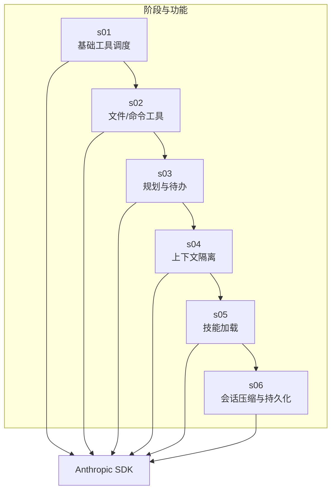
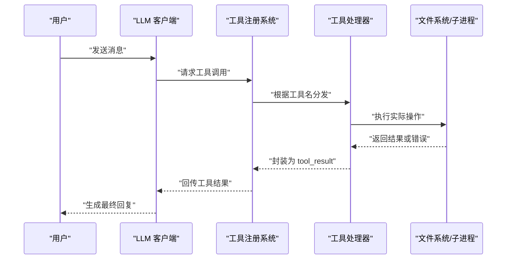
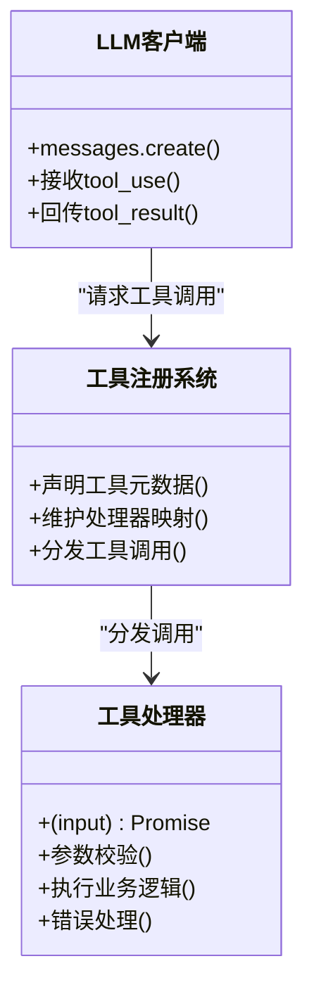
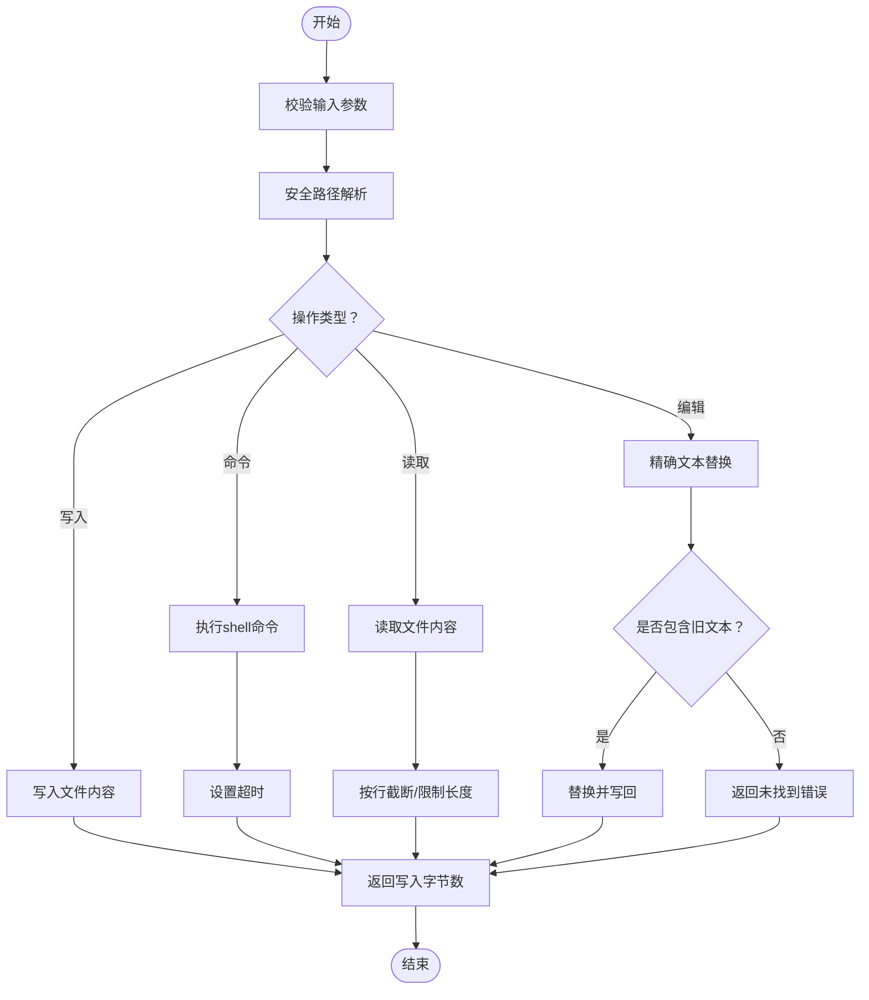
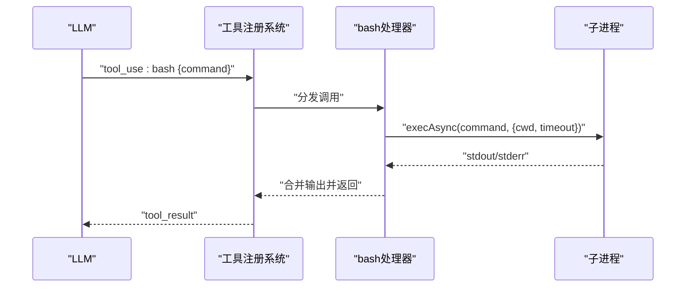
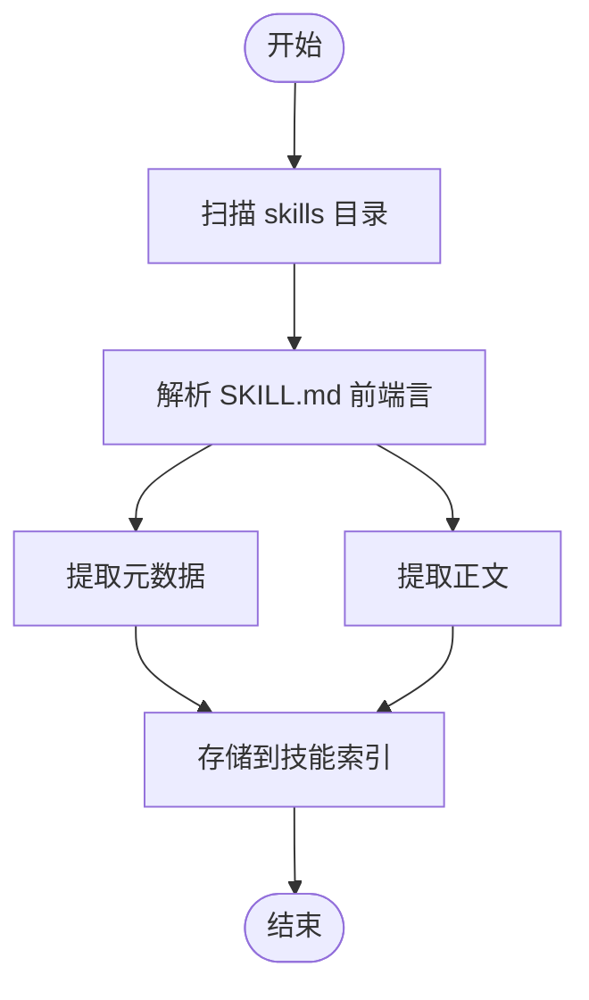
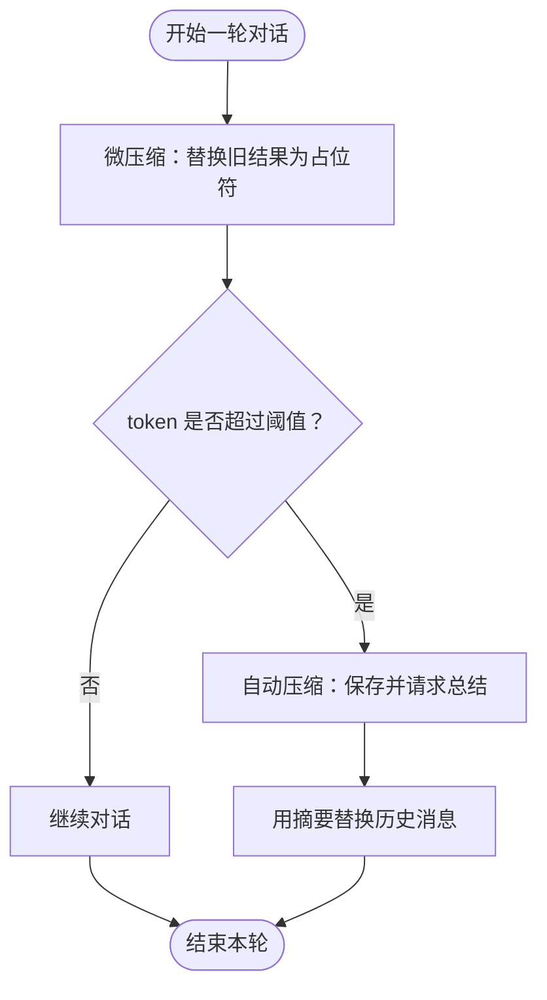
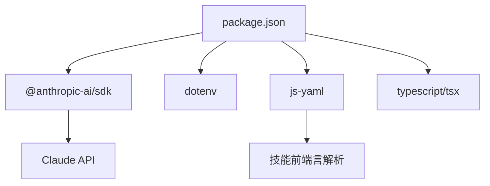

# 自定义工具开发

<cite>
**本文引用的文件**
- [README.md](file://README.md)
- [package.json](file://package.json)
- [src/s01/index.ts](file://src/s01/index.ts)
- [src/s02/index.ts](file://src/s02/index.ts)
- [src/s03/index.ts](file://src/s03/index.ts)
- [src/s04/index.ts](file://src/s04/index.ts)
- [src/s05/index.ts](file://src/s05/index.ts)
- [src/s05/skills/code-reviews/SKILL.md](file://src/s05/skills/code-reviews/SKILL.md)
- [src/s06/index.ts](file://src/s06/index.ts)
- [src/s06/.transcripts/transcript_1777018931.jsonl](file://src/s06/.transcripts/transcript_1777018931.jsonl)
- [src/s02/greet.py](file://src/s02/greet.py)
</cite>

## 目录
1. [简介](#简介)
2. [项目结构](#项目结构)
3. [核心组件](#核心组件)
4. [架构总览](#架构总览)
5. [详细组件分析](#详细组件分析)
6. [依赖关系分析](#依赖关系分析)
7. [性能考量](#性能考量)
8. [故障排查指南](#故障排查指南)
9. [结论](#结论)
10. [附录](#附录)

## 简介
本项目以“逐步实现的最小 Claude Code”为目标，通过多阶段示例展示了如何构建一个具备工具调用能力的智能体系统。每个阶段（s01 到 s06）聚焦于不同的工程化主题：基础工具调度、文件与命令工具、规划与待办管理、上下文隔离、按需知识加载、以及会话压缩与持久化。本文档面向希望扩展工具注册系统、添加新工具处理器与输入参数校验的开发者，提供从架构到实现细节的完整指导，并给出最佳实践与安全边界建议。

## 项目结构
仓库采用按阶段划分的模块化组织方式，每个阶段在独立目录中提供可运行的示例程序与配套资源：
- s01：基础工具调度与 shell 命令执行
- s02：文件读写与编辑工具，引入路径安全检查
- s03：结合 Todo 管理的规划式工具使用
- s04：子代理与上下文隔离，避免历史污染
- s05：技能加载器，按需注入领域知识
- s06：会话压缩与持久化，支持自动与手动压缩

图表来源
- [src/s01/index.ts:1-158](file://src/s01/index.ts#L1-L158)
- [src/s02/index.ts:1-213](file://src/s02/index.ts#L1-L213)
- [src/s03/index.ts:1-335](file://src/s03/index.ts#L1-L335)
- [src/s04/index.ts:1-314](file://src/s04/index.ts#L1-L314)
- [src/s05/index.ts:1-332](file://src/s05/index.ts#L1-L332)
- [src/s06/index.ts:1-413](file://src/s06/index.ts#L1-L413)

章节来源
- [README.md:1-3](file://README.md#L1-L3)
- [package.json:1-25](file://package.json#L1-L25)

## 核心组件
本节概述工具系统的关键构件：工具元数据、工具处理器映射、LLM 调用与工具结果回传、以及安全与错误处理策略。

- 工具元数据（TOOLS）
  - 每个工具由名称、描述与输入模式（JSON Schema）组成，用于向 LLM 提供精确的调用规范。
  - 示例路径：[工具元数据定义:118-127](file://src/s02/index.ts#L118-L127)，[工具元数据定义（含 todo）:219-230](file://src/s03/index.ts#L219-L230)，[工具元数据定义（含 load_skill）:234-245](file://src/s05/index.ts#L234-L245)，[工具元数据定义（含 compact）:280-291](file://src/s06/index.ts#L280-L291)

- 工具处理器映射（TOOL_HANDLERS）
  - 将工具名映射到具体实现函数，统一处理工具调用与结果封装。
  - 示例路径：[处理器映射（s02）:129-135](file://src/s02/index.ts#L129-L135)，[处理器映射（s03）:232-239](file://src/s03/index.ts#L232-L239)，[处理器映射（s04）:116-122](file://src/s04/index.ts#L116-L122)，[处理器映射（s05）:247-254](file://src/s05/index.ts#L247-L254)，[处理器映射（s06）:293-300](file://src/s06/index.ts#L293-L300)

- LLM 工具调用循环
  - 发送消息与工具列表给 LLM；当 LLM 请求工具调用时，执行对应处理器并将结果作为 tool_result 回传，驱动下一轮对话。
  - 示例路径：[单轮工具调用（s01）:76-124](file://src/s01/index.ts#L76-L124)，[通用工具调用循环（s02）:138-179](file://src/s02/index.ts#L138-L179)，[带提醒与 Todo 的循环（s03）:242-299](file://src/s03/index.ts#L242-L299)，[子代理与任务工具（s04）:221-279](file://src/s04/index.ts#L221-L279)，[技能加载工具（s05）:257-298](file://src/s05/index.ts#L257-L298)，[压缩流程入口（s06）:303-367](file://src/s06/index.ts#L303-L367)

- 安全与错误处理
  - 文件路径安全检查（防止越权访问）、统一异常捕获与错误消息格式化、超时控制等。
  - 示例路径：[路径安全检查（s02）:37-48](file://src/s02/index.ts#L37-L48)，[路径安全检查（s03）:138-149](file://src/s03/index.ts#L138-L149)，[路径安全检查（s04）:47-58](file://src/s04/index.ts#L47-L58)，[路径安全检查（s05）:153-164](file://src/s05/index.ts#L153-L164)，[路径安全检查（s06）:199-210](file://src/s06/index.ts#L199-L210)，[错误处理（s02）:50-74](file://src/s02/index.ts#L50-L74)，[错误处理（s03）:151-190](file://src/s03/index.ts#L151-L190)，[错误处理（s04）:60-99](file://src/s04/index.ts#L60-L99)，[错误处理（s05）:166-205](file://src/s05/index.ts#L166-L205)，[错误处理（s06）:212-251](file://src/s06/index.ts#L212-L251)

章节来源
- [src/s01/index.ts:31-124](file://src/s01/index.ts#L31-L124)
- [src/s02/index.ts:37-135](file://src/s02/index.ts#L37-L135)
- [src/s03/index.ts:77-239](file://src/s03/index.ts#L77-L239)
- [src/s04/index.ts:47-122](file://src/s04/index.ts#L47-L122)
- [src/s05/index.ts:46-254](file://src/s05/index.ts#L46-L254)
- [src/s06/index.ts:54-300](file://src/s06/index.ts#L54-L300)

## 架构总览
整体架构围绕“LLM + 工具注册系统 + 工具处理器”的模式展开，工具调用链路如下：

图表来源
- [src/s02/index.ts:138-179](file://src/s02/index.ts#L138-L179)
- [src/s03/index.ts:242-299](file://src/s03/index.ts#L242-L299)
- [src/s04/index.ts:221-279](file://src/s04/index.ts#L221-L279)
- [src/s05/index.ts:257-298](file://src/s05/index.ts#L257-L298)
- [src/s06/index.ts:303-367](file://src/s06/index.ts#L303-L367)

## 详细组件分析

### 组件一：工具注册系统与处理器映射
- 设计要点
  - 工具元数据集中声明，便于 LLM 理解可用能力与输入约束。
  - 处理器映射集中管理，便于扩展与维护。
  - 工具调用循环统一处理结果回传与后续对话推进。
- 实现模式
  - 元数据：name/description/input_schema
  - 处理器签名：(input) => Promise<string|any>
  - 分发逻辑：根据 block.name 查表执行
- 扩展建议
  - 新增工具时，先完善元数据（含必填字段与类型），再实现处理器，最后加入映射。
  - 对复杂输入进行参数校验与默认值处理，确保健壮性。

图表来源
- [src/s02/index.ts:118-135](file://src/s02/index.ts#L118-L135)
- [src/s03/index.ts:219-239](file://src/s03/index.ts#L219-L239)
- [src/s04/index.ts:137-146](file://src/s04/index.ts#L137-L146)
- [src/s05/index.ts:234-254](file://src/s05/index.ts#L234-L254)
- [src/s06/index.ts:280-300](file://src/s06/index.ts#L280-L300)

章节来源
- [src/s02/index.ts:118-135](file://src/s02/index.ts#L118-L135)
- [src/s03/index.ts:219-239](file://src/s03/index.ts#L219-L239)
- [src/s04/index.ts:137-146](file://src/s04/index.ts#L137-L146)
- [src/s05/index.ts:234-254](file://src/s05/index.ts#L234-L254)
- [src/s06/index.ts:280-300](file://src/s06/index.ts#L280-L300)

### 组件二：文件操作工具（读取/写入/编辑/命令）
- 功能概览
  - 读取文件内容并限制输出长度
  - 写入文件并自动创建目录
  - 在文件内进行精确文本替换
  - 执行 shell 命令并返回标准输出/错误
- 安全与健壮性
  - 使用安全路径解析，防止路径逃逸
  - 统一异常捕获与错误消息格式化
  - 命令执行设置超时，避免长时间阻塞
- 最佳实践
  - 输入参数必须包含必要字段（如 path、command）
  - 对大文件读取提供 limit 参数，避免内存压力
  - 文本替换前先检查是否存在目标文本，避免误改

图表来源
- [src/s02/index.ts:50-104](file://src/s02/index.ts#L50-L104)
- [src/s03/index.ts:151-205](file://src/s03/index.ts#L151-L205)
- [src/s04/index.ts:60-114](file://src/s04/index.ts#L60-L114)
- [src/s05/index.ts:166-220](file://src/s05/index.ts#L166-L220)
- [src/s06/index.ts:212-266](file://src/s06/index.ts#L212-L266)

章节来源
- [src/s02/index.ts:50-104](file://src/s02/index.ts#L50-L104)
- [src/s03/index.ts:151-205](file://src/s03/index.ts#L151-L205)
- [src/s04/index.ts:60-114](file://src/s04/index.ts#L60-L114)
- [src/s05/index.ts:166-220](file://src/s05/index.ts#L166-L220)
- [src/s06/index.ts:212-266](file://src/s06/index.ts#L212-L266)

### 组件三：系统命令工具（bash）
- 实现要点
  - 使用 child_process 执行命令，设置工作目录与超时
  - 合并 stdout 与 stderr 输出，统一返回
- 错误处理
  - 捕获执行异常并返回错误信息
  - 设置合理超时，避免长时间阻塞
- 安全边界
  - 仅允许在受控工作区内执行命令
  - 可结合白名单或沙箱策略进一步限制

图表来源
- [src/s01/index.ts:50-62](file://src/s01/index.ts#L50-L62)
- [src/s02/index.ts:92-104](file://src/s02/index.ts#L92-L104)
- [src/s03/index.ts:193-205](file://src/s03/index.ts#L193-L205)
- [src/s04/index.ts:102-114](file://src/s04/index.ts#L102-L114)
- [src/s05/index.ts:208-220](file://src/s05/index.ts#L208-L220)
- [src/s06/index.ts:254-266](file://src/s06/index.ts#L254-L266)

章节来源
- [src/s01/index.ts:50-62](file://src/s01/index.ts#L50-L62)
- [src/s02/index.ts:92-104](file://src/s02/index.ts#L92-L104)
- [src/s03/index.ts:193-205](file://src/s03/index.ts#L193-L205)
- [src/s04/index.ts:102-114](file://src/s04/index.ts#L102-L114)
- [src/s05/index.ts:208-220](file://src/s05/index.ts#L208-L220)
- [src/s06/index.ts:254-266](file://src/s06/index.ts#L254-L266)

### 组件四：第三方服务集成工具（技能加载）
- 功能概览
  - 通过前端言（YAML）提取技能元数据与正文
  - 将技能正文作为 tool_result 返回，供 LLM 使用
- 实现要点
  - 遍历 skills 目录，解析 SKILL.md
  - 将技能名称映射到元数据与正文
- 最佳实践
  - 技能元数据包含 name、description、tags 等
  - 正文采用 Markdown 结构化格式，便于 LLM 解析

图表来源
- [src/s05/index.ts:46-144](file://src/s05/index.ts#L46-L144)
- [src/s05/skills/code-reviews/SKILL.md:1-157](file://src/s05/skills/code-reviews/SKILL.md#L1-L157)

章节来源
- [src/s05/index.ts:46-144](file://src/s05/index.ts#L46-L144)
- [src/s05/skills/code-reviews/SKILL.md:1-157](file://src/s05/skills/code-reviews/SKILL.md#L1-L157)

### 组件五：会话压缩与持久化（s06）
- 功能概览
  - 微压缩：将较早的工具结果替换为占位符，保留最近若干条
  - 自动压缩：超过阈值时保存完整对话并请求 LLM 总结，替换为摘要
  - 手动压缩：模型显式调用 compact 工具触发压缩
- 实现要点
  - 估计 token 数量，决定是否触发压缩
  - 保存完整对话到 .transcripts 目录
  - 通过 LLM 生成摘要并替换历史消息
- 最佳实践
  - 保留 read_file 等参考型工具结果，避免重复读取
  - 压缩后仍保留关键上下文，确保连续性

图表来源
- [src/s06/index.ts:59-196](file://src/s06/index.ts#L59-L196)
- [src/s06/index.ts:303-367](file://src/s06/index.ts#L303-L367)
- [src/s06/.transcripts/transcript_1777018931.jsonl:1-8](file://src/s06/.transcripts/transcript_1777018931.jsonl#L1-L8)

章节来源
- [src/s06/index.ts:59-196](file://src/s06/index.ts#L59-L196)
- [src/s06/index.ts:303-367](file://src/s06/index.ts#L303-L367)
- [src/s06/.transcripts/transcript_1777018931.jsonl:1-8](file://src/s06/.transcripts/transcript_1777018931.jsonl#L1-L8)

## 依赖关系分析
- 运行时依赖
  - @anthropic-ai/sdk：调用 Claude API
  - dotenv：加载环境变量
  - js-yaml：解析技能前端言
- 开发依赖
  - typescript、tsx：类型检查与热重载
- 关键外部接口
  - Anthropic.messages.create：发送消息与工具列表，接收 tool_use 并回传 tool_result

图表来源
- [package.json:13-23](file://package.json#L13-L23)

章节来源
- [package.json:1-25](file://package.json#L1-L25)

## 性能考量
- 工具调用频率与响应时间
  - 控制工具调用次数，避免频繁 IO 或长耗时操作
  - 对大文件读取使用 limit 参数，减少内存占用
- 会话压缩
  - 通过微压缩与自动压缩降低上下文长度，提升吞吐
  - 保留关键工具结果（如 read_file）以减少重复读取
- 超时与资源限制
  - 子进程执行设置超时，防止阻塞
  - 合理设置 max_tokens，避免过长输出

## 故障排查指南
- 常见问题与定位
  - 路径逃逸错误：确认输入路径经安全解析，且位于工作区范围内
    - 参考路径：[安全路径检查（s02）:37-48](file://src/s02/index.ts#L37-L48)，[安全路径检查（s03）:138-149](file://src/s03/index.ts#L138-L149)
  - 文件读取失败：检查文件存在性、权限与编码
    - 参考路径：[文件读取错误处理（s02）:50-63](file://src/s02/index.ts#L50-L63)，[文件读取错误处理（s03）:151-164](file://src/s03/index.ts#L151-L164)
  - 命令执行异常：查看 stderr 输出，确认命令合法性与工作目录
    - 参考路径：[命令执行错误处理（s02）:92-104](file://src/s02/index.ts#L92-L104)，[命令执行错误处理（s03）:193-205](file://src/s03/index.ts#L193-L205)
  - 技能加载失败：检查 SKILL.md 前端言格式与文件命名
    - 参考路径：[技能加载器（s05）:46-144](file://src/s05/index.ts#L46-L144)，[示例技能文件（s05）:1-157](file://src/s05/skills/code-reviews/SKILL.md#L1-L157)
  - 会话压缩异常：检查 token 估算与摘要生成逻辑
    - 参考路径：[压缩流程（s06）:59-196](file://src/s06/index.ts#L59-L196)，[转录文件（s06）:1-8](file://src/s06/.transcripts/transcript_1777018931.jsonl#L1-L8)

章节来源
- [src/s02/index.ts:37-104](file://src/s02/index.ts#L37-L104)
- [src/s03/index.ts:138-205](file://src/s03/index.ts#L138-L205)
- [src/s05/index.ts:46-144](file://src/s05/index.ts#L46-L144)
- [src/s06/index.ts:59-196](file://src/s06/index.ts#L59-L196)
- [src/s06/.transcripts/transcript_1777018931.jsonl:1-8](file://src/s06/.transcripts/transcript_1777018931.jsonl#L1-L8)

## 结论
本项目以渐进方式展示了工具系统的完整生命周期：从工具元数据定义、处理器实现、到调用分发与结果回传；并通过上下文隔离、按需知识加载与会话压缩等工程化手段，提升了系统的安全性、可扩展性与稳定性。开发者可据此模式快速扩展新的工具类型，同时遵循安全边界与错误处理最佳实践，确保工具在可控范围内高效运行。

## 附录
- 工具元数据配置最佳实践
  - 明确 name 与 description，简洁易懂
  - input_schema 中列出必需字段与类型，使用 enum 限定枚举值
  - 必要时提供示例输入，帮助 LLM 正确构造请求
  - 参考路径：[工具元数据（s02）:118-127](file://src/s02/index.ts#L118-L127)，[工具元数据（s03）:219-230](file://src/s03/index.ts#L219-L230)，[工具元数据（s05）:234-245](file://src/s05/index.ts#L234-L245)，[工具元数据（s06）:280-291](file://src/s06/index.ts#L280-L291)
- 输入参数验证与默认值
  - 在处理器入口进行参数校验，缺失或非法参数应尽早返回错误
  - 对可选参数提供合理默认值，减少调用方负担
  - 参考路径：[参数校验与默认值（s02）:129-135](file://src/s02/index.ts#L129-L135)，[参数校验与默认值（s03）:232-239](file://src/s03/index.ts#L232-L239)
- 错误处理与日志
  - 统一捕获异常并格式化错误消息，便于调试与用户反馈
  - 记录关键步骤与工具调用结果，便于审计与复现
  - 参考路径：[错误处理（s02）:50-74](file://src/s02/index.ts#L50-L74)，[错误处理（s03）:151-190](file://src/s03/index.ts#L151-L190)，[错误处理（s04）:60-99](file://src/s04/index.ts#L60-L99)，[错误处理（s05）:166-205](file://src/s05/index.ts#L166-L205)，[错误处理（s06）:212-251](file://src/s06/index.ts#L212-L251)
- 安全边界与权限控制
  - 严格限制文件系统访问范围，防止路径逃逸
  - 对命令执行进行白名单或沙箱策略
  - 对第三方服务调用进行鉴权与速率限制
  - 参考路径：[路径安全检查（s02）:37-48](file://src/s02/index.ts#L37-L48)，[路径安全检查（s03）:138-149](file://src/s03/index.ts#L138-L149)，[路径安全检查（s04）:47-58](file://src/s04/index.ts#L47-L58)，[路径安全检查（s05）:153-164](file://src/s05/index.ts#L153-L164)，[路径安全检查（s06）:199-210](file://src/s06/index.ts#L199-L210)