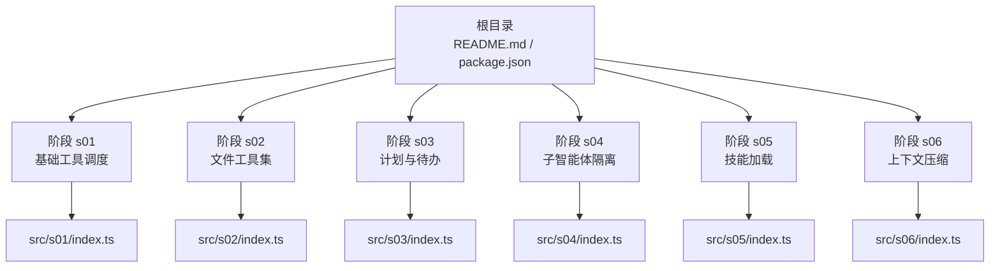
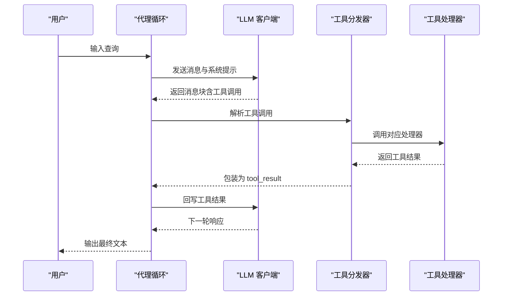
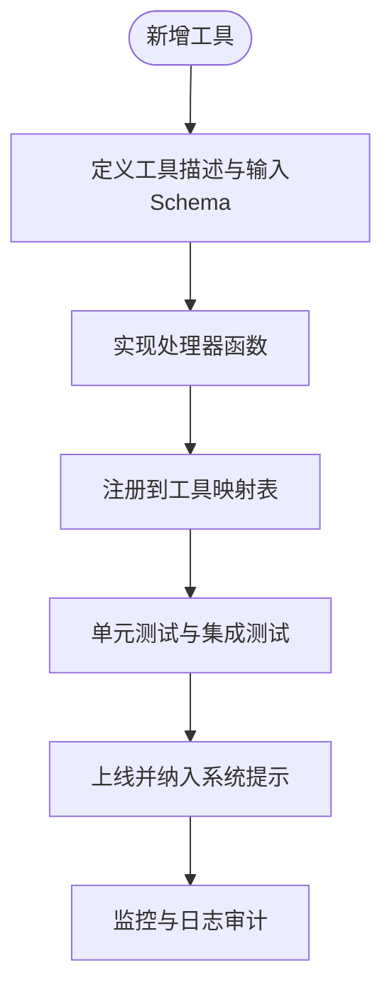
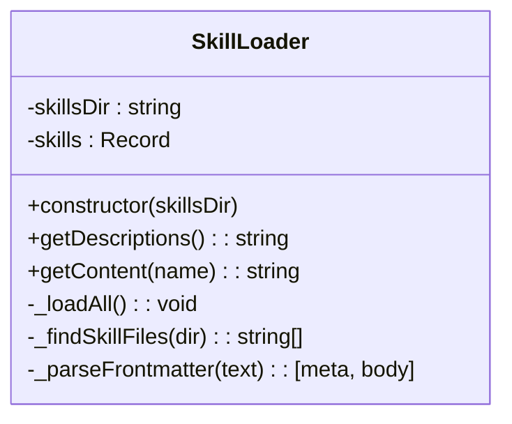
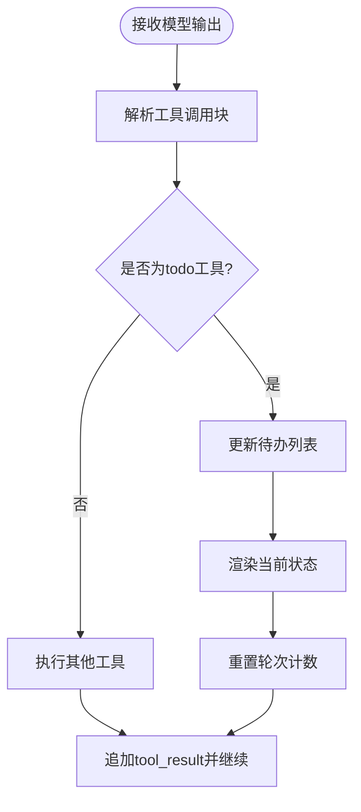
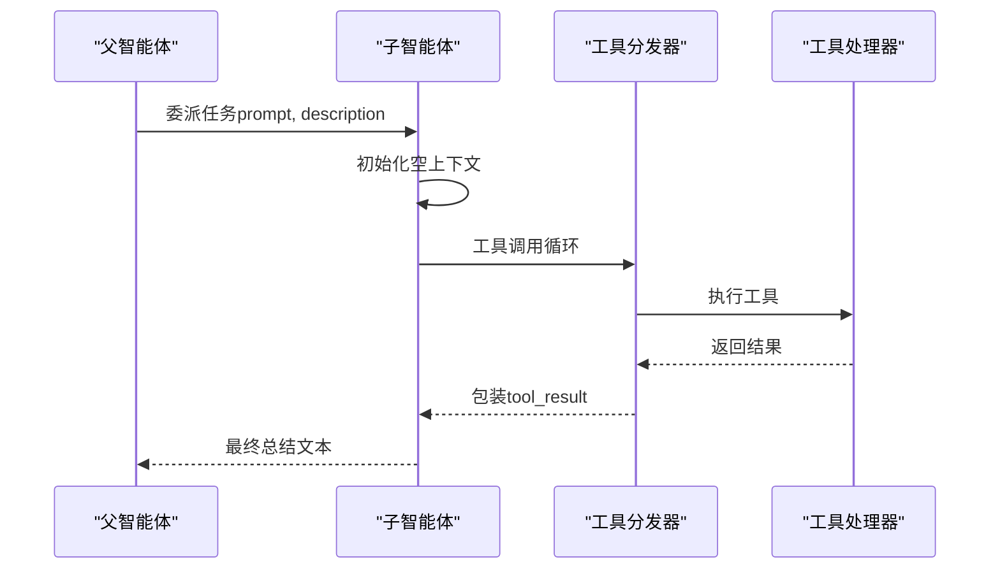
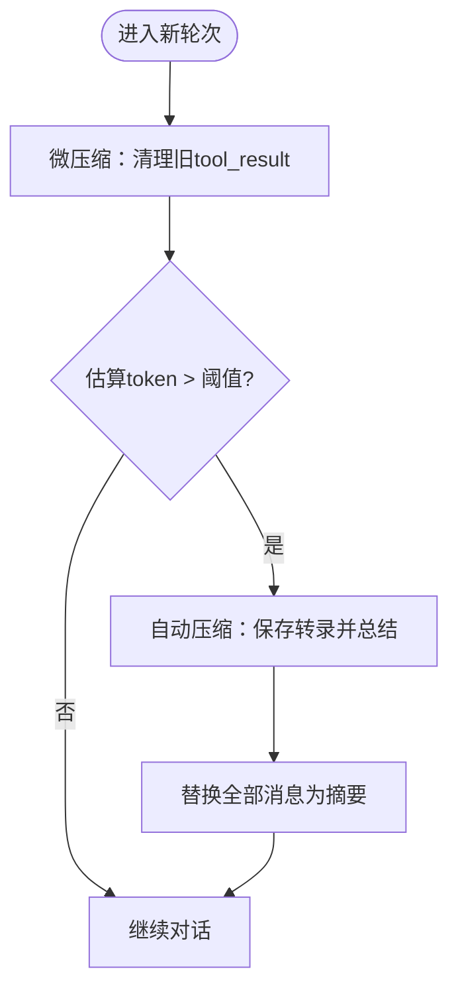
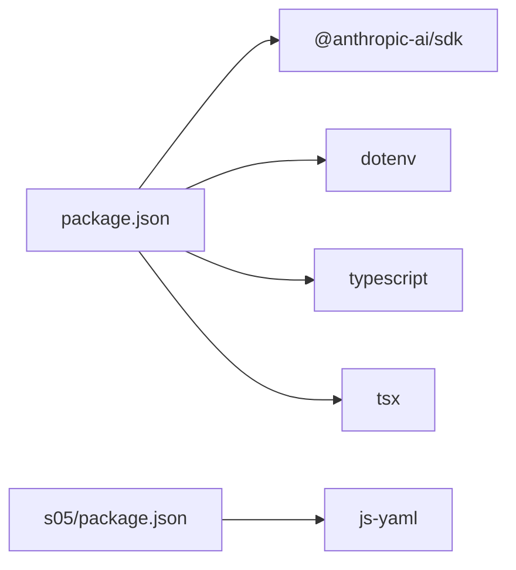

# 高级主题

<cite>
**本文引用的文件**
- [README.md](file://README.md)
- [package.json](file://package.json)
- [src/s01/index.ts](file://src/s01/index.ts)
- [src/s02/index.ts](file://src/s02/index.ts)
- [src/s03/index.ts](file://src/s03/index.ts)
- [src/s04/index.ts](file://src/s04/index.ts)
- [src/s05/index.ts](file://src/s05/index.ts)
- [src/s05/skills/code-reviews/SKILL.md](file://src/s05/skills/code-reviews/SKILL.md)
- [src/s06/index.ts](file://src/s06/index.ts)
- [learn-summary.md](file://learn-summary.md)
- [src/s01/package.json](file://src/s01/package.json)
- [src/s02/package.json](file://src/s02/package.json)
</cite>

## 目录
1. [引言](#引言)
2. [项目结构](#项目结构)
3. [核心组件](#核心组件)
4. [架构总览](#架构总览)
5. [详细组件分析](#详细组件分析)
6. [依赖分析](#依赖分析)
7. [性能考量](#性能考量)
8. [故障排除指南](#故障排除指南)
9. [结论](#结论)
10. [附录](#附录)

## 引言
本高级主题文档聚焦于 Mini-Claude-Code 的系统化演进与工程化实践，围绕“自定义工具开发”“技能扩展机制”“性能调优策略”“系统集成方案”四大维度展开。通过对仓库中六个阶段（s01–s06）的源码进行逐层剖析，提炼出可复用的扩展点、最佳实践与风险控制手段，并给出与 CI/CD、IDE 扩展、监控系统对接的实战建议。

## 项目结构
该项目采用按阶段拆分的模块化组织方式，每个阶段（s01–s06）对应一个独立的可运行示例，逐步引入工具调度、计划管理、子智能体、技能加载与上下文压缩等能力。顶层 README 与 package.json 提供项目概览与通用依赖；各阶段子目录包含各自的入口脚本与运行时配置。

图表来源
- [README.md:1-3](file://README.md#L1-L3)
- [package.json:1-25](file://package.json#L1-L25)
- [src/s01/index.ts:1-158](file://src/s01/index.ts#L1-L158)
- [src/s02/index.ts:1-213](file://src/s02/index.ts#L1-L213)
- [src/s03/index.ts:1-335](file://src/s03/index.ts#L1-L335)
- [src/s04/index.ts:1-314](file://src/s04/index.ts#L1-L314)
- [src/s05/index.ts:1-332](file://src/s05/index.ts#L1-L332)
- [src/s06/index.ts:1-413](file://src/s06/index.ts#L1-L413)

章节来源
- [README.md:1-3](file://README.md#L1-L3)
- [package.json:1-25](file://package.json#L1-L25)

## 核心组件
- 工具注册与分发：通过工具清单与处理器映射实现统一调度，支持 bash、文件读写编辑、任务委托、技能加载与上下文压缩等能力。
- 计划与待办：以 TodoManager 维护任务状态，结合提醒机制避免长任务过程中的遗忘与漂移。
- 子智能体：父智能体与子智能体共享文件系统但隔离对话上下文，提升长程任务稳定性。
- 技能系统：基于目录扫描与 YAML Frontmatter 的技能加载器，按需注入领域知识。
- 上下文压缩：三层压缩策略（微压缩、自动压缩、手动压缩），在保持关键信息的同时显著降低 token 使用。

章节来源
- [src/s01/index.ts:31-43](file://src/s01/index.ts#L31-L43)
- [src/s02/index.ts:118-135](file://src/s02/index.ts#L118-L135)
- [src/s03/index.ts:77-131](file://src/s03/index.ts#L77-L131)
- [src/s04/index.ts:136-216](file://src/s04/index.ts#L136-L216)
- [src/s05/index.ts:46-144](file://src/s05/index.ts#L46-L144)
- [src/s06/index.ts:59-196](file://src/s06/index.ts#L59-L196)

## 架构总览
整体架构遵循“用户输入 → 多轮对话 → 工具调用 → 结果回写 → 循环推进”的闭环，工具调用由模型驱动，工具执行由本地处理器承接，上下文管理贯穿始终。

图表来源
- [src/s01/index.ts:76-124](file://src/s01/index.ts#L76-L124)
- [src/s02/index.ts:138-179](file://src/s02/index.ts#L138-L179)
- [src/s03/index.ts:242-299](file://src/s03/index.ts#L242-L299)
- [src/s04/index.ts:220-279](file://src/s04/index.ts#L220-L279)
- [src/s05/index.ts:257-298](file://src/s05/index.ts#L257-L298)
- [src/s06/index.ts:303-367](file://src/s06/index.ts#L303-L367)

## 详细组件分析

### 自定义工具开发与扩展机制
- 工具清单与输入模式：通过工具描述与 JSON Schema 描述输入参数，确保模型调用的确定性与一致性。
- 处理器映射：以名称到函数的映射表集中管理工具执行逻辑，便于新增与替换。
- 安全边界：文件操作通过安全路径解析防止越界访问；命令执行设置超时与错误兜底。

图表来源
- [src/s02/index.ts:118-135](file://src/s02/index.ts#L118-L135)
- [src/s03/index.ts:219-239](file://src/s03/index.ts#L219-L239)
- [src/s04/index.ts:136-216](file://src/s04/index.ts#L136-L216)
- [src/s05/index.ts:234-254](file://src/s05/index.ts#L234-L254)
- [src/s06/index.ts:280-300](file://src/s06/index.ts#L280-L300)

章节来源
- [src/s02/index.ts:37-89](file://src/s02/index.ts#L37-L89)
- [src/s03/index.ts:137-190](file://src/s03/index.ts#L137-L190)
- [src/s04/index.ts:47-99](file://src/s04/index.ts#L47-L99)
- [src/s05/index.ts:153-205](file://src/s05/index.ts#L153-L205)
- [src/s06/index.ts:199-251](file://src/s06/index.ts#L199-L251)

### 技能扩展机制（Skill Loader）
- 目录扫描：递归遍历技能目录，收集以特定文件命名的技能文档。
- Frontmatter 解析：使用 YAML Frontmatter 提取元信息（名称、描述、标签）与正文内容。
- 动态注入：将技能摘要注入系统提示，按需加载完整技能正文作为工具结果返回。

图表来源
- [src/s05/index.ts:46-144](file://src/s05/index.ts#L46-L144)

章节来源
- [src/s05/index.ts:33-151](file://src/s05/index.ts#L33-L151)
- [src/s05/skills/code-reviews/SKILL.md:1-157](file://src/s05/skills/code-reviews/SKILL.md#L1-L157)

### 计划与待办（TodoManager）
- 数据模型：任务项包含 id、text、status 三要素，支持三种状态与渲染格式。
- 校验规则：限制任务数量、状态枚举与唯一性，强制单个进行中任务。
- 提醒机制：在未使用待办且超过阈值轮次后注入提醒，促使模型持续更新进度。

图表来源
- [src/s03/index.ts:77-131](file://src/s03/index.ts#L77-L131)
- [src/s03/index.ts:242-299](file://src/s03/index.ts#L242-L299)

章节来源
- [src/s03/index.ts:62-131](file://src/s03/index.ts#L62-L131)
- [learn-summary.md:20-26](file://learn-summary.md#L20-L26)

### 子智能体（Subagent）与上下文隔离
- 角色分工：父智能体负责任务委派与高层协调，子智能体专注具体执行并保持全新上下文。
- 工具集合：子智能体继承基础工具集，但不包含递归委派能力，避免无限嵌套。
- 结果收敛：子智能体仅返回最终总结文本，丢弃中间上下文，确保父智能体上下文清洁。

图表来源
- [src/s04/index.ts:148-195](file://src/s04/index.ts#L148-L195)
- [src/s04/index.ts:220-279](file://src/s04/index.ts#L220-L279)

章节来源
- [src/s04/index.ts:36-38](file://src/s04/index.ts#L36-L38)
- [learn-summary.md:27-33](file://learn-summary.md#L27-L33)

### 上下文压缩（三层压缩策略）
- 微压缩（每轮）：将较旧的工具结果替换为占位摘要，保留最近若干条，避免无意义重复。
- 自动压缩（阈值触发）：当估算 token 超过阈值时，保存转录、请求模型总结并替换全部消息。
- 手动压缩（工具触发）：模型显式调用压缩工具时，立即执行自动压缩流程。

图表来源
- [src/s06/index.ts:82-138](file://src/s06/index.ts#L82-L138)
- [src/s06/index.ts:150-196](file://src/s06/index.ts#L150-L196)
- [src/s06/index.ts:303-367](file://src/s06/index.ts#L303-L367)

章节来源
- [src/s06/index.ts:49-52](file://src/s06/index.ts#L49-L52)
- [learn-summary.md:48-51](file://learn-summary.md#L48-L51)

## 依赖分析
- 运行时依赖：Anthropic SDK 用于与模型交互；dotenv 用于环境变量加载。
- 开发依赖：TypeScript、tsx、类型声明，保障类型安全与热重载开发体验。
- 阶段差异：s01/s02 仅基础依赖，s05 引入 js-yaml 以解析技能文档；s06 无额外运行时依赖。

图表来源
- [package.json:13-23](file://package.json#L13-L23)
- [src/s01/package.json:13-21](file://src/s01/package.json#L13-L21)
- [src/s02/package.json:13-21](file://src/s02/package.json#L13-L21)

章节来源
- [package.json:13-23](file://package.json#L13-L23)
- [src/s01/package.json:13-21](file://src/s01/package.json#L13-L21)
- [src/s02/package.json:13-21](file://src/s02/package.json#L13-L21)

## 性能考量
- 工具调用与 I/O：文件读写与命令执行是主要开销来源，应尽量减少不必要的重复读取与长时间运行命令。
- 上下文长度控制：通过微压缩与自动压缩有效降低 token 使用，避免超出模型上下文上限。
- 并发与超时：命令执行设置超时，避免阻塞；文件系统操作使用异步 API。
- 类型与健壮性：使用 TypeScript 接口替代 any，减少运行时错误与异常分支带来的性能损耗。

章节来源
- [src/s06/index.ts:59-61](file://src/s06/index.ts#L59-L61)
- [src/s02/index.ts:92-104](file://src/s02/index.ts#L92-L104)
- [src/s03/index.ts:193-205](file://src/s03/index.ts#L193-L205)

## 故障排除指南
- 工具调用失败
  - 现象：模型调用工具但未得到对应 tool_result。
  - 排查：确认工具清单与处理器映射一致；检查工具调用块的 tool_use_id 是否正确关联。
  - 参考：多轮对话中工具调用与结果回写的严格配对要求。
- 文件路径越界
  - 现象：抛出路径逃逸错误。
  - 排查：检查输入路径是否相对且位于工作区之内；避免绝对路径与上层目录引用。
- 命令注入风险
  - 现象：命令执行存在注入隐患。
  - 排查：对命令参数进行白名单校验与转义；必要时在沙箱环境中执行。
- 上下文溢出
  - 现象：token 数过高导致截断或报错。
  - 排查：启用自动压缩；减少非必要文本回传；优先保留 read_file 输出。
- 技能加载异常
  - 现象：技能名称未知或 Frontmatter 解析失败。
  - 排查：确认技能目录结构与文件命名；检查 YAML 格式与元信息完整性。

章节来源
- [learn-summary.md:6-17](file://learn-summary.md#L6-L17)
- [src/s02/index.ts:37-48](file://src/s02/index.ts#L37-L48)
- [src/s05/index.ts:92-108](file://src/s05/index.ts#L92-L108)
- [src/s06/index.ts:150-196](file://src/s06/index.ts#L150-L196)

## 结论
Mini-Claude-Code 通过六个阶段逐步构建起一套可扩展、可维护的工具化智能体框架。自定义工具开发与技能加载提供了强大的能力扩展点；计划管理与子智能体增强了长程任务的稳定性；上下文压缩策略有效缓解了 token 压力。结合本文提供的性能优化与故障排除建议，可在工程实践中进一步提升系统的可靠性与可运维性。

## 附录

### 高级配置选项与调试技巧
- 环境变量
  - ANTHROPIC_API_KEY：模型访问密钥
  - ANTHROPIC_BASE_URL：模型服务地址
  - MODEL_ID：模型版本标识
- 调试建议
  - 在工具处理器中添加细粒度日志，记录输入、输出与耗时。
  - 对长轮次对话开启转录保存，便于事后复盘与问题定位。
  - 使用单元测试覆盖关键路径（路径解析、工具执行、压缩算法）。

章节来源
- [src/s01/index.ts:19-28](file://src/s01/index.ts#L19-L28)
- [src/s02/index.ts:20-29](file://src/s02/index.ts#L20-L29)
- [src/s03/index.ts:32-44](file://src/s03/index.ts#L32-L44)
- [src/s04/index.ts:27-38](file://src/s04/index.ts#L27-L38)
- [src/s05/index.ts:29-40](file://src/s05/index.ts#L29-L40)
- [src/s06/index.ts:36-47](file://src/s06/index.ts#L36-L47)

### 实战案例：与 CI/CD、IDE 扩展与监控对接
- CI/CD 集成
  - 将工具执行封装为可复用脚本，配合流水线触发自动化评审与修复建议。
  - 使用自动压缩后的摘要作为工件上传，减少日志体积。
- IDE 扩展
  - 在编辑器中集成工具调用入口，将选区或光标位置信息作为工具输入，实现“所见即所得”的智能辅助。
- 监控系统对接
  - 采集工具调用次数、耗时分布与错误率，建立告警阈值；对压缩触发频率进行趋势分析，评估上下文治理效果。

章节来源
- [src/s06/index.ts:150-196](file://src/s06/index.ts#L150-L196)
- [learn-summary.md:48-51](file://learn-summary.md#L48-L51)